# Business document management overview

[!include [banner](../includes/banner.md)]

Business users use the [Electronic reporting (ER)](general-electronic-reporting.md) framework to configure formats for outbound documents in accordance with the legal requirements of various countries/regions. Users can also define the dataflow to specify what application data is placed in generated documents. The ER framework generates outbound documents in Microsoft Office formats (Excel workbooks or Word documents) by using predefined templates. The templates are populated with required data in accordance to configured dataflow while required documents are generated. Each configured format can be published as part of an ER solution to generate specific outbound documents. This is represented by an ER format configuration that can contain templates you can use to generate different outbound documents. Business users can use this framework to manage required business documents.

**Business document management** is built on top of the ER framework and enables business users to edit business document templates by using Microsoft 365 service or appropriate Microsoft Office desktop application. Edits to the documents might include changing business document designs and adding placeholders for additional data without source code changes and new deployments. No knowledge of the ER framework is required to update templates of business documents.

> [!NOTE]
> Be aware that Business document management allows you to modify templates that are used to produce business documents such as orders, invoices, etc. While a template has been modified and a new version of it has been published, this version is used to generate required business documents. Business document management cannot be used to modify already generated business documents.

## Supported deployments

Currently, the Business document management feature is implemented only for cloud deployments. If this feature is critical to your on-premises deployment, let us know by providing feedback on the [Ideas](https://experience.dynamics.com/ideas/) site.

## Supported Microsoft Office applications

To use Business document management for editing templates in Excel or Word formats by using Microsoft Office desktop applications, you must have Microsoft Office 2010 or later installed. This is supported in cloud and on-premises deployments.

To use Business document management for editing templates in Excel or Word formats by using Microsoft 365 applications, you must have Microsoft 365 Office for the web subscription. This is supported in cloud deployment.

## Business document availability

For a complete list of all the reports planned for the October 2019 release, see [Configurable business documents reporting in Word and Excel](/dynamics365-release-plan/2019wave2/dynamics365-finance-operations/configurable-business-documents-reporting-word-excel-pdf#feature-details).

For a complete list of all the reports planned for the October 2020 release, see [Configurable business documents – Word templates](/dynamics365-release-plan/2020wave1/dynamics365-finance/configurable-business-documents-word-templates).

More reports will become available in future releases. Special notifications about additional reports will be sent separately. To learn how to review the list of currently available reports, see the section [List of ER configurations that have been released in Finance to support configurable business documents](#list-of-configurations-cbd) below.

To learn more about this feature, complete the example in this article.

## Configure ER parameters

Because Business document management is built on top of the ER framework, you must configure the ER parameters to start working with Business document management. To do this, you need to set up the ER parameters as described in [Configure the Electronic reporting (ER) framework](electronic-reporting-er-configure-parameters.md). You also need to add a new configuration provider as described in [Create configuration providers and mark them as active](tasks/er-configuration-provider-mark-it-active-2016-11.md).

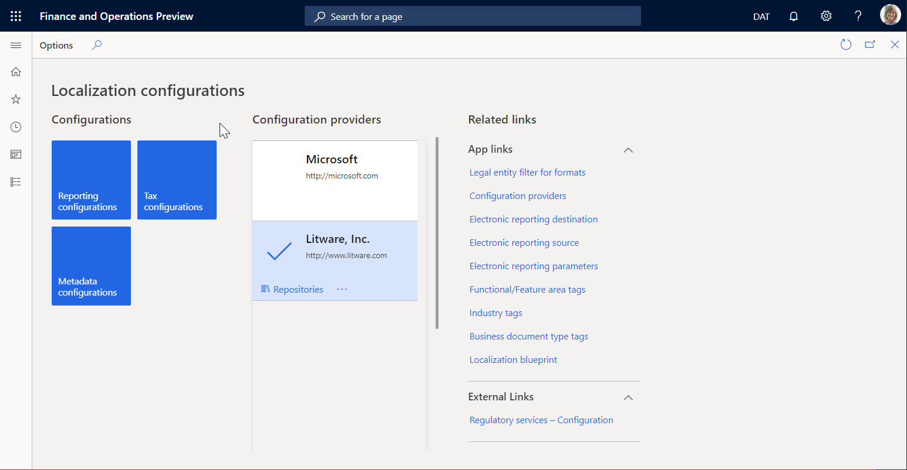

## Import ER solutions

Sample ER configurations are used in the example of this procedure. You must import, into your current instance of Dynamics 365 Finance, the ER configurations that contain the business document templates that can be edited by using Business document management. Download, and then locally store the following files to complete this procedure.

**Sample ER customer invoicing solution**

| File                                      | Content |
|-------------------------------------------|---------|
| Customer invoicing model.version.2.xml    | [ER data model configuration](https://download.microsoft.com/download/b/f/a/bfa5cb52-e6e2-42bc-a4c0-77014a4c54e6/Customerinvoicingmodel.version.2.xml) |
| Customer FTI report (GER).version.2.3.xml | [Free text invoice ER format configuration](https://download.microsoft.com/download/3/c/2/3c2e58f2-6e56-43d9-85ea-4c97252a108d/CustomerFTIreportGER.version.2.3.xml) |

**Sample ER payment checks solution**

| File                                     | Content |
|------------------------------------------|---------|
| Model for cheques.version.10.xml         | [ER data model configuration](https://download.microsoft.com/download/3/7/6/376cb0f6-181a-4895-a432-390ffca64162/Modelforcheques.version.10.xml) |
| Cheques printing format.version.10.9.xml | [Payment cheque ER format configuration](https://download.microsoft.com/download/6/d/6/6d61bfff-3d89-4377-9e34-2e3ee6d6df91/Chequesprintingformat.version.10.9.xml) |

**Sample ER foreign trade solution**

| File                             | Content |
|----------------------------------|---------|
| Intrastat model.version.1.xml    | [ER data model configuration](https://download.microsoft.com/download/2/0/0/200d6ed1-eff8-48ec-ab75-175a4acf9714/Intrastatmodel.version.1.xml) |
| Intrastat report.version.1.9.xml | [Intrastat control report ER format configuration](https://download.microsoft.com/download/7/a/2/7a2a27c3-a8a5-42a1-9d04-f0a8e1ec1707/Intrastatreport.version.1.9.xml) |

Use the following procedure to import each file. Import the ER *data model* configuration of each ER solution in the tables above before you import the corresponding ER *format* configuration.

1. Open the **Organization administration** \> **Electronic reporting** \> **Configurations** page.
2. On the top of the page, select **Exchange**.
3. Select **Load from XML file**.
4. Select **Browse** to load the required XML file.
5. Select **OK** to confirm configuration's import.

Alternatively, you can import the officially published ER format configurations from Microsoft Dynamics Lifecycle Services. For example, to complete this procedure you can import the latest version of the **Free text invoice (Excel)** ER format configuration. The corresponding ER data model and ER model mapping configurations will be imported automatically.

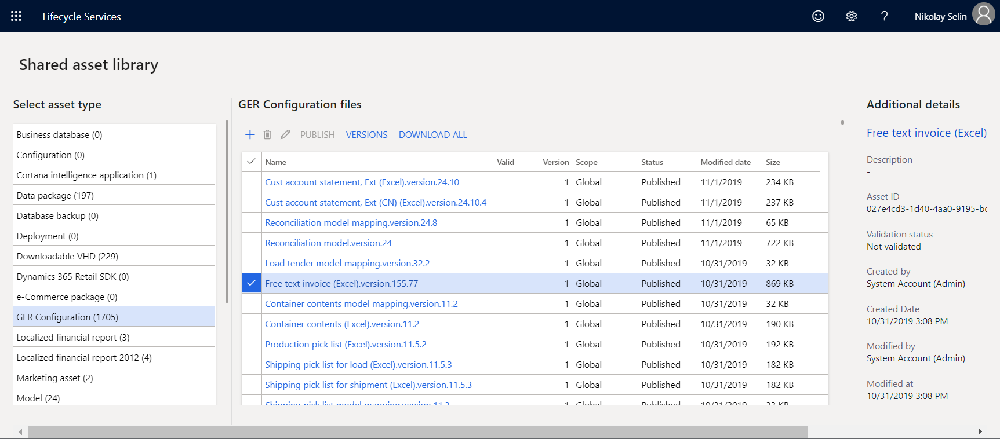

For more information about importing ER configurations, see [Manage the ER configuration lifecycle](general-electronic-reporting-manage-configuration-lifecycle.md).

## Enable Business document management

> [!NOTE]
> In versions of Finance before 10.0.21, Business document management functionality had to be explicitly enabled. However, starting in version 10.0.21, the **Business document management** feature was automatically enabled. Then, starting in version 10.0.29, the feature became mandatory. In other words, it was automatically turned on and couldn't be turned off. In Finance version 10.0.32, the feature has been eliminated.
>
> The system behavior assumes that Business document management functionality is enabled out of the box. This section is applicable to Finance versions earlier than 10.0.21.

To start Business document management, you need to open the **Feature management** workspace and enable the **Business document management** feature.

Use the following procedure to enable Business document management functionality for all legal entities.

1. Open the **Feature management** workspace.
2. On the **New** tab, select the **Business document management** feature in the list.
3. Select **Enable now** to turn on the selected feature.
4. Refresh the page to access the new feature.

> [!NOTE]
> For more information about using the new document user interface in Business document management, see [New document user interface in Business document management](er-business-document-management-new-template-ui.md).

For more information about activating new features, see [Feature management overview](../../fin-ops/get-started/feature-management/feature-management-overview.md).

## Configure parameters

Use the information in the following sections to set up the basic parameters for Business document management.

### Prerequisites for parameter setup

Before you can set up Business document management, you must set up the required document type in the Document management framework. This document type is used to specify a temporary storage of documents in Office formats (Excel and Word) that are used as templates for ER reports. The temporary storage template can be edited by using the Office desktop applications.

For this document type, the following attribute values must be selected.

| Attribute name | Attribute value |
|----------------|-----------------|
| Class          | Attach file     |
| Group          | File            |
| Location       | SharePoint      |

For information about how to set up the required document management parameters and document types, see [Configure document management](../../fin-ops/organization-administration/configure-document-management.md).

### Set up parameters

Basic Business document management parameters can be set up on the **Business document parameters** page. Only specific users can access the page. This includes:

- Users who are assigned to the **System administrator** role.
- Users who are assigned to any role that is configured to perform the duty, **Maintain Business document management parameters** (AOT name **ERBDMaintainParameters**).

Use the following procedure to set up the basic parameters for all legal entities.

1. Sign in as a user with access to the **Business document parameters** page.
2. Go to **Organization administration** \> **Electronic reporting** \> **Business document management** \> **Business document parameters**.
3. On the **Business document parameters** page, on the **Attachments** tab, in the **SharePoint document type** field, define the document type that should be used to temporarily store templates in Office formats while they are edited using the Office desktop applications. 

> [!NOTE]
> Only document types that are configured using a SharePoint location are available for this parameter.

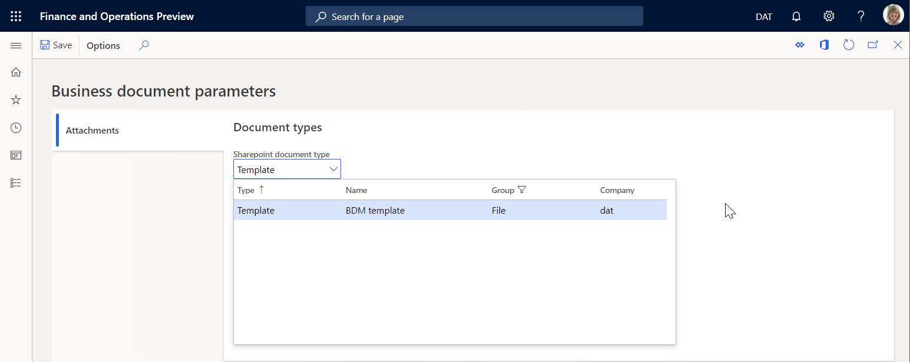

The selected document type is company-specific and will be used when the user is working with Business document management in the company for which the selected document type is configured. When the user is working with Business document management in another company, the same selected document type will be used if one has not been configured for this company. When a document type has been configured, it will be used instead of the one selected in the **SharePoint document type** field.

> [!NOTE]
> The **SharePoint document type** parameter defines a SharePoint folder as temporary storage for templates that are editable using either Microsoft Excel or Word. You need to set up this parameter if you plan to use these Office desktop applications for editing templates. For more information, see [Edit a template in the Office desktop application](#EditInOfficeDesktopApp). You can keep this parameter blank if you plan to modify the template by only using the functionality in Microsoft 365. For more information, see [Edit a template in Microsoft 365](#EditInOffice365).

## Configure access permissions

By default, when access to Business document management permissions is not enabled, every user with access to the Business document management workspace will see all of the ER solution templates that are available. The Business document management workspace will show only those templates that reside in ER format configurations and that are marked by a **Business document type** tag.

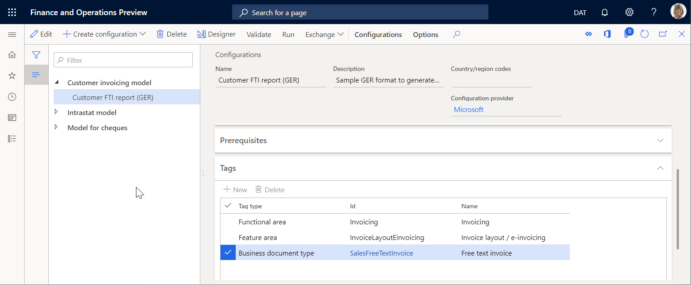

The list of templates available in the Business document management workspace can be restricted by configuring access permissions. This may be important when different templates are used to produce business documents for different business domains (functional areas), and you want to allow specific users access to different templates for editing in the Business document management workspace.

Business document management access permissions can be set on the **Configurator of access permissions**. Only the following users can access the page:

- Users assigned to the **System administrator** role.
- Users assigned to any other role that is configured to perform the duty, **Configure permissions to access Business document templates for editing** (AOT name **ERBDTemplatesSecurity**).

Use the following procedure to set up the access Business document management permissions for all legal entities.

1. Sign in as a user with access to the **Configurator of access permissions** page.
2. Go to **Organization administration** \> **Electronic reporting** \> **Business document management** \> **Manage access permissions**.

    Pay attention to the notification informing you that the usage of access permissions for Business document management is currently not enabled.

    

    With this setting, every user assigned to any security role that is configured to perform the **Manage Business document templates** (AOT name **ERBDManageTemplates**) duty is able to open the Business document management workspace and can edit any template that is available.

    The following graphic shows what is available in the Business document management workspace for users assigned to the **Accounts receivable clerk** role. With the current access permissions setting, the user can edit business document templates from different functional areas including invoicing, regulatory reporting, and payments.

    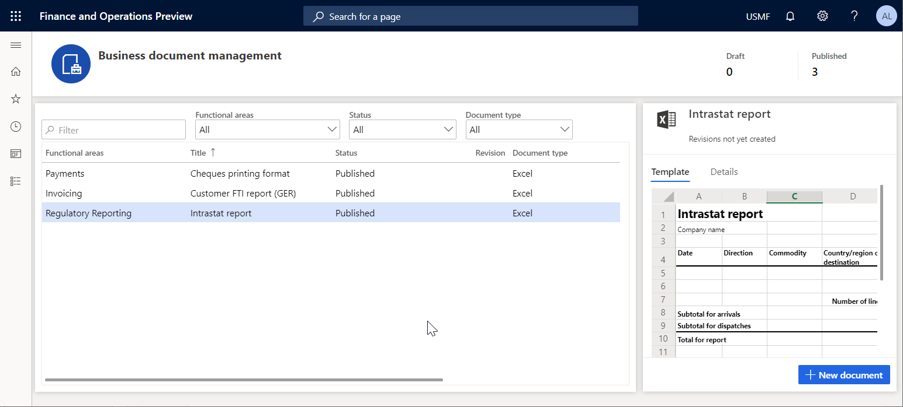

3. On the **Configurator of access permissions** page, select **Access permissions setting**.
4. In the **Settings of access permissions to edit templates** dialog box, enable the **Apply configured access permissions** option.
5. Select **OK** to confirm that Business document management access permissions have been enabled.

    

6. Select **Add** to enter a new business role for which permissions to access Business document management templates must be configured.
7. In the **Security roles** dialog box, select the **Accounts receivable clerk** role and then select **OK** to confirm the role selection.
8. On the **Access permissions per tags of configurations** tab, select **New**.
9. In the **Tag type** field, select **Functional area**, and in the **ID** field, select **Invoicing**.
10. Select **Save** to store configured access permissions for the selected role.

    The current setting means that for any user who is assigned to the **Accounts receivable clerk** role and performing the duty, **Manage Business document templates** (AOT name **ERBDManageTemplates**), ER format configuration templates that have the **Invoicing** value for the **Functional area** tag will be available to edit in the Business document management workspace.

11. Switch the **Related information** pane from the right side of the current page. The **Related information** pane shows how the configured access permissions will be applied, including what ER configuration templates will be available for users that are assigned to the **Accounts receivable clerk** role.

    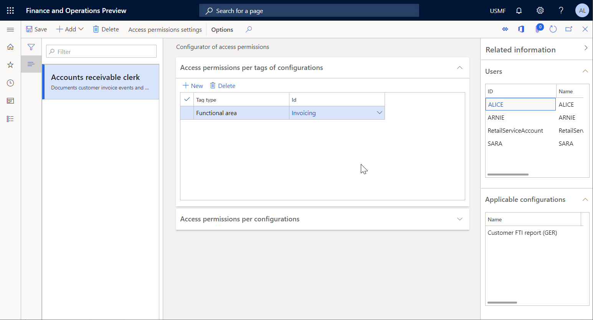

12. On the **Access permissions per configurations** tab, select the **Add** option.
13. In the **Select configuration** dialog box, mark the **Intrastat report** ER format configuration.
14. Select **OK** to confirm the entry of the selected configurations and then select **Save** to store the configured access permissions for the selected role.

The current setting means that for any user assigned to the **Accounts receivable clerk** role and performing the duty, **Manage Business document templates** (AOT name **ERBDManageTemplates**), the following templates will be available to edit in the Business document management workspace:

- Templates that have the value, **Invoicing** for the **Functional area** tag.
- Templates from ER format configurations that are listed on the **Access permissions per configurations** tab (templates from the **Intrastat report** format configuration of the **Statutory reporting** domain in this example).

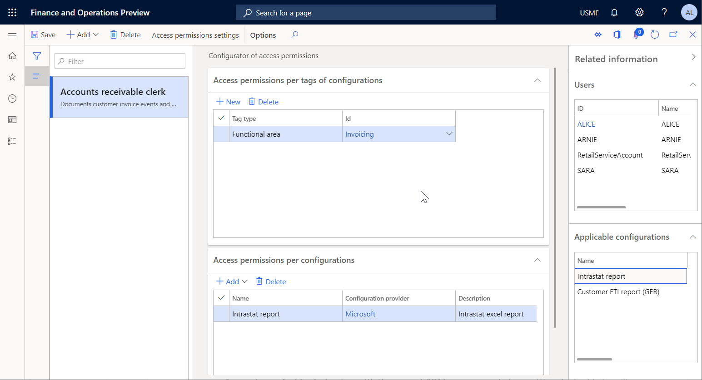

The following graphic shows what the Business document management workspace provides to a user assigned to the **Accounts receivable clerk** role. With the current Business document management access permissions setting, the user can edit business document templates from the **Invoicing** domain and the **Intrastat report** ER format configuration. Templates from the **Payments** domain are not accessible for the **Accounts receivable clerk** role.

> [!NOTE]
> The **Access permissions per configurations** rules are stored by using the unique identification ID of an ER format configuration. This means that these rules will not be deleted when an ER configuration that refers to them is deleted. When you import deleted configurations back to this instance, these rules will refer to them again. There is no need to set up the rules again after the deleted configurations are imported again.

## Use Business document management to edit templates

Business users can access business document templates for editing in the Business document management workspace. Only the following users can access the Business document management workspace:

- Users assigned to the role, **System administrator**.
- Users assigned to any role that is configured to perform the duty, **Manage Business document templates** (AOT name **ERBDManageTemplates**).

Use the following procedure to edit free text invoice templates in the Business document management workspace. Before you complete this procedure, you must have completed all of the preceding procedures in this article.

1. Sign in as a user with access to the Business document management workspace.
2. Open the Business document management workspace.

> [!NOTE]
> Starting in Finance version 10.0.21, the **Office-like UI experience for Business document management** feature was turned on by default. Then, starting in Finance version 10.0.29, the feature became mandatory and couldn't be turned off. Starting in Finance version 10.0.32, the feature has been eliminated.

When the **Office-like UI experience for Business document management** feature is turned off in the **Feature management** workspace, the main grid in the **Business document management** workspace shows the following templates:

- Templates that are owned by your ER configuration provider (that is, the provider that is currently marked as active in the **Electronic reporting** workspace). After you select one of these templates, you can select **Edit template** to start or continue to edit it.
- Templates that are owned by other ER configuration providers. After you select one of these templates, you can select **New document** to create a copy of it that is owned by your ER configuration provider, and then start to edit the copy.

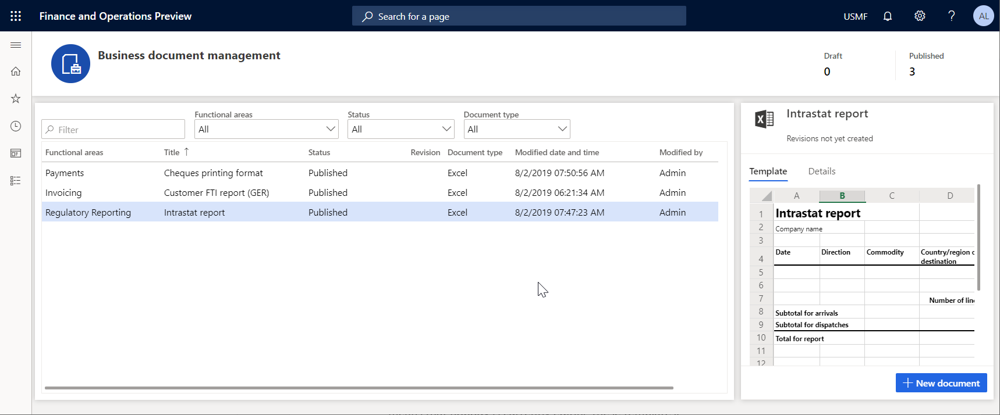

The **Template** tab presents the content of the selected template. Select the **Details** tab to review details of the selected template as well as details of an ER format configuration this template resides in. Notice that all of the templates have a status of **Published**, and contain no details in the **Revision** column. This means that these templates are not currently being edited.

When the **Office-like UI experience for Business document management** feature is turned on in the **Feature management** workspace, the main grid in the **Business document management** workspace shows templates that are owned by your ER configuration provider (that is, the provider that is currently marked as active in the **Electronic reporting** workspace). After you select one of these templates, you can select **Edit template** to start or continue to edit it.

To work with templates that are owned by other ER configuration providers, select **New document** to create a copy of the template that is owned by your ER provider. You can then start to edit the copy. For more information, see [New document user interface in Business document management](er-business-document-management-new-template-ui.md).

### Initiate editing templates owned by your configuration provider

1. In the Business document management workspace, select the **Cheques printing format** template in the list.
2. Select the **Details** tab.

The **Edit template** option is available for the selected template. This option is always available for a template in an ER format configuration that is owned by the active ER configuration provider (**Litware, Inc.** in this example). When **Edit template** is selected, the existing template from the draft version of the underlying ER format configuration will be available to edit.

### Initiate editing templates owned by other providers

1. In the Business document management workspace, select the document that you want to use as a template.

    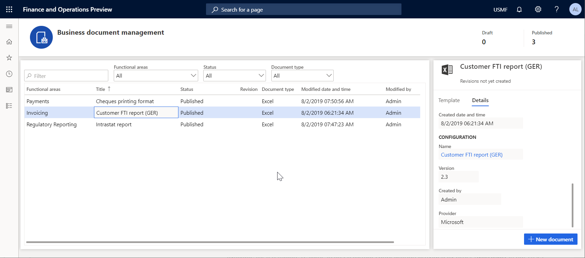

2. Select **New document**, and in the **Title** field, change the title of the editable template if needed. The text will be used to name the ER format configuration that is automatically created. Note that the draft version of this configuration (**Customer FTI report (GER) Copy**) that will contain the edited template will automatically be marked to run this ER format for the current user. At the same time, the non-modified original template from the base ER format configuration will be used to run this ER format for any other user.
3. In the **Name** field, change the name of the first revision of the editable template that will be created automatically.
4. In the **Comment** field, change the comment for the automatically created revision of the editable template.
5. Select **OK** to confirm the start of the editing process.

If there is no any provider it will be offered to create. If there is no active provider it will be offered to choose it for activate.

To create a provider, change the name of the provider in the **Name** field, update the internet address of the new provider in the **Internet address** field, and select **OK** to confirm.

   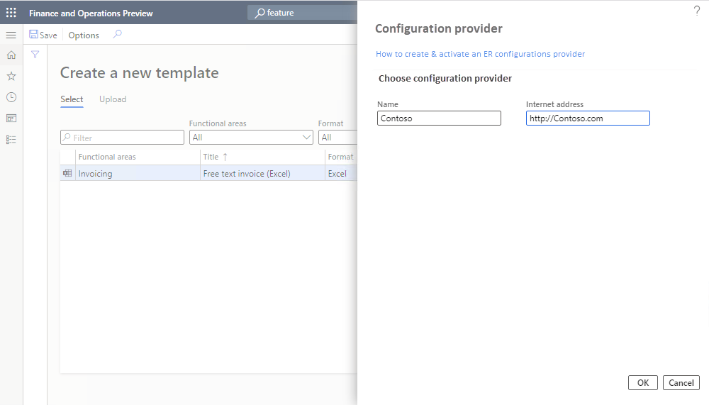

To activate existing provider, choose the name of the provider in the **Configuration provider** field, and select **OK** to set the provider as active.

   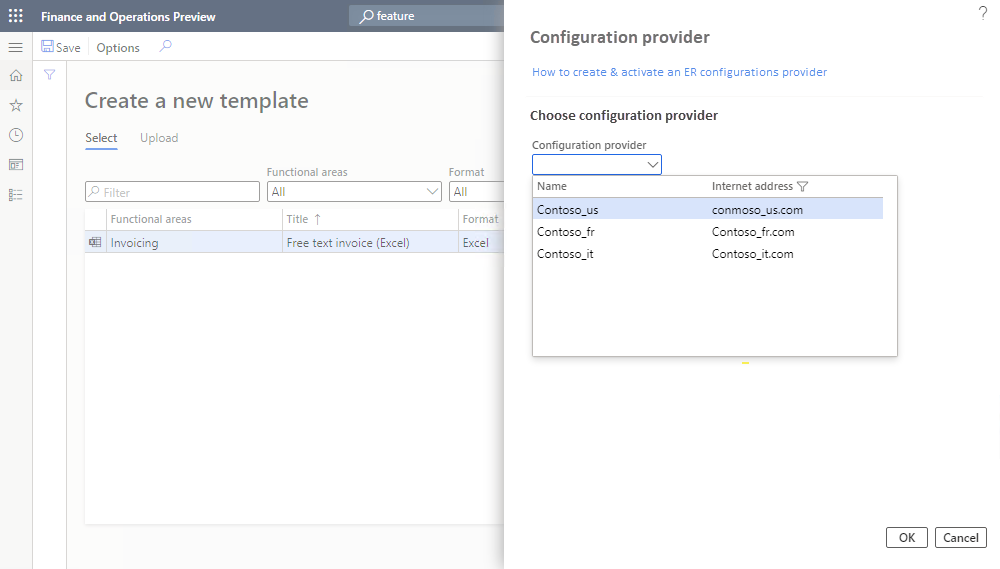

> [!NOTE]
> Each BDM template refers to the provider as the author of the configuration. This is why an active provider is required for the template.

The **New document** option is always available for a template in an ER format configuration provided by current and another provider (Microsoft in this example) that doesn't have any revision. The edited template will then be stored in a new ER format configuration that is automatically generated.

### Start editing a template

1. From the selected template, select **Edit document**.
2. In the **Name** field, change the name of the first revision of the editable template that will be created automatically.
3. In the **Comment** field, change the remark for the automatically created revision of the editable template.

    

4. Select **OK** to confirm the start of the editing process.

The **BDM template editor** page will open. The selected template will be available for online editing by using Microsoft 365.

### Edit a template in Microsoft 365

You can modify the template using Microsoft 365. For example, in Office online, change the font of the field prompts in the template header from **Regular** to **Bold**. These changes are automatically stored in the editable template that is stored in the primary template's storage (by default, the Azure blob storage). This is configured for the ER framework.

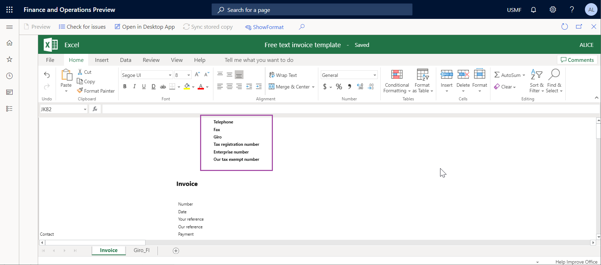

### Edit a template in the Office desktop application

> [!NOTE]
> This function is only available when the **SharePoint document type** parameter is properly configured. For more information, see [Configure parameters](#SetupBdmParameters).

1. Select the **Open in Desktop App** option to modify the template by using the functionality of the Office desktop application (Excel in this example). The editable template is copied from the permanent storage to the temporary storage configured in the Business document management parameters as a SharePoint folder.
2. Confirm that you want to open the template from the temporary file storage in the Office desktop Excel application.

    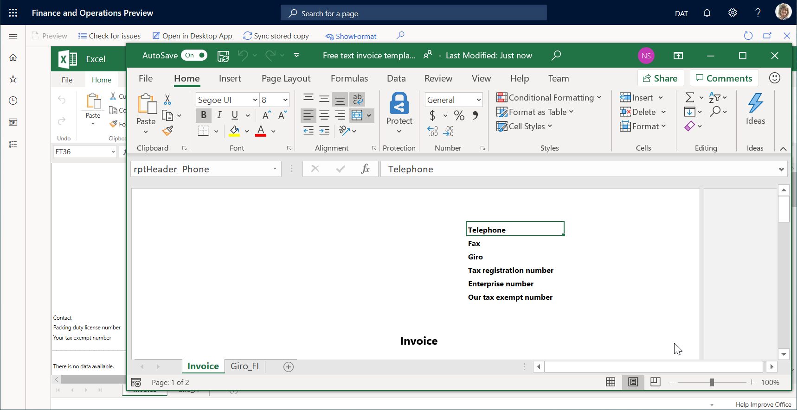

3. Modify the template. For example, change the font of the fields prompts in the template header by updating color from **Black** to **Blue**.

    

4. Select **Save** in the Excel desktop application to store the template changes in the temporary storage.

    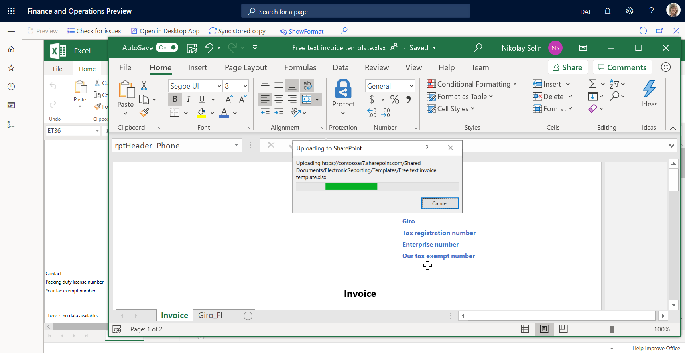

5. Close the Excel desktop application.
6. Select **Sync stored copy** to synchronize the temporary template storage to the permanent template storage.

> [!NOTE]
> The copy of the editable template in the temporary file storage is kept for only the current session of template editing. When you finish this session by closing the **BDM template editor** page, this copy will be deleted. If you adjusted the template in the temporary file storage and did not select **Sync stored copy**, when you try to close the **BDM template editor** page, a message will ask whether you want to store introduced changes. Select **Yes** if you want to save your changes to the template in the permanent file location.

### Validate a template

1. On the **BDM template editor** page, select **Check for issues** to validate the modified template against the underlying ER format configuration. Follow the recommendations (if any) to align the template with the structure of the format from the base ER format configuration.
2. Select **Show format** to view the current structure of the format from the base ER format configuration that must be aligned with the editable template. 
3. Select **Hide format** to close the pane.

    

4. Close the **BDM template editor** page.

The updated template is shown on the **Template** tab. Notice that the status of the edited template is now **Draft** and the current revision is no longer empty. This means that the process of this template's editing has been started.

### Test the modified template 

1. In the application, change to the company, **USMF**.
2. Go to **Accounts receivable** \> **Invoices** \> **All free text invoices**.
3. Select the **FTI-00000002** invoice, and then select **Print management**.
4. Select the **Module - accounts receivable** \> **Documents** \> **Free text invoice** \> **Original document** level to specify the scope of invoices for processing.
5. In the **Report format** field, select the **Customer FTI report (GER) Copy** ER format for the specified document level.

    

6. Press **Escape** to close the current page.
7. Select **Print**, and then select **Selected**.
8. Download the document and open it using the Excel desktop application.

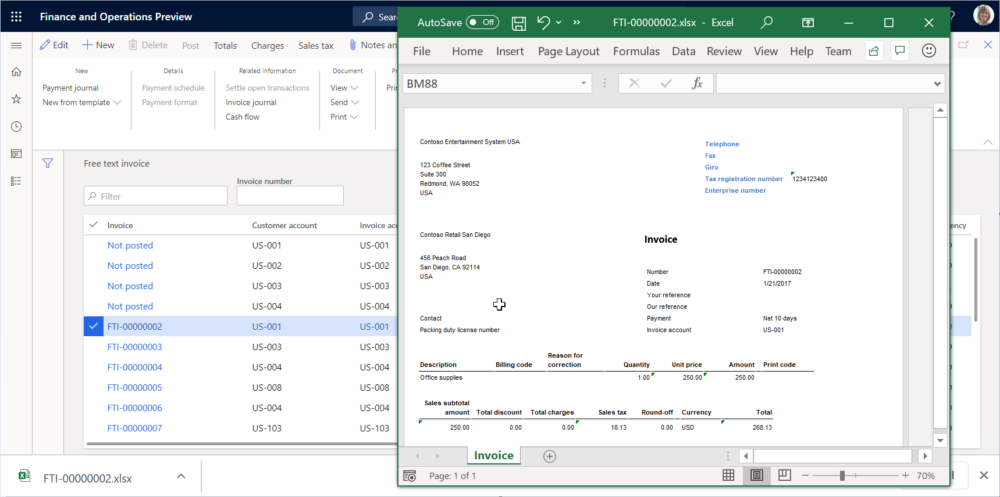

The modified template is used to generate the free text invoice report for the selected item. To analyze how this report is affected by the changes that you introduced to the template, you can run this report in one application session right after you modified the template in another application session.

### Create an alternative template revision

1. Open the **BDM template editor** page and select the **Customer FTI report (GER) Copy** template.
2. On the **Revisions** tab, select **New**.
3. If needed, in the **Name** field, change the name of the second revision and base it on the currently active first revision.
4. If needed, in the **Comment** field, change the remark for the automatically created revision of the editable template.

    

    You created a new revision of your template that has been stored in the permanent template's storage. Now you can continue editing the template of the second revision that is currently selected as active.

5. Select the first revision and then select **Set active**. You can select another revision as active if at any time you want to return to that revision of the template.
6. Select the second revision, and then select **Delete**.
7. Select **OK** to confirm that you want to delete the selected revision. You can delete any of the non-active revisions when they are no longer needed.

### Delete a modified template

1. On the **BDM template editor** page, select the **Template** tab.
2. Select **Delete**.
3. If you select **OK** to confirm deletion, the **Customer FTI report (GER) Copy** ER format with the modified template will be deleted. Select **Cancel** to explore other options.

### Revoke changes of template

When you edit the template from an ER format that is owned by the current active provider, you will be offered the option to revoke changes introduced for the template.

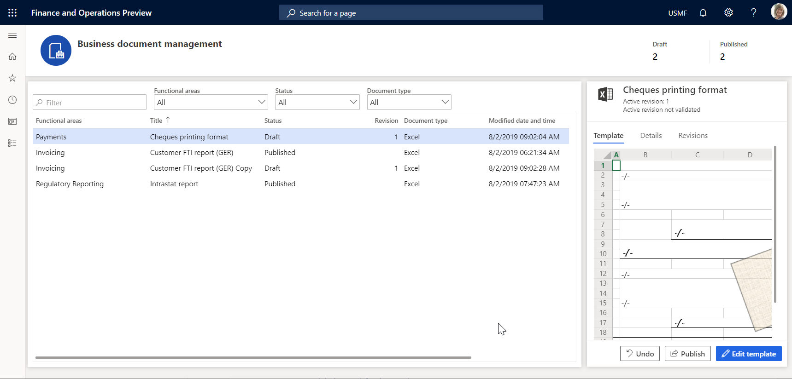

1. On the **BDM template editor** page, select the **Template** tab.
2. Select **Undo**.
3. If you select **OK** to revoke the changes introduced for the template, the modified template will be replaced by the original template and all changes will be removed. When you revoke changes to the template, you will be able to delete the template. Select **Cancel** to explore other options.

### Publish a modified template

1. On the **BDM template editor** page, on the **Template** tab, select **Publish**.
2. If you select **OK** to confirm publishing, the draft version of the derived **Customer FTI report (GER) Copy** ER format that contains the modified template will be marked as completed. The modified template becomes available for other users. The completed versions of this ER format will keep only the last active revision of your template. Other revisions will be deleted. Select **Cancel** to explore other options.

## Frequently asked questions

### I selected Edit document, but instead of going to the BDM template editor page in Finance, I was sent to the Microsoft 365 webpage.

This issue is a known issue that involves Microsoft 365 redirection. It occurs when you sign to Microsoft 365 for the first time. To work around this issue, select **Back** in your browser to return to the previous page.

### I understand how to edit a template by using Microsoft 365 in the first application session, and how to use the template in the second application session and adjust the template to see how my changes affect the generated business document. Can I use the Office desktop application in the same way?

Yes, you can. In the first application session, select **Open in Desktop App**. Your template will be stored in the temporary file storage and opened in the Office desktop application. Next, complete the following steps to preview your template changes in the generated business document:

1. Make changes in the template by using the Office desktop application.
2. Select **Save** in the Office desktop application.
3. On the **BDM template editor** page of the first application session, select **Sync stored copy**.
4. Execute this template ER format in the second application session.

### When I select Open in Desktop App, I receive the following error message: "Value cannot be null. Parameter name: externalId." How do I work around this issue?

Most likely you signed in to the current instance of the app of the Azure AD domain which differs from the Azure AD domain that was used to deploy this instance. Because the SharePoint service, which is used to store templates for making them available for editing by using the Office desktop applications, belongs to the same domain, we have no permissions to access the SharePoint service. To resolve this issue, sign in to the current instance using the credentials of a user with the correct Azure AD domain.

## Additional resources

[Electronic reporting (ER) overview](general-electronic-reporting.md)

[ER Design a configuration for generating reports in OPENXML format (November 2016)](tasks/er-design-reports-openxml-2016-11.md)

[Design ER configurations to generate reports in Word format](tasks/er-design-configuration-word-2016-11.md)

[Embed images and shapes in documents that you generate by using ER](electronic-reporting-embed-images-shapes.md)

[Configure Electronic reporting (ER) to pull data into Power BI](general-electronic-reporting-report-configuration-get-data-powerbi.md)

## List of ER configurations that have been released in Finance to support configurable business documents

The [list](general-electronic-reporting.md#list-of-configurations) of ER configurations for Finance is constantly updated. Open the [Global repository](er-download-configurations-global-repo.md) to review the list of ER configurations that are currently supported. You can [filter](../../../finance/localizations/enhanced-filtering-global-repo.md) the Global repository to review the list of ER configurations that are used to support configurable business documents.

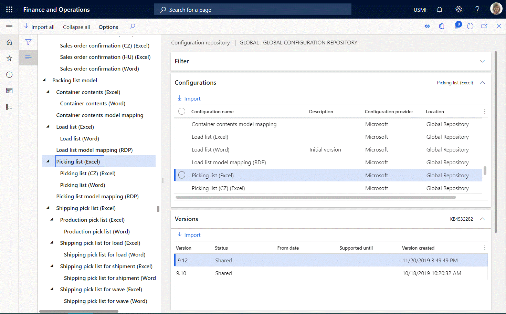

The following table shows the list of ER configurations that support configurable business documents and that have been released in Finance up until December 2020.

| Data model configuration    | Format configurations                           |
|-----------------------------|-------------------------------------------------|
| Bill of lading model        | Bill of lading (Excel)                          |
|                             | Bill of lading (Word)                           |
| Certificate of origin model | Certificate of origin (Excel)                   |
|                             | Certificate of origin (Word)                    |
| Invoice model               | Customer Debit and Credit Note (Excel)          |
|                             | Customer Debit and Credit Note (Word)           |
|                             | Free text invoice (Excel)                       |
|                             | Free text invoice (Excel) (BH)                  |
|                             | Free text invoice (FR) (Excel)                  |
|                             | Free text invoice (LT) (Excel)                  |
|                             | Free text invoice (LV) (Excel)                  |
|                             | Free text invoice (PL) (Excel)                  |
|                             | Free text invoice (CZ) (Excel)                  |
|                             | Free text invoice (EE) (Excel)                  |
|                             | Free text invoice (HU) (Excel)                  |
|                             | Free text invoice (TH) (Excel)                  |
|                             | Free text invoice (Word)                        |
|                             | Project contract line items (Excel)             |
|                             | Project contract line items (CZ) (Excel)        |
|                             | Project contract line items (Excel) (BH)        |
|                             | Project contract line items (HU) (Excel)        |
|                             | Project contract line items (LT) (Excel)        |
|                             | Project contract line items (PL) (Excel)        |
|                             | Project contract line items (Word)              |
|                             | Project customer retention release (Excel)      |
|                             | Project customer retention release (CZ) (Excel) |
|                             | Project customer retention release (HU) (Excel) |
|                             | Project customer retention release (LT) (Excel) |
|                             | Project customer retention release (PL) (Excel) |
|                             | Project customer retention release (TH) (Excel) |
|                             | Project customer retention release (Word)       |
|                             | Project invoice (Excel)                         |
|                             | Project Invoice (Word)                          |
|                             | Project invoice (AE) (Excel)                    |
|                             | Project invoice (CZ) (Excel)                    |
|                             | Project invoice (Excel) (BH)                    |
|                             | Project invoice (HU) (Excel)                    |
|                             | Project invoice (JP) (Excel)                    |
|                             | Project invoice (LT) (Excel)                    |
|                             | Project invoice (PL) (Excel)                    |
|                             | Project invoice (TH) (Excel)                    |
|                             | Project invoice full (MY) (Excel)               |
|                             | Project invoice simple (MY) (Excel)             |
|                             | Project manage invoice (Excel)                  |
|                             | Project manage invoice (CZ) (Excel)             |
|                             | Project manage invoice (Excel) (BH)             |
|                             | Project manage invoice (HU) (Excel)             |
|                             | Project manage invoice (JP) (Excel)             |
|                             | Project manage invoice (LT) (Excel)             |
|                             | Project manage invoice (PL) (Excel)             |
|                             | Project manage invoice (Word)                   |
|                             | Purchase advance invoice (Excel)                |
|                             | Purchase advance invoice (Word)                 |
|                             | Sales advance invoice (Excel)                   |
|                             | Sales advance invoice (Word)                    |
|                             | Sales advance invoice (PL) (Excel)              |
|                             | Sales invoice (Excel)                           |
|                             | Sales invoice (Excel) (BH)                      |
|                             | Sales invoice (Excel) (CZ)                      |
|                             | Sales invoice (Excel) (EE)                      |
|                             | Sales invoice (Excel) (FR)                      |
|                             | Sales invoice (Excel) (HU)                      |
|                             | Sales invoice (Excel) (IN)                      |
|                             | Sales invoice (Excel) (LT)                      |
|                             | Sales invoice (Excel) (LV)                      |
|                             | Sales invoice (Excel) (PL)                      |
|                             | Sales invoice (Excel) (TH)                      |
|                             | Sales invoice (Word)                            |
|                             | TMS Commercial Invoice (Excel)                  |
|                             | TMS Commercial Invoice (Word)                   |
|                             | Vendor invoice document (Excel)                 |
|                             | Vendor invoice document (CZ) (Excel)            |
|                             | Vendor invoice document (HU) (Excel)            |
|                             | Vendor invoice document (IN) (Excel)            |
|                             | Vendor invoice document (LT) (Excel)            |
|                             | Vendor invoice document (LV) (Excel)            |
|                             | Vendor invoice document (MY) (Excel)            |
|                             | Vendor invoice document (Word)                  |
| Order model                 | Agreement confirmation (Excel)                  |
|                             | Agreement confirmation (Word)                   |
|                             | Purchase agreement confirmation (Excel)         |
|                             | Purchase agreement confirmation (Word)          |
|                             | Purchase order (Excel)                          |
|                             | Purchase order (CZ) (Excel)                     |
|                             | Purchase order inquiry (CZ) (Excel)             |
|                             | Purchase order (HU) (Excel)                     |
|                             | Purchase order inquiry (HU) (Excel)             |
|                             | Purchase order (Word)                           |
|                             | Purchase order inquiry (Excel)                  |
|                             | Purchase order inquiry (Word)                   |
|                             | Sales order confirmation (Excel)                |
|                             | Sales order confirmation (CZ) (Excel)           |
|                             | Sales order confirmation (HU) (Excel)           |
|                             | Sales order confirmation (Word)                 |
| Packing list model          | Container contents (Excel)                      |
|                             | Container contents (Word)                       |
|                             | Load list (Excel)                               |
|                             | Load list (Word)                                |
|                             | Picking list (Excel)                            |
|                             | Picking list (CZ) (Excel)                       |
|                             | Picking list (Word)                             |
|                             | Production pick list (Excel)                    |
|                             | Production pick list (Word)                     |
|                             | Shipping pick list for load (Excel)             |
|                             | Shipping pick list for load (Word)              |
|                             | Shipping pick list for shipment (Excel)         |
|                             | Shipping pick list for shipment (Word)          |
|                             | Shipping pick list for wave (Excel)             |
|                             | Shipping pick list for wave (Word)              |
| Payment model               | Customer payment advice (Excel)                 |
|                             | Customer payment advice (Word)                  |
|                             | Vendor payment advice (Excel)                   |
|                             | Vendor payment advice (Word)                    |
| Quotation model             | Project quotation (Excel)                       |
|                             | Project quotation (Word)                        |
|                             | Request for quotation (Excel)                   |
|                             | Request for quotation (Accept) (Excel)          |
|                             | Request for quotation (Accept) (Word)           |
|                             | Request for quotation (Reject) (Excel)          |
|                             | Request for quotation (Reject) (Word)           |
|                             | Request for quotation (Return) (Excel)          |
|                             | Request for quotation (Return) (Word)           |
|                             | Request for quotation (Word)                    |
|                             | Sales quotation (Excel)                         |
|                             | Sales quotation (CZ) (Excel)                    |
|                             | Sales quotation (HU) (Excel)                    |
|                             | Sales quotation (Word)                          |
|                             | Sales quotation confirmation (Excel)            |
|                             | Sales quotation confirmation (Word)             |
| Reconciliation model        | Cust account statement, Ext (Excel)             |
|                             | Cust account statement, Ext (CN) (Excel)        |
|                             | Cust account statement, Ext (Word)              |
|                             | Cust account statement, France (Excel)          |
| Reminder model              | Collection letter note (Excel)                  |
|                             | Collection letter note (CN) (Excel)             |
|                             | Collection letter note (Word)                   |
|                             | Customer interest note (Excel)                  |
|                             | Customer interest note (Word)                   |
| Waybill model               | Load tender (Excel)                             |
|                             | Load tender (Word)                              |
|                             | Purchase order packing slip (Excel)             |
|                             | Purchase order packing slip (CZ) (Excel)        |
|                             | Purchase order packing slip (Word)              |
|                             | Route (Excel)                                   |
|                             | Route (Word)                                    |
|                             | Sales order packing slip (Excel)                |
|                             | Sales order packing slip (CZ) (Excel)           |
|                             | Sales order packing slip (LT) (Excel)           |
|                             | Sales order packing slip (PL) (Excel)           |
|                             | Sales order packing slip (Word)                 |

[!INCLUDE[footer-include](../../../includes/footer-banner.md)]
