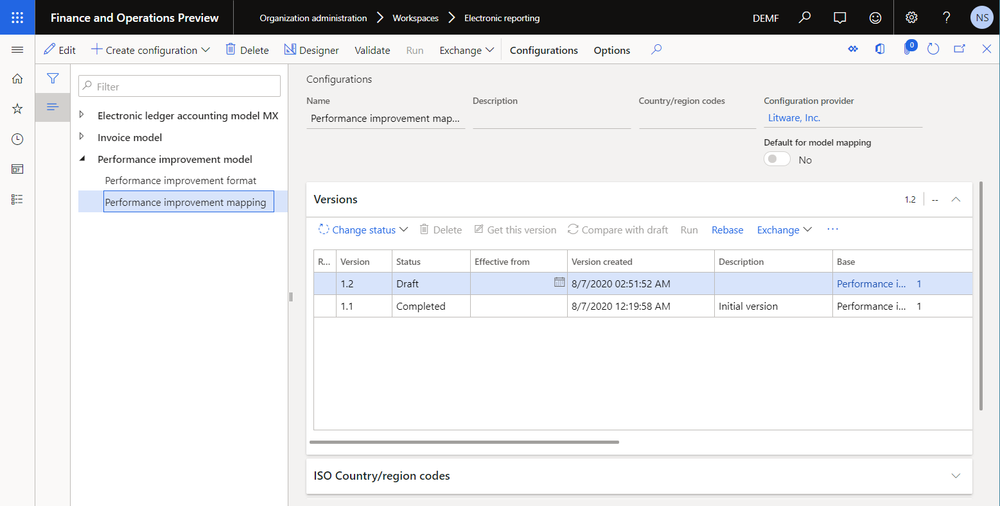
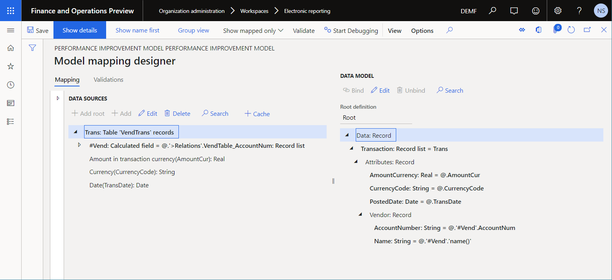
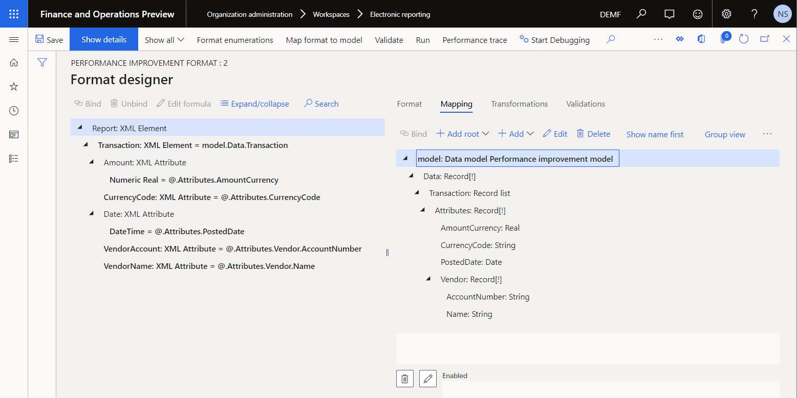
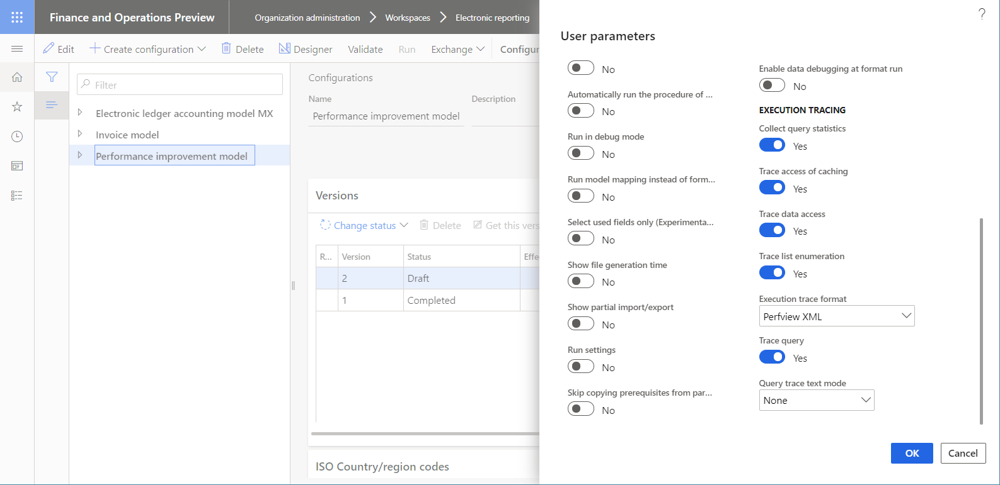
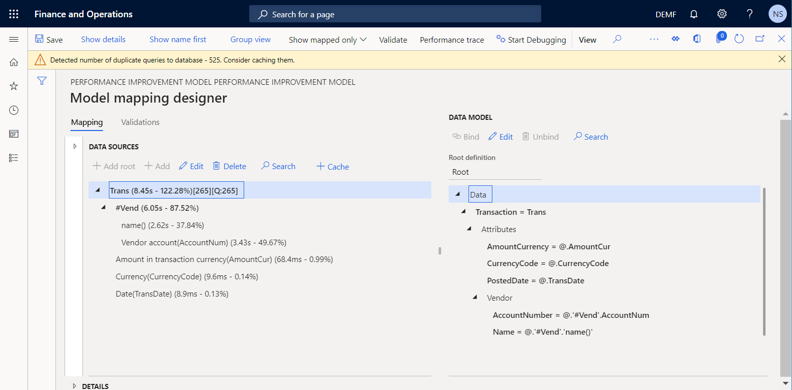
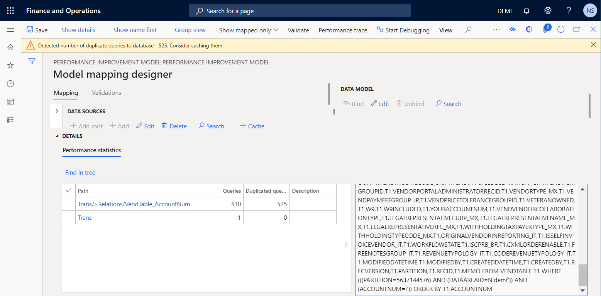
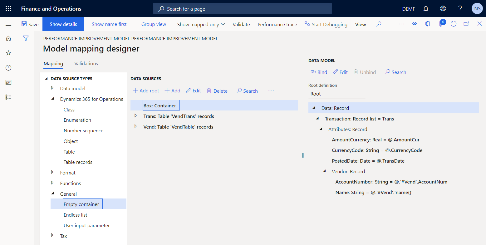
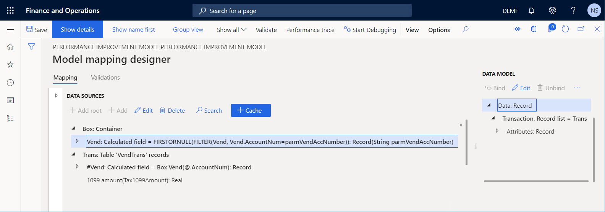
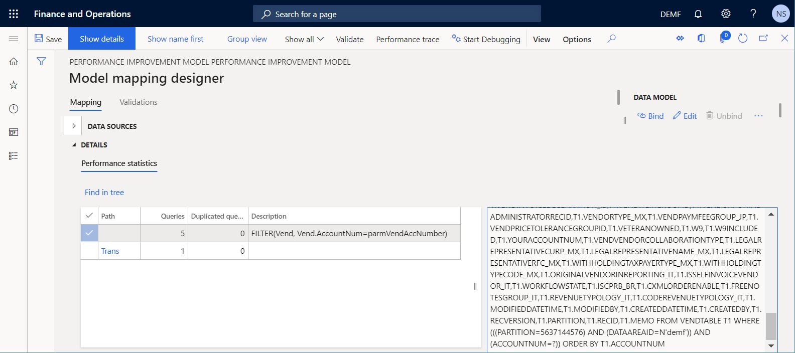
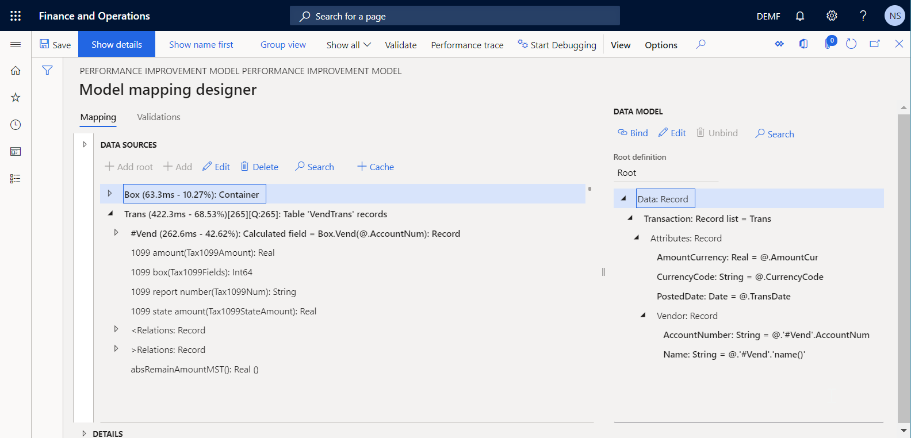

---
# required metadata

title: Improve the performance of ER solutions by adding parameterized CALCULATED FIELD data sources
description: This topic explains how you can help improve the performance of Electronic reporting (ER) solutions by adding parameterized CALCULATED FIELD data sources.
author: NickSelin
ms.date: 04/23/2021
ms.topic: article
ms.prod: 
ms.technology: 

# optional metadata

# ms.search.form: ERModelMappingDesigner, EROperationDesigner, ERExpressionDesignerFormula
# ROBOTS: 
audience: Application User, Developer, IT Pro
# ms.devlang: 
ms.reviewer: kfend
# ms.tgt_pltfrm: 
ms.custom: 
ms.assetid: 
ms.search.region: Global
# ms.search.industry: 
ms.author: nselin
ms.search.validFrom: 
ms.dyn365.ops.version: 10.0.5

---

# Improve the performance of ER solutions by adding parameterized CALCULATED FIELD data sources

[!include [banner](../includes/banner.md)]

This topic explains how you can take [performance traces](trace-execution-er-troubleshoot-perf.md) of [Electronic reporting (ER)](general-electronic-reporting.md) formats that are run, and then use the information from those traces to help improve performance by configuring a parameterized **Calculated field** data source.

As part of the process of designing ER configurations to generate business documents, you define the method that is used to retrieve data from the application and enter it in the generated output. By designing a parametrized ER data source of the **Calculated field** type, you can reduce the number of database calls, and significantly reduce the time and cost that are involved in collecting the details of ER format execution.

## Prerequisites

- To complete the examples in this topic, you must have the access to one of the following [roles](../sysadmin/tasks/assign-users-security-roles.md):

    - Electronic reporting developer
    - Electronic reporting functional consultant
    - System administrator

- The company must be set to **DEMF**.
- Follow the steps in [Appendix 1](#appendix1) of this topic to download the components of the sample Microsoft ER solution that is required to complete the examples in this topic.
- Follow the steps in [Appendix 2](#appendix2) of this topic to configure the minimal set of ER parameters that is required to use the ER framework to help improve the performance of the sample Microsoft ER solution.

## Import the sample ER solution

Imagine that you must design an ER solution to generate a new report that shows vendor transactions. Currently, you can find the transactions for a selected vendor on the **Vendor transactions** page (go to **Account payable** \> **Vendors** \> **All vendors**, select a vendor, and then, on the Action Pane, on the **Vendor** tab, in the **Transactions** group, select **Transactions**). However, you want to have all vendor transactions together in one electronic document in XML format. This solution will consist of several ER configurations that contain the required data model, model mapping, and format components.

The first step is to import the sample ER solution to generate a vendor transactions report.

1. Sign in to the instance of Microsoft Dynamics 365 Finance that is provisioned for your company.
2. In this topic, you will create and modify configurations for the **Litware, Inc.** sample company. Make sure that this configuration provider has been added to your Finance instance and is marked as active. For more information, see [Create configuration providers and mark them as active](tasks/er-configuration-provider-mark-it-active-2016-11.md).
3. In the **Electronic reporting** workspace, select the **Reporting configurations** tile.
4. On the **Configurations** page, import the ER configurations that you downloaded as a prerequisite into Finance, in the following order: data model, model mapping, format. For each configuration, follow these steps:

    1. On the Action Pane, select **Exchange** \> **Load from XML file**.
    2. Select **Browse**, and select the appropriate file for the ER configuration in XML format.
    3. Select **OK**.

## Review the sample ER solution

### Review the model mapping

1. On the **Configurations** page, in the configuration tree, expand **Performance improvement model**, and select **Performance improvement mapping**.
2. On the Action Pane, select **Designer**.
3. On the **Model to datasource mapping** page, on the Action Pane, select **Designer**.

    This ER model mapping is designed to perform the following actions:

    - Fetch the list of vendor transactions that are stored in the VendTrans table (**Trans** data source).
    - For every transaction, fetch, from the VendTable table, the record of a vendor that the transaction has been posted for (**\#Vend** data source).

    > [!NOTE]
    > The **\#Vend** data source is configured to fetch the corresponding vendor record by using the existing many-to-one relation **\@.'\>Relations'.VendTable\_AccountNum**.

    The model mapping in this configuration implements the base data model for any ER formats that are created for this model and run in Finance. Therefore, the content of the **Trans** data source is exposed for ER formats such as abstract **model** data sources.

    

4. Close the **Model mapping designer** page.
5. Close the **Model to datasource mapping** page.

### Review format

1. On the **Configurations** page, in the configuration tree, expand **Performance improvement model**, and select **Performance improvement format**.
2. On the Action Pane, select **Designer**.
3. On the **Format designer** page, on the **Mapping** tab, select **Expand/Collapse**.
4. Expand the **Model**, **Data,** and **Transaction** items.

    This ER format is designed to generate a vendor transactions report in XML format.

    

5. Close the **Format designer** page.

## Run the sample ER solution to trace execution

Imagine that you've finished designing the first version of the ER solution. You now want to test the solution in your Finance instance and analyze the execution performance.

### Turn on the ER performance trace

1. Select the **DEMF** company.
2. Follow the steps in [Turn on the ER performance trace](trace-execution-er-troubleshoot-perf.md#turn-on-the-er-performance-trace) to generate a performance trace while an ER format is run.

    

### Run the ER format

1. Go to **Organization administration** \> **Electronic reporting** \> **Configurations**.
2. On the **Configurations** page, in the configuration tree, select **Performance improvement format**.
3. On the Action Pane, select **Run**.

## Use the performance trace to analyze model mapping performance

1. On the **Configurations** page, in the configuration tree, select **Performance improvement mapping**.
2. On the Action Pane, select **Designer**.
3. On the **Model mappings** page, on the Action Pane, select **Designer**.
4. On the **Model mapping designer** page, on the Action Pane, select **Performance trace**.
5. Select the most recent trace that was generated, and then select **OK**.

New information is now available for some data source items of the current model mapping:

- The actual time that was spent getting data by using the data source
- The same time expressed as a percentage of the total time that was spent running the whole model mapping

The **Performance statistics** grid shows that the **Trans** data source calls the VendTrans table one time. The value **\[265\]\[Q:265\]** of the **Trans** data source indicates that 265 vendor transactions have been fetched from the application table and returned to the data model.

The **Performance statistics** grid also shows that the current model mapping duplicates database requests while the **\#Vend** data source is run. This duplication occurs for the following reasons:

- The vendor table is called two times for each of the 265 iterated vendor transactions, for a total of 530 calls:

    - One call is made to enter the vendor account number.
    - One call is made to enter the vendor name.

- The vendor table is called for each iterated vendor transaction, even though the fetched transactions have been posted for only five vendors. Of the 530 calls, 525 are duplicates. The following illustration shows the message that you receive about duplicate calls (database requests).

Of the total model mapping execution time (approximately eight seconds), notice that more than 80 percent (approximately six seconds) has been spent retrieving values from the VendTable application table. That percentage is too large for two attributes of five vendors, compared with the volume of information from the VendTrans application table.

To reduce the number of calls that are made to get the vendor details for every transaction, and to improve the performance of the model mapping, you can use caching for the **\#Vend** data source.

> [!NOTE]
> The **Trans\\\#Vend** data source will be cached in the scope of the current transaction of the **Trans** data source at runtime.

By caching the **\#Vend** data source, you reduce the number of duplicated calls from 525 to 260, but you don't completely eliminate the duplication. To completely eliminate duplication, you can configure a new parameterized data source of the **Calculated field** type.

## Improve the model mapping based on information from the execution trace

### Change the logic of the model mapping

Follow these steps to use caching and a data source of the **Calculated field** type, to help prevent duplicate calls to the database.

1. On the **Configurations** page, in the configuration tree, select **Performance improvement mapping**.
2. On the Action Pane, select **Designer**.
3. On the **Model mappings** page, on the Action Pane, select **Designer**.
4. On the **Model mapping designer** page, follow these steps to add a data source of the **Table records** type to access records in the VendTable application table:

    1. In the **Data source types** pane, expand **Dynamics 365 for Operations**, and select **Table records**.
    2. Select **Add root**.
    3. In the dialog box, in the **Name** field, enter **Vend**.
    4. In the **Table** field, enter **VendTable**.
    5. Select **OK**.

5. You can parameterize calls to data sources of the **Calculated field** type only if those data sources reside in a container. Therefore, follow these steps to add a data source of the **Empty container** type to hold a new parameterized data source of the **Calculated field** type:

    1. In the **Data source types** pane, expand **General**, and select **Empty container**.
    2. Select **Add root**.
    3. In the dialog box, in the **Name** field, enter **Box**.
    3. Select **OK**.

    

6. Follow these steps to add a parameterized data source of the **Calculated field** type:

    1. In the **Data sources** pane, select **Box**.
    2. In the **Data source types** pane, expand **Functions**, and select **Calculated field**.
    3. Select **Add**.
    4. In the dialog box, in the **Name** field, enter **Vend**.
    5. Select **Edit formula**.
    6. On the **Formula designer** page, select **Parameters** to specify the parameters that must be provided when this data source is called.
    7. In the **Parameters** dialog box, select **New**.
    8. In the **Name** field, enter **parmVendAccNumber**.
    9. In the **Type** field, select **String**.
    10. Select **OK**.
    11. In the **Formula** field, enter **FIRSTORNULL(FILTER(Vend, Vend.AccountNum=parmVendAccNumber))**.
    12. Select **Save**, and close the **Formula designer** page.
    13. Select **OK** to add the new data source.

7. Follow these steps to mark the added data source as cached during the execution:

    1. In the **Data sources** pane, select **Box\\Vend**.
    2. Select **Cache**.

    > [!NOTE]
    > The **Box\\Vend** data source will be cached in the scope of all vendor transactions of the **Trans** data source at runtime.

8. Follow these steps to update the nested **Trans\\\#Vend** data source so that it uses the **Box\\Vend** data source:

    1. In the **Data sources** pane, expand **Trans**.
    2. Select the **Trans\\\#Vend** data source, and then select **Edit** \> **Edit formula**.
    3. On the **Formula designer** page, in the **Formula** field, enter **Box.Vend(\@.AccountNum)**.
    4. Select **Save**, and then close the **Formula designer** page.
    5. Select **OK** to complete your changes to the selected data source.

9. Select **Save**.

    

10. Close the **Model mapping designer** page.
11. Close the **Model mappings** page.

### Complete the modified version of the ER model mapping

1. On the **Configurations** page, on the **Versions** FastTab, select version **1.2** of the **Performance improvement mapping** configuration.
2. Select **Change status** \> **Complete**, and then select **OK**.

## Run the modified ER solution to trace execution

Repeat the steps in the [Run the ER format](#run-format) section earlier in this topic to generate a new performance trace.

## Use the performance trace to analyze adjustments to the model mapping 

1. On the **Configurations** page, in the configuration tree, select **Performance improvement mapping**.
2. On the Action Pane, select **Designer**.
3. On the **Model mappings** page, on the Action Pane, select **Designer**.
4. On the **Model mapping designer** page, on the Action Pane, select **Performance trace**.
5. Select the most recent trace that was generated, and then select **OK**.

Notice that the adjustments that you made to the model mapping have eliminated duplicate queries to database. The number of calls to database tables and data sources for this model mapping has also been reduced.

The total execution time has been reduced about 20 times (from about 8 seconds to about 400 milliseconds). Therefore, the performance of the whole ER solution has been improved.

## Appendix 1: Download the components of the sample Microsoft ER solution

You must download the following files and store them locally.

| File                                        | Content |
|---------------------------------------------|---------|
| Performance improvement model.version.1     | [Sample ER data model configuration](https://download.microsoft.com/download/4/6/f/46f0f3fa-782b-414a-8f7b-b6c64a388661/Performance_improvement_model.version.1.xml) |
| Performance improvement mapping.version.1.1 | [Sample ER model mapping configuration](https://download.microsoft.com/download/8/9/1/8913a763-afb8-4bf4-aaf1-95ad793ffc5a/Performance_improvement_mapping.version.1.1.xml) |
| Performance improvement format.version.1.1  | [Sample ER format configuration](https://download.microsoft.com/download/9/0/c/90c75963-bc78-4edc-9096-556bbe281f10/Performance_improvement_format.version.1.1.xml) |

## Appendix 2: Configure the ER framework

Before you can start to use the ER framework to improve the performance of the sample Microsoft ER solution, you must configure the minimal set of ER parameters.

### Configure ER parameters

1. Go to **Organization administration** \> **Workspaces** \> **Electronic reporting**.
2. On the **Localization configurations** page, in the **Related links** section, select **Electronic reporting parameters**.
3. On the **Electronic reporting parameters** page, on the **General** tab, set the **Enable design mode** option to **Yes**.
4. On the **Attachments** tab, set the following parameters:

    - In the **Configurations** field, select the **File** type for the **DEMF** company.
    - In the **Job archive**, **Temporary**, **Baseline**, and **Others** fields, select the **File** type.

For more information about ER parameters, see [Configure the ER framework](electronic-reporting-er-configure-parameters.md).

### Activate an ER configuration provider

Every ER configuration that is added is marked as owned by an ER configuration provider. The ER configuration provider that is activated in the **Electronic reporting** workspace is used for this purpose. Therefore, you must activate an ER configuration provider in the **Electronic reporting** workspace before you start to add or edit ER configurations.

> [!NOTE]
> Only the owner of an ER configuration can edit the configuration. Therefore, before an ER configuration can be edited, the appropriate ER configuration provider must be activated in the **Electronic reporting** workspace.

#### Review the list of ER configuration providers

1. Go to **Organization administration** \> **Workspaces** \> **Electronic reporting**.
2. On the **Localization configurations** page, in the **Related links** section, select **Configuration providers**.
3. On the **Configuration provider table** page, each provider record has a unique name and URL. Review the contents of this page. If a record for **Litware, Inc.** already exists, skip the next procedure, [Add a new ER configuration provider](#ActivateProvider).

#### Add a new ER configuration provider

1. Go to **Organization administration** \> **Workspaces** \> **Electronic reporting**.
2. On the **Localization configurations** page, in the **Related links** section, select **Configuration providers**.
3. On the **Configuration providers** page, select **New**.
4. In the **Name** field, enter **Litware, Inc.**
5. In the **Internet address** field, enter `https://www.litware.com`.
6. Select **Save**.

#### Activate an ER configuration provider

1. Go to **Organization administration** \> **Workspaces** \> **Electronic reporting**.
2. On the **Localization configurations** page, in the **Configuration providers** section, select the **Litware, Inc.** tile, and then select **Set active**.

For more information about ER configuration providers, see [Create configuration providers and mark them as active](tasks/er-configuration-provider-mark-it-active-2016-11.md).

## Additional resources

- [Electronic Reporting overview](general-electronic-reporting.md)
- [Trace the execution of ER formats to troubleshoot performance issues](trace-execution-er-troubleshoot-perf.md)
- [Support parameterized calls of ER data sources of the Calculated field type](er-calculated-field-type.md)

[!INCLUDE[footer-include](../../../includes/footer-banner.md)]
