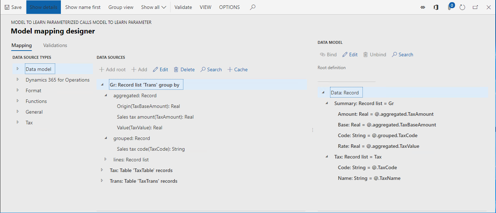
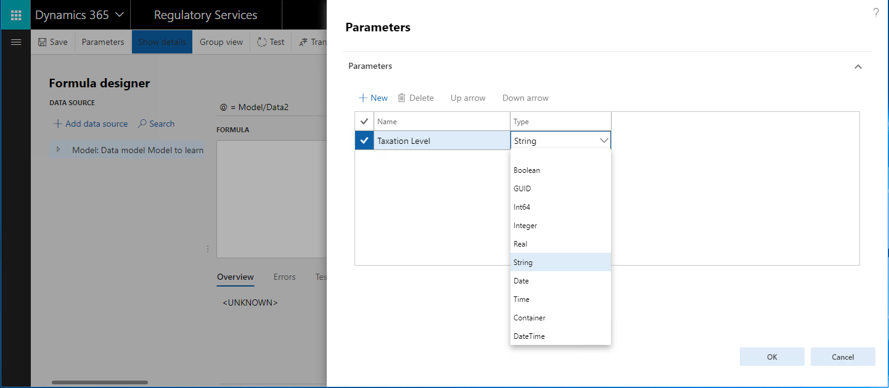
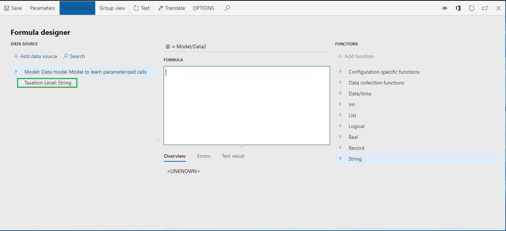
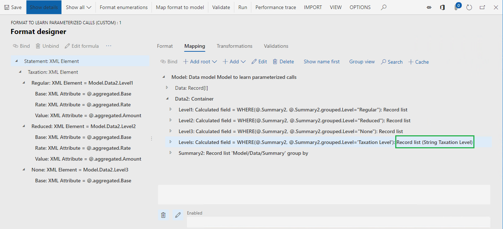
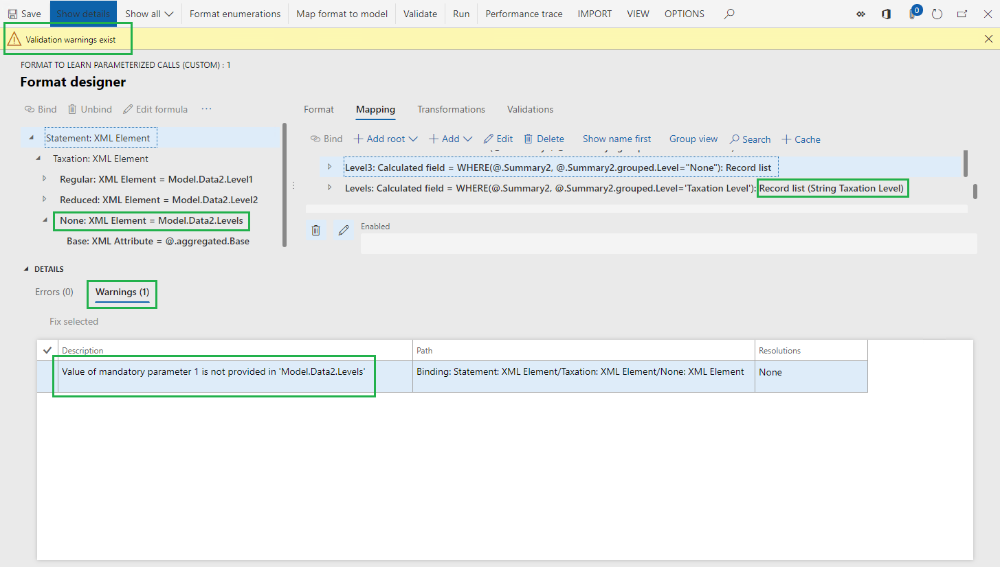
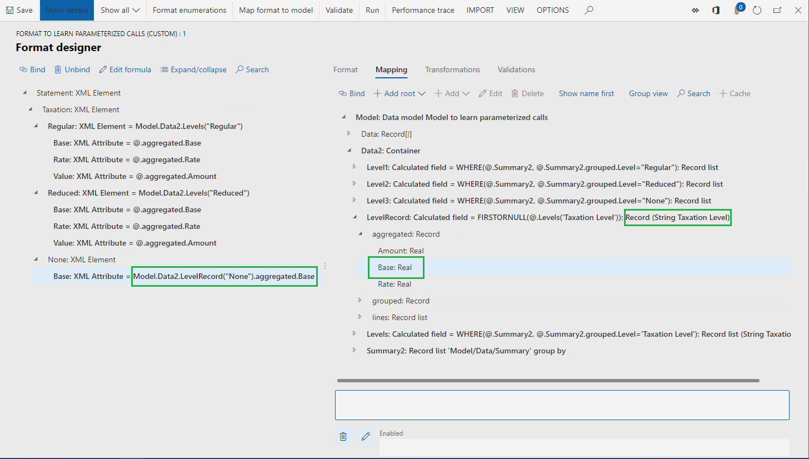

# Support parameterized calls of ER data sources of the Calculated field type

[!include [banner](../includes/banner.md)]

This article explains how you can design an Electronic reporting (ER) data source by using the **Calculated field** type. This data source may contain an ER expression that, when executed, can be controlled by the values of the parameter arguments that are configured in a binding that calls this data source. By configuring parameterized calls of such a data source, you can reuse a single data source in many bindings, which reduces the total number of data sources that must be configured in ER model mappings or ER formats. It also simplifies the configured ER component, which reduces the maintenance costs and the cost of use by other consumers.

## Prerequisites
To complete the examples in this article, you must have the following access:

- Access to one of these roles:

    - Electronic reporting developer
    - Electronic reporting functional consultant
    - System administrator

- Access to Regulatory Configuration Services (RCS) that have been provisioned for the same tenant as finance and operations for one of the following roles:

    - Electronic reporting developer
    - Electronic reporting functional consultant
    - System administrator

You must also download and locally store the following files.

| **Content**                           | **File name**                                        |
|---------------------------------------|------------------------------------------------------|
| Sample ER data model configuration    | [Model to learn parameterized calls.version.1.xml](https://download.microsoft.com/download/e/5/c/e5c0d3f9-1818-47c7-ae75-46efcbb1314f/Modeltolearnparameterizedcallsversion.1.xml)     |
| Sample ER metadata configuration      | [Metadata to learn parameterized calls.version.1.xml](https://download.microsoft.com/download/8/3/a/83a910a5-bf65-4509-bec4-6737a81ecc45/Metadatatolearnparameterizedcalls.version.1.xml)  |
| Sample ER model mapping configuration | [Mapping to learn parameterized calls.version.1.1.xml](https://download.microsoft.com/download/b/f/d/bfd8cbd8-0370-44d1-a1b1-66d021c580ca/Mappingtolearnparameterizedcalls.version.1.1.xml) |
| Sample ER format configuration        | [Format to learn parameterized calls.version.1.1.xml](https://download.microsoft.com/download/8/1/d/81deb6d8-a768-4fcf-bbbe-8f84d2dac3eb/Formattolearnparameterizedcalls.version.1.1.xml)  |

## Sign in to your RCS instance
In this example, you will create a configuration for the sample company, Litware, Inc. First, in RCS, you must complete the steps in the [Create configuration providers and mark them as active](tasks/er-configuration-provider-mark-it-active-2016-11.md) procedure:

1. On the default dashboard, select **Electronic reporting**.
2. Select **Reporting configurations**.
3. Import the downloaded configurations to RCS in the following sequence: data model, metadata, model mapping, format. Complete the following steps for each ER configuration:

    1. Select **Exchange.**
    2. Select **Load from XML file**.
    3. Select **Browse**, and then select the required ER configuration in XML format.
    4. Select **OK.**

## Review the provided ER solution

### Review model mapping

1. In the configuration tree, expand the content of the **Model to learn parameterized calls** item.
2. Select **Mapping to learn parameterized calls**.
3. Select **Designer**.
4. Select **Designer**.  
   
    This ER model mapping is designed to do the following:

    - Fetch the list of tax codes (**Tax** data source) residing in the **TaxTable** table.
    - Fetch the list of tax transactions (**Trans** data source) residing in the **TaxTrans** table:
    
        - Group the list of fetched transactions (**Gr** data source) by tax code.
        - Calculate for grouped transactions following aggregated values per tax code:

            - Sum of tax base values.
            - Sum of tax values.
            - Minimum value of applied tax rate.

    The model mapping in this configuration implements the base data model for any of the ER formats created for this model and executed in finance and operations. As a result, the content of the **Tax** and **Gr** data sources is exposed for ER formats such as abstract data sources.

    

5.  Close the **Model mapping designer** page.
6.  Close the **Model mapping** page.

### Review format

1. In the configuration tree, expand the content of the **Model to learn parameterized calls** item.
2. Select **Format to learn parameterized calls**.
3. Select **Designer**. This ER format is designed to do the following:

    - Generate a tax statement in XML format.
    - Present the following levels of taxation in the tax statement: regular, reduced, and none.
    - Present multiple details at each taxation level, having a different number of details in each level.

    

4. Select **Mapping**.
5. Expand the **Model**, **Data,** and **Summary** items. 

    The calculated field **Model.Data.Summary.Level** contains the expression that returns the code of the taxation level (**Regular**, **Reduced**, **None,** or **Other**) as a text value for any tax code that can be retrieved from the **Model.Data.Summary** data source at run time.

    

6. Expand the **Model**.**Data2** item.
7. Expand the **Model**.**Data2.Summary2** item.
   
    The **Model**.**Data2.Summary2** data source is configured to group the **Model.Data.Summary** data source transaction details by taxation level (returned by the **Model.Data.Summary.Level** calculated field) and compute the aggregations.

    

8. Review the calculated fields **Model**.**Data2.Level1**, **Model**.**Data2.Level2**, and **Model**.**Data2.Level3.** These calculated fields are used to filter the **Model**.**Data2.Summary2** records list and return only records that represent a particular taxation level.
9. Close the **Format designer** page.

## Create a derived format
You can improve the provided format by adding one calculated field to filter the required taxation level instead of using the existing three fields: **Model**.**Data2.Level1**, **Model**.**Data2.Level2,** and **Model**.**Data2.Level3**. The required taxation level can be specified in the location where this new calculated field will be called.

1. In the configuration tree, expand the content of the **Model to learn parameterized calls** item.
2. Select **Format to learn parameterized calls**.
3. Select **Create configuration**.
4. Select **Derive from Name: Format to learn parameterized calls, Microsoft**.
5. In the **Name** field, enter **Format to learn parameterized calls (custom)**.
6. Select **Create configuration.**

## Configure a parameterized calculated field that returns a list of records

### Start adding a new calculated field

1. Select **Designer**.
2. Select **Expand/collapse** to expand all format items.
3. Select **Mapping**.
4. Expand the **Model** item.
5. Select the **Model.Data2** item.
6. Select **Add**.
7. Select **Functions\\Calculated field**.
8. In the **Name** field, enter **Levels**.
9. Select **Edit formula**.

### Define a parameter for adding a calculated field

1. Select **Parameters**.
2. Select **New**.
3. In the **Name** field, enter **Taxation Level**.
4. In the **Type** field, select **String**.

    Only primitive data types can be used to specify the type of the parameter’s argument. Therefore, **Record list**, **Record**, and **Enum** types cannot be used for this purpose.

    The maximum number of parameters that can be specified for a single calculated field is 8.

    

5. Select **OK**.

By adding this parameter, you specify the condition that must be in place to call this calculated field. When you call this calculated field, you need to specify the argument of the **Taxation Level** parameter as a value with **String** format.

   Make sure that you define parameters only for those calculated fields that reside in a container (either **Record list**, **Record**, or **Container**).

   The configured parameter is available in the list of data sources for this calculated field. You can add the parameter to the configured expression by selecting **Add data source**.

   

### Define an expression for adding a calculated field

1. In the **Formula** field, enter: 

    **WHERE(\@.Summary2, \@.Summary2.grouped.Level =**
    
2. Select the **Taxation Level** parameter in the list of data sources.
3. Select **Add data source**.
4. In the **Formula** field, finalize the expression as:  

    **WHERE(\@.Summary2, \@.Summary2.grouped.Level = 'Taxation Level')**

5. Select **Save**.

    

6. Close the **Formula designer** page.

### Finish adding a new calculated field

- Select **OK**.

On the **Format designer** page, the configured parameterized calculated field **Levels** requires a **String** argument.

### Use the configured calculated field for binding format elements

1. Select **Model.Data2.Levels** to select the configured calculated field.
2. Select the **Statement.Taxation.Regular** format element.
3. Select **Bind**.
4. Select **Yes** to confirm the replacement of the currently used data source, **Level1**, by the new data source, **Levels**, in all nested format elements of the selected format element.

    Applied binding has been built as a call of the parameterized calculated field. By default, the name of the bound format element is used as an argument for parameterized calculated field under the following conditions:

      - The calculated field is configured to use a single parameter.
      - The data type of this parameter is defined as **String**.

    When the name of the bound format element is blank, the data source name of this element is used in applied binding.

5. Select the **Statement.Taxation.Reduced** format element.
6. Select **Bind**.
7. Select **Yes** to confirm the replacement of the currently used data source, **Level2**, by the new data source, **Levels**, in all nested format elements under the selected format element.
8. Select the **Statement.Taxation.None** format element.
9. Select **Bind**.
10. Select **Yes** to confirm the replacement of the currently used data source, **Level3**, by the new data source, **Levels**, in all nested format elements under the selected format element.

   When you specify the argument of the parameterized calculated field for the XML element representing taxation level (for example, **Model.Data2.Levels("Reduced")** as a text value), you don’t need to do the same for nested XML attributes—their bindings will automatically inherit the value of the argument defined on the parent level (**Model.Data2.Levels.aggregated.Base**, not **Model.Data2.Levels("Reduced").aggregated.Base**).

Recurrent calls of any parameterized calculated field are not supported.

You can select **Edit formula**, and change the applied-by-default argument of the parameterized calculated field in the selected binding. If this argument is missing, it can cause errors at run time — users are informed about such a situation when the current format is validated.

## Configure a parameterized calculated field to return a record
When a parameterized calculated field returns a record, you need to support binding of individual fields of this record to format elements. In such cases there will be no parent binding that contains the value of an argument to call a parameterized calculated field — this value must be defined in the binding of a single record’s field.

### Start adding a new calculated field

1. Select the **Model.Data2** item.
2. Select **Add**.
3. Select **Functions\\Calculated field**.
4. In the **Name** field, enter **LevelRecord**.
5. Select **Edit formula**.

### Define a parameter for adding a calculated field

1. Select **Parameters**.
2. Select **New**.
3. In the **Name** field, enter **Taxation Level**.
4. In the **Type** field, select **String**.
5. Select **OK**.

### Define an expression for adding a calculated field

1. In the **Formula** field, enter the following:  
    
    **FIRSTORNULL(\@.Levels(**

2. Select the **Taxation Level** parameter.
3. Select **Add data source**.
4. In the **Formula** field, append **'Taxation Level'))** to what you entered in Step 1 to finalize the expression to:  
    
    **FIRSTORNULL(\@.Levels('Taxation Level'))**

5. Select **Save**.
6. Close **the Formula designer** page.

### Finish adding a new calculated field

-   Select **OK**.

### Use the configured calculated field to bind format elements

1. Expand **Model.Data2.LevelRecord** to select the configured calculated field.
2. Expand the **Model.Data2.LevelRecord.aggregated** container of the configured calculated field.
3. Select the **Model.Data2.LevelRecord.aggregated.Base** field.
4. Select the **Statement.Taxation.None** format element.
5. Select **Unbind**.
6. Select the **Statement.Taxation.None.Base** format element.
7. Select **Bind**.
8. Select **Edit formula**.
9. Change the expression to **Model.Data2.LevelRecord("None").aggregated.Base**.

## Remove calculated fields that are not used

1. Select **Model.Data2.Level1**.
2. Select **Delete**.
3. Select **Model.Data2.Level2**.
4. Select **Delete**.
5. Select **Model.Data2.Level3**.
6. Select **Delete**.
7. Select **Save**.

  > [!NOTE]
  > You reused the same calculated field **Model.Data2.Levels** several times in format bindings. It is much easier to use and maintain a single calculated field instead of doing this for multiple similar fields.

8. Close the **Format designer** page.

## Complete adjusted version of a derived format

1. In the **Versions** FastTab, select **Change status**.
2. Select **Complete**.

## Export completed version of a derived format

1. Select **Format to learn parameterized calls (custom)** format in the configurations tree.
2. In the **Versions** FastTab, select the completed version 1.1.1.
3. Select **Exchange**.
4. Select **Export as XML file**.
5. Store the downloaded configuration locally, in XML format.

## Test ER formats 
You can run the initial and improved ER formats to make sure that configured parameterized calculated fields work properly.

### Import ER configurations
You can import reviewed configurations from RCS by using the ER repository of the **RCS** type. If you already went through the steps in the article, [Import Electronic reporting (ER) configurations from Regulatory Configuration Services (RCS)](rcs-download-configurations.md), use the configured ER repository to import configurations discussed earlier in this article to your environment. Otherwise, follow these steps:

1. Select the **DEMF** company and on the default dashboard, select **Electronic reporting**.
2. Select **Reporting configurations**.
3. Import the configurations from Microsoft Download Center in the following sequence: data model, model mapping, format. Complete the following steps for each ER configuration:

    1. Select **Exchange.**
    2. Select **Load from XML file**.
    3. Select **Browse** to select the required ER configuration in XML format.
    4. Select **OK**.

4. Import the exported from RCS completed version 1.1.1 of the **Format to learn parameterized calls (custom)** format:

    1. Select **Exchange.**
    2. Select **Load from XML file**.
    3. Select **Browse** to select the locally stored **Format to learn parameterized calls (custom)** file in XML format.
    4. Select **OK**.

### Run ER formats

1. In the configuration tree, expand the content of the **Model to learn parameterized calls** item.
2. Select **Format to learn parameterized calls**.
3. Select **Run** on the top-most ribbon.
4. Save the locally generated output.
5. Select the **Format to learn parameterized calls (custom)** item.
6. Select **Run** on the top-most ribbon.
7. Save the generated output locally. 
8. Compare the contents of the generated outputs.

## Additional resources

- [Formula designer in Electronic reporting (ER)](general-electronic-reporting-formula-designer.md)
- [Improve performance of ER solutions by adding parameterized CALCULATED FIELD data sources](er-calculated-field-ds-performance.md)

[!INCLUDE[footer-include](../../../includes/footer-banner.md)]

