---
# required metadata

title: Inspect the configured ER component to prevent runtime issues
description: This topic explains how to inspect the configured Electronic reporting (ER) components to prevent runtime issues that might occur.
author: NickSelin
ms.date: 01/03/2022
ms.topic: article
ms.prod: 
ms.technology: 

# optional metadata

ms.search.form: ERSolutionTable, ERDataModelDesigner, ERModelMappingTable, ERModelMappingDesigner, EROperationDesigner
# ROBOTS: 
audience: Application User, Developer, IT Pro
# ms.devlang: 
ms.reviewer: kfend
# ms.tgt_pltfrm: 
ms.custom: 220314
ms.assetid: 
ms.search.region: Global
# ms.search.industry: 
ms.author: nselin
ms.search.validFrom: 2016-06-30
ms.dyn365.ops.version: Version 7.0.0

---

# Inspect the configured ER component to prevent runtime issues

[!include[banner](../includes/banner.md)]

Every configured [Electronic reporting (ER)](general-electronic-reporting.md) [format](er-overview-components.md#format-components-for-outgoing-electronic-documents) and [model mapping](er-overview-components.md#model-mapping-component) component can be [validated](er-fillable-excel.md#validate-an-er-format) at design time. During this validation, a consistency check runs to help prevent runtime issues that might occur, such as execution errors and performance degradation. For every issue that is found, the check provides the path of a problematic element. For some issues, an automatic fix is available.

By default, the validation is automatically applied in the following cases for an ER configuration that contains the previously mentioned ER components:

- You [import](general-electronic-reporting.md#importing-an-er-component-from-lcs-to-use-it-internally) a new [version](general-electronic-reporting.md#component-versioning) of an ER configuration into your instance of Microsoft Dynamics 365 Finance.
- You change the [status](general-electronic-reporting.md#component-versioning) of the editable ER configuration from **Draft** to **Completed**.
- You [rebase](general-electronic-reporting.md#upgrading-a-format-selecting-a-new-version-of-base-format-rebase) an editable ER configuration by applying a new base version.

You can explicitly run this validation. Select one of the following three options, and follow the steps that are provided:

- Option 1:

    1. Go to **Organization administration \> Electronic reporting \> Configurations**.
    2. In the configurations tree in the left pane, select the desired ER configuration that contains the ER format or ER model mapping component.
    3. On the **Versions** FastTab, select the desired version of the selected ER configuration.
    4. On the Action Pane, select **Validate**.

- Option 2, for an ER format:

    1. Go to **Organization administration \> Electronic reporting \> Configurations**.
    2. In the configurations tree in the left pane, select the desired ER configuration that contains the ER format component.
    3. On the **Versions** FastTab, select the desired version of the selected ER configuration.
    4. On the Action Pane, select **Designer**.
    5. On the **Format designer** page, on the Action Pane, select **Validate**.

- Option 3, for an ER model mapping:

    1. Go to **Organization administration \> Electronic reporting \> Configurations**.
    2. In the configurations tree in the left pane, select the desired ER configuration that contains the ER model mapping component.
    3. On the **Versions** FastTab, select the desired version of the selected ER configuration.
    4. On the Action Pane, select **Designer**.
    5. On the **Model to datasource mapping** page, on the Action Pane, select **Designer**.
    6. On the **Model mapping designer** page, on the Action Pane, select **Validate**.

To skip the validation when the configuration is imported, follow these steps.

1. Go to **Organization administration \> Electronic reporting \> Configurations**.
2. On the **Configurations** page, on the Action Pane, on the **Configurations** tab, in the **Advanced settings** group, select **User parameters**.
3. Set the **Validate the configuration after importing** option to **No**.

To skip the validation when you change or rebase the version's status, follow these steps.

1. Go to **Organization administration \> Electronic reporting \> Configurations**.
2. On the **Configurations** page, on the Action Pane, on the **Configurations** tab, in the **Advanced settings** group, select **User parameters**.
3. Set the **Skip validation at configuration's status change and rebase** option to **Yes**.

ER uses the following categories to group consistency check inspections:

- **Executability** – Inspections that detect critical issues that might occur at runtime. These issues are mostly at an **Error** level. 
- **Performance** – Inspections that detect issues that might cause inefficient execution of configured ER components. These issues are mostly at a **Warning** level.
- **Data integrity** – Inspections that detect issues that might cause data loss or runtime issues. These issues are mostly at a **Warning** level.

## List of inspections

The following table provides an overview of the inspections that ER provides. For more information about these inspections, use the links in the first column to go to the relevant sections of this topic. Those sections explain the types of components that ER provides inspections for and how you can reconfigure ER components to help prevent issues.

<table>
<thead>
<tr>
<th>Name</th>
<th>Category</th>
<th>Level</th>
<th>Message</th>
</tr>
</thead>
<tbody>
<tr>
<td><a href='#i1'>Type conversion</a></td>
<td>Executability</td>
<td>Error</td>
<td>

Cannot convert expression of type &lt;type&gt; to field of type &lt;type&gt;.

<b>Runtime error:</b> Exception for type

</td>
</tr>
<tr>
<td><a href='#i2'>Type compatibility</a></td>
<td>Executability</td>
<td>Error</td>
<td>

The configured expression cannot be used as the binding of the current format element to a data source as this expression returns value of the data type &lt;type&gt; that is beyond the scope of data types that are supported by the current format element of type &lt;type&gt;.

<b>Runtime error:</b> Exception of type

</td>
</tr>
<tr>
<td><a href='#i3'>Missing configuration element</a></td>
<td>Executability</td>
<td>Error</td>
<td>

Path not found &lt;path&gt;.

<b>Runtime error:</b> Element of the configuration &lt;path&gt; not found

</td>
</tr>
<tr>
<td><a href='#i4'>Executability of an expression with FILTER function</a></td>
<td>Executability</td>
<td>Error</td>
<td>

The list expression of FILTER function is not queryable.

<b>Runtime error:</b> Filtering is not supported. Validate the configuration to get more details about this.

</td>
</tr>
<tr>
<td rowspan='2'><a href='#i5'>Executability of a GROUPBY data source</a></td>
<td>Executability</td>
<td>Error</td>
<td>Path &lt;path&gt; does not support querying.</td>
</tr>
<tr>
<td>Executability</td>
<td>Error</td>
<td>

Group by function cannot be executed with query.

<b>Runtime error:</b> Group by function can't be executed with query.

</td>
</tr>
<tr>
<td><a href='#i6'>Executability of a JOIN data source</a></td>
<td>Executability</td>
<td>Error</td>
<td>

Cannot join a list &lt;path&gt; that is not a filter in query.

<b>Runtime error:</b> Function Joined datasource should be a filter expression calculated field has been incorrectly called.

</td>
</tr>
<tr>
<td><a href='#i7'>Preferability of FILTER vs WHERE function</a></td>
<td>Performance</td>
<td>Warning</td>
<td>Using FILTER function for the expression is preferable than WHERE from the performance perspective. Select Fix to replace it automatically.</td>
</tr>
<tr>
<td><a href='#i8'>Preferability of ALLITEMSQUERY vs ALLITEMS function</a></td>
<td>Performance</td>
<td>Warning</td>
<td>Using ALLITEMSQUERY function for the expression is preferable than ALLITEMS from the performance perspective. Select Fix to replace it automatically.</td>
</tr>
<tr>
<td><a href='#i9'>Consideration of empty list cases</a></td>
<td>Executability</td>
<td>Warning</td>
<td>

List &lt;path&gt; does not have any check for empty list case, it can result an error at run time. Add a check for empty list case.

<b>Runtime error:</b> List is empty at &lt;path&gt;

<b><a href='#i9a'>Potential issue</a>:</b> Line is getting populated once while a data source it is populated from contains multiple records

</td>
</tr>
<tr>
<td><a href='#i10'>Executability of an expression with FILTER function (caching)</a></td>
<td>Executability</td>
<td>Error</td>
<td>

FILTER function cannot be applied to the selected type of data source. A data source of the Table records type is applicable only when it is not cached and has no manually added nested data sources.

<b>Runtime error:</b> Filtering is not supported. Validate the configuration to get more details about this.

</td>
</tr>
<tr>
<td><a href='#i11'>Missing binding</a></td>
<td>Executability</td>
<td>Warning</td>
<td>

Path &lt;path&gt; has no binding to any datasource in using model's mapping.

<b>Runtime error:</b> Path &lt;path&gt; is not bound

</td>
</tr>
<tr>
<td><a href='#i12'>Not linked template</a></td>
<td>Data integrity</td>
<td>Warning</td>
<td>File &lt;name&gt; is linked to no file components and will be removed after changing status of configuration version.</td>
</tr>
<tr>
<td><a href='#i13'>Not synced format</a></td>
<td>Data integrity</td>
<td>Warning</td>
<td>Defined name &lt;component name&gt; does not exist in Excel sheet &lt;sheet name&gt;</td>
</tr>
<tr>
<td><a href='#i14'>Not synced format</a></td>
<td>Data integrity</td>
<td>Warning</td>
<td>

&lt;Tagged Word content control&gt; tag does not exist in Word template file

<b>Runtime error:</b> &lt;Tagged Word content control&gt; tag does not exist in Word template file.

</td>
</tr>
<tr>
<td><a href='#i15'>No default mapping</a></td>
<td>Data integrity</td>
<td>Error</td>
<td>

More than one model mapping exists for the &lt;model name (root descriptor)&gt; data model in the configurations &lt;configuration names separated by comma&gt;. Set one of the configurations as default

<b>Runtime error:</b> More than one model mapping exists for the &lt;model name (root descriptor)&gt; data model in the configurations &lt;configuration names separated by comma&gt;. Set one of the configurations as default.

</td>
</tr>
<tr>
<td><a href='#i16'>Inconsistent setting of Header or Footer components</a></td>
<td>Data integrity</td>
<td>Error</td>
<td>

Headers/footers (&lt;component type: Header or Footer&gt;) are inconsistent

<b>Runtime:</b> The last configured component is used at runtime if the draft version of the configured ER format is executed.

</td>
</tr>
<tr>
<td><a href='#i17'>Inconsistent setting of Page component</a></td>
<td>Data integrity</td>
<td>Error</td>
<td>There are more than two range components without replication. Please, remove unnecessary components.</td>
</tr>
<tr>
<td><a href='#i18'>Executability of an expression with ORDERBY function</a></td>
<td>Executability</td>
<td>Error</td>
<td>

The list expression of ORDERBY function is not queryable.

<b>Runtime error:</b> Sorting is not supported. Validate the configuration to get more details about this.

</td>
</tr>
</tbody>
</table>

## Type conversion

ER checks whether the data type of a data model field is compatible with the data type of an expression that is configured as the binding of that field. If the data types are incompatible, a validation error occurs in the ER model mapping designer. The message that you receive states that ER can't convert an expression of type A to a field of type B.

The following steps show how this issue might occur.

1. Start to configure the ER data model and the ER model mapping components simultaneously.
2. In the data model tree, add a field that is named **X**, and select **Integer** as the data type.

    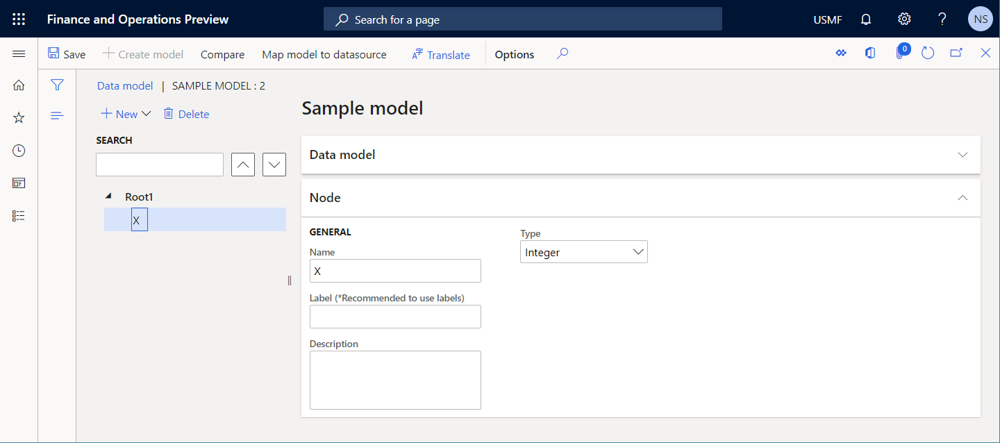

3. In the model mapping designer, in the **Data sources** pane, add a data source of the **Calculated field** type.
4. Name the new data source **Y**, and configure it so that it contains the expression `INTVALUE(100)`.
5. Bind **X** to **Y**.
6. In the data model designer, change the data type of the **X** field from **Integer** to **Int64**.
7. Select **Validate** to inspect the editable model mapping component on the **Model mapping designer** page.

    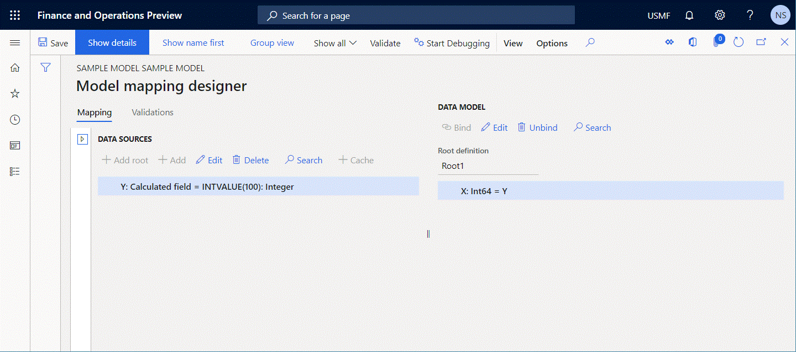

8. Select **Validate** to inspect the model mapping component of the selected ER configuration on the **Configurations** page.

    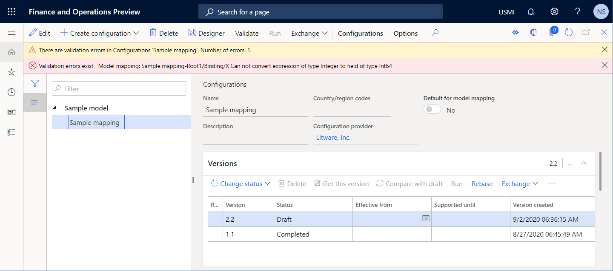

9. Notice that a validation error occurs. The message states that the value of the **Integer** type that the `INTVALUE(100)` expression of the **Y** data source returns can't be stored in the **X** data model field of the **Int64** type.

The following illustration shows the runtime error that occurs if you ignore the warning and select **Run** to run a format that is configured to use the model mapping.

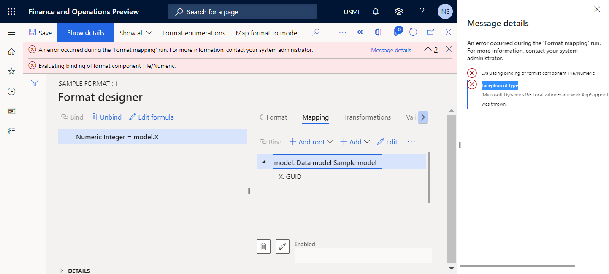

### Automatic resolution

No option to automatically fix this issue is available.

### Manual resolution

#### Option 1

Update the data model structure by changing the data type of the data model field so that it matches the data type of the expression that is configured for the binding of that field. For the preceding example, the data type of the **X** field must be changed back to **Integer**.

#### Option 2

Update the model mapping by changing the expression of the data source that is bound with the data model field. For the preceding example, the expression of the **Y** data source must be changed to `INT64VALUE(100)`.

## Type compatibility

ER checks whether the data type of a format element is compatible with the data type of an expression that is configured as the binding of that format element. If the data types are incompatible, a validation error occurs in the ER Operations designer. The message that you receive states that the configured expression can't be used as the binding of the current format element to a data source, because the expression returns a value of data type A that is beyond the scope of the data types that are supported by the current format element of type B.

The following steps show how this issue might occur.

1. Start to configure the ER data model and the ER format components simultaneously.
2. In the data model tree, add a field that is named **X**, and select **Integer** as the data type.
3. In the format structure tree, add a format element of the **Numeric** type.
4. Name the new format element **Y**. In the **Numeric type** field, select **Integer** as the data type.
5. Bind **X** to **Y**.
6. In the format structure tree, change the data type of the **Y** format element from **Integer** to **Int64**.
7. Select **Validate** to inspect the editable format component on the **Format designer** page.

    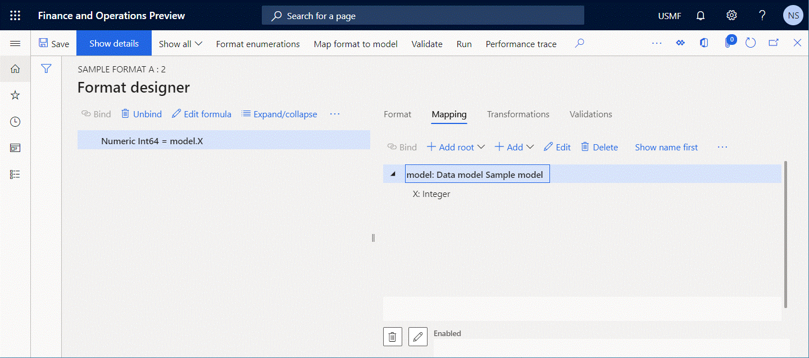

8. Notice that a validation error occurs. The message states that the configured expression can accept only **Int64** values. Therefore, the value of the **X** data model field of the **Integer** type can't be entered in the **Y** format element.

### Automatic resolution

No option to automatically fix this issue is available.

### Manual resolution

#### Option 1

Update the format structure by changing the data type of the **Numeric** format element so that it matches the data type of the expression that you configured for the binding of that element. In the preceding example, the **Numeric type** value of the **X** format element must be changed back to **Integer**.

#### Option 2

Update the format mapping of the **X** format element by changing the expression from `model.X` to `INT64VALUE(model.X)`.

## Missing configuration element

ER checks whether the binding expressions contain only data sources that are configured in the editable ER component. For every binding that contains a data source that is missing in the editable ER component, a validation error occurs in the ER Operations designer or the ER model mapping designer.

The following steps show how this issue might occur.

1. Start to configure the ER data model and the ER model mapping components simultaneously.
2. In the data model tree, add a field that is named **X**, and select **Integer** as the data type.

    

3. In the model mapping designer, in the **Data sources** pane, add a data source of the **Calculated field** type.
4. Name the new data source **Y**, and configure it so that it contains the expression `INTVALUE(100)`.
5. Bind **X** to **Y**.
6. In the model mapping designer, in the **Data sources** pane, delete the **Y** data source.
7. Select **Validate** to inspect the editable model mapping component on the **Model mapping designer** page.

    

8. Notice that a validation error occurs. The message states that the binding of the **X** data model field contains the path that refers to the **Y** data source, but this data source isn't found.

### Automatic resolution

Select **Unbind** to automatically fix this issue by removing the missing data source binding.

### Manual resolution

#### Option 1

Unbind the **X** data model field to stop referring to the nonexistent **Y** data source.

#### Option 2

In the model mapping designer, in the **Data sources** pane, add the **Y** data source again.

## Executability of an expression with FILTER function

The built-in [FILTER](er-functions-list-filter.md) ER function is used to access application tables, views, or data entities by placing a single SQL call to get the required data as a list of records. A data source of the **Record list** type is used as an argument of this function and specifies the application source for the call. ER checks whether a direct SQL query can be established to a data source that is referred to in the `FILTER` function. If a direct query can't be established, a validation error occurs in the ER model mapping designer. The message that you receive states that the ER expression that includes the `FILTER` function can't be run at runtime.

The following steps show how this issue might occur.

1. Start to configure the ER model mapping component.
2. Add a data source of the **Dynamics 365 for Operations \\ Table records** type.
3. Name the new data source **Vendor**. In the **Table** field, select **VendTable** to specify that this data source will request the VendTable table.
4. Add a data source of the **Calculated field** type.
5. Name the new data source **FilteredVendor**, and configure it so that it contains the expression `FILTER(Vendor, Vendor.AccountNum="US-101")`.
6. Select **Validate** to inspect the editable model mapping component on the **Model mapping designer** page and verify that the `FILTER(Vendor, Vendor.AccountNum="US-101")` expression in the **Vendor** data source can be queried.
7. Modify the **Vendor** data source by adding a nested field of the **Calculated field** type to get the trimmed vendor account number.
8. Name the new nested field **$AccNumber**, and configure it so that it contains the expression `TRIM(Vendor.AccountNum)`.
9. Select **Validate** to inspect the editable model mapping component on the **Model mapping designer** page and verify that the `FILTER(Vendor, Vendor.AccountNum="US-101")` expression in the **Vendor** data source can be queried.

    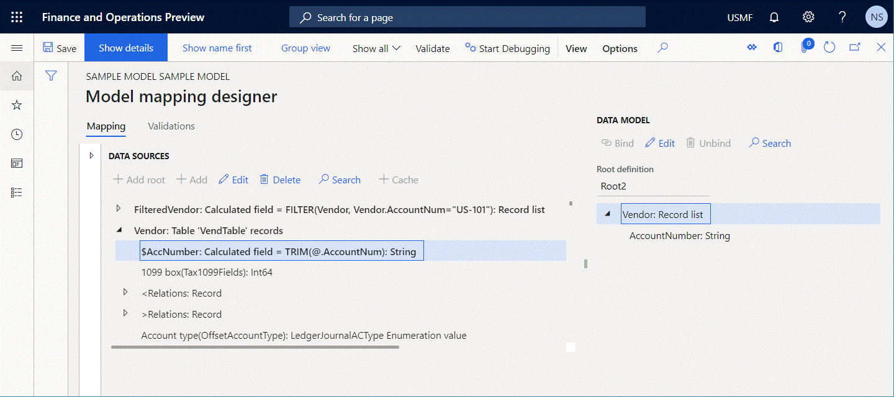

10. Notice that a validation error occurs, because the **Vendor** data source contains a nested field of the **Calculated field** type that doesn't allow the expression of the **FilteredVendor** data source to be translated to the direct SQL statement.

The following illustration shows the runtime error that occurs if you ignore the warning and select **Run** to run a format that is configured to use the model mapping.

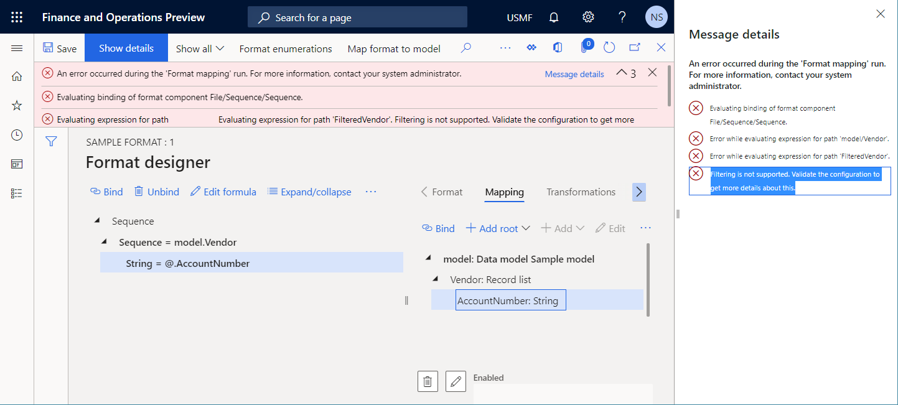

### Automatic resolution

No option to automatically fix this issue is available.

### Manual resolution

#### Option 1

Instead of adding a nested field of the **Calculated field** type to the **Vendor** data source, add the **$AccNumber** nested field to the **FilteredVendor** data source, and configure it so that it contains the expression `TRIM(FilteredVendor.AccountNum)`. In this way, the `FILTER(Vendor, Vendor.AccountNum="US-101")` expression can be run at the SQL level and calculate the **$AccNumber** nested field afterward.

#### Option 2

Change the expression of the **FilteredVendor** data source from `FILTER(Vendor, Vendor.AccountNum="US-101")` to `WHERE(Vendor, Vendor.AccountNum="US-101")`. We don't recommend that you change the expression for a table that has a large volume of data (transactional table), because all records will be fetched, and selection of the required records will be done in memory. Therefore, this approach can cause poor performance. For more information, see [WHERE ER function](er-functions-list-where.md).

## Executability of a GROUPBY data source

The **GROUPBY** data source divides the query result into groups of records, usually for the purpose of doing one or more aggregations on each group. Every **GROUPBY** data source can be configured so that it's run either at the database level or in memory. When a **GROUPBY** data source is configured so that it's run at the database level, ER checks whether a direct SQL query can be established to a data source that is referred to in that data source. If a direct query can't be established, a validation error occurs in the ER model mapping designer. The message that you receive states that the configured **GROUPBY** data source can't be run at runtime.

The following steps show how this issue might occur.

1. Start to configure the ER model mapping component.
2. Add a data source of the **Dynamics 365 for Operations \\ Table records** type.
3. Name the new data source **Trans**. In the **Table** field, select **VendTrans** to specify that this data source will request the VendTrans table.
4. Add a data source of the **Group by** type.
5. Name the new data source **GroupedTrans**, and configure it in the following way:

    - Select the **Trans** data source as the source of records that should be grouped.
    - In the **Execution location** field, select **Query** to specify that you want to run this data source at the database level.

    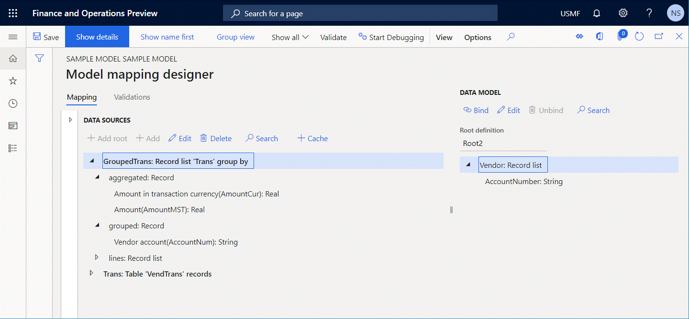

6. Select **Validate** to inspect the editable model mapping component on the **Model mapping designer** page and verify that the configured **GroupedTrans** data source can be queried.
7. Modify the **Trans** data source by adding a nested field of the **Calculated field** type to get the trimmed vendor account number.
8. Name the new data source **$AccNumber**, and configure it so that it contains the expression `TRIM(Trans.AccountNum)`.

    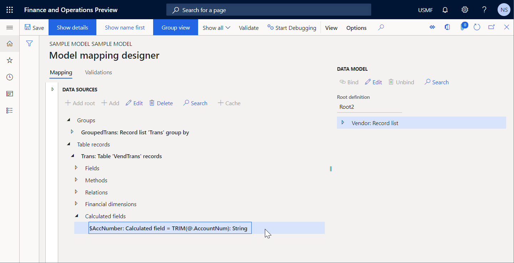

9. Select **Validate** to inspect the editable model mapping component on the **Model mapping designer** page and verify that the configured **GroupedTrans** data source can be queried.

    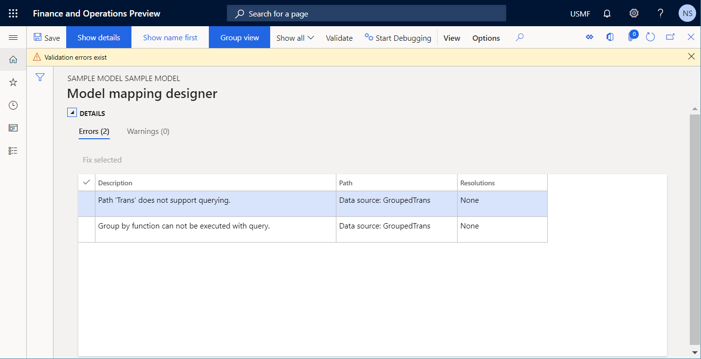

10. Notice that a validation error occurs, because the **Trans** data source contains a nested field of the **Calculated field** type that doesn't allow the call for the **GroupedTrans** data source to be translated to the direct SQL statement.

The following illustration shows the runtime error that occurs if you ignore the warning and select **Run** to run a format that is configured to use the model mapping.

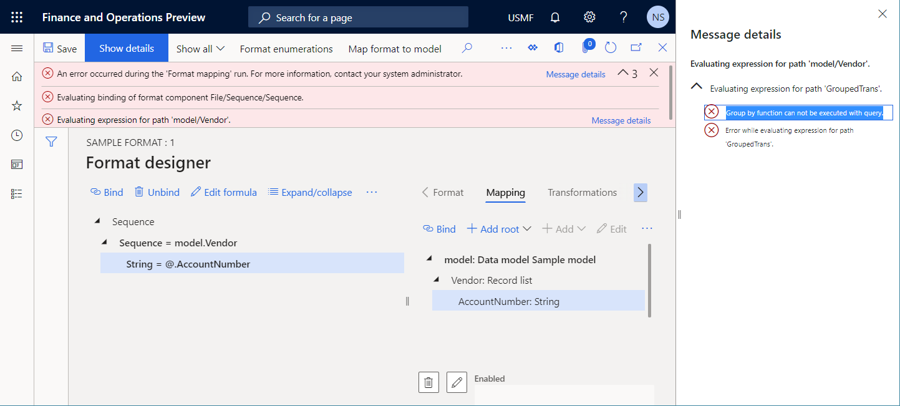

### Automatic resolution

No option to automatically fix this issue is available.

### Manual resolution

#### Option 1

Instead of adding a nested field of the **Calculated field** type to the **Trans** data source, add the **$AccNumber** nested field for the **GroupedTrans.lines** item of the **GroupedTrans** data source, and configure it so that it contains the expression `TRIM(GroupedTrans.lines.AccountNum)`. In this way, the **GroupedTrans** data source can be run at the SQL level and calculate the **$AccNumber** nested field afterward.

#### Option 2

Change the value of the **Execution location** field for the **GroupedTrans** data source from **Query** to **In memory**. We don't recommend that you change the value for a table that has a large volume of data (transactional table), because all records will be fetched, and grouping and aggregation will be done in memory. Therefore, this approach can cause poor performance.

## Executability of a JOIN data source

The [JOIN](er-join-data-sources.md) data source combines records from two or more database tables, based on related fields. Every **JOIN** data source can be configured so that it's run either at the database level or in memory. When a **JOIN** data source is configured so that it's run at the database level, ER checks whether a direct SQL query can be established to data sources that are referred to in that data source. If a direct SQL query can't be established with at least one referenced data source, a validation error occurs in the ER model mapping designer. The message that you receive states that the configured **JOIN** data source can't be run at runtime.

The following steps show how this issue might occur.

1. Start to configure the ER model mapping component.
2. Add a data source of the **Dynamics 365 for Operations \\ Table records** type.
3. Name the new data source **Vendor**. In the **Table** field, select **VendTable** to specify that this data source will request the VendTable table.
4. Add a data source of the **Dynamics 365 for Operations \\ Table records** type.
5. Name the new data source **Trans**. In the **Table** field, select **VendTrans** to specify that this data source will request the VendTrans table.
6. Add a data source of the **Calculated field** type as the nested field of the **Vendor** data source.
7. Name the new data source **FilteredTrans**, and configure it so that it contains the expression `FILTER(Trans, Trans.AccountNum=Vendor.AccountNum)`.
8. Add a data source of the **Join** type.
9. Name the new data source **JoinedList**, and configure it in the following way:

    1. Add the **Vendor** data source as the first set of records to join.
    2. Add the **Vendor.FilteredTrans** data source as the second set of records to join. Select **INNER** as the type.
    3. In the **Execute** field, select **Query** to specify that you want to run this data source at the database level.

    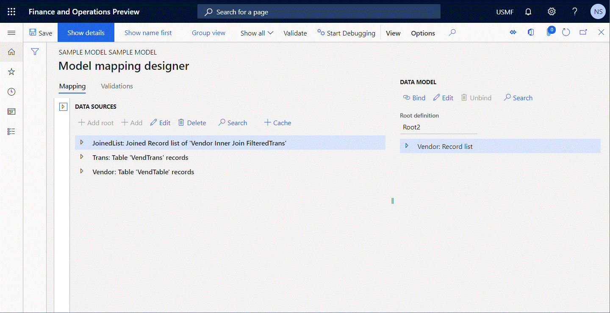

10. Select **Validate** to inspect the editable model mapping component on the **Model mapping designer** page and verify that the configured **JoinedList** data source can be queried.
11. Change the expression of the **Vendor.FilteredTrans** data source from `FILTER(Trans, Trans.AccountNum=Vendor.AccountNum)` to `WHERE(Trans, Trans.AccountNum=Vendor.AccountNum)`.
12. Select **Validate** to inspect the editable model mapping component on the **Model mapping designer** page and verify that the configured **JoinedList** data source can be queried.

    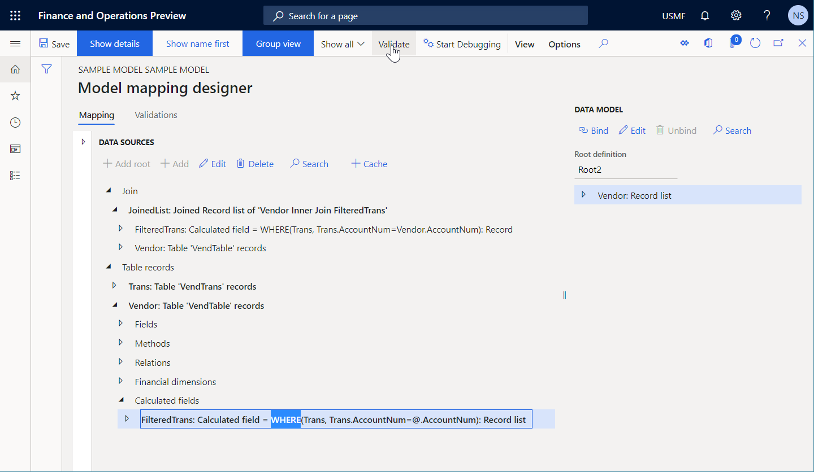

13. Notice that a validation error occurs, because the expression of the **Vendor.FilteredTrans** data source can't be translated to the direct SQL call. Additionally, the direct SQL call doesn't allow the call for the **JoinedList** data source to be translated to the direct SQL statement.

    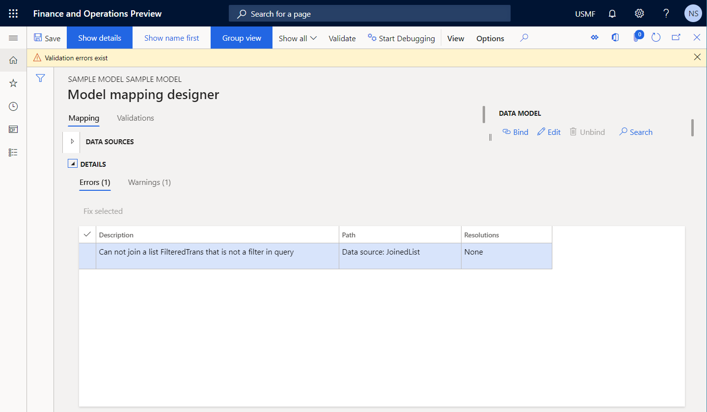

The following illustration shows the runtime error that occurs if you ignore the warning and select **Run** to run a format that is configured to use the model mapping.

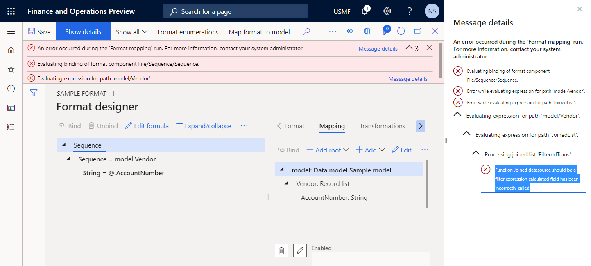

### Automatic resolution

No option to automatically fix this issue is available.

### Manual resolution

#### Option 1

Change the expression of the **Vendor.FilteredTrans** data source from `WHERE(Trans, Trans.AccountNum=Vendor.AccountNum)` back to `FILTER(Trans, Trans.AccountNum=Vendor.AccountNum)`, as the warning advised.

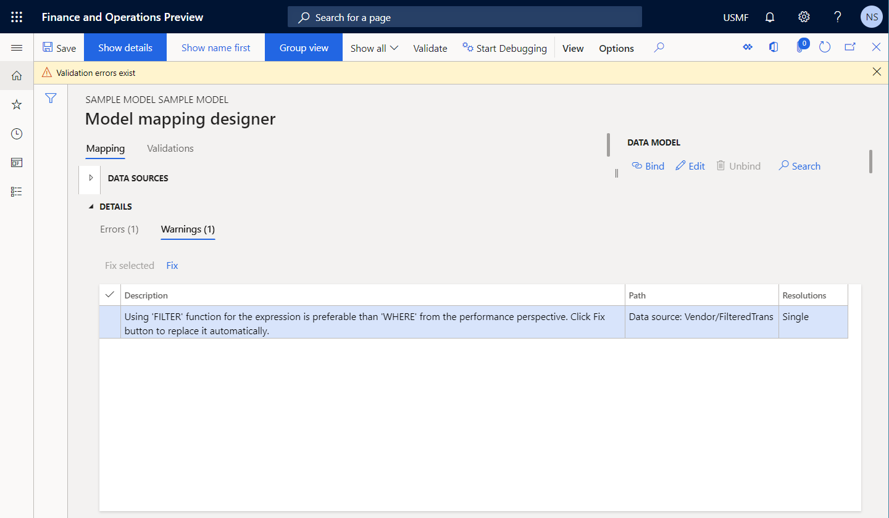

#### Option 2

Change the value of the **Execute** field for the **JoinedList** data source from **Query** to **In memory**. We don't recommend that you change the value for a table that has a large volume of data (transactional table), because all records will be fetched, and the join occurs in memory. Therefore, this approach can cause poor performance. A validation warning is shown to inform you about this risk.

## Preferability of FILTER vs WHERE function

The built-in [FILTER](er-functions-list-filter.md) ER function is used to access application tables, views, or data entities by placing a single SQL call to get the required data as a list of records. The [WHERE](er-functions-list-where.md) function fetches all records from the given source and does record selection in memory. A data source of the **Record list** type is used as an argument of both functions and specifies a source for getting records. ER checks whether a direct SQL call can be established to a data source that is referred to in the **WHERE** function. If a direct call can be established, a validation warning occurs in the ER model mapping designer. The message that you receive recommends that you use the **FILTER** function instead of the **WHERE** function to help improve efficiency.

The following steps show how this issue might occur.

1. Start to configure the ER model mapping component.
2. Add a data source of the **Dynamics 365 for Operations \\ Table records** type.
3. Name the new data source **Trans**. In the **Table** field, select **VendTrans** to specify that this data source will request the VendTrans table.
4. Add a data source of the **Calculated field** type as the nested field of the **Vendor** data source.
5. Name the new data source **FilteredTrans**, and configure it so that it contains the expression `WHERE(Trans, Trans.AccountNum="US-101")`.
6. Add a data source of the **Dynamics 365 for Operations \\ Table records** type.
7. Name the new data source **Vendor**. In the **Table** field, select **VendTable** to specify that this data source will request the VendTable table.
8. Add a data source of the **Calculated field** type.
9. Name the new data source **FilteredVendor**, and configure it so that it contains the expression `WHERE(Vendor, Vendor.AccountNum="US-101")`.
10. Select **Validate** to inspect the editable model mapping component on the **Model mapping designer** page.

    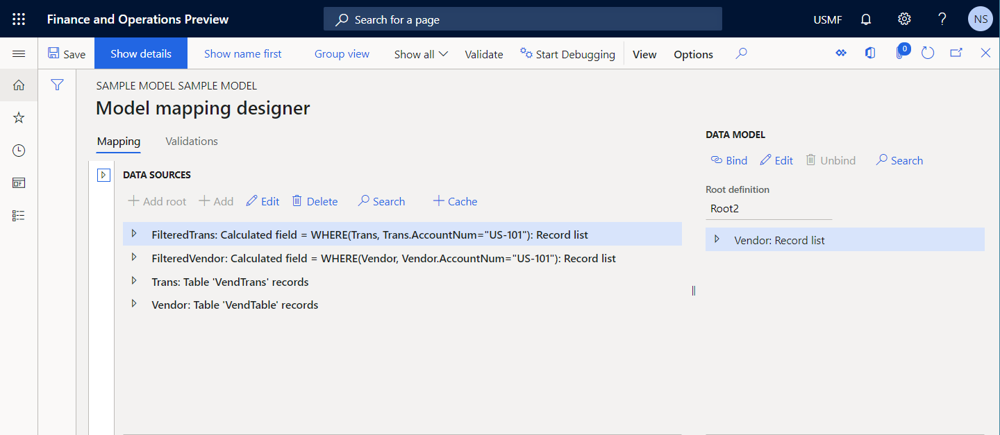

11. Notice that validation warnings recommend that you use the **FILTER** function instead of the **WHERE** function for the **FilteredVendor** and **FilteredTrans** data sources.

    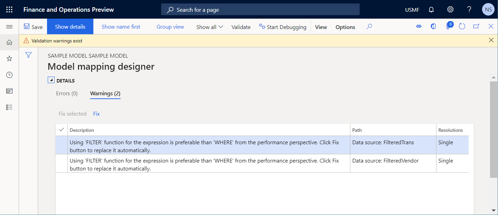

### Automatic resolution

Select **Fix** to automatically replace the **WHERE** function with the **FILTER** function in the expression of all data sources that appear in the grid on the **Warnings** tab for this type of inspection.

Alternatively, you can select the row for a single warning in the grid and then select **Fix selected**. In this case, the expression is automatically changed only in the data source that is mentioned in the selected warning.

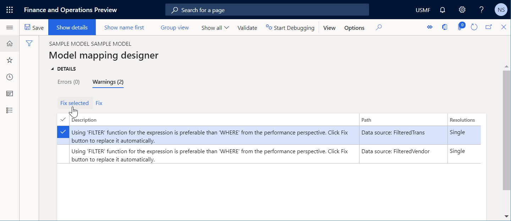

### Manual resolution

You can manually adjust the expressions of all the data sources in the validation grid by replacing the **WHERE** function with the **FILTER** function.

## Preferability of ALLITEMSQUERY vs ALLITEMS function

The built-in [ALLITEMS](er-functions-list-allitems.md) and [ALLITEMSQUERY](er-functions-list-allitemsquery.md) ER functions return a flattened **Record list** value that consists of a list of records that represent all items that match the specified path. ER checks whether a direct SQL call can be established to a data source that is referred to in the **ALLITEMS** function. If a direct call can be established, a validation warning occurs in the ER model mapping designer. The message that you receive recommends that you use the **ALLITEMSQUERY** function instead of the **ALLITEMS** function to help improve efficiency.

The following steps show how this issue might occur.

1. Start to configure the ER model mapping component.
2. Add a data source of the **Dynamics 365 for Operations \\ Table records** type.
3. Name the new data source **Vendor**. In the **Table** field, select **VendTable** to specify that this data source will request the VendTable table.
4. Add a data source of the **Calculated field** type to get records for several vendors.
5. Name the new data source **FilteredVendor**, and configure it so that it contains the expression `FILTER(Vendor, OR(Vendor.AccountNum="US-101",Vendor.AccountNum="US-102"))`.
6. Add a data source of the **Calculated field** type to get the transactions of all filtered vendors.
7. Name the new data source **FilteredVendorTrans**, and configure it so that it contains the expression `ALLITEMS(FilteredVendor.'<Relations'.'VendTrans.VendTable_AccountNum')`.
8. Select **Validate** to inspect the editable model mapping component on the **Model mapping designer** page.

    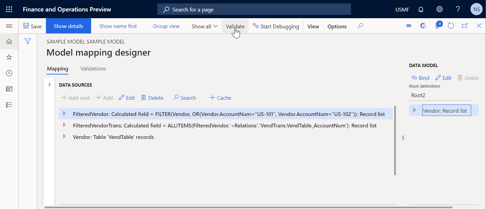

9. Notice that a validation warning occurs. The message recommends that you use the **ALLITEMSQUERY** function instead of the **ALLITEMS** function for the **FilteredVendorTrans** data source.

    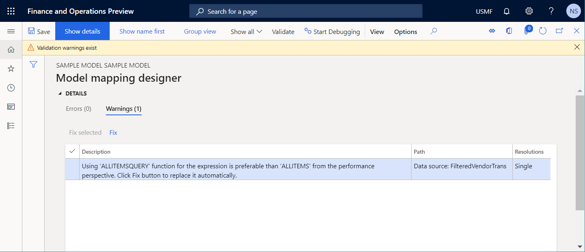

### Automatic resolution

Select **Fix** to automatically replace the **ALLITEMS** function with the **ALLITEMSQUERY** function in the expression of all data sources that appear in the grid on the **Warnings** tab for this type of inspection.

Alternatively, you can select the row for a single warning in the grid and then select **Fix selected**. In this case, the expression is automatically changed only in the data source that is mentioned in the selected warning.

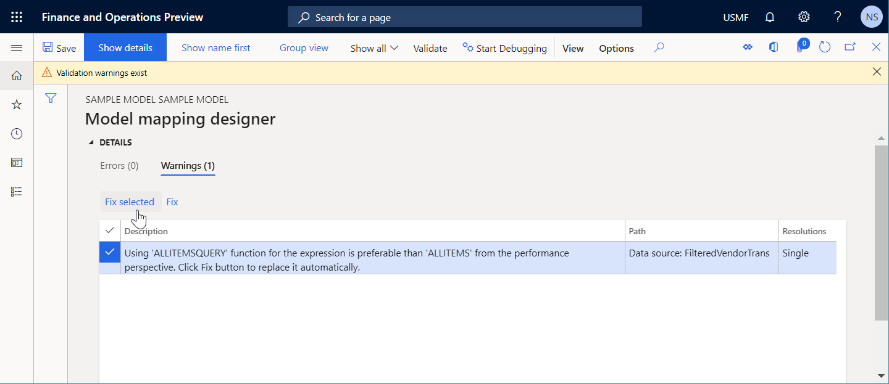

### Manual resolution

You can manually adjust the expressions of all the data sources that are mentioned in the validation grid by replacing the **ALLITEMS** function with the **ALLITEMSQUERY** function.

## Consideration of empty list cases

You can configure your ER format or model mapping component to get the field value of a data source of the **Record list** type. ER checks whether your design considers the case where a data source that is called contains no records (that is, it's empty), to prevent runtime errors when a value is fetched from a field of a nonexistent record.

The following steps show how this issue might occur.

1. Start to configure the ER data model, the ER model mapping, and the ER format components simultaneously.
2. In the data model tree, add a root item that is named **Root3**.
3. Modify the **Root3** item by adding a nested item of the **Record list** type.
4. Name the new nested item **Vendor**.
5. Modify the **Vendor** item in the following way:

    - Add a nested field of the **String** type, and name it **Name**.
    - Add a nested field of the **String** type, and name it **AccountNumber**.

    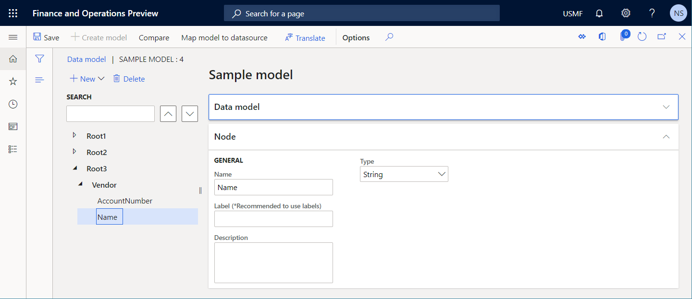

6. In the model mapping designer, in the **Data sources** pane, add a data source of the **Dynamics 365 for Operations \\ Table records** type.
7. Name the new data source **Vendor**. In the **Table** field, select **VendTable** to specify that this data source will request the VendTable table.
8. Add a data source of the **General \\ User input parameter** type to search for a vendor account in the runtime dialog box.
9. Name the new data source **RequestedAccountNum**. In the **Label** field, enter **Vendor account number**. In the **Operations data type name** field, leave the default value, **Description**.
10. Add a data source of the **Calculated field** type to filter a vendor that is inquired about.
11. Name the new data source **FilteredVendor**, and configure it so that it contains the expression `FILTER(Vendor, Vendor.AccountNum=RequestedAccountNum)`.
12. Bind the data model items to configured data sources in the following way:

    - Bind **FilteredVendor** to **Vendor**.
    - Bind **FilteredVendor.AccountNum** to **Vendor.AccountNumber**.
    - Bind **FilteredVendor.'name()'** to **Vendor.Name**.

    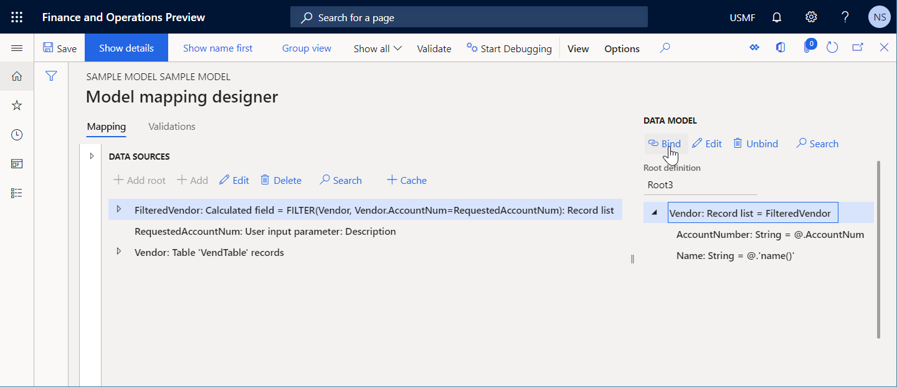

13. In the format structure tree, add the following items to generate an outbound document in XML format that contains the vendor details:

    1. Add the **Statement** root XML element.
    2. For the **Statement** XML element, add the nested **Party** XML element.
    3. For the **Party** XML element, add the following nested XML attributes:

        - Name
        - AccountNum

14. Bind format elements to provided data sources in the following way:

    - Bind the **Statement\\Party\\Name** format element to the **model.Vendor.Name** data source field.
    - Bind the **Statement\\Party\\AccountNum** format element to the **model.Vendor.AccountNumber** data source field.

15. Select **Validate** to inspect the editable format component on the **Format designer** page.

    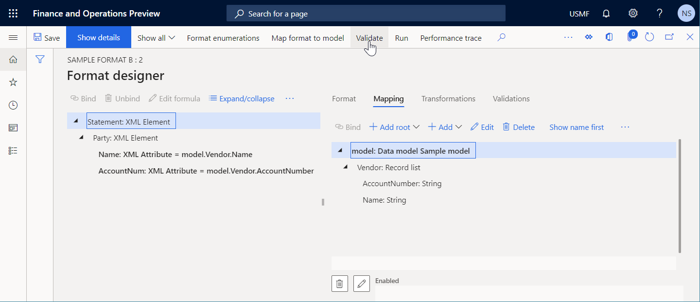

16. Notice that a validation error occurs. The message states that an error might be thrown for the configured **Statement\\Party\\Name** and **Statement\\Party\\AccountNum** format components at runtime if the `model.Vendor` list is empty.

    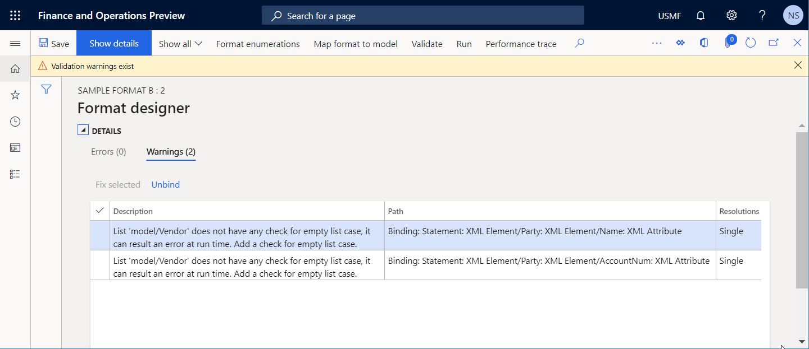

The following illustration shows the runtime error that occurs if you ignore the warning, select **Run** to run the format, and select the account number of a nonexistent vendor. Because the requested vendor doesn't exist, the `model.Vendor` list will be empty (that is, it will contain no records).

### Automatic resolution

For the selected row in the grid on the **Warnings** tab, you can select **Unbind**. The binding that is pointed to in the **Path** column is automatically removed from the format elements.

### Manual resolution

#### Option 1

You can bind the **Statement\\Party\\Name** format element to the `model.Vendor` data source item. At runtime, this binding calls the `model.Vendor` data source first. When `model.Vendor` returns an empty record list, the nested format elements aren't run. Therefore, no validation warnings occur for this format configuration.

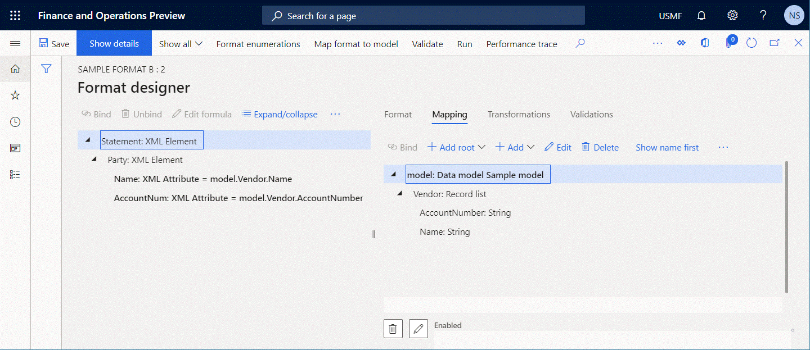

#### Option 2

Change the binding of the **Statement\\Party\\Name** format element from `model.Vendor.Name` to `FIRSTORNULL(model.Vendor).Name`. The updated binding conditionally converts the first record of the `model.Vendor` data source of the **Record list** type to a new data source of the **Record** type. This new data source contains the same set of fields.

- If at least one record is available in the `model.Vendor` data source, the fields of that record are filled with the values of the fields of the first record of the `model.Vendor` data source. In this case, the updated binding returns the vendor name.
- Otherwise, every field of the record that is created is filled with the default value for the data type of that field. In this case, the blank string is returned as the default value of the **String** data type.

Therefore, no validation warnings occur for the **Statement\\Party\\Name** format element when it's bound to the `FIRSTORNULL(model.Vendor).Name` expression.

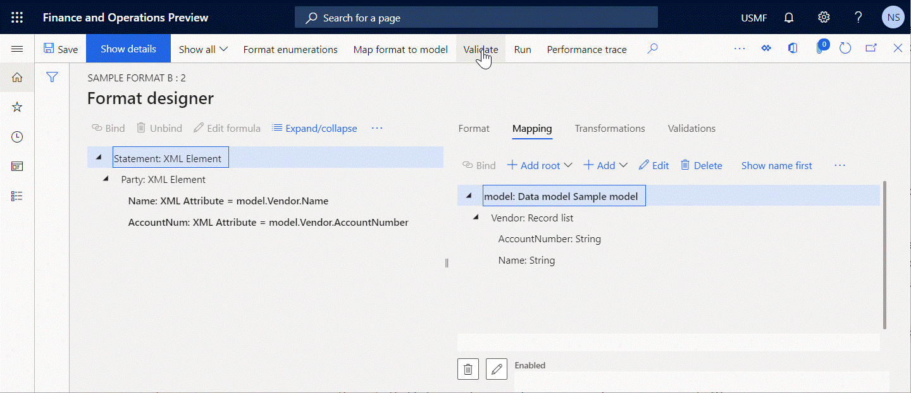

#### Option 3

If you want to explicitly specify the data that is entered in a generated document when the `model.Vendor` data source of the **Record list** type returns no records (the text **Not available** in this example), change the binding of the **Statement\\Party\\Name** format element from `model.Vendor.Name` to `IF(NOT(ISEMPTY(model.Vendor)), model.Vendor.Name, "Not available")`. You can also use the expression `IF(COUNT(model.Vendor)=0, model.Vendor.Name, "Not available")`.

### Additional consideration

The inspection also warns you about another potential issue. By default, as you bind the **Statement\\Party\\Name** and **Statement\\Party\\AccountNum** format elements to the appropriate fields of the `model.Vendor` data source of the **Record list** type, those bindings will be run and will take the values of the appropriate fields of the first record of the `model.Vendor` data source, if that list isn't empty.

Because you haven't bound the **Statement\\Party** format element with the `model.Vendor` data source, the **Statement\\Party** element won't be iterated for every record of the `model.Vendor` data source during format execution. Instead, a generated document will be filled with information from only the first record of the record list, if that list contains multiple records. Therefore, there might be an issue if the format is intended to fill a generated document with information about all vendors from the `model.Vendor` data source. To fix this issue, bind the **Statement\\Party** element with the `model.Vendor` data source.

## Executability of an expression with FILTER function (caching)

Several built-in ER functions, including [FILTER](er-functions-list-filter.md) and [ALLITEMSQUERY](er-functions-list-allitemsquery.md), are used to access application tables, views, or data entities by placing a single SQL call to get the required data as a list of records. A data source of the **Record list** type is used as an argument of each of these functions and specifies an application source for the call. ER checks whether a direct SQL call can be established to a data source that is referred to in one of these functions. If a direct call can't be established because the data source was marked as [cached](trace-execution-er-troubleshoot-perf.md#improve-the-model-mapping-based-on-information-from-the-execution-trace), a validation error occurs in the ER model mapping designer. The message that you receive states that the ER expression that contains one of these functions can't be run at runtime.

The following steps show how this issue might occur.

1. Start to configure the ER model mapping component.
2. Add a data source of the **Dynamics 365 for Operations \\ Table records** type.
3. Name the new data source **Vendor**. In the **Table** field, select **VendTable** to specify that this data source will request the VendTable table.
4. Add a data source of the **General \\ User input parameter** type to search for a vendor account in the runtime dialog box.
5. Name the new data source **RequestedAccountNum**. In the **Label** field, enter **Vendor account number**. In the **Operations data type name** field, leave the default value, **Description**.
6. Add a data source of the **Calculated field** type to filter a vendor that is inquired about.
7. Name the new data source **FilteredVendor**, and configure it so that it contains the expression `FILTER(Vendor, Vendor.AccountNum=RequestedAccountNum)`.
8. Mark the configured **Vendor** data source as cached.

    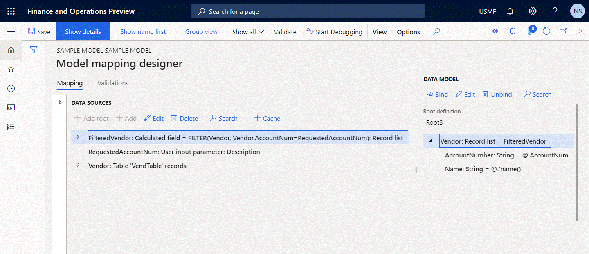

9. Select **Validate** to inspect the editable model mapping component on the **Model mapping designer** page.

    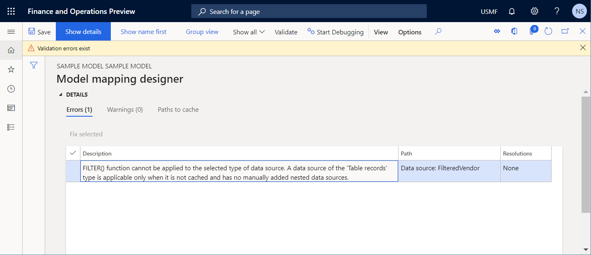

10. Notice that a validation error occurs. The message states that the **FILTER** function can't be applied to the cached **Vendor** data source.

The following illustration shows the runtime error that occurs if you ignore the warning and select **Run** to run the format.

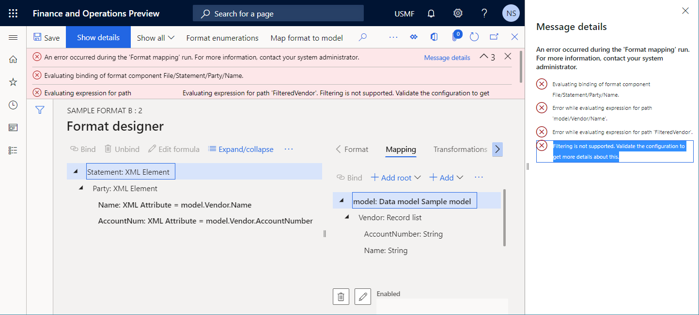

### Automatic resolution

No option to automatically fix this issue is available.

### Manual resolution

#### Option 1

Remove the **Cache** flag from the **Vendor** data source. The **FilteredVendor** data source will then become executable, but the **Vendor** data source that is referred to in the VendTable table will be accessed every time that the **FilteredVendor** data source is called.

#### Option 2

Change the expression of the **FilteredVendor** data source from `FILTER(Vendor, Vendor.AccountNum="US-101")` to `WHERE(Vendor, Vendor.AccountNum="US-101")`. In this case, the **Vendor** data source that is referred to in the VendTable table will be accessed only during the first call of the **Vendor** data source. However, the selection of records will be done in memory. Therefore, this approach can cause poor performance.

## Missing binding

When you configure an ER format component, the base ER data model is offered as a default data source for the ER format. When the configured ER format is run, the [default model mapping](er-country-dependent-model-mapping.md) for the base model is used to fill the data model with application data. The ER format designer shows a warning if you bind a format element to a data model item that isn't bound to any data source in the model mapping that is currently selected as the default model mapping for the editable format. This type of binding can't be run at runtime, because the format that runs can't fill a bound element with application data. Therefore, an error occurs at runtime.

The following steps show how this issue might occur.

1. Start to configure the ER data model, the ER model mapping, and the ER format components simultaneously.
2. In the data model tree, add a root item that is named **Root3**.
3. Modify the **Root3** item by adding a new nested item of the **Record list** type.
4. Name the new nested item **Vendor**.
5. Modify the **Vendor** item in the following way:

    - Add a nested field of the **String** type, and name it **Name**.
    - Add a nested field of the **String** type, and name it **AccountNumber**.

    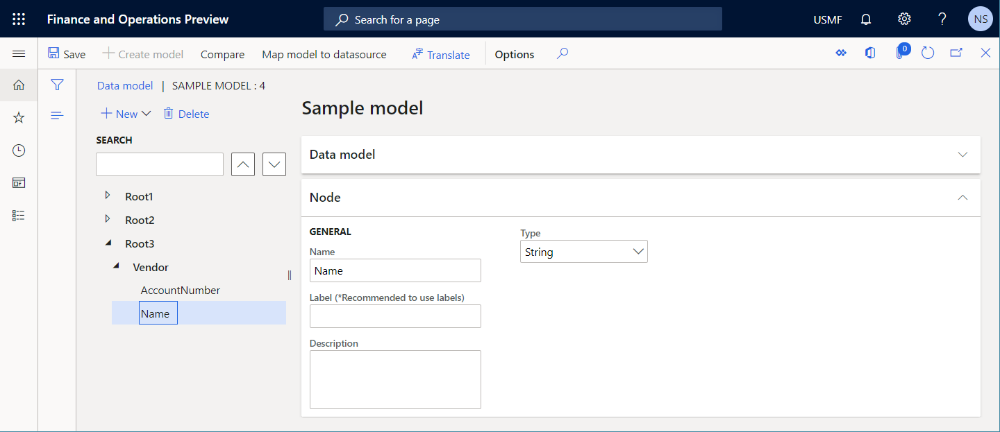

6. In the model mapping designer, in the **Data sources** pane, add a data source of the **Dynamics 365 for Operations \\ Table records** type.
7. Name the new data source **Vendor**. In the **Table** field, select **VendTable** to specify that this data source will request the VendTable table.
8. Add a data source of the **General \\ User input parameter** type to inquire about a vendor account in the runtime dialog box.
9. Name the new data source **RequestedAccountNum**. In the **Label** field, enter **Vendor account number**. In the **Operations data type name** field, leave the default value, **Description**.
10. Add a data source of the **Calculated field** type to filter a vendor that is inquired about.
11. Name the new data source **FilteredVendor**, and configure it so that it contains the expression `FILTER(Vendor, Vendor.AccountNum=RequestedAccountNum)`.
12. Bind the data model items to configured data sources in the following way:

    - Bind **FilteredVendor** to **Vendor**.
    - Bind **FilteredVendor.AccountNum** to **Vendor.AccountNumber**.

    > [!NOTE]
    > The **Vendor.Name** data model field remains unbound.

    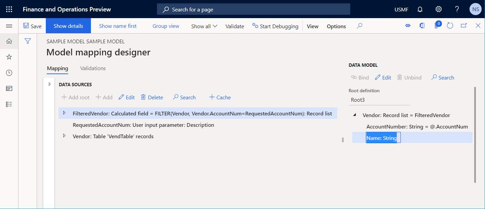

13. In the format structure tree, add the following items to generate an outbound document in XML format that contains the details of the vendors that are inquired about:

    1. Add the **Statement** root XML element.
    2. For the **Statement** XML element, add the nested **Party** XML element.
    3. For the **Party** XML element, add the following nested XML attributes:

        - Name
        - AccountNum

14. Bind the format elements to provided data sources in the following way:

    - Bind the **Statement\\Party** format element to the `model.Vendor` data source item.
    - Bind the **Statement\\Party\\Name** format element to the **model.Vendor.Name** data source field.
    - Bind the **Statement\\Party\\AccountNum** format element to the **model.Vendor.AccountNumber** data source field.

15. Select **Validate** to inspect the editable format component on the **Format designer** page.

    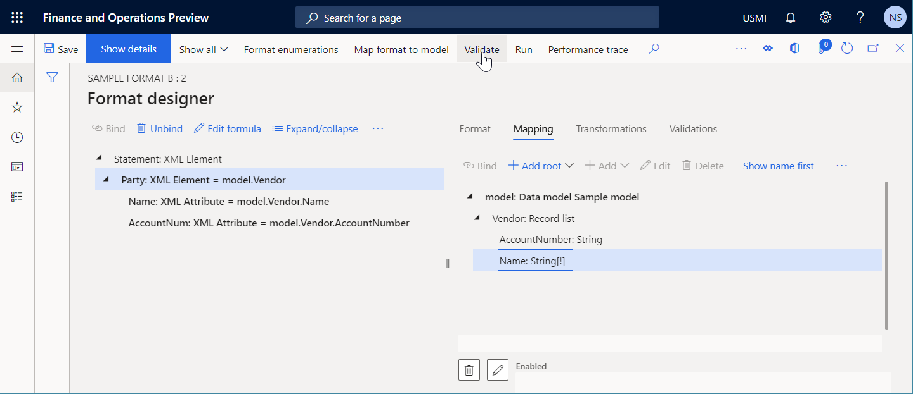

16. Notice that a validation warning occurs. The message states that the **model.Vendor.Name** data source field isn't bound to any data source in the model mapping that is configured to be used by the format. Therefore, the **Statement\\Party\\Name** format element might not be filled at runtime, and a runtime exception might occur.

    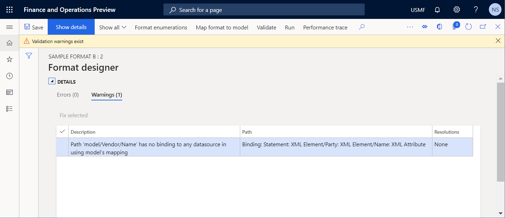

The following illustration shows the runtime error that occurs if you ignore the warning and select **Run** to run the format.

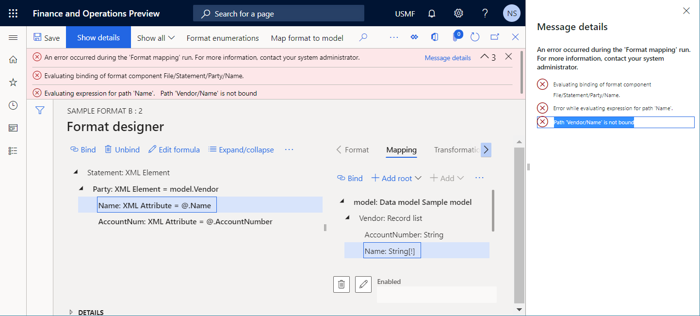

### Automatic resolution

No option to automatically fix this issue is available.

### Manual resolution

#### Option 1

Modify the configured model mapping by adding a binding for the **model.Vendor.Name** data source field.

#### Option 2

Modify the configured format by removing the binding for the **Statement\\Party\\Name** format element.

## Not linked template

When you [manually](er-fillable-excel.md#manual-entry) configure an ER format component to use a template to generate an outbound document, you must manually add the **Excel\\File** element, add the required template as an attachment of the editable component, and select that attachment in the added **Excel\\File** element. In this way, you indicate that the added element will fill the selected template at runtime. When you configure a format component version in **Draft** [status](general-electronic-reporting.md#component-versioning), you might add several templates to the editable component and then select each template in the **Excel\\File** element to run the ER format. In this way, you can see how different templates are filled at runtime. If you have templates that aren't selected in any **Excel\\File** elements, the ER format designer warns you that those templates will be deleted from the editable ER format component version when its status is changed from **Draft** to **Completed**.

The following steps show how this issue might occur.

1. Start to configure the ER format component.
2. In the format structure tree, add the **Excel\\File** element.
3. For the **Excel\\File** element that you just added, add an Excel workbook file, **A.xlsx**, as an attachment. Use the document type that is configured in the [ER parameters](electronic-reporting-er-configure-parameters.md#parameters-to-manage-documents) to specify the storage of ER format templates.
4. For the **Excel\\File** element, add another Excel workbook file, **B.xlsx**, as an attachment. Use the same document type that is used for workbook file A.
5. In the **Excel\\File** element, select workbook file A.
6. Select **Validate** to inspect the editable format component on the **Format designer** page.

    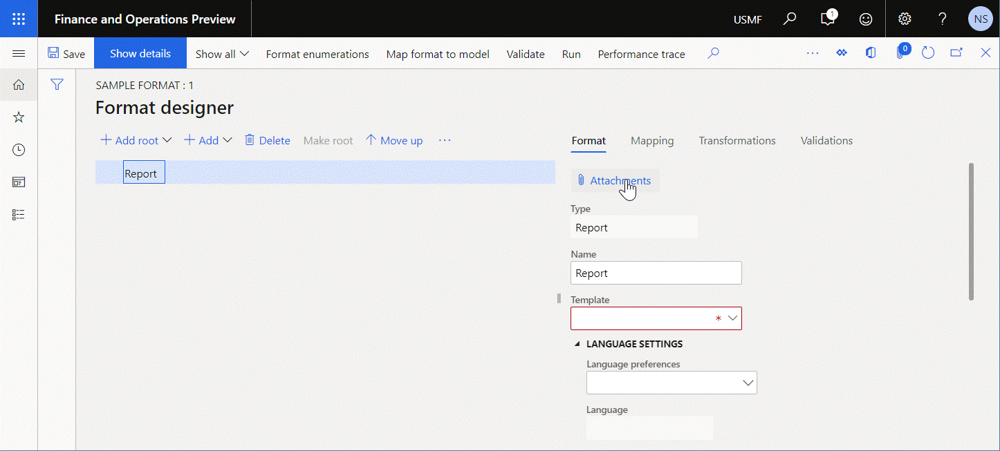

7. Notice that a validation warning occurs. The message states that workbook file B.xlsx isn't linked to any components, and that it will be removed after the status of the configuration version is changed.

### Automatic resolution

No option to automatically fix this issue is available.

### Manual resolution

Modify the configured format by removing all templates that aren't linked to any **Excel\\File** element.

## Not synced format

When you [configure](er-fillable-excel.md) an ER format component to use an Excel template to generate an outbound document, you can manually add the **Excel\\File** element, add the required template as an attachment of the editable component, and select that attachment in the added **Excel\\File** element. In this way, you indicate that the added element will fill the selected template at runtime. Because the added Excel template has been externally designed, the editable ER format might contain Excel names that are missing from the added template. The ER format designer warns you about any inconsistencies between the properties of the ER format elements that refer to names that aren't included in the added Excel template.

The following steps show how this issue might occur.

1. Start to configure the ER format component.
2. In the format structure tree, add the **Excel\\File** element **Report**.
3. For the **Excel\\File** element that you just added, add an Excel workbook file, **A.xlsx**, as an attachment. Use the document type that is configured in the [ER parameters](electronic-reporting-er-configure-parameters.md#parameters-to-manage-documents) to specify the storage of ER format templates.

    > [!IMPORTANT]
    > Make sure that the added Excel workbook doesn't contain the name **ReportTitle**.

4. Add the **Excel\\Cell** element **Title** as a nested element of the **Report** element. In the **Excel range** field, enter **ReportTitle**.
5. Select **Validate** to inspect the editable format component on the **Format designer** page.

    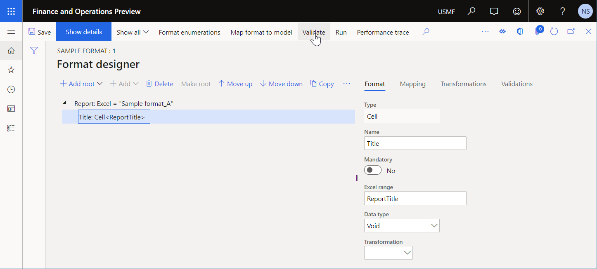

6. Notice that a validation warning occurs. The message states that the name **ReportTitle** doesn't exist on sheet **Sheet1** of the Excel template that you're using.

    

### Automatic resolution

No option to automatically fix this issue is available.

### Manual resolution

#### Option 1

Modify the configured format by removing all elements that refer to Excel names that are missing from the template.

#### Option 2

[Update](er-fillable-excel.md#template-import) the editable ER format by importing an Excel template. The structure of the editable ER format will be [synced](modify-electronic-reporting-format-reapply-excel-template.md) with the structure of the imported Excel template.

### Additional consideration

To learn how the format structure can be synced with an ER template in the template editor of [Business document management](er-business-document-management.md), see [Update the structure of a business document template](er-bdm-update-structure.md).

## Not synced with a Word template format

When you [configure](er-fillable-excel.md) an ER format component to use a Word template to generate an outbound document, you can manually add the **Excel\\File** element, add the required Word template as an attachment of the editable component, and select that attachment in the added **Excel\\File** element.

> [!NOTE]
> When the Word document is attached, the ER format designer presents the editable element as **Word\\File**.

In this way, you indicate that the added element will fill the selected template at runtime. Because the added Word template has been externally designed, the editable ER format might contain references to Word content controls that are missing from the added template. The ER format designer warns you about any inconsistencies between the properties of the ER format elements that refer to content controls that aren't included in the added Word template.

For an example that shows how this issue might occur, see [Configure the editable format to suppress the summary section](er-design-configuration-word-suppress-controls.md#configure-to-suppress-control).

### Automatic resolution

No option to automatically fix this issue is available.

### Manual resolution

#### Option 1

Modify the configured format by deleting the **Removed** formula from the format element that is mentioned in the validation warning.

#### Option 2

Modify the using Word template by [adding](er-design-configuration-word-suppress-controls.md#tag-control) the required tag to the relevant Word content control.

## No default mapping

When the [Missing binding](#i11) inspection is done, the inspected format bindings are evaluated against the bindings of the relevant model mapping component. Because you can import [several](./tasks/er-manage-model-mapping-configurations-july-2017.md) ER model mapping configurations to your Finance instance, and each configuration might contain the applicable model mapping component, one configuration must be selected as the default configuration. Otherwise, when you try to run, edit, or validate the inspected ER format, an exception will occur, and you will receive the following message: "More than one model mapping exists for the \<model name (root descriptor)\> data model in the configurations \<configuration names separated by comma\>. Set one of the configurations as default."

For an example that shows how this issue might occur and how it can be fixed, see [Manage several derived mappings for a single model root](er-multiple-model-mappings.md).

## Inconsistent setting of Header or Footer components

When you [configure](er-fillable-excel.md) an ER format component to use an Excel template to generate an outbound document, you can add the **Excel\\Header** component to fill in headers at the top of a worksheet in an Excel workbook. You can also add the **Excel\\Footer** component to fill in footers at the bottom of a worksheet. For every **Excel\\Header** or **Excel\\Footer** component that you add, you must set the **Header/footer appearance** property to specify the pages that the component is run for. Because you can configure several **Excel\\Header** or **Excel\\Footer** components for a single **Sheet** component, and you can generate different headers or footers for different type of pages in an Excel worksheet, you must configure a single **Excel\\Header** or **Excel\\Footer** component for a specific value of the **Header/footer appearance** property. If more than one **Excel\\Header** or **Excel\\Footer** component is configured for a specific value of the **Header/footer appearance** property, a validation error occurs, and you receive the following error message: "Headers/footers (&lt;component type: Header or Footer&gt;) are inconsistent."

### Automatic resolution

No option to automatically fix this issue is available.

### Manual resolution

#### Option 1

Modify the configured format by deleting one of the inconsistent **Excel\\Header** or **Excel\\Footer** components.

#### Option 2

Modify the value of the **Header/footer appearance** property for one of the inconsistent **Excel\\Header** or **Excel\\Footer** components.

## Inconsistent setting of Page component

When you [configure](er-fillable-excel.md) an ER format component to use an Excel template to generate an outbound document, you can add the **Excel\\Page** component to paginate a generated document by using ER formulas. For every **Excel\\Page** component that you add, you can add many nested [Range](er-fillable-excel.md#range-component) components and still remain compliant with the following [structure](er-fillable-excel.md#page-component-structure):

- The first nested **Range** component can be configured so that the **Replication direction** property is set to **No replication**. This range is used to make page headers in generated documents.
- You can add many other nested **Range** components where the **Replication direction** property is set to **Vertical**. These ranges are used to fill in generated documents.
- The last nested **Range** component can be configured so that the **Replication direction** property is set to **No replication**. This range is used to make page footers in generated documents and to add the required page breaks.

If you don't follow this structure for an ER format in the ER format designer at design time, a validation error occurs, and you receive the following error message: "There are more than two range components without replication. Please, remove unnecessary components."

### Automatic resolution

No option to automatically fix this issue is available.

### Manual resolution

#### Option 1

Modify the configured format by changing the **Replication direction** property for all inconsistent **Excel\\Range** components.

## Executability of an expression with ORDERBY function

The built-in [ORDERBY](er-functions-list-orderby.md) ER function is used to sort the records of an ER data source of the **[Record list](er-formula-supported-data-types-composite.md#record-list)** type that is specified as an argument of the function.

Arguments of the `ORDERBY` function can be [specified](er-functions-list-orderby.md#syntax-2) to sort records of application tables, views, or data entities by placing a single database call to get the sorted data as a list of records. A data source of the **Record list** type is used as an argument of the function and specifies the application source for the call.

ER checks whether a direct database query can be established to a data source that is referred to in the `ORDERBY` function. If a direct query can't be established, a validation error occurs in the ER model mapping designer. The message that you receive states that the ER expression that includes the `ORDERBY` function can't be run at runtime.

The following steps show how this issue might occur.

1. Start to configure the ER model mapping component.
2. Add a data source of the **Dynamics 365 for Operations \\ Table records** type.
3. Name the new data source **Vendor**. In the **Table** field, select **VendTable** to specify that this data source will request the **VendTable** table.
4. Add a data source of the **Calculated field** type.
5. Name the new data source **OrderedVendors**, and configure it so that it contains the expression `ORDERBY("Query", Vendor, Vendor.AccountNum)`.
 
    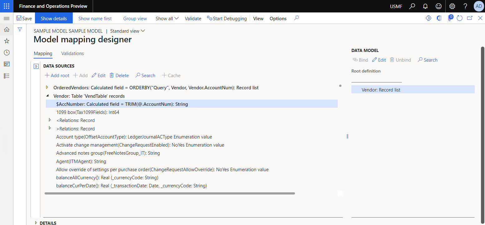

6. Select **Validate** to inspect the editable model mapping component on the **Model mapping designer** page and verify that the expression in the **OrderedVendors** data source can be queried.
7. Modify the **Vendor** data source by adding a nested field of the **Calculated field** type to get the trimmed vendor account number.
8. Name the new nested field **$AccNumber**, and configure it so that it contains the expression `TRIM(Vendor.AccountNum)`.
9. Select **Validate** to inspect the editable model mapping component on the **Model mapping designer** page and verify that the expression in the **Vendor** data source can be queried.

    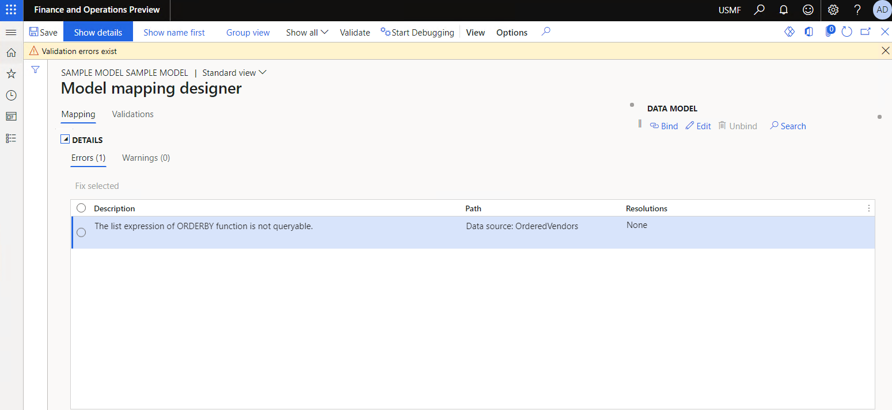

10. Notice that a validation error occurs, because the **Vendor** data source contains a nested field of the **Calculated field** type that doesn't allow the expression of the **OrderedVendors** data source to be translated to the direct database statement. The same error occurs at runtime if you ignore the validation error and select **Run** to run this model mapping.

### Automatic resolution

No option to automatically fix this issue is available.

### Manual resolution

#### Option 1

Instead of adding a nested field of the **Calculated field** type to the **Vendor** data source, add the **$AccNumber** nested field to the **FilteredVendors** data source, and configure the field so that it contains the expression `TRIM(FilteredVendor.AccountNum)`. In this way, the `ORDERBY("Query", Vendor, Vendor.AccountNum)` expression can be run at the database level, and the calculation of the **$AccNumber** nested field can be done after.

#### Option 2

Change the expression of the **FilteredVendors** data source from `ORDERBY("Query", Vendor, Vendor.AccountNum)` to `ORDERBY("InMemory", Vendor, Vendor.AccountNum)`. We don't recommend that you change the expression for a table that has a large volume of data (transactional table), because all records will be fetched, and ordering of the required records will be done in memory. Therefore, this approach can cause poor performance.

## Additional resources

[ALLITEMS ER function](er-functions-list-allitems.md)

[ALLITEMSQUERY ER function](er-functions-list-allitemsquery.md)

[INT64VALUE ER function](er-functions-conversion-int64value.md)

[INTVALUE ER function](er-functions-conversion-intvalue.md)

[FILTER ER function](er-functions-list-filter.md)

[WHERE ER function](er-functions-list-where.md)

[Use JOIN data sources to get data from multiple application tables in ER model mappings](er-join-data-sources.md)

[Trace the execution of ER formats to troubleshoot performance issues](trace-execution-er-troubleshoot-perf.md)

[Business document management overview](er-business-document-management.md)

[Suppress Word content controls in generated reports](er-design-configuration-word-suppress-controls.md)

[Manage several derived mappings for a single model root](er-multiple-model-mappings.md)

[!INCLUDE[footer-include](../../../includes/footer-banner.md)]
