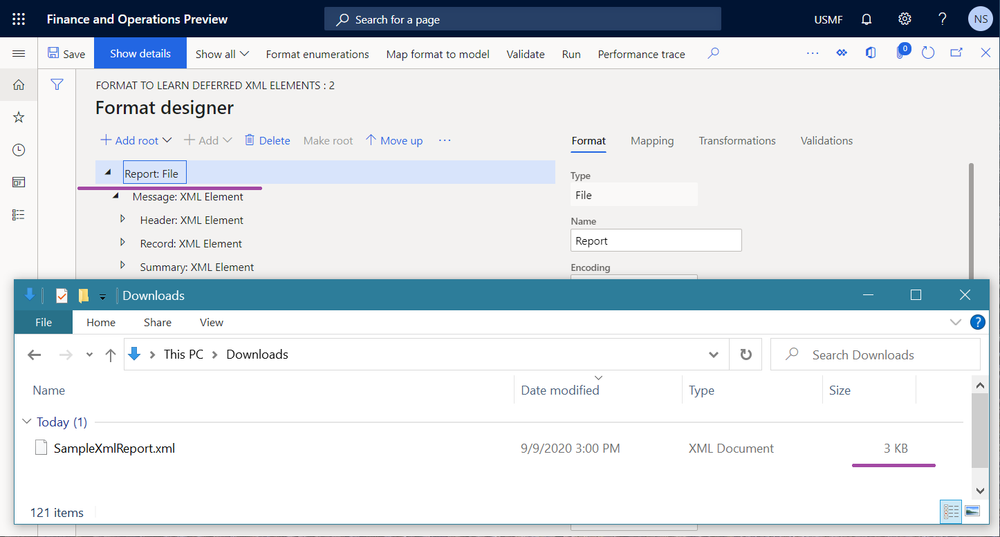
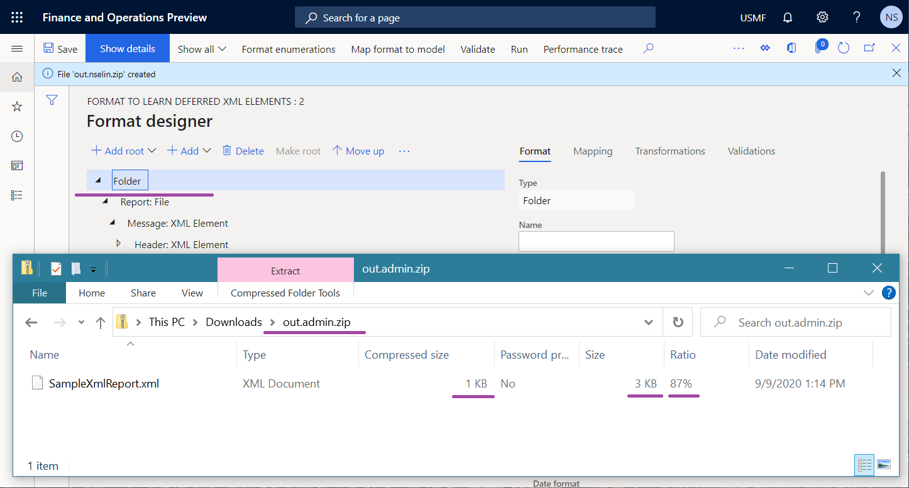

# Compress large documents that are generated in Electronic reporting 

[!include [banner](../includes/banner.md)]

You can use the [Electronic reporting (ER) framework](general-electronic-reporting.md) to configure a solution that fetches transactional data to generate an outbound document. This generated document might be quite large. When this type of document is generated, the [Application Object Server (AOS)](../dev-tools/access-instances.md#location-of-packages-source-code-and-other-aos-configurations) memory is used to hold it. At some point, the document must then be downloaded from your Microsoft Dynamics 365 Finance application. Currently, the maximum size of a single document that is generated in ER is limited to 2 gigabytes (GB). Additionally, Finance currently [limits](https://fix.lcs.dynamics.com/Issue/Details?kb=4569432&bugId=453907&dbType=3) the size of a downloaded file to 1 GB. Therefore, you must configure an ER solution that reduces the likelihood that these limitations will be exceeded, and that you will receive a **Stream was too long** or **Overflow or underflow in the arithmetic operation** exception.

When you configure a solution, you can adjust your ER format in the Operations designer by adding a root element of the **Folder** type to compress the content that is generated by any of its nested elements. Compression works "just in time," so that peak memory usage and the size of the file that will be downloaded can be reduced.

> [!NOTE]
> File compression takes an additional percentage of CPU usage.

For more information about this approach, complete the example in this article.

## Example: Compress an outbound document

This example shows how a user who is assigned to the **System administrator** or **Electronic reporting functional consultant** role can configure an ER format to compress a generated document.

### Prerequisites

Before you complete the procedures in this article, the following steps must be completed.

1. [Activate a configuration provider](er-defer-xml-element.md#activate-a-configuration-provider).
2. [Import the sample ER configurations](er-defer-xml-element.md#import-the-sample-er-configurations).
3. [Review the imported format](er-defer-xml-element.md#review-the-imported-format).

> [!NOTE]
> Currently, the format structure starts from the **Report** element of the **File** type and contains XML elements. Therefore, an outbound document will be generated in XML format, and no compression will be used.

### Generate an ER format to get an uncompressed document

1. [Run the imported format](er-defer-xml-element.md#run-the-imported-format).
2. Notice that the size of the generated document in XML format is 3 kilobytes (KB).

    

### Modify the format to compress the generated output

1. Go to **Organization administration** \> **Electronic reporting** \> **Configurations**.
2. On the **Configurations** page, in the configuration tree, expand **Model to learn deferred elements**.
3. Select the **Format to learn deferred XML elements** configuration.
4. Select **Designer** to modify the format structure.
5. On the **Format designer** page, on the **Format** tab, select **Add root** to add a root format element.
6. In the **Add** dialog box, select **Common\\Folder**.
7. Select **OK** to confirm the addition of the new root element.
8. Select **Save**.

> [!NOTE]
> The format structure starts from the element of the **Folder** type. This element will generate output as a compressed (zip) file. When a document that is generated by the **Report** element is put in an outbound zip file, its content will be compressed to reduce the size of the outbound file.

### Generate an ER format to get a compressed document

1. On the **Format designer** page, select **Run**.
2. Download the zip file that the web browser offers, and open it for review.
3. Notice that the size of the generated document in ZIP format is 1 KB.

    > [!NOTE] 
    > The compression ratio of the XML file that this zip file holds is 87 percent. The compression ratio depends on the data that is being compressed.

    

> [!NOTE]
> If the ER [destination](electronic-reporting-destinations.md) is configured for the format element that generates output (the **Report** element in this example), compression of the output will be bypassed.

## Additional resources

[Electronic reporting (ER) overview](general-electronic-reporting.md)

[Electronic reporting (ER) destinations](electronic-reporting-destinations.md)

[Defer the execution of XML elements in ER formats](er-defer-xml-element.md)

[!INCLUDE[footer-include](../../../includes/footer-banner.md)]
