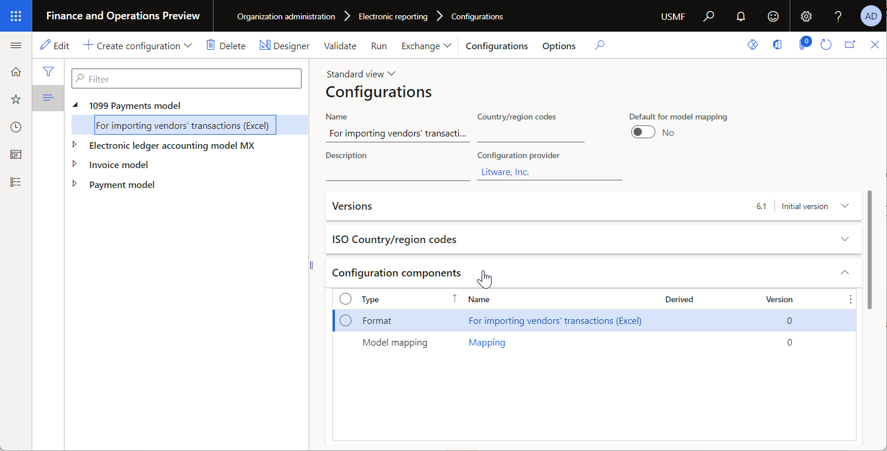

---
# required metadata

title: Import data from manually selected files in batch mode
description: This topic explains how to import data from manually selected files in batch mode.
author: NickSelin
ms.date: 01/07/2022
ms.topic: article
ms.prod: 
ms.technology: 

# optional metadata

ms.search.form: ERSolutionTable, ERImportFormatSourceTable, ERWorkspace
# ROBOTS: 
audience: Application User, Developer, IT Pro
# ms.devlang: 
ms.reviewer: kfend
# ms.tgt_pltfrm: 
ms.custom: 220314
ms.assetid: 
ms.search.region: Global
# ms.search.industry: 
ms.author: nselin
ms.search.validFrom: 2022-01-01
ms.dyn365.ops.version: Release 10.0.25

---
# Import data from manually selected files in batch mode

[!include[banner](../includes/banner.md)]
[!include[banner](../includes/preview-banner.md)]

To use the [Electronic reporting (ER)](general-electronic-reporting.md) framework to import data from manually selected inbound files in batch mode, configure an ER [format](er-overview-components.md#format-component) that supports the import. Then run a [model mapping](er-overview-components.md#model-mapping-component) of the **To destination** type that uses that format as a data source. To import data, browse to the file that you want to import, and manually select it. 

The new ER capability that supports data import in batch mode enables this process to be configured as unattended. You can use ER configurations to perform data import by scheduling a new batch job from the ER user interface (UI).

This topic explains how to complete data import from a manually selected file in batch mode. The examples use vendor transactions as business data. The steps of these examples can be completed in the **USMF** company. No coding is required.

## Prerequisites

To complete the examples in this topic, you must have the following access:

- One of the following roles:

    - Electronic reporting developer
    - Electronic reporting functional consultant
    - System administrator

- ER format and model configurations for 1099 payments

### Create the required ER configurations

To create the required ER configurations and obtain other prerequisites, follow one of these steps:

- Play the **ER Import data from a Microsoft Excel file** task guides, which are part of the **7.5.4.3 Acquire/Develop IT service/solution components (10677)** business process. These task guides walk you through the process of designing and using ER configurations that interactively import vendor transactions from Microsoft Excel files. For more information, see [Parse incoming documents in Excel format](parse-incoming-documents-excel.md).
- Complete the examples in [Configure data import from SharePoint](er-configure-data-import-sharepoint.md). These examples walk you through the process of designing and using ER configurations that interactively import vendor transactions from Excel files that are stored in a SharePoint folder.

### Download the required ER configurations

1. Download the following ER configurations, and save them locally.

    | Content description | File |
    |---------------------|------|
    | **1099 Payments model** ER data model configuration | [1099model.xml](https://download.microsoft.com/download/b/d/9/bd9e8373-d558-4ab8-aa9b-31981adc97ea/1099model.xml) |
    | **For importing vendors' transactions (Excel)** ER format configuration | [1099format-import-from-excel.xml](https://download.microsoft.com/download/b/3/8/b38faf0a-fbaf-4e9e-84c2-dedae7464880/1099format-import-from-excel.xml) |

2. Use the [Load from XML file](er-defer-sequence-element.md#import-the-sample-er-configurations) ER option to import the downloaded ER configurations into your instance of Dynamics 365 Finance in the following order:

    1. ER data model configuration
    2. ER format configuration

### Download the required Excel files

- Download the following sample data set, and save it locally.

    | Content description | File |
    |---------------------|------|
    | Inbound **1099import-data.xlsx** file that contains sample data for import | [1099import-data.xlsx](https://download.microsoft.com/download/f/f/4/ff4dbce9-8364-4391-adee-877945ff01f7/1099import-data.xlsx) |

### Review the prerequisites

1. Go to **Organization administration** \> **Electronic reporting** \> **Configurations**.
2. On the **Configurations** page, review the prepared ER solution for data import in batch mode.
3. Review the **For importing vendors' transactions (Excel)** format configuration.

    - The format component of this configuration is designed to parse an inbound Excel file.
    - The model mapping component of this configuration is used to fill in the base data model by using data from the parsed Excel file.

    

4. Review the **1099 Payments model** data model configuration.

    - The model component of this configuration represents the structure of the data model that is used to pass data between running ER components.
    - The model mapping component of this configuration is used to pull data from the executed format component and then update application tables.

    

5. Open the **1099import-data.xlsx** file in the Excel.

    

## Enable batch data import for ER from the UI

1. Go to **System administration** \> **Workspaces** \> **Feature management**.
2. In the **Feature management** workspace, select the **Run ER import of manually uploaded documents in batch** feature, and then select **Enable now**.

## Import data from manually selected Excel files

1. Go to **Organization administration** \> **Electronic reporting** \> **Configurations**.
2. On the **Configurations** page, select the **1099 Payments model** data model configuration.
3. On the **Configuration components** FastTab, select the **For 1099 manual transactions import** link.
4. On the **Model to datasource mapping** page, the **For 1099 manual transactions import** model mapping is preselected. Select **Run**.
5. On the **Parameters** tab, select **Browse**. Find and select the **1099import-data.xlsx** file, and then select **OK**.
6. In the **Enter voucher id** field, enter **V-00001**.
7. On the **Run in the background** tab, set the **Batch processing** option to **Yes**.

    Notice that the **Task description** field is set to **Run of Model mapping 'For 1099 manual transactions import', configuration '1099 Payments model'**. This value indicates that the execution of the selected model mapping will be scheduled as a new batch job.

    

8. Select **OK**. A message notifies you that a new batch job has been scheduled.

    

## Review the data import results on the Batch job page

1. Go to **Common** \> **Inquiries** \> **Batch jobs** \> **My batch jobs**.
2. On the **Batch job** page, filter the list of batch jobs to find the scheduled batch, and then select it.
3. Select the **Job ID** link to review job details.
4. On the **Batch tasks** FastTab, select **Log**.

    

5. Review the execution details.

    

## Change the data import parameters

After your batch is scheduled and while it hasn't yet been run, you can change the parameters of the scheduled data import.

1. Go to **Common** \> **Inquiries** \> **Batch jobs** \> **My batch jobs**.
2. On the **Batch job** page, filter the list of batch jobs to find the scheduled batch, and then select it.
3. Select **Change status**.
4. In the **Select new status** dialog box, select **Withhold**, and then select **OK**.
5. Select the **Job ID** link to access the job details.
6. On the **Batch tasks** FastTab, select **Parameters**.
7. In the **Electronic report parameters** dialog box, follow these steps:

    1. Select **Browse** to select the alternative file for data import.
    2. Select **Enter voucher id** to change the voucher number for importing vendor transactions.

        

    3. Select **OK**.

8. Make sure that the batch is still selected, and then select **Change status** again.
9. In the **Select new status** dialog box, select **Waiting**, and then select **OK**.

## Review the data import results on the ER source page

1. Go to **Organization administration** \> **Electronic reporting** \> **Electronic reporting source**.
2. Select the **For importing vendors' transactions (Excel)** record that was automatically created during the data import.

    

3. Select **File states for the sources**.
4. On the **Files** and **Source logs for the import format** FastTabs, review the import details.
5. On the **Files** FastTab, select the record. Notice that the imported file is attached to this record.

    

6. Select **Attachments** to review the imported file.

    

    > [!TIP]
    > To keep these attachments, the ER framework uses a document type that is [set](electronic-reporting-er-configure-parameters.md#parameters-to-manage-documents) for the current company in the **Others** field of the ER parameters.

## Review the data import results on the Vendor settlement for 1099s page

1. Go to **Accounts payable** \> **Periodic tasks** \> **Tax 1099** \> **Vendor settlement for 1099s**.
2. In the **From date** field, enter **12/31/2017** (December 31, 2017).
3. Select **Manual 1099 transactions**.

    

## Additional resources

[Electronic Reporting overview](general-electronic-reporting.md)

[!INCLUDE[footer-include](../../../includes/footer-banner.md)]
