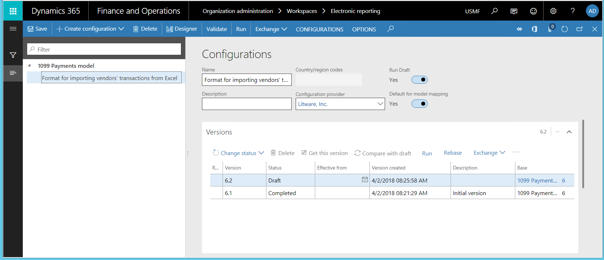
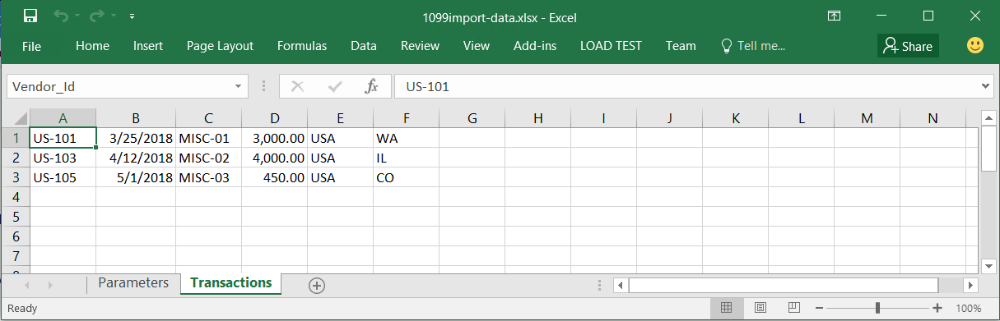
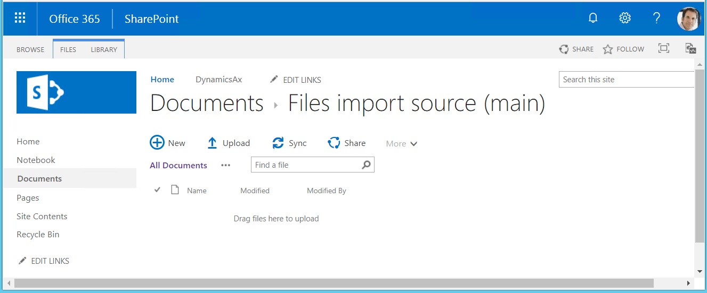
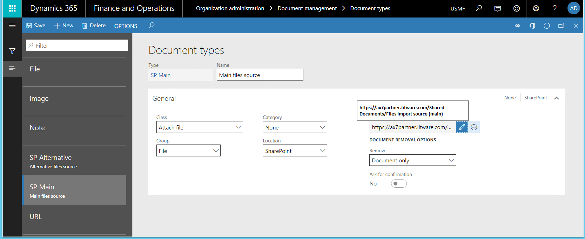
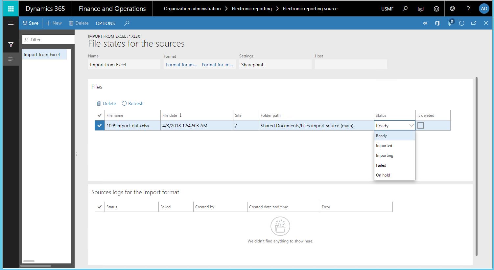
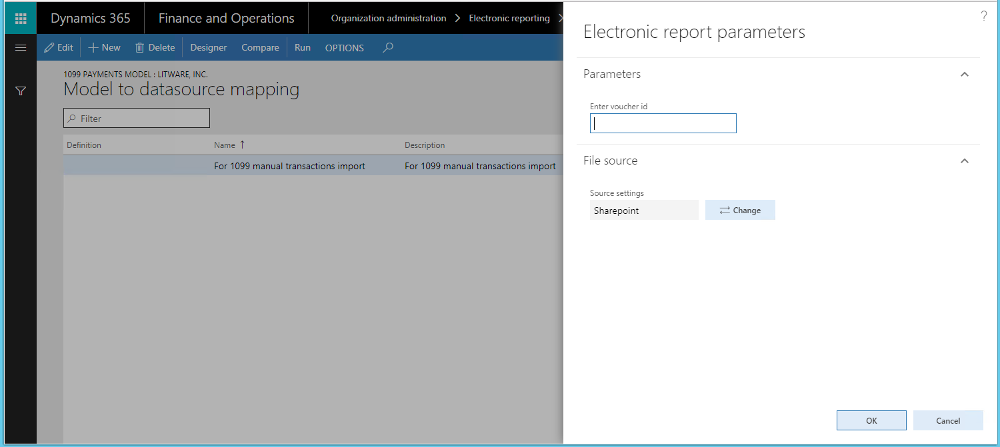
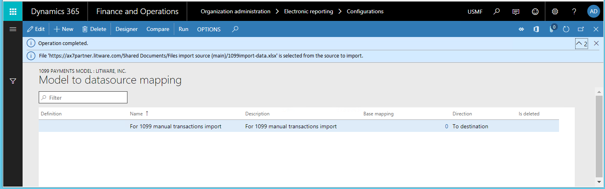
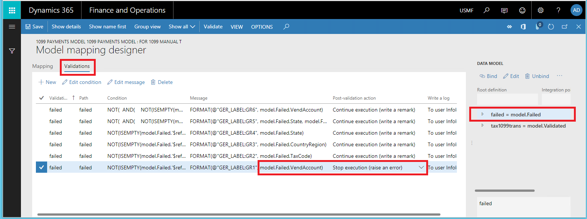
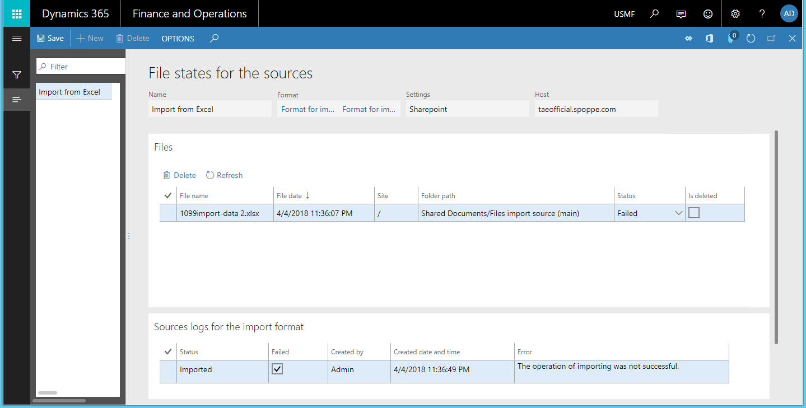

# Configure data import from SharePoint

[!include[banner](../includes/banner.md)]

To import data from an incoming file by using the Electronic reporting (ER) framework, you must configure an ER format that supports the import and then run a model mapping of the **To destination** type that uses that format as a data source. To import data, you must navigate to the file that you want to import. The incoming file can be manually selected by user. With the new ER capability to support importing data from Microsoft SharePoint, this process can be configured as unattended. You can use ER configurations to perform data import from files that are stored in Microsoft SharePoint folders. This article explains how to complete the import from SharePoint. The examples use vendor transactions as business data.

## Prerequisites
To complete the examples in this article, you must have the following access:

- Access one of the following roles:

    - Electronic reporting developer
    - Electronic reporting functional consultant
    - System administrator

- Access to the instance of Microsoft SharePoint Server that is configured for use with the application.
- ER format and model configurations for 1099 payments.

### Create required ER configurations
Play the **ER Import data from a Microsoft Excel file** task guides, which are part of the **7.5.4.3 Acquire/Develop IT service/solution components (10677)** business process. These task guides walk you through the process of designing and using ER configurations to interactively import vendor transactions from Microsoft Excel files. For more information, see [Parse incoming documents in Excel format](parse-incoming-documents-excel.md). After you have completed the task guides, you will have the following setup.

#### ER configurations

- ER model configuration, **1099 Payments model**
- ER format configuration, **Format for importing vendors' transactions from Excel**

#### Sample of the incoming file for data import

- Excel file **1099import-data.xlsx**, with vendor transactions that should be imported.

    
> [!NOTE]
> The format for importing vendor transactions is selected as the default model mapping. Therefore, if you run a model mapping of the **1099 Payments model**, and that model mapping is of the **To destination** type, the model mapping runs this format to import data from external files. It then uses that data to update application tables.

## Configure access to SharePoint for file storage
To store electronic report files in a SharePoint location, you must configure access to the SharePoint Server instance that will be used by the current company. In this example, the company is USMF. For instructions, see [Configure SharePoint storage](../../fin-ops/organization-administration/configure-document-management.md#configure-sharepoint-storage).

1. Complete the steps in [Configure SharePoint storage](../../fin-ops/organization-administration/configure-document-management.md#configure-sharepoint-storage).
2. Open the configured SharePoint site.
3. Create the following folders where incoming electronic reporting files can be stored:

     - Files import source (main) (Example shown in screenshot below)
     - Files import source (alternative)

    

4. (Optional) Create the following folders where the files can be stored after import. 

    - Files archive folder - This folder would be for successfully imported files.
    - Files warning folder - This folder would be for files that were imported with a warning.
    - Files error folder - This folder would be for files that failed to import.

4. Go to **Organization administration > Document management > Document types**.
5. Create the following document types that will be used to access the SharePoint folders that you created. For instructions, see [Configure document types](../../fin-ops/organization-administration/configure-document-management.md#configure-document-types).

|Document type       | Group              | Location      | SharePoint folder      |
|--------------------|--------------------|---------------|------------------------|
|SP Main             |File                |SharePoint     |Files import source (main)|
|SP Alternative             |File                |SharePoint     |Files import source (alternative)|
|SP Archive             |File                |SharePoint     |Files archive folder|
|SP Warning             |File                |SharePoint     |Files warning folder|
|SP Error             |File                |SharePoint     |Files error folder|

## Configure ER sources for the ER format
1. Click **Organization administration** \> **Electronic reporting** \> **Electronic reporting source**.
2. On the **Electronic reporting source** page, configure the source files for data import by using the configured ER format.
3. Define a file name mask, so that only files with the .xlsx extension are imported. The file name mask is optional and is used only when it has been defined. You can define only one mask for each ER format.
4. Change **Sort files before import** to **Do not sort**, if there are several files for import and the import order is not important
5. Select all SharePoint folders that you created earlier.

    

> [!NOTE]
> - The ER *source* is defined for each application company individually. By contrast, ER *configurations* are shared across companies.
> - When you delete an ER source setting for an ER format, all connected file states (see below) are also deleted by confirmation.

## Review the files states for the ER format
1. On the **Electronic reporting source** page, select **File states for the sources** to review the content of the configured file sources for the current ER format.
2. In the **Files** section, review the list of files. This list presents the following:

    - Source files that are applicable, based on the file name mask (if a file name mask is defined), and that are ready for data import. For these files, the **Sources log for the import format** section is blank.
    - Previously imported files. For each of these files, in the **Sources log for the import format** section, you can review the history of import of this file.

You can also open the **File states for the sources** page by selecting **Organization administration** \> **Electronic reporting** \> **File states for the sources**. In this case, the page provides information about file sources for all ER formats that file sources have been configured for in the company that you're currently signed in to.

## Import data from Excel files that are in a SharePoint folder
1. In SharePoint, upload the Microsoft Excel file **1099import-data.xlsx** that contains vendor transactions to the **Files import source (main)** SharePoint folder that you created earlier.

    

2. On the **File states for the sources** page, select **Refresh** to refresh the page. The Excel file that was uploaded to SharePoint appeared on this page with the status **Ready**. The following statuses are currently supported:

    - **Ready** – Assigned automatically for each new file in a SharePoint folder. This status means that the file is ready for import.
    - **Importing** – Assigned automatically by an ER report when the file will be locked by the import process to prevent its usage by other processes (if many of them are running simultaneously).
    - **Imported** – Assigned automatically by an ER report when the file import is successfully completed. This status means that the imported file has been deleted from the configured files source (SharePoint folder).
    - **Failed** – Assigned automatically by an ER report when the file import completed with errors or exceptions.
    - **On hold** – Assigned manually by user on this page. This status means that the file will not be imported for now. This status can be used to postpone the import of some files.

    

## Import data from SharePoint files
1. Open the ER configurations tree, select the **1099 Payment model**, and expand the list of ER model components.
2. Select the name of the model mapping to open the list of model mappings of the selected ER model configuration.

    

3. Select **Run** to run the selected model mapping. Because you configured file sources for the ER format, you can change the setting of the **File source** option, if needed. If you keep the setting of this option, the .xslx files are imported from the configured sources (the SharePoint folders, in this example).

    In this example, you're importing only one file. However, if there are multiple files, they are selected for importing in the order in which they were added to the SharePoint folder. Every run of an ER format imports a single selected file.

    

4. The model mapping can run [unattended](#limitations) in batch mode. In this case, every time that a batch runs this ER format, a single file is imported from the configured file sources.

    When a file is successfully imported from the SharePoint folder, it's deleted from that folder and moved to folder for successful imported files or to the folder to imported files with warnings. Otherwise, it's moved to folder for failed files or stays in this folder if the folder for failed files isn't set up. 

5. Enter the voucher ID, such as **V-00001**, and then select **OK**.

    

6. On the **File states for the sources** page, select **Refresh** to refresh the page.

    

7. In the **Files** section, review the list of files. The **Sources log for the import format** section provides the history of the Excel file import. Because this file was successfully imported, it's marked as **Deleted** in the SharePoint folder.
8. Review the **Files import source (main)** SharePoint folder. The Excel files that were successfully imported have been deleted from this folder.
9. Select **Accounts payable** \> **Periodic tasks** \> **Tax 1099** \> **Vendor settlement for 1099s**.
10. In the **From date** and **To date** fields, enter appropriate values. Then select **Manual 1099 transactions**.

    The vendor transactions that were imported from the Excel files on SharePoint for voucher **V-00001**, are presented on the page.

    

## Prepare an Excel file for import
1. Open the Excel file that you previously used. In row 3 column 1, add a vendor code that doesn't exist in the application. Add additional false vendor information to the row.

    

2. Upload the updated Excel file that contains vendors transactions to the **Files import source (main)** SharePoint folder.
3. Open the ER configurations tree, select the **1099 Payment model**, and expand the list of ER model components.
4. Select the name of the model mapping to update the model mapping so that the incorrect vendor code is considered an error during the data import process.
5. Select **Designer**.
6. On the **Validations** tab, you must change the post-validation action for the validation rule that was configured to evaluate whether the vendor account that is imported exists in the application. Update the value of the **Post-validation action** field to **Stop execution**, save your changes, and close the page.

    

7. Save your changes, and close the ER model mapping designer.
8. Select **Run** to run the modified ER model mapping.
9. Enter the voucher ID, such as **V-00002**, and then select **OK**.

    The Infolog contains a notification that there's a file in the SharePoint folder that contains incorrect vendor account and can’t be imported.

    

10. On the **File states for the sources** page, select **Refresh**, and then, in the **Files** section, review the list of files.

    

   The **Sources log for the import format** section indicates that the import process failed and that the file is in the Files error SharePoint folder (the **Is deleted** check box is not selected). If you fix this file on SharePoint by adding the proper vendor code and then move it to the Files import source (main) SharePoint folder, you can import the file again.

11. Select **Accounts payable** \> **Periodic tasks** \> **Tax 1099** \> **Vendor settlement for 1099s**, enter appropriate values in the **From date** and **To date** fields, and then select **Manual 1099 transactions**.

    Only transactions for voucher V-00001 are available. No transactions for voucher V-00002 are available even though the error for the last imported transaction has been found in the Excel file.

## <a name="limitations">Limitations</a>

In versions of Dynamics 365 Finance before version 10.0.25, the user interface (UI) of the ER framework doesn't offer the capability to initiate a new batch job that will run a model mapping for data import in unattended mode. Instead, you must develop new logic so that the configured ER model mapping can be called from the application UI to import data from inbound files. To develop this logic, some engineering work is required. 

For more information about the relevant ER API, see the [Code to run a format mapping for data import](er-apis-app73.md#code-to-run-a-format-mapping-for-data-import) section in [ER framework API changes for Application update 7.3](er-apis-app73.md). Review the code in the `BankImport_RU` class of the `Application Suite` model to see how your custom logic can be implemented. The `BankImport_RU` class extends the `RunBaseBatch` class. In particular, review the `runER()` method, where the `ERIModelMappingDestinationRun` object is created as the runner of an ER model mapping.

In Finance version 10.0.25 and later, the ER framework UI does offer the capability to initiate a new batch job that will run a model mapping for data import in unattended mode. For more information about this process, see [Import data in batch mode from manually selected files](er-configure-data-import-batch.md).

## Additional resources

[Electronic Reporting overview](general-electronic-reporting.md)

[ER framework API changes for Application update 7.3](er-apis-app73.md)

[ER framework API changes for Application update 10.0.23](er-apis-app10-0-23.md)

[ER framework API changes for Application update 10.0.25](er-apis-app10-0-25.md)

[!INCLUDE[footer-include](../../../includes/footer-banner.md)]
