# Configure country/region context dependent ER model mappings

[!include[banner](../includes/banner.md)]

You can configure Electronic reporting (ER) model mappings so that they implement a generic ER data model but are specific to Dynamics 365 Finance. This article explains how to design multiple ER model mappings for an ER data model to control how they are used by corresponding ER formats that are run from companies that have different country/region contexts.

## Prerequisites

To complete the examples in this article, you must have the following access:

- Access to Finance for one of the following roles:
    - Electronic reporting developer
    - Electronic reporting functional consultant
    - System administrator

- Access to the instance of Regulatory Configuration Services (RCS) that has been provisioned for the same tenant as Finance for one of the following roles:
    - Electronic reporting developer
    - Electronic reporting functional consultant
    - System administrator

Some steps in this article require execution of an ER format. In some cases, execution of an ER format is affected by the country/region context of the company that you're currently signed in to. You can run an ER format in the current RCS instance if the company that has the required country/region context is available in RCS. Otherwise, you must upload a completed version of the ER model mapping and ER format configurations that use the ER data model to your Finance instance, and then run the ER format in that Finance instance. For information about how to import configurations that reside in RCS into a Finance instance, see [Import configurations from RCS](rcs-download-configurations.md).

## Single model mapping case

Follow the steps in [Appendix 1](#appendix1) of this article to design the required ER components. You now have the **Mapping (General)** model mapping configuration that contains the model mapping for the **Entry point 1** definition.

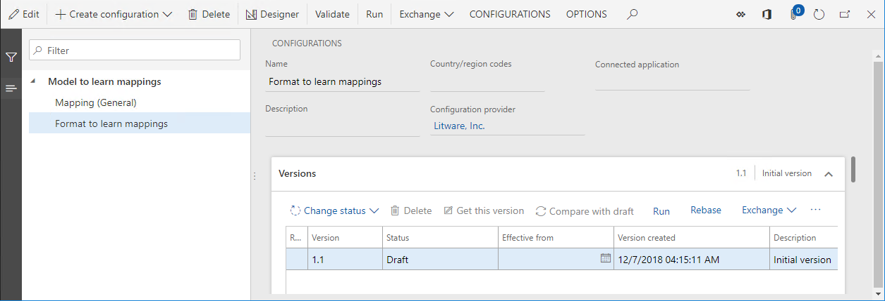

### Run the configured format

1.	On the **Configurations page**, on the **Versions** FastTab, select **Run**.
2.	Select **OK**.

Notice that the web browser offers to download the text file that was generated by executed ER format. Because this format was configured to use the **Entry point 1** definition, and only a single model mapping is currently available for the base model that contains a mapping for this definition, the executed ER format used the **Mapping (General)** model mapping of the **Mapping (General)** configuration as a data source. Therefore, the downloaded file contains the **Generic functionality 1** text.

## Multiple shared model mappings case

Follow the steps in [Appendix 2](#appendix2) of this article to design the required ER components. You now have **Mapping (General)** and **Mapping (General) custom** model mapping configurations, each of which contains the model mapping for the **Entry point 1** definition.

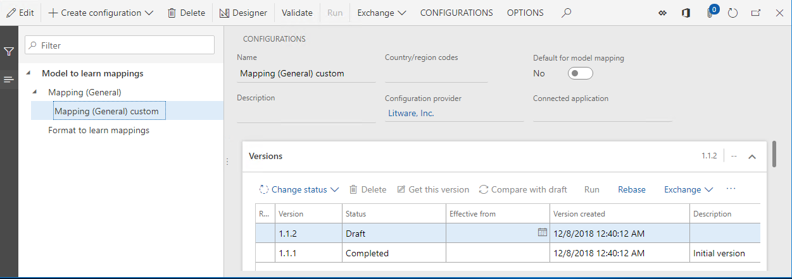

### Run the configured format

1.	On the **Configurations** page, in the configurations tree, select **Format to learn mappings**.
2.	On the **Versions** FastTab, select **Run**.
3.	Select **OK**.

Notice that execution of the selected ER format is unsuccessful. An error message informs you that more than one model mapping exists for the **Model to learn mappings** model and the **Entry point 1** definition in the **Mapping (General)** and **Mapping (General) custom** model mapping configurations. The message also recommends that you select one of those configurations as the default configuration.

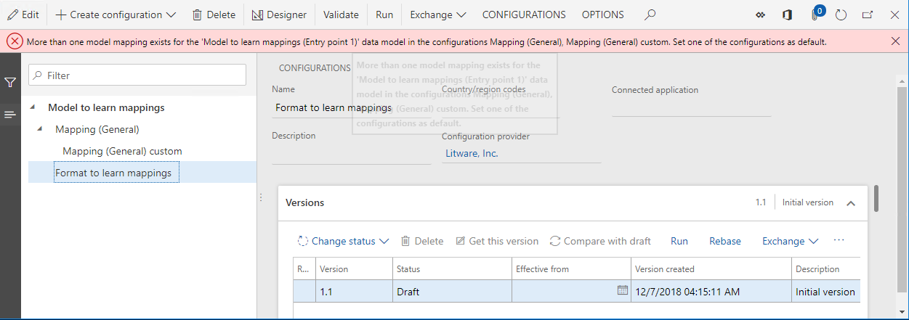

### Define a default mapping configuration

Follow these steps to define the **Mapping (General) custom** model mapping configuration as the default configuration, so that its mappings can be used as data sources for the **Format to learn mappings** ER format.

1.	On the **Configurations** page, in the configurations tree, select **Mapping (General) custom**.
2.	As required, select **Edit** to make the current page ready for editing.
3.	Set the **Default for model mapping** option to **Yes**.
4.	Select **Save**.

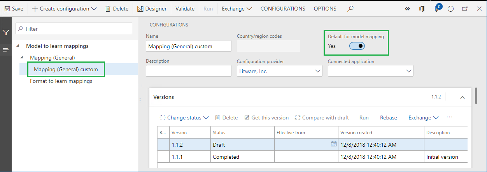

### Run the configured format

1.	On the **Configurations** page, in the configurations tree, select **Format to learn mappings**.
2.	On the **Versions** FastTab, select **Run**.
3.	Select **OK**.

Notice that execution of the selected ER format succeeds. The web browser offers to download the text file that was generated by executed ER format. Because this format was configured to use the **Entry point 1** definition, and the **Mapping (General) custom** model mapping configuration was selected as the default configuration, the executed ER format used the **Mapping (General) copy** model mapping of the **Mapping (General) custom** configuration as a data source. Therefore, the downloaded file contains the **Generic functionality 1 custom** text.

> [!NOTE]
> If you change the company that you're currently signed in to and run this ER format again, you get the same content in the generated file, because the default ER model mapping configuration doesn't contain any company-dependent restrictions.

## Multiple mixed model mappings case

Follow the steps in [Appendix 3](#appendix3) of this article to design the required ER components. You now have **Mapping (General)**, **Mapping (General) custom**, and **Mapping (FR) model mapping** configurations that contain the model mapping for the **Entry point 1** definition.

Notice that version 1 of the **Mapping (FR)** model mapping configuration is configured so that it applies only to ER formats of the **Model to learn mappings** model that are run in Finance companies that have French country/region context.

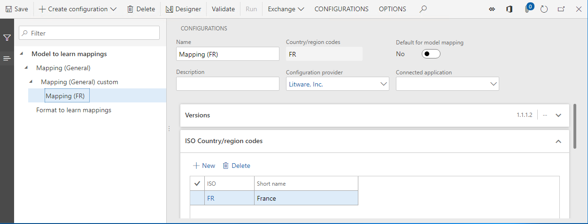

### Run the configured format

1.	Change the company to **FRSI**.
2.	On the **Configurations** page, in the configurations tree, select **Format to learn mappings**.
3.	On the **Versions** FastTab, select **Run**.
4.	Select **OK**.

Notice that execution of the selected ER format succeeds. The web browser offers to download the text file that was generated by the executed ER format. Because this format was configured to use the **Entry point 1** definition, and the **Mapping (General) custom** model mapping configuration was selected as the default configuration, the executed ER format used the **Mapping (General) copy** model mapping of the **Mapping (General) custom** configuration as a data source. Therefore, the downloaded file contains the **Generic functionality 1 custom** text.

### Define the France-specific mapping configuration as the default configuration

Follow these steps to define the custom **Mapping (FR)** model mapping configuration as the default configuration. Note that, because this mapping is specific to France, it will be considered the default mapping between all model mapping configurations that have the **FR** country code specified in the **ISO country/region codes** field.

1.	On the **Configurations** page, in the configurations tree, select **Mapping (FR)**.
2.	As required, select **Edit** to make the current page ready for editing.
3.	Set the **Default for model mapping** option to **Yes**.
4.	Select **Save**.

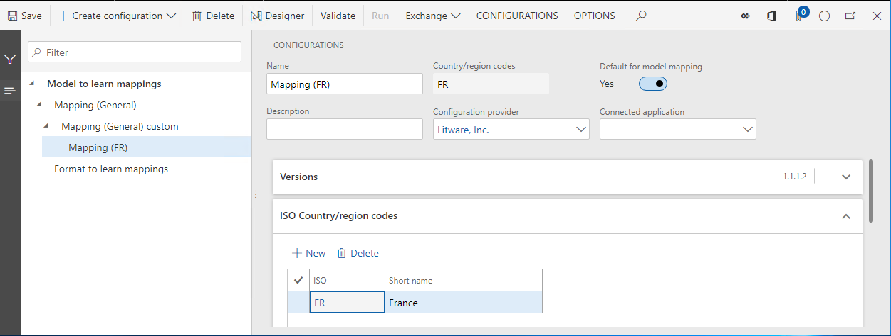

### Run the configured format

1.	On the **Configurations** page, in the configurations tree, select **Format to learn mappings**.
2.	On the **Versions** FastTab, select **Run**.
3.	Select **OK**.

Notice that execution of the selected ER format succeeds. The web browser offers to download the text file that was generated by the executed ER format. Because this format was configured to use the **Entry point 1** definition, and the **Mapping (FR)** model mapping configuration was selected as the default configuration, the executed ER format used the **Mapping (FR)** model mapping of the **Mapping (FR)** configuration as a data source. Therefore, the downloaded file contains the **FR functionality 1** text.

> [!NOTE]
> If you change the company that you're currently signed in to and run this ER format again, the output will depend on the country/region context of the selected company.

## Other model mapping cases

As you've seen, the selection of a model mapping for the execution of an ER format works in the following way:

- The model mapping definition that an ER format uses is specified (**Entry point 1** in the examples in this article).
- All mapping configurations that contain a mapping that has the specified definition, and that satisfy any country/region context restrictions that are configured, can potentially be used to run the ER format (**Mapping (General)**, **Mapping (General) custom**, and **Mapping (FR)** in the examples in this article).
- Any default model mapping that has country/region context restrictions has the highest priority for selection (**Mapping (FR)** in the examples in this article).
- Any default model mapping that doesn't have country/region context restrictions has the next higher priority for selection  (**Mapping (General) custom** in the examples in this article).
- Any model mapping that has country/region context restrictions has higher priority for selection than a model mapping that doesn't have country/region context restrictions.

The following table provides information about the results of model mapping selection for all possible cases for model mapping settings:

- Column 1 indicates whether the first model mapping that doesn't have country/region context restrictions (for example, the shared **Mapping (General)** mapping) is presented and, if it is, whether the **Default for model mapping** option is set to **Yes** for it.
- Column 2 indicates whether the second model mapping that doesn't have country/region context restrictions (for example, the shared **Mapping (General) custom** mapping) is presented and, if it is, whether the **Default for model mapping** option is set to **Yes** for it.
- Column 3 indicates whether the first model mapping that has country/region A context restrictions (for example, the France-specific **Mapping (FR)** mapping) is presented and, if it is, whether the **Default for model mapping** option is set to **Yes** for it.
- Column 4 indicates whether the second model mapping that has country/region A context restrictions is presented and, if it is, whether the **Default for model mapping** option is set to **Yes** for it.
- Column 5 presents the result of a model mapping selection for execution of an ER format under the control of a company that has country/region A context.
- Column 6 presents the result of a model mapping selection for execution of an ER format under the control of a company that has country/region B context.

In the table, a plus sign (+) indicates the presence of a model mapping configuration in the current instance of the Microsoft Azure service that is used to run an ER format (either Finance or RCS).

| Case | Model mapping 1 without country/region context (MM1) | Model mapping 2 without country/region context (MM2) | Model mapping 1 with country/region A context (MM1A) | Model mapping 2 with country/region A context (MM2A) | Run under control of a company that has country/region A context | Run under the control of a company that has country/region B context |
|---------|---------|---------|---------|---------|---------------------------|----------------------------|
|         |     1   |     2   |    3    |    4    |           5               |            6               |
|     1   |         |         |         |         | Error (missing mapping)   | Error (missing mapping)    |
|     2   |     +   |         |         |         | MM1                       | MM1                        |
|     3   |     +   |     +   |         |         | Error (multiple mappings) | Error (multiple mappings)  |
|     4   |     +   |         |    +    |         | MM1A                      | MM1                        |
|     5   |     +   |         |    +    |    +    | Error (multiple mappings) | MM1                        |
|     6   |     +   | default |    +    |    +    | MM2                       | MM2                        |
|     7   |     +   |         | default |         | MM1A                      | MM1                        |
|     8   |     +   |         | default |    +    | MM1A                      | MM1                        |
|     9   |     +   |         | default | default | Error (multiple mappings) | MM1                        |
|    10   | default |         |         |         | MM1                       | MM1                        |
|    11   | default |    +    |         |         | MM1                       | MM1                        |
|    12   | default |         |    +    |         | MM1                       | MM1                        |
|    13   | default | default |         |         | Error (multiple mappings) | Error (multiple mappings)  |
|    14   | default |         | default |         | MM1A                      | MM1                        |
|    15   | default |         | default | default | MM1A                      | MM2A                       |
|    16   |         |         |    +    |    +    | MM1A                      | MM2A                       |
|    17   |         |         | default | default | MM1A                      | MM2A                       |

## Learn what mapping was used in the execution of an ER format

### Configure ER user parameters

1.  On the **Configurations** page, on the Action Pane, on the **CONFIGURATIONS** tab, select **User parameters**.
2.	Set the **Run in debug mode** option to **Yes**.
4.	Select **Ok**.

### Run the configured format

1.	On the **Configurations** page, in the configurations tree, select **Format to learn mappings**.
2.	On the **Versions** FastTab, select **Run**.
3.	Select **Ok**.

### Review the ER debug log

1.	In the navigation pane, go to **Modules \> Organization administration \> Electronic reporting \> Configuration debug log**.
2.	Select the **Reload this page** button.

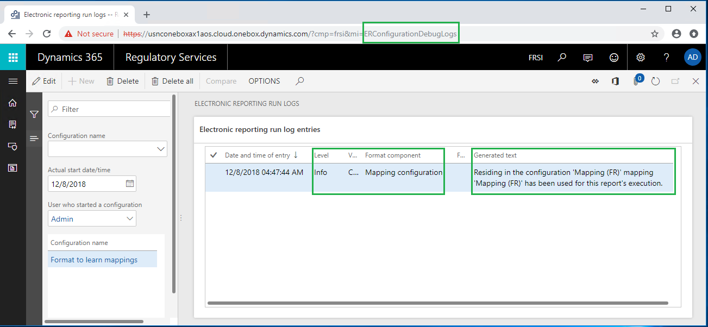

Notice that a new record has been added to the ER debug log for the executed ER format. Because the **Level** field of this record is set to **Info**, the record is informational. Because the Format component field is set to **Mapping configuration**, the record informs you about a model mapping that was used during execution of the **Format to learn mappings** ER format (selected in the **Configuration name** field). The content of the **Generated text** field informs you that the **Mapping (FR)** mapping component that resides in the **Mapping (FR)** configuration has been used to run this report.

##  Appendix 1

### Configure a sample data model

Sign in to your RCS instance.

In this example, you will create a configuration for sample company, Litware, Inc. To complete these steps, you must first complete, in RCS, the steps in the [Create a configuration provider and mark it as active](tasks/er-configuration-provider-mark-it-active-2016-11.md) procedure.

#### Create an ER data model configuration

1.	On the default dashboard, select **Electronic reporting**.
2.	Select the **Reporting configurations** tile.
3.	On the **Configurations** page, select **Create configuration**.
4.	In the drop-down dialog box, in the **Name** field, enter **Model to learn mappings**.
5.	Select **Create configuration**.
6.	Select the **Configuration components** FastTab.

Notice that draft version 1 of this ER configuration is ready for editing. This version contains the data model component.

#### Design a sample data model

1.	On the **Configurations page**, select **Designer**.
2.	Select **New**.
3.	In the drop-down dialog box, in the **Name** field, enter **Entry point 1**.
4.	Select **Add**.
5.	Select **New**.
6.	In the drop-down dialog box, in the **Name** field, enter **Functionality description**.
7.	Select **Add**.
8.	Select **New**.
9.	In the drop-down dialog box, in the **New node** field group, select **Model root**.
10.	In the **Name** field, enter **Entry point 2**.
11.	Select **Entry point 2**.
12.	Select **Add**.
13.	Select **New**.
14.	In the drop-down dialog box, in the **Name** field, enter **Functionality description**.
15.	Select **Add**.

    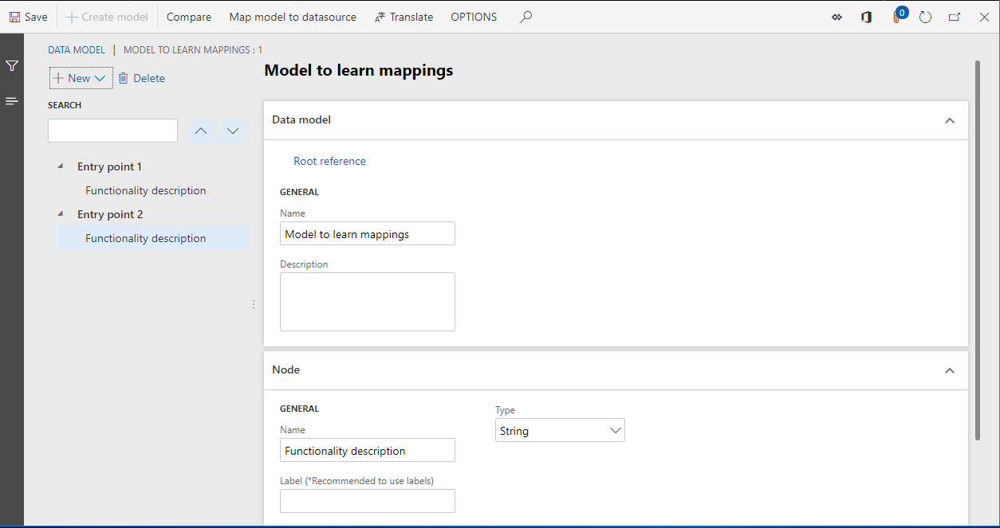

16.	Select **Save**.
17.	Close the page.

#### Complete the modified version of the model configuration

1.	On the **Configurations** page, on the **Versions** FastTab, select **Change status**.

    > Change the status of designed model configuration from **Draft** to **Completed**, so that it can be used to design the required model mappings and formats.

2.	Select **Complete**.
3.	Select **OK**.

Notice that the configuration that you created is saved as completed version 1.

### Configure a sample model mapping

#### Create an ER model mapping configuration

1.	On the **Configurations** page, select **Create configuration**.
2.	In the drop-down dialog box, in the **New** field group, select **Model mapping based on data model Model to learn mappings**.
3.	In the **Name** field, enter **Mapping (General)**.
4.	In the **Data model definition** field, select **Entry point 1**.
5.	Select **Create configuration**.

Notice that draft version 1 of this ER configuration is ready for editing. This version contains the model mapping component.

#### Design a sample model mapping

1.	On the **Configurations** page, select **Designer**.

    Notice that the model mapping of the **To model** direction type has been automatically added to this component for the **Entry point 1** definition.
    
2.	Select **Designer** to start editing the added model mapping.
3.	In the **Data model** section, select **Edit**.
4.	In the **Formula** field, enter **"Generic functionality 1"**.
5.	Select **Save**.
6.	Close the **Formula designer** page.

    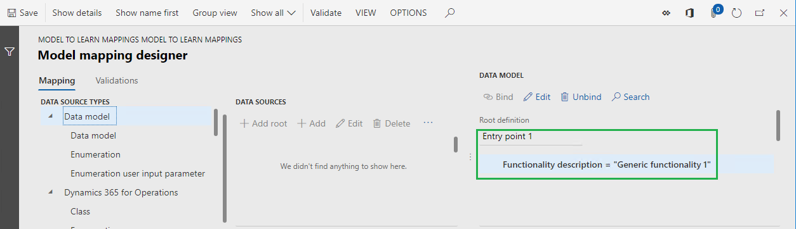

7.	Select **Save**.
8.	Close the **Model mapping designer** page.
9.	Select **New**.
10.	In the **Definition** field, select **Entry point 2**.
11.	In the **Name** field, enter **Mapping (General) 2**.
12.	Select **Designer**.
13.	In the **Data model** section, select **Edit**.
14.	In the **Formula** field, enter **"Generic functionality 2"**.
15.	Select **Save**.
16.	Close the **Formula designer** page.

    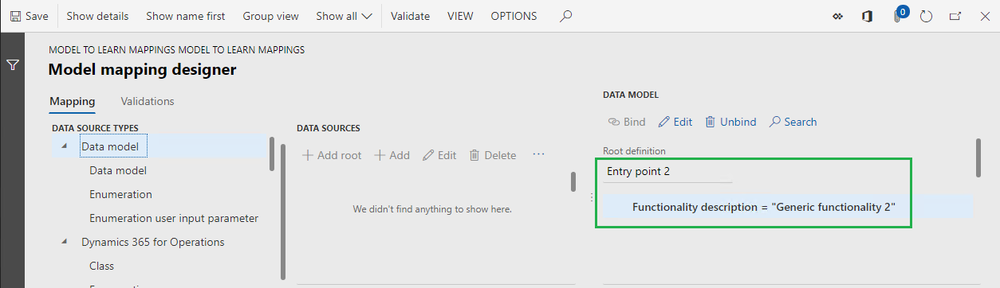

17.	Select **Save**.
18.	Close the **Model mapping designer** page.

    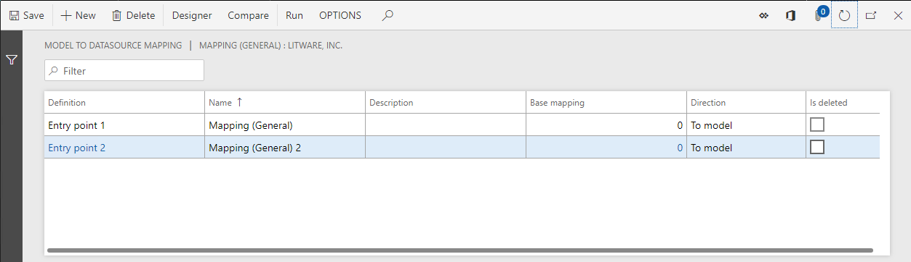

19.	Close the **Model mappings** page.

#### Complete the modified version of the model mapping configuration

1.	On the **Configurations page**, on the **Versions** FastTab, select **Change status**.

    > Change the status of designed model mapping configuration from **Draft** to **Completed**, so that it can be used by ER formats.

2.	Select **Complete**.
3.	Select **OK**.

Notice that the configuration that is created is saved as completed version 1.

### Configure a sample format

#### Create an ER format configuration

1.	On the **Configurations** page, in the configurations tree, select **Model to learn mappings**.
2.	Select **Create configuration**.
3.	In the drop-down dialog box, in the **New** field group, select **Format based on data model Model to learn mappings**.
4.	In the **Name** field, enter **Format to learn mappings**.
5.	In the **Data model definition** field, select **Entry point 1**.
6.	Select **Create configuration**.

Notice that draft version 1 of this ER configuration is ready for editing. This version contains the format component.

#### Design a sample format

1.	On the **Configurations** page, select **Designer**.
2.	Select **Add root**.
3.	In the **Text** group, select the **String** item.
4.	Select **OK**.

#### Bind format elements to a data source

1.	On the **Format designer** page, on the **Mapping** tab, expand the model data source.
2.	Select the **Functionality description** field.
3.	Select **Bind**.

    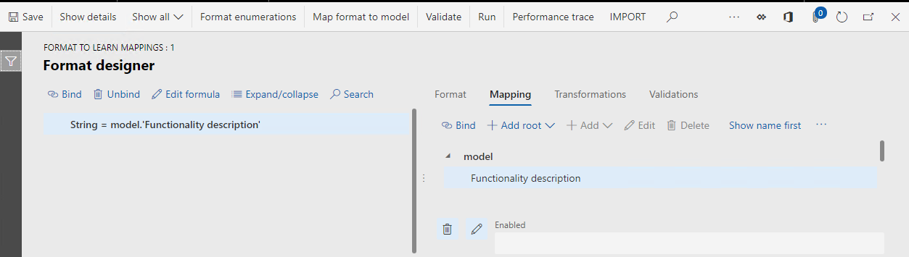

4.	Select **Save**.
5.	Close the page.

##  Appendix 2

### Configure a sample model mapping for general customization

You might want to customize a model mapping that a configuration provider (partner) provided to you, and then use the customized version as a data source for your ER formats. In this case, you must create a custom ER model mapping configuration to make the required changes in existing model mappings. The procedures in this appendix use the **Mapping (General)** model mapping as an example.

#### Create an ER model mapping configuration

1.	On the **Configurations** page, in the configurations tree, select **Mapping (General)**.
2.	Select **Create configuration**.
3.	In the drop-down dialog box, in the **New** field group, select **Derive from Name: Mapping (General), Litware, Inc.**.
4.	In the **Name** field, enter **Mapping (General) custom**.
5.	Select **Create configuration**.

Notice that draft version 1 of this ER configuration is ready for editing.

#### Design a sample model mapping

1.	On the **Configurations** page, select **Designer**.

    > Notice that the model mappings of the base configuration have been automatically copied to this configuration.

2.	Select the **Mapping (General) Copy** mapping.
3.	Select **Designer**.
4.	In the **Data model** section, select **Edit**.
5.	In the **Formula** field, enter **"Generic functionality 1 custom"**.
6.	Select **Save**.
7.	Close the page.

    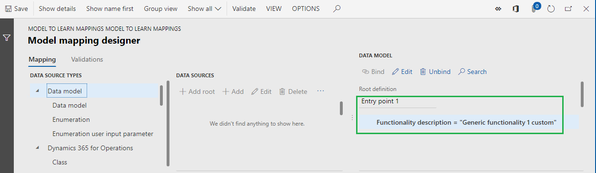

8.	Select **Save**.
9.	Close the page.
10.	Select the **Mapping (General) 2 Copy** mapping.
11.	Select **Designer**.
12.	In the **Data model** section, select **Edit**.
13.	In the **Formula** field, enter **"Generic functionality 2 custom"**.
14.	Select **Save**.
15.	Close the page.

    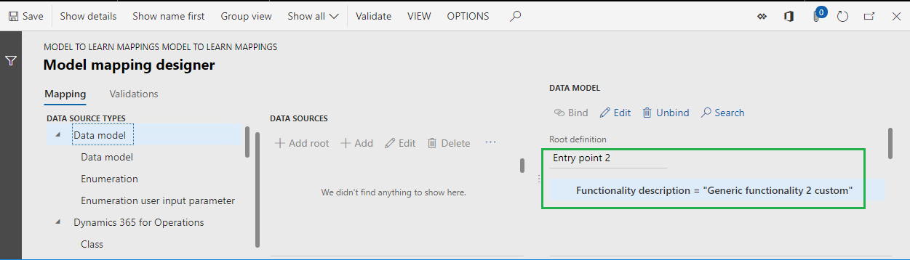

16.	Select **Save**.
17.	Close the page.

    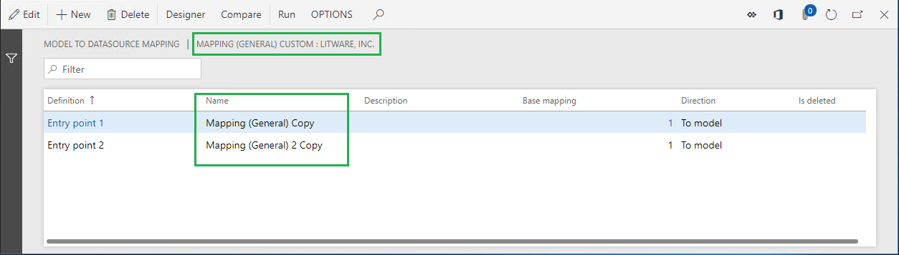

18.	Close the page.

#### Complete the modified version of the model mapping configuration

1.	On the **Configurations** page, on the **Versions** FastTab, select **Change status**.

    > Change the status of designed model mapping configuration from **Draft** to **Completed**, so that it can be used by ER formats.

2.	Select **Complete**.
3.	Select **OK**.

Notice that the configuration that is created is saved as completed version 1.

##  Appendix 3

### Configure a sample model mapping for country/region-specific customization

For some ER formats, there might be country/region-specific requirements for data preparation. In this case, you can manage a separate ER model mapping configuration and isolate the implementation of these country/region-specific requirements from the general implementation. The procedures in this appendix use the **Format to learn mappings** ER format and French-specific requirements as an example.

#### Create an ER model mapping configuration

First, create a new ER model mapping configuration to implement the country/region-specific requirements. Use your custom ER model mapping configuration as a base.

1.	On the **Configurations** page, in the configurations tree, select **Mapping (General) custom**.
2.	Select **Create configuration**.
3.	In the drop-down dialog box, in the **New** field group, select **Derive from Name: Mapping (General) custom, Litware, Inc**.
4.	In the **Name** field, enter **Mapping (FR)**.
5.	Select **Create configuration**.

Notice that draft version 1 of this ER configuration is ready for editing.

#### Design a sample model mapping

1.	On the **Configurations** page, select **Designer**.

    > Notice that model mappings of the base configuration have been automatically copied to this configuration.

2.	Select the **Mapping (General) Copy Copy** mapping.
3.	Rename it **Mapping (FR)**.
4.	Select **Designer**.
5.	In the **Data model** section, select **Edit**.
6.	In the **Formula** field, enter **"FR functionality 1"**.
7.	Select **Save**.
8.	Close the page.

    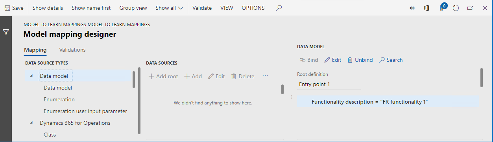

9.	Select **Save**.
10.	Close the page.
11.	Select the **Mapping (General) 2 Copy Copy** mapping.
12.	Rename it **Mapping (FR) 2**.
13.	Select **Designer**.
14.	In the **Data model** section, select **Edit**.
15.	In the **Formula** field, enter **"FR functionality 2"**.
16.	Select **Save**.
17.	Close the page.

    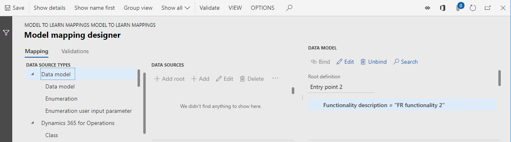

18.	Select **Save**.
19.	Close the page.

    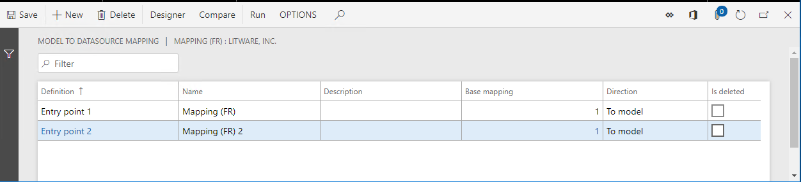

20.	Close the page.

#### Specify country/region context restrictions for use

1.	On the **Configurations** page, on the **ISO Country/region codes** FastTab, select **New**.
2.	In the **ISO** field, select **FR**.
3.	Select **Save**.

Note that you must sign in to a specific company in Finance to run an ER format. Therefore, this company can be considered a party that controls both ER format execution and selection of the correct ER model mapping of the base ER data model. By adding the **FR** country code, you specify that this model mapping is available for selection by an ER format of the base data model only when that format is run under the control of a company that has French country/region context.

You can add multiple country/region codes for a single version of an ER model mapping configuration. In this way, model mappings that reside in that model mapping configuration can be used for an ER format that is run under the control of companies that have a different country/region context.

Note that the list of country/region codes is specified for each version of an ER model mapping configuration and can vary from version to version.

#### Complete the modified version of the model mapping configuration

1.	On the **Configurations** page, on the **Versions** FastTab, select **Change status**.

    > Change the status of designed model mapping configuration from **Draft** to **Completed**, so that it can be used by ER formats.

2.	Select **Complete**.
3.	Select **OK**.

Notice that the configuration that is created is saved as completed version 1.

## Additional resources

[Electronic reporting (ER) overview](general-electronic-reporting.md)

[Manage ER model mapping in separate ER configurations](./tasks/er-manage-model-mapping-configurations-july-2017.md)

[Apply country/region context](../lcs-solutions/apply-country-context.md)

## Frequently asked questions

#### I configured two shared ER model mapping configurations in RCS and marked one of them as the default model mapping configuration. I successfully ran an ER format that was created for the same base ER data model configuration, to test model mappings. I then imported the whole ER solution (ER data model, two ER model mapping configurations, and ER format configuration) into Finance. Why do I receive an error message when I try to run the same ER format in Finance?
The default model mapping setting is environment-specific. It's configured in RCS but isn't exported to Finance. To successfully run this ER format, you must mark one of ER model mapping configurations as the default model mapping configuration in Finance too.

#### I configured one model mapping as a shared model mapping and completed the draft version of it. I then added a new model mapping configuration for same data model and configured it as French-specific. Why is the shared model mapping selected when I run an ER format, even though this ER format uses the correct root definition and execution is done under the control of the company that has French country/region context?
Make sure that the shared model mapping configuration isn't marked as the default model mapping configuration. Otherwise, it will have higher priority during mapping selection. Also make sure that the French-specific model mapping configuration is considered when a mapping is selected during ER format execution. An ER model mapping configuration is available for selection only if at least one of the following conditions is met:
- At least one version of the ER model mapping configuration has either **Completed** or **Shared** status. In this case, the version that has the highest version number will be used for ER format execution.
- The **Run draft** option for the ER model mapping configuration is turned on. In this case, the version that has **Draft** status will be used for ER format execution.
> The **Run draft** option becomes available on the **Configurations** page for each ER model mapping configuration when the **Run setting** ER user parameter is turned on.

[!INCLUDE[footer-include](../../../includes/footer-banner.md)]
