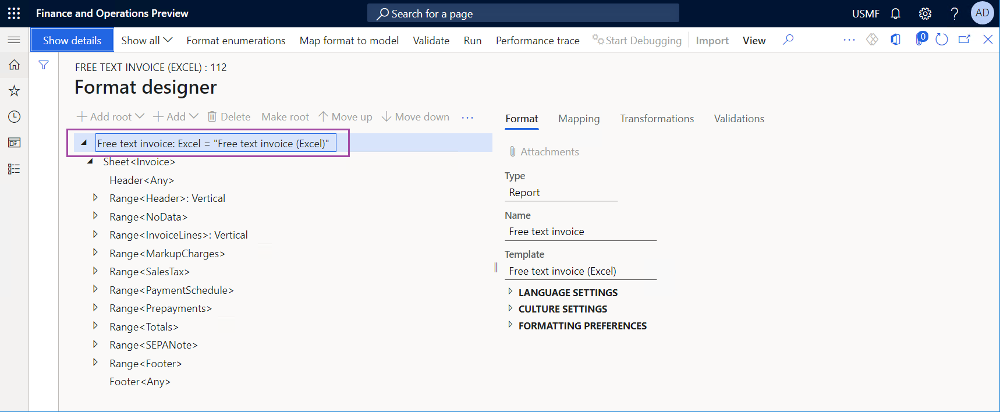
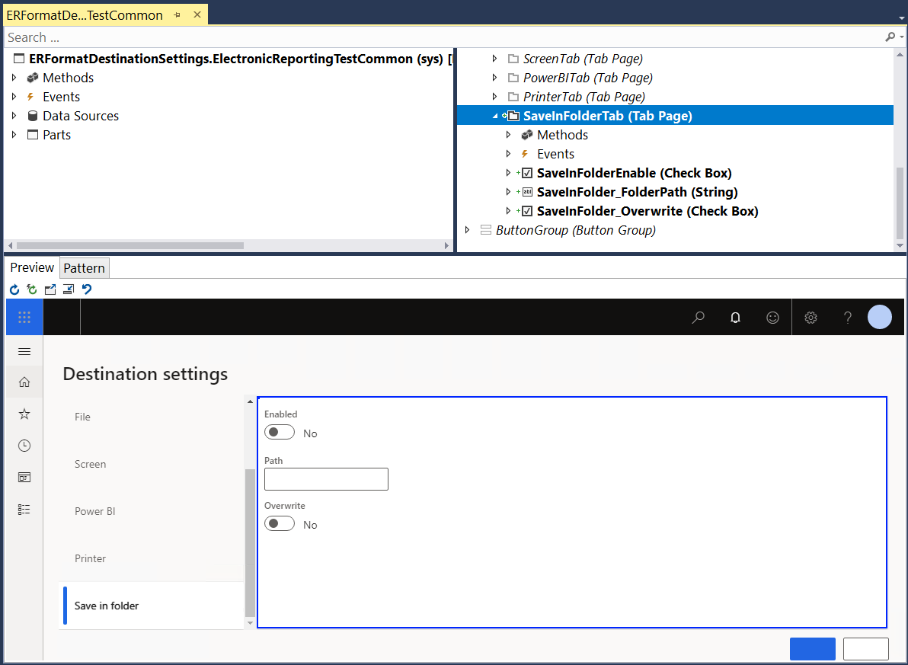
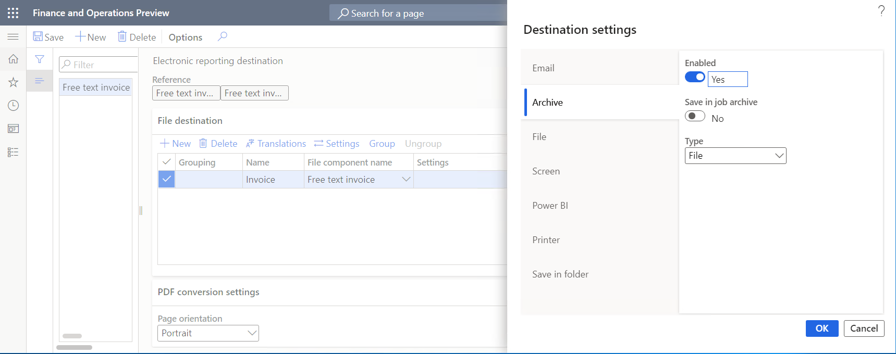
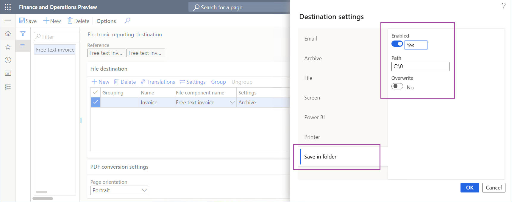

# Implement a custom destination for generated documents

[!include[banner](../includes/banner.md)]

The application programming interface (API) of the [Electronic reporting (ER)](general-electronic-reporting.md) framework lets you [extend](er-apis-app10-0-19.md#er-api-extend-destination) the list of ER destinations that you can use to store documents that ER formats generate. This article includes an overview of the main tasks that you must complete to implement a custom ER destination.

## Prerequisites

You must deploy a topology that supports continuous build. For more information, see [Deploy topologies that support continuous build and test automation](../perf-test/continuous-build-test-automation.md). You must have access to this topology for one of the following roles:

- Electronic reporting developer
- Electronic reporting functional consultant
- System administrator

You must also have access to the development environment for this topology.

## Create or import an ER format configuration

In the current topology, [create a new ER format](tasks/er-format-configuration-2016-11.md) to generate the documents that you plan to store by using a custom ER destination. Alternatively, you can [import an existing ER format into this topology](general-electronic-reporting-manage-configuration-lifecycle.md).



> [!IMPORTANT]
> The ER format that you create or import must contain at least one of the following format elements:
>
> - Common\\File
> - Common\\File attachment
> - Common\\Folder
> - Excel\\File 
> - PDF\\Merger
> - PDF\\File

## Extend the source code

1. Append your Microsoft Visual Studio project with a new class (`ERFileDestinationFolder` in this example), and write code that uses the `ERIFileDestination` public interface to implement your custom destination. In the following example, the class is designed to store generated documents as files in a folder of the local file system.

    ```xpp
    using Microsoft.Dynamics365.LocalizationFramework;

    public class ERFileDestinationFolder implements ERIFileDestination
    {
        private str folderPath;
        private boolean overwrite;

        public str parmFolderPath(str _value = folderPath)
        {
            folderPath = _value;
            return folderPath;
        }

        public boolean parmOverwrite(boolean _value = overwrite)
        {
            overwrite = _value;
            return overwrite;
        }

        [Hookable(false)]
        public System.IO.Stream saveFile(System.IO.Stream _stream, str _filePath)
        {
            this.sendFileToFolder(_stream, System.IO.Path::GetFileName(_filePath));
            return _stream;
        }

        [Hookable(false)]
        public System.IO.Stream newFileStream(str _filePath)
        {
            return new System.IO.MemoryStream();
        }

        private str getFileName(str _fileName)
        {
            if (overwrite)
            {
                return _fileName;
            }
            System.DateTime now = DateTimeUtil::utcNow();
            return strFmt('%1_%2%3', System.IO.Path::GetFileNameWithoutExtension(_fileName), now.ToString('yyyy-M-d_HH_mm_ss'), System.IO.Path::GetExtension(_fileName));
        }

        private void sendFileToFolder(System.IO.Stream _stream, str _fileName)
        {
            var resultPath = System.IO.Path::Combine(this.folderPath, this.getFileName(_fileName));
            using(var fileStream = System.IO.File::Create(resultPath))
            {
                if( _stream.CanSeek)
                {
                    _stream.Seek(0, System.IO.SeekOrigin::Begin);
                }
                _stream.CopyTo(fileStream);
            }
        }

        /// <summary>
        /// Finalizes files processing.
        /// </summary>
        [Hookable(false)]
        public void finalize()
        {
        }
    }
    ```

2. Add a new class to your Visual Studio project (`ERFormatDestinationSaveInFolderSettings` in this example) to use the `ERIFormatFileDestinationSettings` public interface to write code that specifies how a custom destination is created, how its parameters are packed for storage, and how its parameters are unpacked for presentation in the user interface (UI).

    ```xpp
    using Microsoft.Dynamics365.LocalizationFramework;

    public class ERFormatDestinationSaveInFolderSettings implements ERIFormatFileDestinationSettings
    {
        internal const str SettingsKey = classStr(ERFormatDestinationSaveInFolderSettings);
        public const int CurrentVersion = 1;

        private boolean isEnabled;
        private boolean overwrite;
        private str folderPath;

        [Hookable(false)]
        public str parmFolderPath(str _value = folderPath)
        {
            folderPath = _value;
            return folderPath;
        }

        [Hookable(false)]
        public boolean parmIsEnabled(boolean _value = isEnabled)
        {
            isEnabled = _value;
            return isEnabled;
        }

        [Hookable(false)]
        public boolean parmOverwrite(boolean _value = overwrite)
        {
            overwrite = _value;
            return overwrite;
        }

        [Hookable(false)]
        public void setEnabled(boolean _value)
        {
            isEnabled = _value;
        }

        [Hookable(false)]
        public boolean isEnabled()
        {
            return isEnabled;
        }

        [Hookable(false)]
        public str getName()
        {
            return 'Save in folder';
        }

        [Hookable(false)]
        public void validate()
        {
        }

        [Hookable(false)]
        public ERIFileDestination createDestination(ERDestinationExecutionContext _destinationContext, boolean _isGrouped)
        {
            ERFileDestinationFolder ret = new ERFileDestinationFolder();
            ret.parmFolderPath(this.parmFolderPath());
            ret.parmOverwrite(this.parmOverwrite());
            return ret;
        }

        [Hookable(false)]
        public str getKey()
        {
            return SettingsKey;
        }

        [Hookable(false)]
        public container pack()
        {
            return [CurrentVersion, isEnabled, folderPath];
        }

        [Hookable(false)]
        public boolean unpack(container packedClass)
        {
            int version = RunBase::getVersion(packedClass);
            switch (version)
            {
                case CurrentVersion:
                    [version, isEnabled, folderPath] = packedClass;
                    return true;
                default:
                    return false;
            }
        }

        /// <summary>
        /// Creates a new instance of an objected from a packed class container.
        /// </summary>
        /// <param name = "_packedClass">A packed class container.</param>
        /// <returns>The new instance of an object.</returns>
        public static ERFormatDestinationSaveInFolderSettings create(container _packedClass)
        {
            var ret = new ERFormatDestinationSaveInFolderSettings();
            ret.unpack(_packedClass);
            return ret;
        }
    }
    ```

    > [!NOTE]
    > In the preceding code, the `ERFormatDestinationSaveInFolderSettings` class is introduced as the `static` class. The implementation object should have a `static create(container)` method that creates an object and unpacks the container that the object requires for a correct pack-unpack process. For more information, see [Pack-Unpack Design Pattern](/dynamicsax-2012/developer/pack-unpack-design-pattern#aa879675collapse_allen-usax60gifpublic-static-yourclass-createcontainer-_packedobject).

3. In your Visual Studio project, add a new extension for the `ERFormatDestinationSettings` form, and write code that implements a custom UI for your custom destination. The following illustration shows what this UI looks like in the Visual Studio designer.

    

4. Add another new class (`ERFormatDestinationSettingsEventHandlers` in this example) to your Visual Studio project, and write the event handler code for an extended destination form. This step requires that the public `ERIFormatFileDestinationSettingsStorage` interface be implemented.

    ```xpp
    public class ERFormatDestinationSettingsEventHandlers
    {
        [PostHandlerFor(formStr(ERFormatDestinationSettings), formMethodStr(ERFormatDestinationSettings, init))]
        public static void ERFormatDestinationSettings_Post_init(XppPrePostArgs args)
        {
            FormRun formRun = args.getThis();
            ERIFormatFileDestinationSettingsStorage settingsStorage = args.getThis();
            var settings = ERFormatDestinationSettingsEventHandlers::getSaveInFolderSettings(settingsStorage);

            FormStringControl folderPathControl = formRun.design().controlName(formControlStr(ERFormatDestinationSettings, SaveInFolder_FolderPath));
            folderPathControl.text(settings.parmFolderPath());

            FormCheckBoxControl enabledControl = formRun.design().controlName(formControlStr(ERFormatDestinationSettings, SaveInFolderEnable));
            enabledControl.checked(settings.isEnabled());

            FormCheckBoxControl overwriteControl = formRun.design().controlName(formControlStr(ERFormatDestinationSettings, SaveInFolder_Overwrite));
            overwriteControl.checked(settings.parmOverwrite());
        }

        [PreHandlerFor(formStr(ERFormatDestinationSettings), formMethodStr(ERFormatDestinationSettings, closeOk))]
        public static void ERFormatDestinationSettings_Pre_closeOk(XppPrePostArgs args)
        {
            FormRun formRun = args.getThis();
            ERIFormatFileDestinationSettingsStorage settingsStorage = args.getThis();
            var settings = ERFormatDestinationSettingsEventHandlers::getSaveInFolderSettings(settingsStorage);

            FormStringControl folderPathControl = formRun.design().controlName(formControlStr(ERFormatDestinationSettings, SaveInFolder_FolderPath));
            settings.parmFolderPath(folderPathControl.text());

            FormCheckBoxControl enabledControl = formRun.design().controlName(formControlStr(ERFormatDestinationSettings, SaveInFolderEnable));
            settings.setEnabled(enabledControl.checked());
            
            FormCheckBoxControl overwriteControl = formRun.design().controlName(formControlStr(ERFormatDestinationSettings, SaveInFolder_Overwrite));
            settings.parmOverwrite(overwriteControl.checked());
        }

        private static ERFormatDestinationSaveInFolderSettings getSaveInFolderSettings(ERIFormatFileDestinationSettingsStorage _settingsStorage)
        {
            ERFormatDestinationSaveInFolderSettings ret = _settingsStorage.getSettingsByKey(ERFormatDestinationSaveInFolderSettings::SettingsKey);
            if (ret == null)
            {
                ret = new ERFormatDestinationSaveInFolderSettings();
                _settingsStorage.addSettings(ret);
            }
            return ret;
        }
    }
    ```

5. Rebuild your Visual Studio project.

## Configure ER destinations for the ER format that you created or imported

1. Configure the [Archive](er-destination-type-archive.md) destination for one of the previously mentioned components (file, folder, merger, or attachment) of the ER format that you created or imported. For more information, see [ER Configure destinations](tasks/er-destinations-2016-11.md).

    

2. For the same component of the selected ER format, enable and configure the custom **Save in folder** destination.

    

    > [!NOTE] 
    > Make sure that the specified custom destination folder (**c:\\0** in this example) is present in the local file system of the server that runs the AOS service. Otherwise, a [DirectoryNotFoundException](/dotnet/api/system.io.directorynotfoundexception) exception will be thrown at runtime.

## Run the ER format that you created or imported

1. Run the ER format that you created or imported.
2. Go to **Organization administration \> Electronic reporting \> Electronic reporting jobs**, and find the record that was created for this execution job and that has the generated file attached to it.
3. Browse to the local **C:\\0** folder to find the generated file.

## Additional resources

[Electronic reporting (ER) destinations](electronic-reporting-destinations.md)

[Electronic reporting framework API changes for Application update 10.0.19](er-apis-app10-0-19.md)

[!INCLUDE[footer-include](../../../includes/footer-banner.md)]
