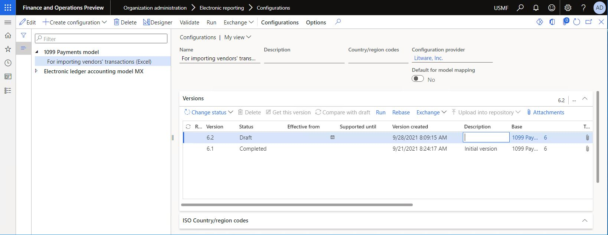
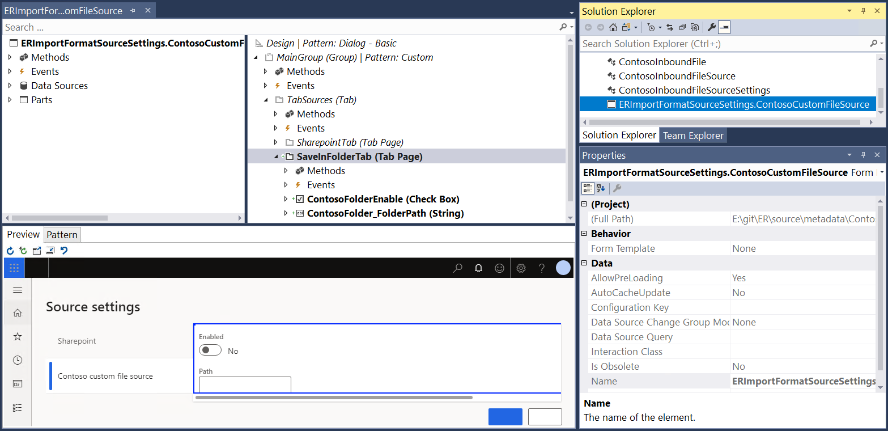
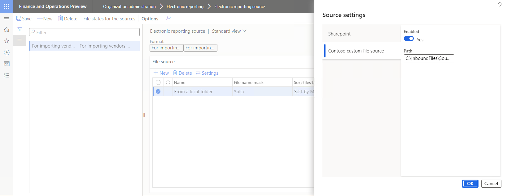
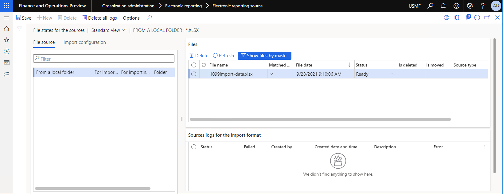
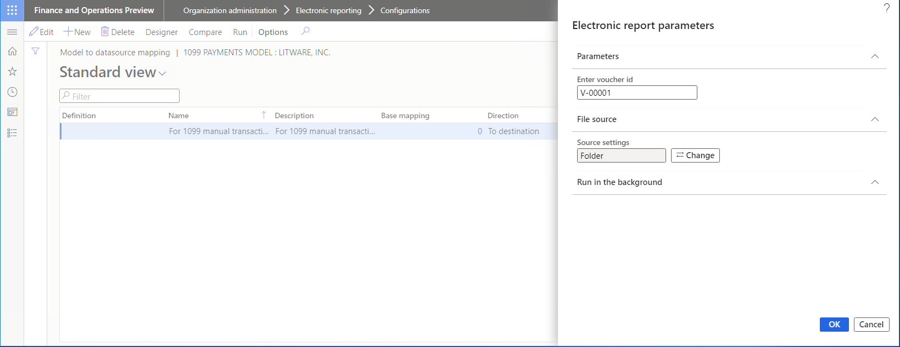
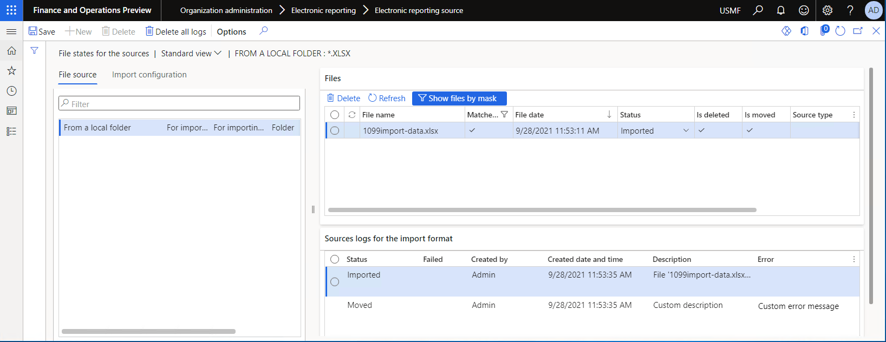

---
# required metadata

title: Implement a custom ER source of inbound documents
description: This topic explains how to extend the list of Electronic reporting (ER) sources to access inbound documents for data import.
author: NickSelin
ms.date: 10/05/2021
ms.topic: article
ms.prod: 
ms.technology: 

# optional metadata

ms.search.form: ERFormatDestinationTable, ERParameters
# ROBOTS: 
audience: Developer, IT Pro
# ms.devlang: 
ms.reviewer: kfend
# ms.tgt_pltfrm: 
# ms.custom: 
# ms.assetid: 
ms.search.region: Global
# ms.search.industry: 
ms.author: nselin
ms.search.validFrom: 2021-10-01
ms.dyn365.ops.version: 10.0.23

---

# Implement a custom ER source of inbound documents

[!include[banner](../includes/banner.md)]

To import data from an inbound document by using the [Electronic reporting (ER)](general-electronic-reporting.md) framework, configure an ER format that supports the import, and then run a model mapping of the **To destination** type that uses that format as a data source. To import data, go to the document that you want to import, and use a SharePoint folder as the standard ER source of inbound documents that can be imported in unattended mode. To learn more about this process, see [Configure data import from SharePoint](er-configure-data-import-sharepoint.md).

The application programming interface (API) of the ER framework now lets you [extend](er-apis-app10-0-23.md#er-api-extend-file-source) the list of ER sources that you can use to access inbound documents that ER formats [parse](er-parse-incoming-documents.md) for data import. Therefore, you can use ER configurations to perform data import from documents that are stored in your custom source.

This topic includes an overview of the main tasks that you must complete to implement and start to use a custom ER source of inbound documents. To complete these tasks, you will use the same example for importing vendor transactions that is described in [Configure data import from SharePoint](er-configure-data-import-sharepoint.md). The steps of these tasks can be completed in the **USMF** company in Microsoft Dynamics 365 Finance.

## Prerequisites

### Deploy a topology

You must deploy a topology that supports continuous build. For more information, see [Deploy topologies that support continuous build and test automation](../perf-test/continuous-build-test-automation.md). You must have access to this topology for one of the following roles:

- Electronic reporting developer
- Electronic reporting functional consultant
- System administrator

You must also have access to the development environment for this topology.

### Configure the ER framework

Follow the steps in [Configure the ER framework](er-quick-start2-customize-report.md#ConfigureFramework) to set up the minimal set of ER parameters. Complete this setup before you start to use the ER framework to import inbound documents from a custom source.

### Import an ER format configuration

Additional tasks use the ER configurations that are mentioned in [Configure data import from SharePoint](er-configure-data-import-sharepoint.md). If you haven't played the task guide of that topic, download the following files.

| Content description | File |
|---------------------|------|
| ER data model configuration | [1099model.xml](https://download.microsoft.com/download/b/d/9/bd9e8373-d558-4ab8-aa9b-31981adc97ea/1099model.xml) |
| ER format configuration | [1099format-import-from-excel.xml](https://download.microsoft.com/download/b/3/8/b38faf0a-fbaf-4e9e-84c2-dedae7464880/1099format-import-from-excel.xml) |
| Inbound file in .XLSX format containing sample data for import | [1099import-data.xlsx](https://download.microsoft.com/download/f/f/4/ff4dbce9-8364-4391-adee-877945ff01f7/1099import-data.xlsx) |

Use the [Load from XML file](er-defer-sequence-element.md#import-the-sample-er-configurations) ER option to import the downloaded ER configurations into your Finance instance in the following order:

1. ER data model configuration
2. ER format configuration



> [!IMPORTANT]
> The ER format that you create or import must contain at least one of the following format elements:
>
> - Common\\File
> - Excel\\File

## Extend the source code

1. Append a new class to your Visual Studio project. In this example, use `ContosoInboundFile`.
2. Write code that uses the `ERIImportFile` public interface to describe a custom inbound file. The following information must be specified to comply with the ER framework's requirements for handling inbound files:

    - A key to uniquely identify a custom source at runtime (the `sourceSettingsKey` variable in this example), and the methods to get and set this key. The key is important because there might be many sources.
    - [*DateTime*](er-formula-supported-data-types-primitive.md#datetime) values to specify the date and time of inbound file creation and modification (the `createdDateTime` and `modifiedDateTime` variables in this example), and the methods to get and set these dates. The values are used at runtime to sort and filter inbound documents that are recognized in a custom source.
    - A method to load an inbound file from a custom source (the `Load()` method in this example).
    - A method to delete an imported file in custom storage (the `Delete()` method in this example).
    - A method to expose additional information about an inbound file (the `parmAdditionalInfo()` method in this example), so that this information can be stored and then extracted upon request.

    ```xpp
    using Microsoft.Dynamics365.LocalizationFramework;
    using SL = Microsoft.Dynamics365.LocalizationFramework.XppSupportLayer;
    using System.IO;

    /// <summary>
    /// Import file
    /// </summary>
    public class ContosoInboundFile implements ERIImportFile
    {
        private str folderPath;
        private System.IO.Stream fileContent;
        private str additionalInfo;
        private str fileId;
        private str name;
        private SL.utcdatetime createdDateTime;
        private SL.utcdatetime modifiedDateTime;
        private str sourceSettingsKey;

        protected void new(
            str _fileId,
            str _name,
            utcdatetime _dateTime,
            str _folderPath,
            Stream _fileContent
            )
        {
            fileId = _fileId;
            name = _name;
            createdDateTime = ERLFConvert::fromUtcdatetime(_dateTime);
            modifiedDateTime =  ERLFConvert::fromUtcdatetime(_dateTime);
            folderPath = _folderPath;
            fileContent = _fileContent;
            this.set_SourceSettingsKey(ContosoInboundFileSourceSettings::SettingsKey);

        }

        [Hookable(false)]
        public str get_SourceSettingsKey()
        {
            return sourceSettingsKey;
        }

        [Hookable(false)]
        public void set_SourceSettingsKey(str _sourceSettingsKey = sourceSettingsKey)
        {
            sourceSettingsKey = _sourceSettingsKey;
        }

        [Hookable(false)]
        public str parmAdditionalInfo(str _additionalInfo = additionalInfo)
        {
            additionalInfo = _additionalInfo;
            return additionalInfo;
        }

        /// <summary>
        /// Construct new object.
        /// </summary>
        /// <param name = "_fileId">File id.</param>
        /// <param name = "_name">Name.</param>
        /// <param name = "_dateTime">Date time.</param>
        /// <param name = "_folderPath">Folder path.</param>
        /// <param name = "_fileContent">File content as stream.</param>
        /// <returns>Import file.</returns>
        public static ContosoInboundFile construct(str _fileId,
            str _name,
            utcdatetime _dateTime,
            str _folderPath,
            Stream _fileContent
            )
        {
            return new ContosoInboundFile(_fileId, _name, _dateTime, _folderPath, _fileContent);
        }

        [Hookable(false)]
        public void set_FileId(str _fileId = fileId)
        {
            fileId = _fileId;
        }

        [Hookable(false)]
        public void set_Name(str _name = name)
        {
            name = _name;
        }

        [Hookable(false)]
        public str get_Name()
        {
            return name;
        }

        [Hookable(false)]
        public SL.utcdatetime get_CreatedDateTime()
        {
            return createdDateTime;
        }

        [Hookable(false)]
        public void set_CreatedDateTime(SL.utcdatetime _createdDateTime = createdDateTime)
        {
            createdDateTime = _createdDateTime;
        }

        [Hookable(false)]
        public void set_ModifiedDateTime(SL.utcdatetime _modifiedDateTime = modifiedDateTime)
        {
            modifiedDateTime = _modifiedDateTime;
        }

        /// <summary>
        /// Loads the file from the source.
        /// </summary>
        /// <returns>A file operation result.</returns>
        public ERFileLoadResult Load()
        {
            return ERFileLoadResult::Success(fileContent);
        }

        public ERFileDeleteResult Delete()
        {
            if (System.IO.File::Exists(Path::Combine(folderPath, name)))
            {
                System.IO.File::Delete(Path::Combine(folderPath, name));
                return ERFileDeleteResult::Success();
            }
            return ERFileDeleteResult::Fail();
        }

        [Hookable(false)]
        public str GetFileId()
        {
            return fileId;
        }

        [Hookable(false)]
        public SL.utcdatetime GetModifiedDateTime()
        {
            return modifiedDateTime;
        }

    }
    ```

3. Append a new class to your Visual Studio project. In this example, use `ContosoInboundFileSource`.
4. Write code that uses the `ERIFileSource` public interface to describe a custom source of inbound files. The following information must be specified to comply with the ER framework's requirements for handling inbound files:

    - A file mask (the `fileMask` variable in this example), so that users can specify the file name pattern to filter only specific files from a custom source, based on a file name and extension.
    - A method to load inbound files from a custom source (the `GetFiles()` method in this example). This method refers to the `ContosoInboundFile()` method for specifying an inbound file.

    ```xpp
    using Microsoft.Dynamics365.LocalizationFramework;
    using System.IO;

    /// <summary>
    /// File source as a folder
    /// </summary>
    public class ContosoInboundFileSource implements ERIFileSource
    {
        private str folderPath;
        private str fileMask;

        /// <summary>
        /// Creates a new instance of <C>ERFileSourceFolder</C>.
        /// </summary>
        /// <param name = "_folderPath">A folder path.</param>
        /// <param name = "_fileMask">A file mask to filter; optional.</param>
        protected void new(str _folderPath, str _fileMask)
        {
            folderPath = _folderPath;
            fileMask = _fileMask;
        }

        /// <summary>
        /// Construct new instance of <c>ERFileSourceFolder</c>.
        /// </summary>
        /// <param name = "_folderPath">A folder path.</param>
        /// <param name = "_fileMask">A file mask to filter; optional.</param>
        /// <returns>New instance of class.</returns>
        internal static ContosoInboundFileSource construct(str _folderPath, str _fileMask)
        {
            return new ContosoInboundFileSource(_folderPath, _fileMask);
        }

        public str parmFolderPath(str _value = folderPath)
        {
            folderPath = _value;
            return folderPath;
        }

        [Hookable(false)]
        public ERIFiles GetFiles()
        {
            if (fileMask == '')
            {
                fileMask = '*.*';
            }
            var ret = new ERFiles();
            var directoryInfo = new System.IO.DirectoryInfo(folderPath);
            var files = directoryInfo.GetFiles(fileMask);
            var i = files.GetEnumerator();

            while (i.MoveNext())
            {
                System.IO.FileInfo fileInfo = i.get_Current();
                if (fileInfo)
                {
                    using (StreamReader sr = fileInfo.OpenText())
                    {
                        var localStream = new System.IO.MemoryStream();

                        System.IO.Stream base = sr.BaseStream;
                        base.CopyTo(localStream);
                        if (localStream.CanSeek)
                        {
                            localStream.Seek(0, System.IO.SeekOrigin::Begin);
                        }
                        ERIFile file = ContosoInboundFile::construct(fileInfo.Name, fileInfo.Name, DateTimeUtil::getSystemDateTime(), folderPath, localStream);
                        ret.Add(file);

                    }
                }
            }
            return ret;
        }

    }
    ```

    > [!NOTE]
    > The file name is used as the unique file identifier in the configured custom source when the file object is constructed while the `GetFiles()` method is called. If something other than a folder of the local file system source is used to store inbound files, you can implement another way to uniquely identify inbound files.

5. Append a new class to your Visual Studio project. In this example, use `ContosoERFileDestinationFolder`.
6. Write code that uses the `ERIFileDestination` public interface to describe a custom source of inbound files as a folder. You can reuse the code sample from step 1 of the "Extend the source code" procedure in [Implement a custom destination for generated documents](er-custom-file-destination.md#extend-the-source-code). In the example, the class is designed to look for inbound documents as files in a folder of the local file system.

    ```xpp
    using Microsoft.Dynamics365.LocalizationFramework;

    /// <summary>
    /// File destination as a folder
    /// </summary>
    public class ContosoERFileDestinationFolder implements ERIFileDestination
    {
        private str folderPath;
        private boolean overwrite;

        public str parmFolderPath(str _value = folderPath)
        {
            folderPath = _value;
            return folderPath;
        }

        public boolean parmOverwrite(boolean _value = overwrite)
        {
            overwrite = _value;
            return overwrite;
        }

        [Hookable(false)]
        public System.IO.Stream saveFile(System.IO.Stream _stream, str _filePath)
        {
            this.sendFileToFolder(_stream, _filePath);
            return _stream;
        }

        [Hookable(false)]
        public System.IO.Stream newFileStream(str _filePath)
        {
            return new System.IO.MemoryStream();
        }

        private str getFileName(str _fileName)
        {
            if (overwrite)
            {
                return _fileName;
            }
            System.DateTime now = DateTimeUtil::utcNow();
            return strFmt('%1_%2%3', System.IO.Path::GetFileNameWithoutExtension(_fileName), now.ToString('yyyy-M-d_HH_mm_ss'), System.IO.Path::GetExtension(_fileName));
        }

        private void sendFileToFolder(System.IO.Stream _stream, str _filePath)
        {
            using(var fileStream = System.IO.File::Create(_filePath))
            {
                if( _stream.CanSeek)
                {
                    _stream.Seek(0, System.IO.SeekOrigin::Begin);
                }
                _stream.CopyTo(fileStream);
            }
        }

        /// <summary>
        /// Finalizes files processing.
        /// </summary>
        [Hookable(false)]
        public void finalize()
        {
        }

    }
    ```

7. Append a new class to your Visual Studio project. For this example, use `ContosoInboundFileSourceSettings`.
8. Write code that uses the `ERIImportFileSourceSettings` public interface to specify how a custom source is created, how its parameters are packed for storage, and how its parameters are unpacked for presentation in the user interface (UI). The following information must be specified to comply with the ER framework's requirements for handling inbound files:

    - A key (the `SettingsKey` text constant in this example) to uniquely identify settings of a custom source at runtime. We recommend that you use a class name to guarantee the uniqueness of keys of this type.
    - The name of a custom source (the `Folder` text constant in this example) to present a custom source in the appropriate UI dialog box at design time.
    - A parameter (the `isEnabled` variable in this example) to indicate whether a custom source is enabled at design time for use at runtime.
    - Because all these parameters must be stored as parts of a single binary object in the application database, they must be packed for this purpose at design time and then unpacked when they are requested at runtime. The appropriate methods must be implemented to support this process.
    - Pay attention to the `fileImported()` method that is used to implement the logic of any required post-processing that must be applied to the imported file. The argument of this method represents an imported file itself and information about the import that is performed. A state manager is included. This state manager includes a logger that collects information about whether an imported file was deleted or moved to another location. In this example, the code moves successfully imported files to another folder (**C:\\InboundFiles\\Archive**) of the local file system and keeps the original file names.

    ```xpp
    using Microsoft.Dynamics365.LocalizationFramework;
    using System.IO;

    /// <summary>
    /// Folder file source settings
    /// </summary>
    public class ContosoInboundFileSourceSettings implements SysPackable, ERIImportFileSourceSettings
    {
        internal const str SettingsKey = classStr(ContosoInboundFileSourceSettings);
        public const int CurrentVersion = 1;

        private boolean isEnabled;
        private str folderPath;

        [Hookable(false)]
        public str parmFolderPath(str _value = folderPath)
        {
            folderPath = _value;
            return folderPath;
        }

        [Hookable(false)]
        public boolean parmIsEnabled(boolean _value = isEnabled)
        {
            isEnabled = _value;
            return isEnabled;
        }

        [Hookable(false)]
        public void setEnabled(boolean _value)
        {
            isEnabled = _value;
        }

        [Hookable(false)]
        public boolean isEnabled()
        {
            return isEnabled;
        }

        [Hookable(false)]
        public str getName()
        {
            /// Name of settings of a custom source. 
            /// This name will be presented in the dialog box that is offered at runtime for user to adjust configured settings.
            return 'Folder';
        }

        [Hookable(false)]
        public boolean validate()
        {
            return true;
        }

        [Hookable(false)]
        public str getKey()
        {
            return SettingsKey;
        }

        [Hookable(false)]
        public container pack()
        {
            return [CurrentVersion, isEnabled, folderPath];
        }

        [Hookable(false)]
        public boolean unpack(container packedClass)
        {
            int version = RunBase::getVersion(packedClass);
            switch (version)
            {
                case CurrentVersion:
                    [version, isEnabled, folderPath] = packedClass;
                    return true;
                default:
                    return false;
            }
        }

        /// <summary>
        /// Creates a file source for current settings.
        /// </summary>
        /// <param name = "_fileMask">File mask.</param>
        /// <returns>A new instance of a file source.</returns>
        public ERIFileSource createFileSource(str _fileMask)
        {
            return ContosoInboundFileSource::construct(folderPath, _fileMask);
        }

        /// <summary>
        /// Creates a file destination for current settings.
        /// </summary>
        /// <param name = "_destination">A destination folder to move the file.</param>
        /// <returns>A new instance of a file destination.</returns>
        private ERIFileDestination createPostProcessingDestination(ERFormatFileDestinationAfterImport _destination)
        {
            ContosoERFileDestinationFolder ret = new ContosoERFileDestinationFolder();
            var path = folderPath;
            switch (_destination)
            {
                case ERFormatFileDestinationAfterImport::None :
                    break;
                default:
                    path = System.IO.Path::Combine(path, enum2Str(_destination));
                    break;
            }
            ret.parmFolderPath(path);
            return ret;
        }

        public void fileImported(ERFileImportedArgs _args)
        {
            if (_args.IsImportOperationSuccessful())
            {
                /// copy an outbound file to the alternative location
                var destination = this.createPostProcessingDestination( _args.IsImportOperationSuccessful() ? ERFormatFileDestinationAfterImport::Archive : ERFormatFileDestinationAfterImport::None);
                ERIImportFile file = _args.getFile();
                destination.saveFile(_args.getFileStream(), @'C:\InboundFiles\Archive\'+file.Name);

                /// do logging
                ttsbegin;
                _args.getState().markAsMoved();
                _args.getState().getLogger().logMoved(!_args.IsImportOperationSuccessful(), 'Custom error message', 'Custom description');
                ttscommit;

                /// delete file
                ttsbegin;
                _args.getFile().Delete();
                _args.getState().markAsDeleted();
                ttscommit;
            }      
        }

        /// <summary>
        /// Create new instance of <c>ERImportFormatSourceFolderSettings</c> from packed presentation.
        /// </summary>
        /// <param name = "_packedClass">A container with packed presentation.</param>
        /// <returns>New instance.</returns>
        internal static ContosoInboundFileSourceSettings create(container _packedClass)
        {
            var settings = new ContosoInboundFileSourceSettings();
            settings.unpack(_packedClass);
            return settings;
        }

        /// <summary>
        /// Event.
        /// </summary>
        /// <param name="_record">Record.</param>
        /// <param name="_file">File.</param>
        ///
        /// This code and code below presents the sample how you can memorize additional info about an imported file
        /// in the extended field of the ERImportFormatFileSourceStateTable table.
        /// 
        [SubscribesTo(tableStr(ERImportFormatFileSourceStateTable), delegateStr(ERImportFormatFileSourceStateTable, objectInitialized))]
        public static void ERImportFormatFileSourceStateTable_objectInitialized(ERImportFormatFileSourceStateTable _record, ERIImportFile _file)
        {
            anytype file =_file;
            var folderFile = file as ContosoInboundFile;
            if (folderFile != null)
            {
    ///            folderFile.parmAdditionalInfo(_record.additionalInfo);
            }
        }

        /// <summary>
        /// Event.
        /// </summary>
        /// <param name="_record">Record.</param>
        /// <param name="_file">File</param>
        [SubscribesTo(tableStr(ERImportFormatFileSourceStateTable), delegateStr(ERImportFormatFileSourceStateTable, tableRecordInitialized))]
        public static void ERImportFormatFileSourceStateTable_tableRecordInitialized(ERImportFormatFileSourceStateTable _record, ERIImportFile _file)
        {
            anytype file =_file;
            var folderFile = file as ContosoInboundFile;
            if (folderFile != null)
            {
    ///            _record.AdditionalInfo = folderFile.parmAdditionalInfo();
            }
        }

    }
    ```

9. In your Visual Studio project, add a new extension for the `ERImportFormatSourceSettings` form. In this example, use `ERImportFormatSourceSettings.ContosoCustomFileSource`.
10. Write code that implements a custom UI for your custom source of inbound files. The following illustration shows what this UI looks like in the Visual Studio designer.

    

11. Append a new class to your Visual Studio project. For this example, use `ContosoImportFormatSourceSettingsEventHandlers`.
12. Write the event handler code for an extended form of settings of a custom source. This step requires that the public `ERIImportFileSourceSettingsStorage` interface be implemented.

    ```xpp
    using Microsoft.Dynamics365.LocalizationFramework;

    /// <summary>
    /// Handler for <c>ERImportFormatSourceSettings</c> form
    /// </summary>
    public class ContosoImportFormatSourceSettingsEventHandlers
    {
        /// <summary>
        /// Post init method event handler.
        /// </summary>
        /// <param name = "args">Args.</param>
        [PostHandlerFor(formStr(ERImportFormatSourceSettings), formMethodStr(ERImportFormatSourceSettings, init))]
        public static void ERImportFormatSourceSettings_Post_init(XppPrePostArgs args)
        {
            FormRun formRun = args.getThis();
            ERIImportFileSourceSettingsStorage settingsStorage = args.getThis();
            var settings = ContosoImportFormatSourceSettingsEventHandlers::getSaveInFolderSettings(settingsStorage);

            FormStringControl folderPathControl = formRun.design().controlName(formControlStr(ERImportFormatSourceSettings, ContosoFolder_FolderPath));
            folderPathControl.text(settings.parmFolderPath());

            FormCheckBoxControl enabledControl = formRun.design().controlName(formControlStr(ERImportFormatSourceSettings, ContosoFolderEnable));
            enabledControl.checked(settings.isEnabled());

        }

        /// <summary>
        /// CloseOk method event handler.
        /// </summary>
        /// <param name = "args">Args.</param>
        [PreHandlerFor(formStr(ERImportFormatSourceSettings), formMethodStr(ERImportFormatSourceSettings, closeOk))]
        public static void ERFormatDestinationSettings_Pre_closeOk(XppPrePostArgs args)
        {
            FormRun formRun = args.getThis();
            ERIImportFileSourceSettingsStorage settingsStorage = args.getThis();
            var settings = ContosoImportFormatSourceSettingsEventHandlers::getSaveInFolderSettings(settingsStorage);

            FormStringControl folderPathControl = formRun.design().controlName(formControlStr(ERImportFormatSourceSettings, ContosoFolder_FolderPath));
            settings.parmFolderPath(folderPathControl.text());

            FormCheckBoxControl enabledControl = formRun.design().controlName(formControlStr(ERImportFormatSourceSettings, ContosoFolderEnable));
            settings.setEnabled(enabledControl.checked());
            
        }

        private static ContosoInboundFileSourceSettings getSaveInFolderSettings(ERIImportFileSourceSettingsStorage _settingsStorage)
        {
            ContosoInboundFileSourceSettings ret = _settingsStorage.getSettingsByKey(ContosoInboundFileSourceSettings::SettingsKey);
            if (ret == null)
            {
                ret = new ContosoInboundFileSourceSettings();
                _settingsStorage.addSettings(ret);
            }
            return ret;
        }

    }
    ```

13. Rebuild your Visual Studio project.

## Configure ER sources for the imported ER format

1. Configure the custom source of inbound files for one of the previously mentioned components (Common\\File or Excel\\File) of the ER format that you imported.

    1. Go to **Organization administration** \> **Electronic reporting** \> **Electronic reporting source**.
    2. On the **Electronic reporting source** page, select **New**.
    3. In the **Format** field, select the imported ER format.
    4. On the **File source** FastTab, select **New**, and then follow these steps:

        1. In the **Name** field, enter **From a local folder** as the name of a custom source.
        2. In the **File name mask** field, enter the ***.xlsx** mask to filter only files that have the .xlsx extension in a custom source.
        3. In the **Sort files before import** field, select **Sort by Modified date/time**.

    4. For the source record that you entered, select the **Settings** option, and then follow these steps:

        1. In the **Source settings** dialog box, on the **Contoso custom file source** tab, set the **Enabled** option to **Yes**.
        2. In the **Path** field, enter **C:\\InboundFiles\\Source** to specify the local folder that contains inbound files.
        3. Select **OK**, and then select **Save**.

    

2. Copy the imported file, **1099import-data.xlsx**, to the **C:\\InboundFiles\\Source** folder of the file system of the server that runs the first instance of Application Object Server (AOS).
3. Make sure that the **C:\\InboundFiles\\Archive** folder has been created in the file system of the server that runs the first AOS instance.
4. On the **Electronic reporting source** page, select **File states for the sources**, and then following these steps to review the content of the configured custom file source for the current ER format:

    1. On the **File states for the sources** page, in the **File source** list, select the **From a local folder** source.
    2. On the **Files** tab, select **Refresh** to see the **1099import-data.xlsx** file that is ready for import from a custom source.

    

## Run the ER mapping that you imported

1. To import vendor transactions from an inbound file that is located in a custom source, follow these steps to run the ER model mapping that you imported:

    1. Go to **Organization administration** \> **Electronic reporting** \> **Configurations**.
    2. In the **Configurations** tree, select **1099 Payments model**.
    3. On the **Configuration components** FastTab, select the name of the **Model mapping** component to open the list of model mappings of the selected ER model configuration.
    5. Select **Run** to run the selected model mapping. Because you configured file sources for the ER format, you can change the setting of the **File source** option as you require. If you keep the setting of this option, the .xslx files are imported from the configured custom sources (the **1099import-data.xlsx** file from the **C:\\InboundFiles\\Source** local folder in this example).
    6. Enter the voucher ID, such as **V-00001**, and then select **OK**.

    

2. Browse to the local **C:\\InboundFiles\\Archive** folder to find the imported **1099import-data.xlsx** file that has been moved from the **C:\\InboundFiles\\Source** local folder, based on the post-processing logic that is defined in the source code.
3. Follow these steps to review the current status of the configured custom source of inbound files.

    1. Go to **Organization administration** \> **Electronic reporting** \> **Electronic reporting source**.
    2. On the **Electronic reporting source** page, select **File states for the sources** to review the content of the configured custom file source for the current ER format.
    3. On the **File states for the sources** page, in the **File source** list, select the **From a local folder** source.
    4. On the **Files** tab, select **Refresh** to see the previously imported **1099import-data.xlsx** file that has been moved from the **C:\\InboundFiles\\Source** folder to the **C:\\InboundFiles\\Archive** folder.

    

## Additional resources

[Configure data import from SharePoint](er-configure-data-import-sharepoint.md)

[Electronic reporting framework API changes for Application update 10.0.23](er-apis-app10-0-23.md)

[!INCLUDE[footer-include](../../../includes/footer-banner.md)]
