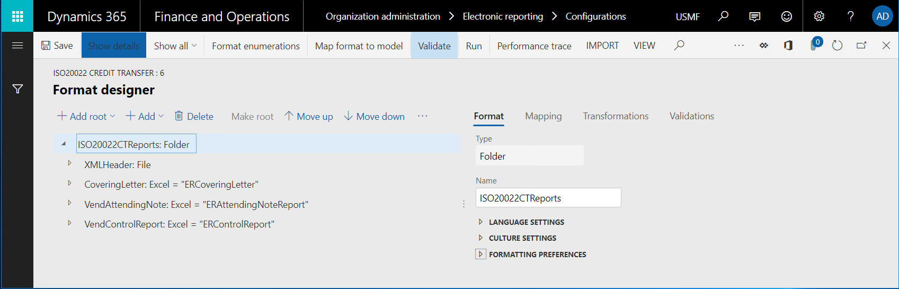

# Specify a custom storage location for generated documents

[!include[banner](../includes/banner.md)]

The application programming interface (API) of the Electronic reporting (ER) framework lets you extend the list of storage locations for documents that ER formats generate. This article includes an overview of the main tasks that you must complete to add a custom storage location.

## Prerequisites

You must deploy a topology that supports continuous build. (For more information, see [Deploy topologies that support continuous build and test automation](/dynamics365/unified-operations/dev-itpro/perf-test/continuous-build-test-automation).) You must have access to this topology for one of the following roles:

- Electronic reporting developer
- Electronic reporting functional consultant
- System administrator

You must also have access to the development environment for this topology.

## Create or import an ER format configuration

In the current topology, [create a new ER format](tasks/er-format-configuration-2016-11.md) to generate documents that you plan to add a custom storage location for. Alternatively, [import an existing ER format into this topology](general-electronic-reporting-manage-configuration-lifecycle.md).



> [!IMPORTANT]
> The ER format that you create or import must contain at least one of the following format elements:
>
> - File
> - Folder
> - Merger
> - Attachment

## Create a new document type

To specify how documents that an ER format generates are routed, you must configure [Electronic reporting (ER) destinations](electronic-reporting-destinations.md). In each ER destination that is configured to store generated documents as files, you must specify a document type of the Document management framework. Different document types can be used to route documents that different ER formats generate.

1. Add a new [document type](../../fin-ops/organization-administration/configure-document-management.md) for the ER format that you created or imported earlier. In the illustration that follows, the document type is **FileX**.
2. To differentiate this document type from other document types, include a specific keyword in its name. For example, in the illustration that follows, the name is **(LOCAL) folder**.
3. In the **Class** field, specify **Attach file**.
4. In the **Group** field, specify **File**.


> [!NOTE]
> Document types are company-specific. To use an ER format with a configured destination in multiple companies, you must configure a separate document type in each company.

## Review source code

Review the code of the **insertFile()** method of the **ERDocuManagement** class. Notice that the **AttachingFile()** event is raised while the generated file is attached to a record.


```xpp
/// <summary>
/// Inserts file as attachment in Document Management.
/// </summary>
/// <param name = "_owner">A record as the attachment owner.</param>
/// <param name = "_stream">The file stream.</param>
/// <param name = "_filePath">The file path with name.</param>
/// <param name = "_attachmentName">The name of file attachment.</param>
/// <returns>The reference to inserted file.</returns>
[Hookable(false)]
public DocuRef insertFile(
    Common _owner, 
    System.IO.Stream _stream, 
    str _filePath, 
    str _attachmentName, 
    DocuTypeId _docuTypeId)
{
    DocuRef docuRef;
    if (_stream)
    {
        DocuType::createDefaults();
        if (!this.isDocuTypeValid(_docuTypeId))
        {
            throw error(strFmt("@ElectronicReporting:DocuTypeIsNotValid", _docuTypeId));
        }
        var args = ERDocuManagementAttachingFileEventArgs::construct(_owner, _stream, _filePath, _attachmentName, _docuTypeId);
        ERDocuManagementEvents::onAttachingFile(args);
        if (args.isHandled())
        {
            docuRef = args.getDocuRef();
        }
        else
        {
            docuRef = this.attachFile(_owner, _stream, _filePath, _attachmentName, _docuTypeId);
        }
    }
    return docuRef;
}
```

The **AttachingFile()** event is raised when the following ER destinations are processed:

- **Archive** – When this destination is used, a new record for the ER format that is run is created in the ERFormatMappingRunJobTable table. The **Archived** field in this record is set to **False**. If the ER format is successfully run, the generated document is attached to this record, and the **AttachingFile()** event is raised. The document type that is selected in this ER destination determines the storage location for the attached file (Microsoft Azure Storage or a Microsoft SharePoint folder).
- **Job archive** – When this destination is used, a new record for the ER form that is run is created in the ERFormatMappingRunJobTable table. The **Archived** field in this record is set to **True**. If the ER format is successfully run, the generated document is attached to this record, and the **AttachingFile()** event is raised. The document type that is configured in the ER parameters determines the storage location for the attached file (Azure Storage or a SharePoint folder).


## Configure an ER destination

1. Configure the archived destination for one of the previously mentioned elements (file, folder, merger, or attachment) of the ER format that you created or imported. For guidance, see [ER Configure destinations](/dynamics365/unified-operations/dev-itpro/analytics/tasks/er-destinations-2016-11).
2. Use the document type that you added earlier for the configured destination. (For the example in this article, the document type is **FileX**.)


## Modify source code

1. Add a new class to your Microsoft Visual Studio project, and write code to subscribe to the **AttachingFile()** event that was mentioned earlier. (For more information about the extensibility pattern that is used, see [Respond by using EventHandlerResult](/dynamics365/unified-operations/dev-itpro/extensibility/respond-event-handler-result).) For example, in the new class, write code that performs the following actions:

    1. Store generated files in a folder of the local file system of the server that runs the Application Object Server (AOS) service.
    2. Store these generated files only when the new document type (for example, the **FileX** type that has the "(LOCAL)" keyword in its name) is used while a file is attached to the record in the ER execution job log.

    ```xpp
    class ERDocuSubscriptionSample
    {
        void new()
        {
        }
        [SubscribesTo(classStr(ERDocuManagementEvents), 
        staticDelegateStr(ERDocuManagementEvents, 
        attachingFile))]
        public static void ERDocuManagementEvents_attachingFile(ERDocuManagementAttachingFileEventArgs _args)
        {
            if (!_args.isHandled())
            {
                DocuType docuType = DocuType::find(_args.getDocuTypeId());
                if (strContains(docuType.Name, '(LOCAL)'))
                {
                    _args.markAsHandled();
                    var stream = _args.getStream();
                    if (stream.CanSeek)
                    {
                        stream.Seek(0, System.IO.SeekOrigin::Begin);
                    }
                    using (var localStream = System.IO.File::OpenWrite(@'c:\0\' + _args.getAttachmentName()))
                    {
                        stream.CopyTo(localStream);
                    }
                }
            }
        }
    }
    ```

2. Rebuild your project.

## Run the ER format that you created or imported

1. Execute the ER format that you created or imported.
2. Go to **Organization administration \> Electronic reporting \> Electronic reporting jobs**. Find the record that was created for this execution job, and that has the generated file attached to it.
3. Explore the local **C:\\0** folder to find same generated file.

## Additional resources

- [Electronic reporting (ER) destinations](electronic-reporting-destinations.md)
- [Extensibility home page](../extensibility/extensibility-home-page.md)


[!INCLUDE[footer-include](../../../includes/footer-banner.md)]
