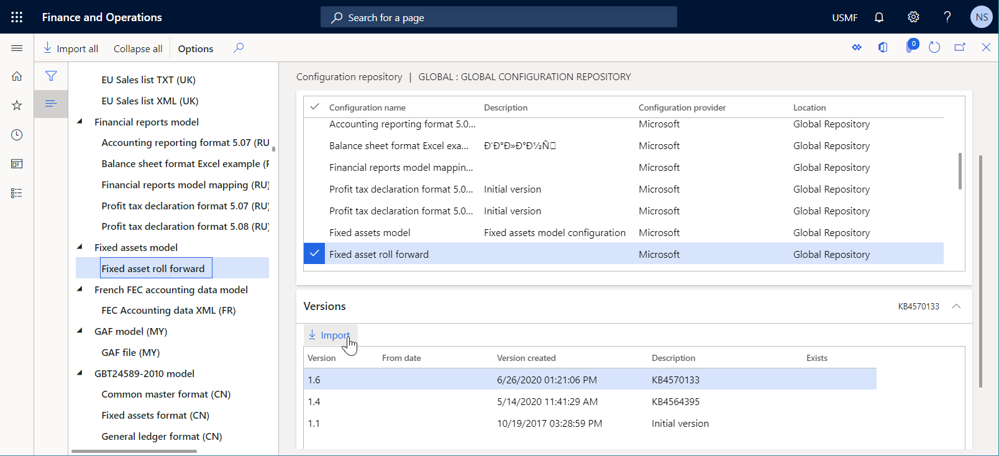
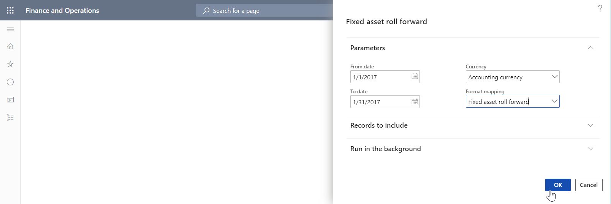

# Specify custom storage locations for generated documents

[!include[banner](../includes/banner.md)]

The application programming interface (API) of the Electronic reporting (ER) framework lets you extend the list of storage locations for documents that ER formats generate. This article explains how to add a custom storage location for generated documents by delegating the task of creating ER destinations to the default destination factory and then implementing a custom class that has its own destination logic.

## Prerequisites

Deploy a topology that supports continuous build. For more information, see [Deploy topologies that support continuous build and test automation](/dynamics365/unified-operations/dev-itpro/perf-test/continuous-build-test-automation). You must have access to this topology for one of the following roles:

- Electronic reporting developer
- Electronic reporting functional consultant
- System administrator

You must also have access to the development environment for this topology.

All the tasks in this article can be completed in the **USMF** company.

## Import the Fixed asset roll forward ER format

To generate the documents that you plan to add a custom storage location for, [import](er-download-configurations-global-repo.md) the **Fixed asset roll forward** ER format configuration into the current topology.



## Run the Fixed asset roll forward report

1. Go to **Fixed assets** \> **Inquiries and reports** \> **Transaction reports** \> **Fixed asset roll forward**.
2. In the **From date** field, enter **1/1/2017** (January 1, 2017).
3. In the **To date** field, enter **1/31/2017** (January 31, 2017).
4. In the **Currency field**, select **Accounting currency**.
5. In the **Format mapping** field, select **Fixed asset roll forward**.
6. Select **OK**.



In Microsoft Excel, review the outbound document that is generated and available for download. This behavior is the [default behavior](electronic-reporting-destinations.md#default-behavior) for an ER format that no [destinations](electronic-reporting-destinations.md) are configured for, and that is running in interactive mode.

## Review the source code

Review the code of the `generateReportByGER()` method of the `AssetRollForwardService` class. Notice that the `Run()` method is used to call the ER framework and generate the **Fixed asset roll forward** report.

```xpp
class AssetRollForwardService extends SysOperationServiceBase
{
    public const str ERFormatModelName = 'Fixed assets';
    public const str ERModelDataSourceName = 'model';
    public const str DefaultExportedFileName = 'AssetRollForward';

    /// <summary>
    /// Generates report by general electronic reporting
    /// </summary>
    /// <param name = "_contract">The Asset Period Statement contract</param>
    public void generateReportByGER(AssetRollForwardContract _contract)
    {
        ERFormatMappingId   formatMappingId;
        AssetRollForwardDP  dataProvider;
        AssetRollForwardTmp assetRollForwardTmp;
        Query               query;

        query = new Query(SysOperationHelper::base64Decode(_contract.parmQuery()));
        dataProvider = AssetRollForwardDP::construct();
        formatMappingId = _contract.parmFormatMapping();
        assetRollForwardTmp = dataProvider.getAssetRollForwardTmp(_contract, query);

        if (assetRollForwardTmp)
        {
            try
            {
                ERIModelDefinitionParamsAction parameters = new ERModelDefinitionParamsUIActionComposite()
                    .add(new ERModelDefinitionDatabaseContext().addTemporaryTable(assetRollForwardTmp))
                    .add(new ERModelDefinitionObjectParameterAction(ERModelDataSourceName, 'MyParameters', _contract, true));

                // Call ER to generate the report.
                ERObjectsFactory::createFormatMappingRunByFormatMappingId(formatMappingId, DefaultExportedFileName)
                    .withParameter(parameters)
                    .withFileDestination(_contract.getFileDestination())
                    .run();
            }
            catch
            {
                // An error occurred while exporting data.
                error("@SYP4861341");
            }
        }
        else
        {
            // There is no data available.
            info("@SYS300117");
        }
    }
}
```

## Modify the source code

1. In your Visual Studio project, add a new class (`AssetRollForwardDestination` in this example), and write code to implement your custom destination for **Fixed asset roll forward** reports that are generated.

    - The `new()` method is designed to get the original ER destination object and the application logic–driven parameter that specifies the custom location where generated reports should be stored. In this example, the custom location is the name of a folder of the local file system of the server that runs the Application Object Server (AOS) service.
    - The `saveFile()` method is designed to save a generated document to a folder of the local file system of the server that runs the AOS service.

    ```xpp
    using Microsoft.Dynamics365.LocalizationFramework;

    /// <summary>
    /// Destination class for <c>AssetRollForwardDestinationFactory</c> that stores a generated report.
    /// </summary>
    public class AssetRollForwardDestination implements ERIFileDestination
    {
        private ERIFileDestination originDestination;
        private str TargetFolder;

        /// <summary>
        /// Creates a stream for new file.
        /// </summary>
        /// <param name = "_fileName">Name of a new file.</param>
        /// <returns>Stream for new file.</returns>
        public System.IO.Stream newFileStream(System.String _fileName)
        {
            return originDestination.newFileStream(_fileName);
        }

        /// <summary>
        /// Saves file in destination.
        /// </summary>
        /// <param name = "_stream">A stream to save.</param>
        /// <param name = "_fileName">A file name.</param>
        /// <returns>Saved stream.</returns>
        public System.IO.Stream saveFile(System.IO.Stream _stream, System.String _fileName)
        {
            _stream.Seek(0, System.IO.SeekOrigin::Begin);
            using (var localStream = System.IO.File::OpenWrite(TargetFolder + _fileName))
            {
                _stream.CopyTo(localStream);
            }
            return _stream;
        }

        /// <summary>
        /// Constructs destination for fixed asset roll forward report.
        /// </summary>
        /// <param name = "_originDestination">The original destination.</param>
        /// <param name = "_TargetFoder">The folder to store a report that's being created.</param>
        /// <returns>The fixed asset roll forward destination.</returns>
        public static AssetRollForwardDestination construct(ERIFileDestination _originDestination, str _TargetFoder)
        {
            return new AssetRollForwardDestination(_originDestination, _TargetFoder);
        }

        protected void new(ERIFileDestination _originDestination, str _TargetFoder)
        {
            originDestination = _originDestination;
            TargetFolder = _TargetFoder;
        }
    }
    ```

2. In your Visual Studio project, add a new class (`AssetRollForwardDestinationFactory` in this example), and write code to set up a custom destination factory that delegates the creation of a destination to the default destination factory, and to wrap a file destination with your own destination.

    ```xpp
    using Microsoft.Dynamics365.LocalizationFramework;
    using Microsoft.Dynamics365.LocalizationFramework.Format.FileGeneration;

    /// <summary>
    /// Destination factory for using <c>AssetRollForwardDestinationFactory</c>.
    /// </summary>
    public class AssetRollForwardDestinationFactory implements ERIFileDestinationFactory, ERIFileDestinationFactoryPostProcessor
    {
        private ERIFileDestinationFactory originDestinationFactory;
        private str TargetFolder;

        /// <summary>
        /// Creates file destination for print management.
        /// </summary>
        /// <param name = "_fileDestination">A default file destination.</param>
        /// <param name = "_identification">An identification strategy.</param>
        /// <param name = "_rootContext">A root context.</param>
        /// <param name = "_root">A root element.</param>
        /// <returns>A file destination.</returns>
        public ERIDataDrivenFileDestination createPrintMgmtDestination(
            ERIFileDestination _fileDestination,
            ERIObjectIdentificationStrategy _identification,
            ERTextFormatDataContext _rootContext,
            ERTextFormatIFileComponent _root)
        {
            ERIDataDrivenFileDestination dataDrivenDestination = originDestinationFactory.createPrintMgmtDestination(
                _fileDestination,
                _identification,
                _rootContext,
                _root);

            IFileDestinationHost fileDestinationHost = dataDrivenDestination as IFileDestinationHost;
            if (fileDestinationHost)
            {
                fileDestinationHost.FileDestination = AssetRollForwardDestination::construct(
                    fileDestinationHost.get_FileDestination(),
                    TargetFolder);
            }

            return dataDrivenDestination;
        }

        /// <summary>
        /// Constructs the fixed asset roll forward destination factory.
        /// </summary>
        /// <param name = "_originDestinationFactory">The original destination.</param>
        /// <param name = "_TargetFolder">The string containing a folder name that corresponds to the report, that's being created.</param>
        /// <returns>The destination factory for the fixed asset roll forward report.</returns>
        public static AssetRollForwardDestinationFactory construct(ERIFileDestinationFactory _originDestinationFactory, str _TargetFolder)
        {
            AssetRollForwardDestinationFactory destinationFactory = new AssetRollForwardDestinationFactory(_originDestinationFactory, _TargetFolder);

            ERIFileDestinationFactoryPostProcessorsHost factoryPostProcessing = ERCast::asObject(destinationFactory.originDestinationFactory) as ERIFileDestinationFactoryPostProcessorsHost;

            if (factoryPostProcessing)
            {
                factoryPostProcessing.addDestinationPostProcessor(destinationFactory);
            }
            return destinationFactory;
        }

        public ERIFileDestination processDestinationAfterCreation(ERIFileDestination _sourceDestination)
        {
            return AssetRollForwardDestination::construct(_sourceDestination, TargetFolder);
        }

        protected void new(ERIFileDestinationFactory _originDestinationFactory, str _TargetFolder)
        {
            originDestinationFactory = _originDestinationFactory;
            TargetFolder = _TargetFolder;
        }
    }
    ```

3. Modify the existing `AssetRollForwardService` class, and write code to set up a custom destination factory for the report runner. Notice that when a custom destination factory is constructed, the application-driven parameter that specifies a target folder is passed. In this way, that target folder is used to store generated files.

    > [!NOTE] 
    > Make sure that the specified folder (**c:\\0** in this example) is present in the local file system of the server that runs the AOS service. Otherwise, a [DirectoryNotFoundException](/dotnet/api/system.io.directorynotfoundexception) exception will be thrown at runtime.

    ```xpp
    using Microsoft.Dynamics365.LocalizationFramework;
    /// <summary>
    /// The electronic reporting service class for fixed asset roll forward report
    /// </summary>
    class AssetRollForwardService extends SysOperationServiceBase
    {
        public const str ERFormatModelName = 'Fixed assets';
        public const str ERModelDataSourceName = 'model';
        public const str DefaultExportedFileName = 'AssetRollForward';

        /// <summary>
        /// Generates report by general electronic reporting
        /// </summary>
        /// <param name = "_contract">The Asset Period Statement contract</param>
        public void generateReportByGER(AssetRollForwardContract _contract)
        {
            ERFormatMappingId   formatMappingId;
            AssetRollForwardDP  dataProvider;
            AssetRollForwardTmp assetRollForwardTmp;
            Query               query;

            query = new Query(SysOperationHelper::base64Decode(_contract.parmQuery()));
            dataProvider = AssetRollForwardDP::construct();
            formatMappingId = _contract.parmFormatMapping();
            assetRollForwardTmp = dataProvider.getAssetRollForwardTmp(_contract, query);

            if (assetRollForwardTmp)
            {
                try
                {
                    ERIModelDefinitionParamsAction parameters = new ERModelDefinitionParamsUIActionComposite()
                        .add(new ERModelDefinitionDatabaseContext().addTemporaryTable(assetRollForwardTmp))
                        .add(new ERModelDefinitionObjectParameterAction(ERModelDataSourceName, 'MyParameters', _contract, true));

                    // Call ER to generate the report.
                    ERIFormatMappingRun formatMappingRun = ERObjectsFactory::createFormatMappingRunByFormatMappingId(formatMappingId, DefaultExportedFileName);
                    formatMappingRun.withParameter(parameters);
                    formatMappingRun.withFileDestination(_contract.getFileDestination());

                    ERIFileDestinationFactoryHost factoryHost = ERCast::asObject(formatMappingRun) as ERIFileDestinationFactoryHost;
                    if (factoryHost)
                    {
                        ERIFileDestinationFactory fileDestinationFactory = factoryHost.getFileDestinationFactory();
                        factoryHost.setFileDestinationFactory(AssetRollForwardDestinationFactory::construct(fileDestinationFactory, @'c:\0\'));
                        formatMappingRun.run();
                    }
                }
                catch
                {
                    // An error occurred while exporting data.
                    error("@SYP4861341");
                }
            }
            else
            {
                // There is no data available.
                info("@SYS300117");
            }
        }
    }
    ```

4. Rebuild your project.

## Re-run the Fixed asset roll forward report

1. Go to **Fixed assets** \> **Inquiries and reports** \> **Transaction reports** \> **Fixed asset roll forward**.
2. In the **From date** field, enter **1/1/2017**.
3. In the **To date** field, enter **1/31/2017**.
4. In the **Currency field**, select **Accounting currency**.
5. In the **Format mapping** field, select **Fixed asset roll forward**.
6. Select **OK**.
7. Browse the local **C:\\0** folder to find the generated file.

> [!NOTE]
> Because the `originDestination` object isn't used in the `AssetRollForwardDestination` object in this example, the configurations for the ER format [destinations](electronic-reporting-destinations.md) will be ignored at runtime.

## Additional resources

- [Electronic reporting (ER) destinations](electronic-reporting-destinations.md)
- [Extensibility home page](../extensibility/extensibility-home-page.md)


[!INCLUDE[footer-include](../../../includes/footer-banner.md)]
