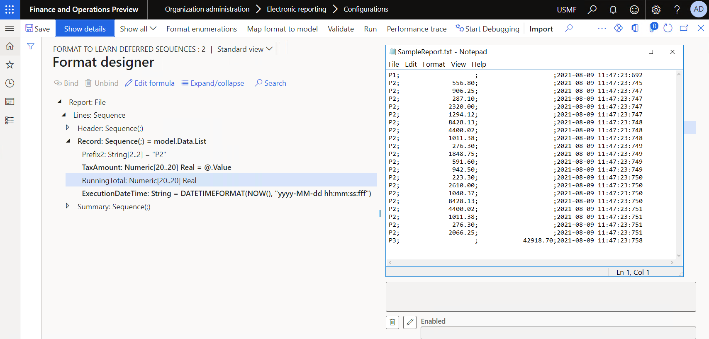
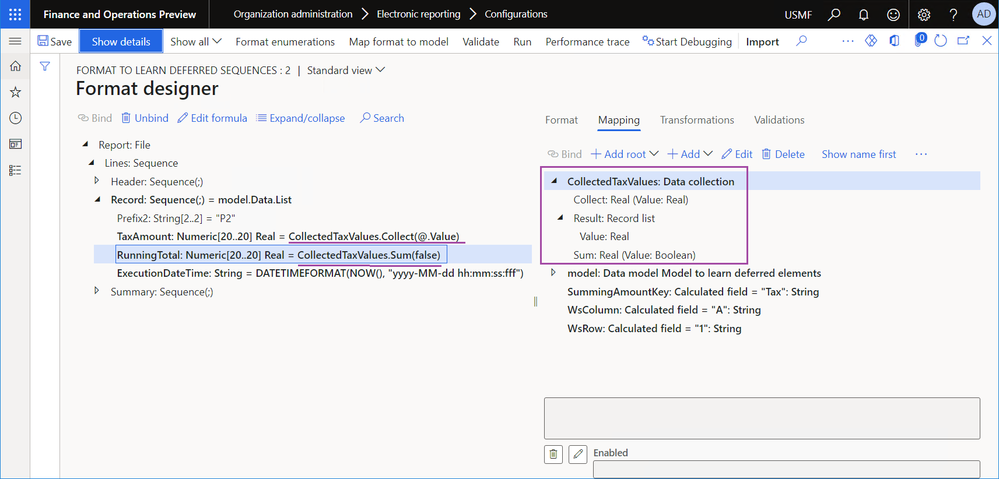
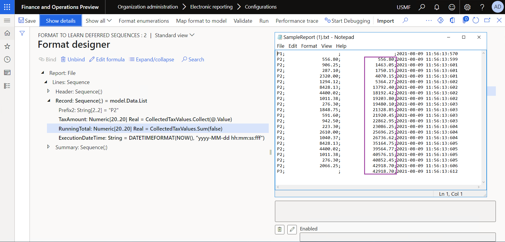
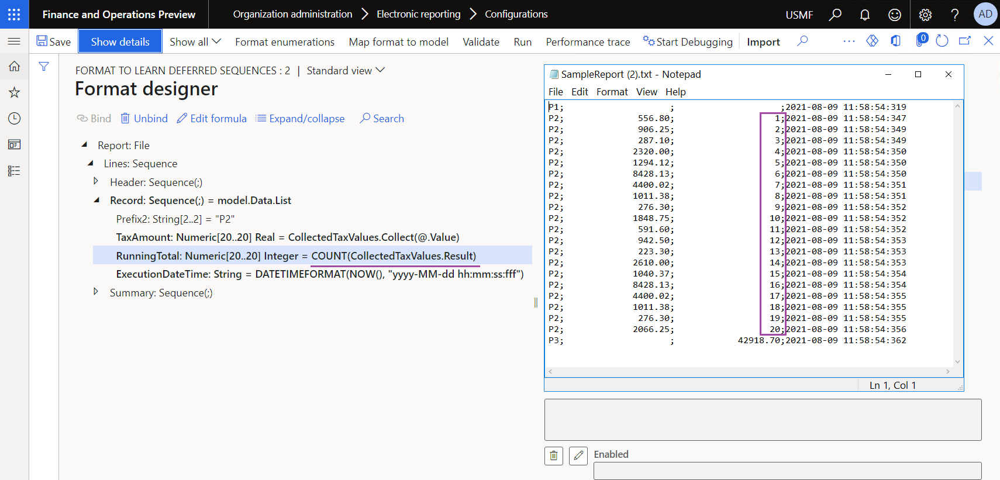

# Use DATA COLLECTION data sources in Electronic reporting formats

[!include [banner](../includes/banner.md)]

You can use the Operations designer of the [Electronic reporting (ER)](general-electronic-reporting.md) framework to configure the format component of an ER solution that is used to generate outbound documents in different formats. The hierarchical structure of the configured format component consists of various types of format elements. These format elements are used to fill generated documents with the required information at runtime. By default, when you run an ER format, the format elements are run in the same order in which they are presented in the format hierarchy: one by one, from top to bottom.

When ER runs a format element that contains a binding, the formula of that binding is run, and the format element adds the value to a generated document. For example, the binding can pass the value of a data model field to a format element. You can configure a DATA COLLECTION data source to collect values of data model fields at runtime, do value summing, and fill a generated document with the collected values. To use this approach, change the initial binding so that the configured DATA COLLECTION data source is used to pass the value of a data model field to a format element. By passing values through the DATA COLLECTION data source, you can collect required details for further use.

When you configure a DATA COLLECTION data source, specify a value type that will be managed in the data source. The following [data types](er-formula-supported-data-types-primitive.md) are currently supported for collecting values:

- Boolean
- Date
- DateTime
- GUID
- Int64
- Integer
- Real
- String
- Time

You can use the `Collect(Value)` method of a DATA COLLECTION data source to pass a value to a data source for collection. In this method, the `Value` argument is either a constant or the valid path of a data source field of the relevant data type.

Use the `Result` property of a DATA COLLECTION data source to access the list of collected values. This property returns a [record list](er-formula-supported-data-types-composite.md#record-list). The records of the record list contain the `Value` field that you can use to access collected values.

By default, a DATA COLLECTION data source collects only unique values.

To collect all values, set the **Collect all values** field of the configured DATA COLLECTION data source to **Yes**. When the **Collect all values** field is set to **Yes**, the `Sum(Flag)` parameterized property becomes available. You can use this property to get the total amount of all currently collected values. In this property, the `Flag` argument is a [Boolean](er-formula-supported-data-types-primitive.md#boolean) value that is used to indicate whether the total value must be reset.

- When the value **False** is provided, summing is continued from the previously collected amount.
- When the value **True** is provided, a new summing is started.

The following data types are currently supported for summing:

- Int64
- Integer
- Real

To learn more about this feature, complete the example that follows.

## Example: Configure an ER format to do counting and summing by using a DATA COLLECTION data source

This example shows how a user in the System administrator or Electronic reporting functional consultant role can configure an ER format that has a DATA COLLECTION data source that is used to calculate running totals and collect summed values.

The procedures in this example can be completed in the USMF company in Microsoft Dynamics 365 Finance.

### Upload and use the provided ER solution

1. [Import the sample ER configurations](er-defer-sequence-element.md#import-the-sample-er-configurations).
2. [Activate a configuration provider](er-defer-sequence-element.md#activate-a-configurations-provider).
3. [Review the imported model mapping](er-defer-sequence-element.md#review-the-imported-model-mapping).
4. [Review the imported format](er-defer-sequence-element.md#review-the-imported-format).
5. [Run the imported format](er-defer-sequence-element.md#run-the-imported-format).

### Run the format of the provided ER solution

1. On the **Format designer** page, select **Run**.
2. In the **Electronic report parameters** dialog box, select **OK**.
3. Download and review the file that the web browser offers.

    

### Modify the format of the ER solution to calculate the running tax total

If the volume of transactions is much larger than the volume in the current example, the time that summing requires might increase and cause performance issues. By changing the settings of the format, you can help prevent these performance issues. Because you access tax values to include them in the generated report, you can reuse that information to sum tax values.

1. On the **Format designer** page, on the **Mapping** tab, select **Add root**.
2. In the **Add data source** dialog box, select **Functions** \> **Data collection**.
3. In the **'Data collection' data source properties** dialog box, follow these steps:

    1. In the **Name** field, enter **CollectedTaxValues**.
    2. In the **Item type** field, select **Real**.
    3. In the **Collect all values** field, select **Yes**.
    4. Select **OK**.

4. Select the **Report\\Lines\\Record\\TaxAmount** numeric format element.

    > [!NOTE]
    > Currently, the `@.Value` binding is configured for this element. Therefore, a generated document if filled with tax values from the `model.Data.List.Value` field.

5. Select **Edit formula**.
6. On the **Formula designer** page, follow these steps:

    1. In the **Formula** field, replace `@.Value` with `CollectedTaxValues.Collect(@.Value)`.
    2. Save your changes, and close the page.

    > [!NOTE]
    > The new binding will pass the same tax values to a generated document. However, those values will also be collected in the **CollectedTaxValues** data source.

7. Select the **Report\\Lines\\Record\\RunningTotal** numeric format element.
8. Select **Edit formula**.
9. On the **Formula designer** page, follow these steps:

    1. In the **Formula** field, enter `CollectedTaxValues.Sum(false)`.
    2. Save your changes, and close the page.

    > [!NOTE]
    > The new binding will pass, to a generated document, the total amount of tax values that have already been entered.

    

10. Select **Save**, and then select **Run**.
11. In the **Electronic report parameters** dialog box, select **OK**.
12. Download and review the file that the web browser offers.

    

### Modify the format to evaluate the list of collected tax values

1. On the **Format designer** page, on the **Format** tab, select the **Report\\Lines\\Record\\RunningTotal** numeric format element, and then follow these steps:

    1. In the **Numeric type** field, change the value from **Real** to **Integer**.
    2. In the **Numeric format** field, change the value from **F2** to **F0**.

3. On the **Mapping** tab, select **Edit formula**.
4. On the **Formula designer** page, follow these steps:

    1. In the **Formula** field, enter `COUNT(CollectedTaxValues.Result)`.
    2. Save your changes, and close the page.

    > [!NOTE]
    > The new binding will pass, to a generated document, the number of records in the list where the tax values are collected.

5. Select **Save**, and then select **Run**.
6. In the **Electronic report parameters** dialog box, select **OK**.
7. Download and review the file that the web browser offers.

    

## Frequently asked questions

### If I have to calculate running totals and collect data, what is the difference between using a DATA COLLECTION data source and using the built-in DATA COLLECTION functions?

Both a DATA COLLECTION data source and the built-in [DATA COLLECTION](er-functions-category-data-collection.md) functions can be used for data collection, summing, and counting, based on information that is passed to a generated outbound document. However, when you're trying to decide which technique to use, you must consider the following points.

| Data source | Built-in functions |
|-------------| ------------------ |
| Only values are collected. | 
Named values are collected. Therefore, totals can be computed for separate groups of values.

Additionally, groups can be extracted as a list.

Text values can also be collected.
 |
| Unique values are automatically collected. | Additional settings are required to extract a list of unique values from the collected values. |
| Performance depends on the volume of collected values. | In practice, performance doesn't depend on the volume of collected values. |
| This technique works for all types of outbound documents. | This technique works only for text and XML documents. |

## Additional resources

- [Configure format to do counting and summing](./tasks/er-format-counting-summing-1.md)
- [Defer the execution of sequence elements in ER formats](er-defer-sequence-element.md#Example)

[!INCLUDE[footer-include](../../../includes/footer-banner.md)]
