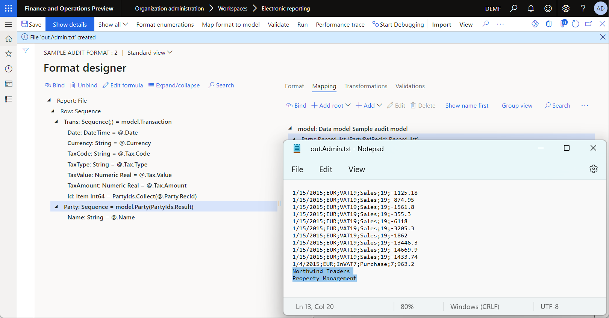
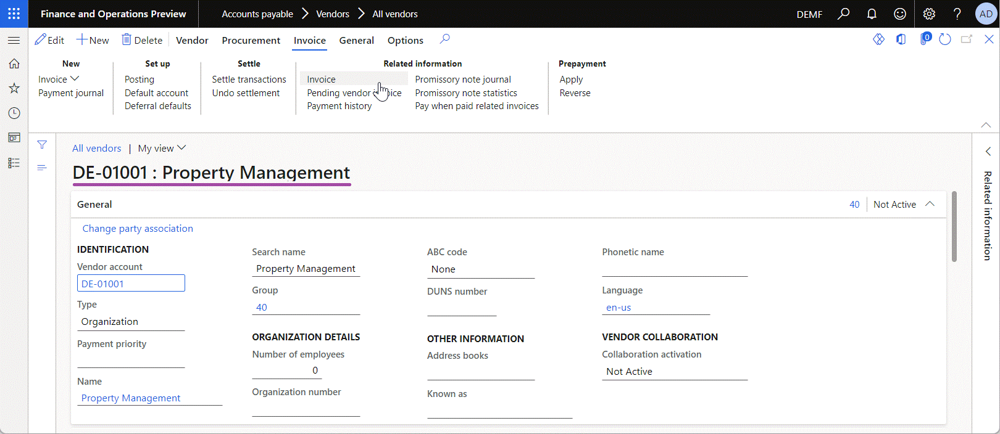

# Support parameterized calls of ER data models

[!include [banner](../includes/banner.md)]

To generate business documents, you configure an [Electronic reporting (ER)](general-electronic-reporting.md) solution that contains the following ER components:

- **[Format](er-overview-components.md#format-component)** – This component specifies the structure of a business document.
- **Format mapping** – This component controls how a business document is filled in at runtime.
- **[Model mapping](er-overview-components.md#model-mapping-component)** – This component specifies what the data pulls from the application into a format mapping.
- **[Data model](er-overview-components.md#data-model-component)** – This component passes information between individual components.

When you run an ER format, every format element is run, starting from the root format element. Whenever a format element that is run contains a binding to a [data source](general-electronic-reporting.md#configuring-data-model-mappings-for-outgoing-documents), the data source is run to deliver the expected data and use it to fill in the format element. When a data source of the *Model* type is called, the appropriate model mapping is called to pull data out of the application, based on the model mapping settings.

Previously, these model mapping calls could not be parameterized to make them dependent on the logic of the format that is run. Only the following data flow was supported.

<table>
<tbody>
<tr align="center">
<td>
<b>Format</b> 
Format&nbsp;element 
&nbsp;
</td>
<td>
<i>Binding</i> 
&gt;&nbsp;request&nbsp;&gt; 
&lt;&nbsp;value&nbsp;&lt;
</td>
<td><b>Format&nbsp;mapping</b> 
Data source 
&nbsp;
</td>
<td>
<i>Data&nbsp;model</i> 
&gt;&nbsp;request&nbsp;&gt; 
&lt;&nbsp;value&nbsp;&lt;
</td>
<td>
<b>Model&nbsp;mapping</b> 
Data&nbsp;source 
&nbsp;
</td>
<td>
<i>Binding</i> 
&gt;&nbsp;request&nbsp;&gt; 
&lt;&nbsp;value&nbsp;&lt;
</td>
<td>
<b>Table</b> 
Record 
Field
</td>
</tr>
</tbody>
</table>

However, in version 10.0.15 and later, you can configure data model fields that can be called only when the values of the configured parameters are provided. When such a field is configured and called from a format component, the required parameters must be provided in a format binding as arguments of the call. In these cases, the values of the arguments can be specified based on format-specific values. Therefore, you can use **dynamic runtime parametrization** for data model calls to support the following data flow.

<table>
<tbody>
<tr align="center">
<td>
<b>Format</b> 
Format&nbsp;element&nbsp;1 
 
Format&nbsp;element&nbsp;2 
&nbsp; 
&nbsp;
</td>
<td>
<i>Binding</i> 
&gt;&nbsp;request&nbsp;1&nbsp;&gt; 
&lt;&nbsp;value&nbsp;1&nbsp;&lt; 
&gt;&nbsp;request&nbsp;2&nbsp;&gt; 
&lt;&nbsp;value&nbsp;3&nbsp;&lt; 
&nbsp;
</td>
<td>
<b>Format&nbsp;mapping</b> 
Data&nbsp;source&nbsp;1 
&nbsp; 
<b>value2=Func(value1)</b> 
&nbsp; 
&nbsp;
</td>
<td>
<i>Data&nbsp;model</i> 
&gt;&nbsp;field1&nbsp;&gt; 
&lt;&nbsp;value&nbsp;1&nbsp;&lt; 
<b>&gt;&nbsp;field2(value2)&nbsp;&gt;</b> 
&lt;&nbsp;value&nbsp;3&nbsp;&lt; 
&nbsp;
</td>
<td>
<b>Model&nbsp;mapping</b> 
Data&nbsp;source&nbsp;1 
 
Data&nbsp;source&nbsp;2 
&nbsp; 
&nbsp;
</td>
<td>
<i>Binding</i> 
&gt;&nbsp;request&nbsp;1&nbsp;&gt; 
&lt;&nbsp;value&nbsp;1&nbsp;&lt; 
&gt;&nbsp;request&nbsp;2&nbsp;&gt; 
&lt;&nbsp;value&nbsp;3&nbsp;&lt; 
&nbsp;
</td>
<td>
<b>Table&nbsp;1</b> 
Record&nbsp;1 
Field&nbsp;1 
<b>Table&nbsp;2</b> 
Record&nbsp;2 
Field&nbsp;2
</td>
</tr>
</tbody>
</table>

The new functionality lets you parametrize the call to any data model field of the [*Record*](er-formula-supported-data-types-composite.md#record) or [*Record list*](er-formula-supported-data-types-composite.md#record-list) type. The following data types are supported for the parameters of a data model field:

- [Boolean](er-formula-supported-data-types-primitive.md#boolean)
- [Container](er-formula-supported-data-types-composite.md#container)
- [Date](er-formula-supported-data-types-primitive.md#date)
- [DateTime](er-formula-supported-data-types-primitive.md#datetime)
- [GUID](er-formula-supported-data-types-primitive.md#guid)
- [Int64](er-formula-supported-data-types-primitive.md#int64)
- [Integer](er-formula-supported-data-types-primitive.md#integer)
- [Real](er-formula-supported-data-types-primitive.md#real)
- [String](er-formula-supported-data-types-primitive.md#string)

You can specify every parameter of a data model field for which the argument can be provided as a single value of the defined data type and the [*list*](er-formula-supported-data-types-composite.md#record-list) of such values.

> [!NOTE]
> The default value for the parameter of a data model field isn't supported. If you add a parameter to a field in a data model, and the version of that data model has already been released and published, you must [rebase](general-electronic-reporting.md#upgrading-a-format-selecting-a-new-version-of-base-format-rebase) all corresponding model mappings and formats to the new version of this model, because this data model change isn't backward compatible.

You can configure parametrized data model fields to make model mapping calls format-specific. This approach can help you reduce the number of model mappings that must be configured for many formats of a single data model. You can also use this approach to improve the execution performance of your formats and reduce the time that is required to generate business documents. To learn more about this feature, complete the example in this article.

## Example: Use parameterized calls of ER data models

The following steps explain how a user in the System Administrator or Electronic Reporting Developer role can design an ER solution that contains a data model, a model mapping, and a format ER component that are configured to call a model mapping from a format by providing an argument for the call, the value of which has been calculated at runtime by using the formula of the running format. 

These steps can be completed in the **DEMF** company. No code modifications are required. 

In this example, you will create the required ER [configurations](general-electronic-reporting.md#Configuration) for the **Litware, Inc.** sample company. Make sure that the configuration provider for the **Litware, Inc.** (`http://www.litware.com`) sample company is listed for the ER framework, and that it's marked as **Active**. If this configuration provider isn't listed, or if it isn't marked as **Active**, follow the steps in [Create a configuration provider and mark it as active](tasks/er-configuration-provider-mark-it-active-2016-11.md).

### Business scenario

You have an ER solution that includes a format that you can run to generate an electronic document for audit purposes. This format contains tax transactions that are related to sales orders and purchase orders, and that have the required details, such as the transaction date and tax value. As of the new fiscal year, the structure of this document has changed. You must now submit an extended document that includes additional details (names) of all parties (customers and vendors) whose transactions are presented on generated reports. Therefore, you must modify your ER solution so that it generates documents that comply with this new requirement.

### Configure the ER framework

Follow the steps in [Configure the ER framework](er-quick-start2-customize-report.md#ConfigureFramework) to set up the minimal set of ER parameters. You must complete this setup before you start to use the ER framework to design a new ER solution.

### Design a domain-specific data model

You must create a new ER configuration that contains the required data model component. This data model will be used as a data source later, when you design an ER format to generate an audit report.

Follow these steps to import the required data model from an XML file that is provided by Microsoft.

1. Download the [Sample audit model.version.1.xml](https://download.microsoft.com/download/7/1/9/719b0132-fed7-4c73-8afa-90cac29c2fee/Sample-audit-model.version.1.xml) file, and save it to your local computer.
2. Go to **Organization administration** \> **Workspaces** \> **Electronic reporting**.
3. In the **Electronic reporting** workspace, select **Reporting configurations**.
4. On the **Configurations** page, on the Action Pane, select **Exchange** \> **Load from XML file**.
5. Select **Browse**, and then find and select the **Sample audit model.version.1.xml** file.
6. Select **OK** to import the configuration.

    

The following illustration shows the editable version of the configured data model on the **Data model designer** page.

Currently, the model is designed to expose only tax transactions that have the required details.

### Design a model mapping for the configured data model

As a user in the Electronic Reporting Developer role, you must create a new ER configuration that contains a model mapping component for the Sample audit data model. This component implements the configured data model for Microsoft Dynamics 365 Finance and is specific to that app. You must configure the model mapping component to specify the application objects that must be used to fill in the configured data model with application data at runtime. To complete this task, you must understand how the data structure of the tax business domain is implemented in Finance.

Follow these steps to import the required model mapping from an XML file that is provided by Microsoft.

1. Download the [Sample audit model mapping.version.1.1.xml](https://download.microsoft.com/download/c/0/3/c03a4673-b1b1-4ef8-96d0-bf96518be6e0/Sample-audit-model-mapping.version.1.1.xml) file, and save it to your local computer.
2. Go to **Organization administration** \> **Workspaces** \> **Electronic reporting**.
3. In the **Electronic reporting** workspace, select **Reporting configurations**.
4. On the **Configurations** page, on the Action Pane, select **Exchange** \> **Load from XML file**.
5. Select **Browse**, and then find and select the **Sample audit model mapping.version.1.1.xml** file.
6. Select **OK** to import the configuration.

    

The following illustration shows the editable version of the configured model mapping on the **Model mapping designer** page.

Currently, the model mapping is designed to expose tax transactions that have the required details. It fetches this information from the `TaxTrans` application table by using the configured `TaxTrans` and `TaxTransFiltered` ER data sources.

### Design a new format

As a user in the Electronic Reporting Functional Consultant role, you must create a new ER configuration that contains a format component. You must configure the format component to fill in generated reports with tax transactions that have all the required details.

Follow these steps to import the required format from an XML file that is provided by Microsoft.

1. Download the [Sample audit format.version.1.1.xml](https://download.microsoft.com/download/e/b/7/eb7e126e-2bb3-4bbb-a735-ffd4c48920b1/Sample-audit-format.version.1.1.xml) file, and save it to your local computer.
2. Go to **Organization administration** \> **Workspaces** \> **Electronic reporting**.
3. In the **Electronic reporting** workspace, select **Reporting configurations**.
4. On the **Configurations** page, on the Action Pane, select **Exchange** \> **Load from XML file**.
5. Select **Browse**, and then find and select the **Sample audit format.version.1.1.xml** file.
6. Select **OK** to import the configuration.

    

The following illustration shows the editable version of the configured format on the **Format designer** page.

The ER format is configured to generate a report as a text file in comma-separated values (CSV) format.

### Run the imported format

1. On the **Configurations** page, select the **Sample audit format** configuration, and then, on the Action Pane, select **Run**.
2. In the **Electronic report parameters** dialog box, on the **Records to include** tab, select **Filter**.
3. Specify the conditions to select the tax transactions of the **PIV-110000004** and **INV-10000001** vouchers.
4. Select **OK**.
5. Select **OK**.
6. Review the generated document that contains tax transactions of the selected vouchers.

    

### Adjust the imported ER solution

According to the new requirement, the document that you must submit must contain the names of customers and vendors whose transactions are included. Therefore, you must modify the imported ER solution so that it generates a document that complies with this new requirement.

Decide how you want to implement the required modifications of the imported ER components.

The obvious approach is to implement the following modifications:

- In your data model, add the new `Transaction.Party.Name` data model field of the *String* type.
- In your model mapping, configure the binding for the new data model field by using available table relations to access the relevant record of the `DirPartyTable` application table and fetch the value of the `Name` field from it.

Although this approach will work, it might cause performance issues in the SQL database, because `TaxTrans` is the transaction table and can therefore contain a large volume of records. In this case, the number of calls to `DirPartyTable` must equal the number of records in the `TaxTrans` table that can cause performance issues.

Alternatively, you might implement the following modifications:

- In your data model, add the new `Party` root and the new `Party.Name` field.
- In your model mapping, add a new data source that will join all the records of tables that are used in table relations to access the relevant record of the `DirPartyTable` application table, starting from the `TaxTrans` table.

Although this approach will work, it might cause some memory consumption issues. Even when a new [JOIN](er-join-data-sources.md) data source is run as a single SQL request to the application database to prevent database performance issues, the result must be fetched to the memory of the application server. Because the number of records and the number of fields in those records will be quite large, this approach might cause very heavy memory consumption. An out-of-memory runtime exception might even be thrown.

You can implement the modifications when a running format collects, in memory, the unique identification codes of customers and vendors for all tax transactions that will be presented on a generated report. Because only unique codes should be kept, the final set of codes won't be large enough to affect memory consumption. The set of codes will then be passed to the model mapping as the argument of another call of the data source of the *Model* type. Based on that call, the model mapping will run a new ER data source that makes a single SQL request to the application database to fetch, from the `DirPartyTable` table, records only for those parties whose codes are presented in the provided set of codes.

### Adjust the imported data model

1. Go to **Organization administration** \> **Electronic reporting** \> **Configurations**.
2. On the **Configurations** page, in the configurations tree in the left pane, select **Sample audit model**.
3. On the **Versions** FastTab, select version **2** that has a status of **Draft**.
4. Select the **Configuration components** FastTab.
5. Select **Designer** to open the data model for editing.
6. On the **Data model** page, make sure that the `Root` field is selected, and then select **New**.
7. In the drop-down dialog box, follow these steps:

    1. In the **New node as** field group, select the **Child of an active node** option.
    2. In the **Name** field, enter **Party**.
    3. In the **Item type** field, select **Record list**.
    4. Select **Add** to finish adding the new field.

8. Make sure that the `Root.Party` field is selected, and then, on the **Node** tab, select **Parameters**.
9. In the **Parameters** dialog box, follow these steps:

    1. On the **Parameters** tab, select **New**.
    2. In the **Name** field, enter **PartyRefRecId**.
    3. In the **Type** field, select **Int64**.
    4. Select the **List** checkbox.
    5. Select **OK** to finish entering the parameters.

    > [!NOTE]
    > You just configured the `Root.Party` data model field as a field that is called when a value is provided in the **PartyRefRecId** parameter. This value must be present in the list of records that contain a `Value` field of the *Int64* data type.

    

10. Make sure that the `Root.Party` field is still selected, and then select **New**.
11. In the drop-down dialog box, follow these steps:

    1. In the **New node as** field group, select the **Child of an active node** option.
    2. In the **Name** field, enter **Name**.
    3. In the **Item type** field, select **String**.
    4. Select **Add** to finish adding the new field.

12. Select **Save**, and close the **Data model** page.

    

13. On the **Versions** FastTab, for version **2**, select **Change status** \> **Complete**. Then select **OK**.

    > [!NOTE]
    > Your data model changes are stored in the second revision of the **Sample audit model** data model component that is located in the second version of the **Sample audit model** ER configuration.

### Adjust the imported model mapping

1. On the **Configurations** page, in the configurations tree in the left pane, expand **Sample audit model**.
2. Select **Sample audit model mapping**, and then, on the **Versions** FastTab, select the second mapping version that is based on the first data model version (version **1.2**), and that has a status of **Draft**.
3. Select **Rebase**.
4. In the **Target version** field, leave version **2** of the **Sample audit model** base model.
5. Select **OK** to rebase and align your model mapping with recent data model changes.

    Notice that the version number of your editable model mapping has changed from **1.2** to **2.2** to indicate that the second model version is currently used as a base.

6. Select **Designer**.
7. On the **Model to datasource mapping** page, select **Designer** for the current model mapping.
8. Follow these steps to add a new data source to access the `DirPartyTable` application table:

    1. In the **Data source type** pane, select **Dynamics 365 for Operations \> Table records**.
    2. In the **Data sources** pane, select **Add root**.
    3. In the **Name** field, enter **PartyTable**.
    4. In the **Table** field, enter **DirPartyTable**.
    5. Select **OK** to finish adding the new data source.

9. Follow these steps to add a new data source to request `DirPartyTable` records, based on the provided list of record identification codes:

    1. In the **Data source type** pane, select **General \> Empty container**.
    2. In the **Data sources** pane, select **Add root**.
    3. In the **Name** field, enter **Data**.
    4. Select **OK** to finish adding the new data source.
    5. In the **Data sources** pane, select the **Data** data source.
    6. In the **Data source type** pane, select **Functions \> Calculated field**.
    7. In the **Data sources** pane, select **Add**.
    8. In the **Name** field, enter **DirParty**.
    9. Select **Edit formula**.
    10. On the **Formula designer** page, select **Parameters**.
    11. In the **Parameters** dialog box, follow these steps:

        1. On the **Parameters** tab, select **New**.
        2. In the **Name** field, enter **DirPartyId**.
        3. In the **Type** field, select **Int64**.
        4. Select the **List** checkbox.
        5. Select **OK**.

        > [!NOTE]
        > You just configured this calculated field so that it will accept, at runtime, the argument of a single parameter that is configured as a record list that has a single `Value` field of the *Int64* type.

    12. In the **Formula** field, enter the following expression:

        `FILTER(PartyTable, VALUEINLARGE(PartyTable.RecId, DirPartyId, DirPartyId.Value))`

        > [!NOTE]
        > You just configured the `DirParty` calculated field to fetch only `DirPartyTable` records where the record identification codes are included in the `DirPartyId` list that is provided as an argument when the `DirParty` field is called.

        

    13. Select **Save**, and close the **Formula designer** page.
    14. Select **Save**, and then select **OK** to finish adding the new data source.

10. Follow these steps to bind the new data source to the new data model field, so that the data model is used to expose party names:

    1. In the **Data model** pane, select the `Root.Party` data model field.
    2. In the **Data model** pane, select **Edit**.
    3. On the **Formula designer** page, in the **Formula** field, enter the expression `Data.DirParty(PartyRefRecId)`.
    4. Select **Save**, and close the **Formula designer** page.

        > [!NOTE]
        > You just configured the binding to call the configured `Data.DirParty` data source and provide the list of record identification codes that will be specified in the format when the `Root.Party` data model field is called.

    5. In the **Data model** pane, select the `Root.Party.Name` data model field.
    6. In the **Data model** pane, select **Edit**.
    7. On the **Formula designer** page, in the **Data source** pane, expand **Data \> DirParty**, and select **Name**.
    8. Select **Add data source**.
    9. Select **Save**, and close the **Formula designer** page.

    

11. Select **Save**, and close the **Model mapping designer** page.
12. Close the **Model to datasource mapping** page.
13. On the **Versions** FastTab, for version **2.2**, select **Change status \> Complete**. Then select **OK**.

### Adjust the imported format

1. On the **Configurations** page, select **Sample audit format**.
2. On the **Versions** FastTab, select version **1.2** that has a status of **Draft**.
3. Select **Rebase**.
4. In the **Target version** field, leave version **2** of the **Sample audit model** base model.
5. Select **OK** to rebase and align your format with the recent data model changes.
6. Select **Designer**.
7. On the **Format designer** page, in the format structure tree in the left pane, select **Expand/Collapse**.
8. Follow these steps to add a new format element to collect record identification codes of parties whose transactions are presented on generated reports.

    1. In the format structure tree, select the **Report.Row.Trans** sequence element.
    2. Select **Add**.
    3. In the **Add** dialog box, select **Data source \> Item**.
    4. In the **Component properties** dialog box, in the **Name** field, enter **Id**.
    5. In the **Data type** field, select **Int64**.
    6. Select **OK**.

    > [!NOTE]
    > A **Data source \> Item** element can be used to perform internal calculations and data transformation only in the scope of the running format. Therefore, by adding this format element, you don't change the content of a generated document.

9. Follow these steps to add new format elements to enter party names on generated reports:

    1. Select the **Report.Row** sequence element.
    2. Select **Add**.
    3. In the **Add** dialog box, select **Text \> Sequence**.
    4. In the **Component properties** dialog box, in the **Name** field, enter **Party**.
    5. Select **OK**.
    6. Select the **Report.Row.Party** sequence element.
    7. Select **Add**.
    8. In the **Add** dialog box, select **Text \> String**.
    9. In the **Component properties** dialog box, in the **Name** field, enter **Name**.
    10. Select **OK**.

10. Follow these steps to add a new data source to collect record identification codes of parties whose transactions are presented on generated reports:

    1. On the **Mapping** tab, select **Add root**.
    2. In the **Add data source** dialog box, select **Functions \> Data collection**.
    3. In the **'Data collection' data source properties** dialog box, in the **Name** field, enter **PartyIds**.
    4. In the **Item type** field, select **Int64**.
    5. Select **OK**.

11. Follow these steps to add a new binding to collect record identification codes of parties whose transactions are presented on generated reports:

    1. In the format structure tree, select the **Report.Row.Trans.Id** data item element.
    2. Select **Edit formula**.
    3. On the **Formula designer** page, enter the expression `PartyIds.Collect(model.Transaction.Party.RecId)`.
    4. Select **Save**, and close the **Formula designer** page.

12. Follow these steps to add new bindings to enter party names on generated reports:

    1. In the format structure tree, select the **Report.Party** sequence element.
    2. Select **Edit formula**.
    3. On the **Formula designer** page, enter the expression `model.Party(PartyIds.Result)`.
    4. Select **Save**, and close the **Formula designer** page.
    5. In the format structure tree, select the **Report.Party.Name** sequence element.
    6. On the **Mapping** tab, select the `model.Party.Name` data model field.
    7. Select **Bind**.

    

13. Select **Save**, and close the **Format designer** page.
14. Close the **Model to datasource mapping** page.
15. On the **Versions** FastTab, for version **2.2**, select **Change status** \> **Complete**. Then select **OK**.

### Run the adjusted format

1. On the **Configurations** page, select **Sample audit format**, and then, on the Action Pane, select **Run**.
2. In the **Electronic report parameters** dialog box, on the **Records to include** tab, select **Filter**.
3. Specify the conditions to select tax transactions of the **PIV-110000004** and **INV-10000001** vouchers.
4. Select **OK**.
5. Select **OK**.
6. Review the generated document that contains tax transactions of the selected vouchers and the names of the corresponding customer and vendor.

    

7. Go to **Accounts payable** \> **Vendors** \> **All vendors**, and review the details of the selected **PIV-110000004** voucher, including the vendor name.

    

8. Go to **Accounts receivable** \> **Customers** \> **All customers**, and review the details of the selected **INV-10000001** voucher, including the customer name.

    

For more details about this execution of the ER solution, use the ER built-in [performance trace](trace-execution-er-troubleshoot-perf.md) parser.

## Additional resources

- [Support parameterized calls of ER data sources of the Calculated field type](er-calculated-field-type.md)
- [Trace the execution of ER formats to troubleshoot performance issues](trace-execution-er-troubleshoot-perf.md)
- [Use DATA COLLECTION data sources in Electronic reporting formats](er-data-collection-data-sources.md)
- [ValueInLarge ER function](er-functions-logical-valueinlarge.md)

[!INCLUDE[footer-include](../../../includes/footer-banner.md)]
