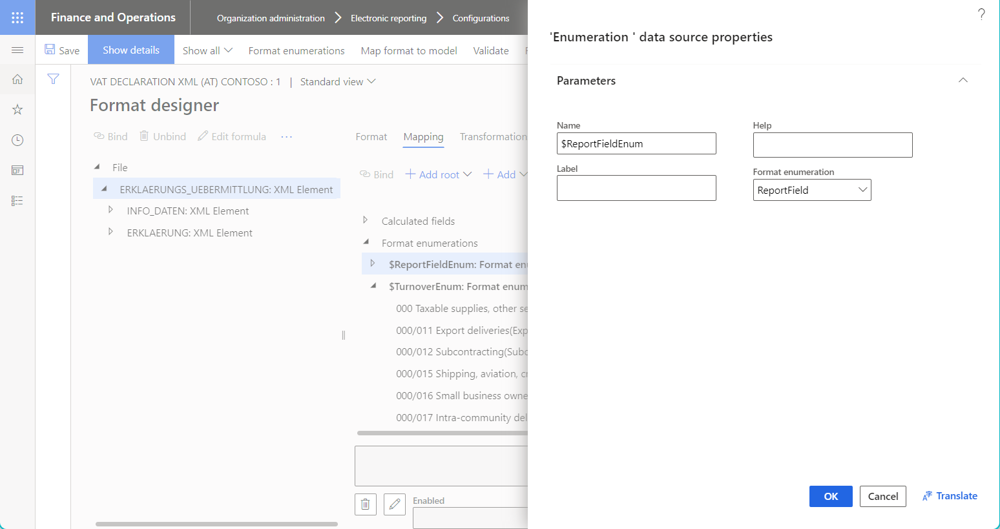
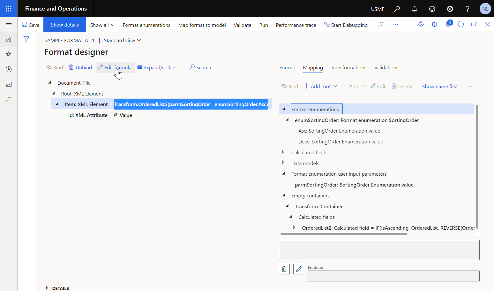
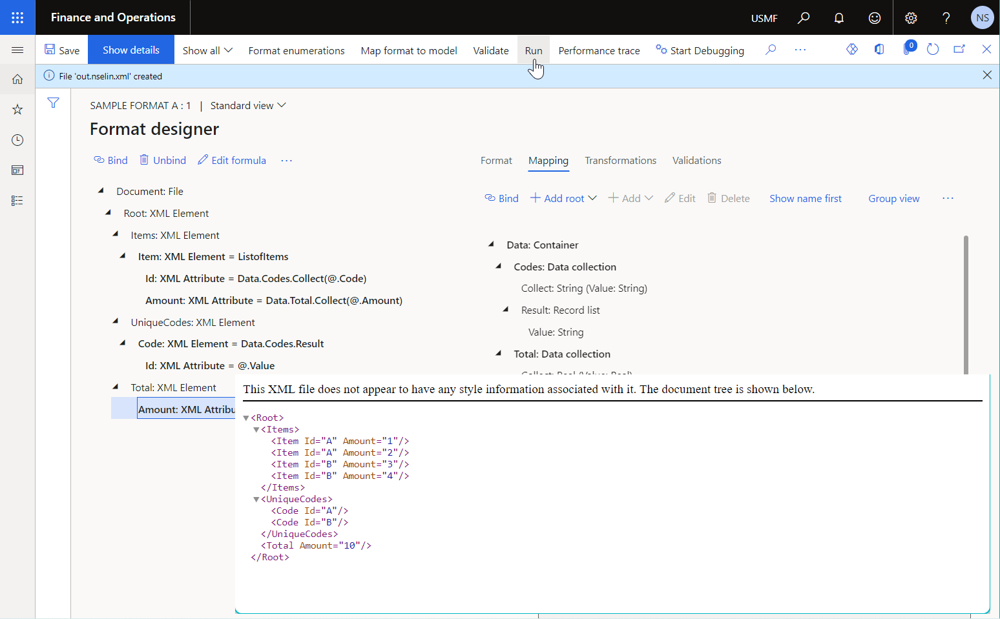

# Supported data source types for ER components

[!include[banner](../includes/banner.md)]

You can use the [Electronic reporting (ER)](general-electronic-reporting.md) framework to design an ER solution that you can run in the Microsoft Dynamics 365 Finance application to [generate](er-overview-components.md#format-components-for-outgoing-electronic-documents) an outbound business document or [parse](er-overview-components.md#format-components-for-incoming-electronic-documents) an inbound business document. To fill in a generated document with application data or update the application database by using data from an inbound business document, configure your ER solution to specify how the data should be fetched from the appropriate data storage, transformed in accordance with the layout of the processed document, and formatted based on specific requirements. To specify data fetching, transformation, and formatting, use different types of ER data sources. The following ER data source types are currently supported for Finance:

- [Data model](#data-model-group)

    - [Data model](#data-model)
    - [Enumeration](#model-enumeration)
    - [Enumeration user input parameter](#model-enumeration-user-input-parameter)
    - [Lookup](#model-enumeration-lookup)

- [Dynamics 365 application (Finance)](#dynamics-365-finance-group)

    - [Class](#class)
    - [Enumeration](#enumeration)
    - [Lookup](#lookup)
    - [Number sequence](#number-sequence)
    - [Object](#object)
    - [Table](#table)
    - [Table records](#table-records)

- [Format](#format-group)

    - [Export format](#export-format)
    - [Import format](#import-format)

- [Format enumeration](#format-enumeration-group)

    - [Enumeration](#format-enumeration)
    - [Enumeration user input parameter](#format-enumeration-user-input-parameter)
    - [Lookup](#format-enumeration-lookup)

- [Functions](#functions-group)

    - [Barcode](#barcode)
    - [Calculated field](#calculated-field)
    - [Data collection](#data-collection)
    - [Financial dimensions details](#financial-dimensions-details)
    - [Group by](#group-by)
    - [Inventory dimensions details](#inventory-dimensions-details)
    - [Join](#join)
    - [Table metadata](#table-metadata)

- [General](#general-group)

    - [Empty container](#empty-container)
    - [Endless list](#endless-list)
    - [User input parameter](#user-input-parameter)

This article provides a summary of the ER data source types.

## Add a new data source

You can configure ER data sources in the ER [model mapping](er-overview-components.md#model-mapping-component) and ER [format](er-overview-components.md#format-component) components of your ER solution for data fetching, transformation, and formatting. You can then bind configured data sources with data consumers. Data consumers include a [data model](er-overview-components.md#data-model-component) of the designed ER model mapping or format elements of the designed ER format.

Select a more convenient grouping mode to quickly discover a data source that you want to review or modify.

- When the **Group view** toggle button on the **Model mapping designer** or **Format designer** page is turned on, the configured data sources are grouped by the data source type.

    

- When the **Group view** toggle button is turned off, the data sources are sorted in alphabetical order.

    

You can filter the list of configured data sources by selecting the more appropriate view mode on the **Model mapping designer** or **Format designer** page:

- Select **Show all** to list all configured data sources.
- Select **Show mapped only** to list only the data sources that are explicitly used in configured bindings.
- Select **Show not-mapped only** to list only the data sources that aren't used in configured bindings.

### Model mapping designer

To add a new data source, select the desired data source type in the **Data source types** pane on the left side of the **Model mapping designer** page. This pane shows the tree of supported ER data sources.

The **Data sources** pane in the middle of the page shows the data sources that have already been added to the current model mapping. Use the **Add root** and **Add** buttons to add a new data source entry.

- To add a new top-level data source, select **Add root**.
- To add a new child data source, in the **Data sources** pane, select an existing data source as the parent node to add the new data source to. Then select **Add**.

The following illustration shows the addition of a new child data source of the *Enumeration* type.

> [!TIP]
> To free up space so that you can enlarge the **Data sources** and **Data model** panes, select the arrow next to the **Data source types** heading in the left pane to collapse the tree. The whole pane is then collapsed.
>
> 

### Format designer

The **Mapping** tab of the **Format designer** page shows the data sources that have already been added to the current format. Use the **Add root** and **Add** buttons to add a new data source entry.

- To add a new top-level data source, select **Add root**. Then, in the **Add data source** dialog box, select the desired data source type.
- To add a new child data source, select an existing data source as the parent node to add the new data source to, and select **Add**. Then, in the **Add data source** dialog box, select the desired data source type.

The following illustration shows the addition of a new top-level data source of the *Data model \> Enumeration* type.

> [!NOTE]
> Be aware that the following data source types are available for selection only when the **Show details** toggle button on the **Format designer** page is turned on:
>
> - Class
> - Object
> - Table
> - Table records

## Common properties of ER data sources

The properties that are described in this section can be specified for any data source type.

### Name property

Because data source names must be unique in an ER component, the **Name** property is mandatory. Use this property to uniquely identify the added data source in the configured ER component.

### Label property

The **Label** property is optional. Use it to specify an alternative name for the data source. To specify language-dependent text for the label of the editable data source, select **Translate**. When the label is [translated](er-design-multilingual-reports.md#entry), it's presented on the **Model mapping designer** or **Format designer** page in the preferred language of the current user.

> [!TIP]
> Turn the **Show name first** toggle button on the **Model mapping designer** or **Format designer** page on or off to sort data sources by name or label.

When this property is specified for a data source that's used to let you enter information in a data entry field, the specified label is used as the prompt text for that data entry field. When the label is translated, the prompt text for the data entry field is presented in your preferred language, or the preferred language of the current user.

### Help property

The **Help** property is optional. Use it to specify a description of the data source. To specify language-dependent text for the description of the editable data source, select **Translate**. When the description is translated, it's presented at the bottom of the **Model mapping designer** or **Format designer** page in the preferred language.

The following illustration shows the entry of data source properties on the **Format designer** page.

## Data model group

You can configure data sources of different types that represent a data model that has been selected as the basis for the editable ER model mapping or ER format component. This section provides a summary of the properties that are common to all types of ER data sources that belong to the **Data model** group.

### Model property

The mandatory **Model** property references the ER data model component that specifies the structure of this data source.

### Definition property

The optional **Definition** property points to a single root element of the selected ER data model component to specify what part of the referenced ER data model is used in this data source.

> [!TIP]
> The **Definition** property can be left blank if the default root definition has been specified in the referenced data model.

### Version property

The optional **Version** property is used to specify the revision of the data model component of this data source. To review the list of data model revisions that are available in the current Finance instance, expand the **Versions** FastTab on the **Configurations** page for the appropriate data model configurations.

> [!TIP]
> Leave this property blank to use a data model component from the configuration [version](er-overview-components.md#component-versioning) that's in the **Draft** status. In this way, you can simultaneously edit your ER model mapping or ER format and its base data model.

> [!IMPORTANT]
> This property must be specified when the status of the editable configuration is changed from **Draft** to **Completed**. If you change the structure of the draft data model and use your changes in the edited ER model mapping or ER format, change the status of the edited base data model configuration version from **Draft** to **Completed** before you make the same change for the edited configuration version of the ER model mapping or ER format. Otherwise, a [Path not found](er-components-inspections.md#i3) exception will be thrown when you try to complete the draft version of the edited ER model mapping or ER format configuration.

### Data model

The **Data model** data source represents the ER data model component that's filled in by actual data at runtime when a data consumer request occurs.

> [!TIP]
> This data source is automatically added for any ER format component that's created to generate an outbound document.

The following illustration shows the properties for a data source of the *Data model* type in the **Data source properties** dialog box.

### Model enumeration

The **Data model enumeration** data source represents the enumeration of the base data model. It's usually required when you configure an ER [expression](er-formula-language.md) to compare the value of a data model field with a specific enumeration value.

The mandatory **Model enumeration** property points to a data model enumeration of the selected ER data model component to specify what values of the referenced ER data model enumeration are used in this data source.

The following illustration shows the properties for a data source of the *Model enumeration* type in the **Data source properties** dialog box.

### Model enumeration user input parameter

The **Model enumeration user input parameter** data source represents the enumeration of the base data model. It's usually required when you want the value of the referenced enumeration that's specified in the related data entry field in the dialog box at runtime, before the ER format is run.

The mandatory **Model enumeration** property points to a data model enumeration of the selected ER data model component to specify what values of the referenced ER data model enumeration are returned by this data source.

The **Allow multiple selection** property identifies whether you can specify a single value or multiple values of the referenced enumeration.

Use the **Read only** property to configure an ER expression and specify whether the appropriate data entry field in the dialog box is editable at runtime.

Use the **Default value** property to configure an ER expression that specifies the default value for the appropriate data entry field in the dialog box at runtime.

The **Always reset to default value** property identifies whether the value that's returned by the **Default value** ER expression should always be used as the default value, regardless of the previously used value.

Use the **Edit visibility** function to configure an ER expression that will specify, at runtime, whether the appropriate data entry field should be shown in the dialog box at runtime.

- If this expression is configured and returns *[False](er-formula-supported-data-types-primitive.md#boolean)* at runtime, the appropriate data entry field in the dialog box is hidden.
- Otherwise, the appropriate data entry field is visible in the dialog box at runtime.

To learn more, see [Use USER INPUT PARAMETER data sources to specify parameters for a report](er-user-input-parameter-data-sources.md).

### Model enumeration lookup

You can use the **Model enumeration lookup** data source to configure an ER data source of the *Lookup* type that returns the values of an ER data model enumeration. 

> [!NOTE]
> The **Model enumeration lookup** data source can be configured only for an ER format component.

Configure a data source of the *Model enumeration lookup* type to filter data in an ER format so that it's based on a set of abstract rules. You can then specify real rules outside the ER component designers by using the user interface (UI) that's automatically generated based on the settings of the **Lookup** data source of the corresponding ER format and the current legal entity data. When this ER format is run, the specified rules will be accessed by the ER format's **Lookup** data source.

The mandatory **Model enumeration** property of the **Model enumeration lookup** data source points to a data model enumeration of the base ER data model component to specify what values of the referenced ER data model enumeration are returned by this data source.

The **Cross-company** property identifies whether you plan to use the configured data source to evaluate the data of multiple companies at runtime.

The **Extended** property reveals additional methods for accessing values of the configured data source.

To learn more, see [Configure Lookup data sources to use ER application-specific parameters](er-lookup-data-sources.md).

## Format enumeration group

You can configure different data source types that represent the editable format component and return values of an enumeration of that format. This section provides a summary of the properties that are common to all types of ER data sources that belong to the **Format enumeration** group.

> [!NOTE]
> Data sources of the **Format enumeration** group can be configured only for an ER format component.

The mandatory **Enumeration** property references an ER format enumeration whose value is returned by the configured data source.

### Format enumeration

The **Format enumeration** data source represents the enumeration of the editable format.

- On the **Format enumeration** FastTab, select **Add** to add a new format enumeration.
- On the **Format enumeration values** FastTab, select **Add** to add a new value for the selected format enumeration.

> [!TIP]
> The **Label** and **Help** properties of format enumerations and format enumeration values are translatable.

The following illustration shows a format enumeration that has been configured for the editable format component.

This data source is usually required when you configure an ER expression to compare a specific format enumeration value with a value of the relevant enumeration that another data source returns.

The following illustration shows the properties for a data source of the *Format enumeration* type in the **Data source properties** dialog box.

### Format enumeration user input parameter

The **Format enumeration user input parameter** data source represents the enumeration of the editable format. It's usually required when you want to specify a value of the referenced enumeration in the related data entry field in the dialog box at runtime, before an ER format is run.

The mandatory **Format enumeration** property of **Format enumeration user input parameter** data source points to an enumeration of the editable format to specify what values of the referred format enumeration are returned by this data source.

The **Allow multiple selection**, **Read only**, **Default value**, and **Always reset to default value** properties are set as described earlier for the *[Model enumeration user input parameter](#model-enumeration-user-input-parameter)* data source type.

> [!TIP]
> If you leave the **Label** or **Help** property blank for a data source of the *Format enumeration user input parameter* type, the appropriate property of the referenced format enumeration will be used, if it has been configured. 

The following illustration shows an ER expression that's configured to enable an ER format element, depending on the result of comparison of values of data sources of the *Format enumeration user input parameter* and *Format enumeration* types.

### Format enumeration lookup

You can use the **Format enumeration lookup** data source to configure an ER data source of the *Lookup* type to return the values of an ER format enumeration. 

Configure a data source of the *Format enumeration lookup* type to filter data in an ER format so that it's based on a set of abstract rules. You can then specify real rules outside the ER component designers by using the UI that's automatically generated based on the settings of the **Lookup** data source of the corresponding ER format and the current legal entity data. Eventually, when this ER format is run, the specified rules will be accessed by the ER format's **Lookup** data source.

The mandatory **Format enumeration** property of the **Format enumeration lookup** data source points to a format enumeration of the editable format to specify what values of the referenced format enumeration are returned by this data source.

The **Cross-company** and **Extended** properties are set as described earlier for the *[Model enumeration lookup](#model-enumeration-lookup)* data source type.

## Format group

### Export format

You can use the **Export format** data source to run another ER format in the scope of the execution of the editable format. Therefore, the execution results of the nested ER format can be used as a data source for the execution of the editable ER format.

Use the mandatory **Format** property to specify an ER format that must be executed in the scope of the execution of the editable format.

### Import format

You can use the **Import format** data source to parse an inbound business document. The results of the inbound document parsing can then be used in the format mapping to fill a data model.

Use the mandatory **Format** property to specify an ER format that must be used for inbound document parsing.

The following illustration shows the ER format that's configured to parse an inbound document in XML format.

The following illustration shows the model mapping that contains a data source of the *Import format* type to expose data of a parsed inbound document and then use that data to fill a data model.

To learn more, see [Parse incoming documents](er-parse-incoming-documents.md).

## Dynamics 365 Finance group

### Class

You can use the **[Class](er-formula-supported-data-types-composite.md#class)** data source to call a static method of a public class from your ER solution. Argument values for calling classes can be dynamically defined at runtime. To invoke a class, configure a data source of the *Calculated field* type so that it has an expression that references the desired class of application source code. To learn more, complete the procedures in [Design ER expressions to call application class methods](./tasks/design-expressions-app-class-er.md).

You can add a data source of the *Class* type in the editable **Model mapping** component. If you identify the editable model mapping as the preferred one for execution, set the **Integration point** option of the **Class** data source to **Yes**. To learn more about this option, see [API to run a format mapping for the generation of outbound documents](er-apis-app10-0-11.md#api-to-run-a-format-mapping-for-the-generation-of-outbound-documents).

### Object

You can use the **[Object](er-formula-supported-data-types-composite.md#object)** data source to call a public method of a class instance from your ER solution. Argument values for calling classes can be dynamically defined at runtime. To invoke a class, configure a data source of the *Calculated field* type so that it has an expression that references the desired class of application source code.

You can add a data source of the *Object* type in the editable **Model mapping** component. If you identify the editable model mapping as the preferred one for execution at runtime, set the **Integration point** option of this **Object** data source to **Yes**.

### Enumeration

The **Enumeration** data source represents the application enumeration. This data source is usually required when you configure an ER expression to compare a specific application enumeration value with a value of the relevant enumeration that another data source returns.

Use the mandatory **Enumeration** property to specify an application enumeration.

The following illustration shows the properties for a data source of the *Application enumeration* type in the **Data source properties** dialog box.

### Application enumeration lookup

You can use the **Application enumeration lookup** data source to configure an ER data source of the *Lookup* type to return the values of an application enumeration. 

Configure a data source of the *Application enumeration lookup* type to filter data in an ER format so that it's based on a set of abstract rules. You can then specify real rules outside the ER component designers by using the UI that's automatically generated based on the settings of the **Lookup** data source of the corresponding ER format and the current legal entity data. Eventually, when this ER format is run, the specified rules will be accessed by the ER format's **Lookup** data source.

The mandatory **Operations data type name (EDT, enum)** property of the **Application enumeration lookup** data source points to an application enumeration or an application [extended data type (EDT)](../extensibility/extensible-edts.md) to specify what values are returned by this data source.

The **Cross-company** and **Extended** properties are set as described earlier for the *[Model enumeration lookup](#model-enumeration-lookup)* data source type.

### Number sequence

You can use the **Number sequence** data source to return a value of the referenced number sequence of the current application instance. Then, whenever a data consumer calls this data source, the referenced number sequence is incremented, and the received value is [returned](#num-sequence-data-source-sample).

The mandatory **Number sequence code** property must be specified to identify the required number sequence.

In addition to **Number sequence** data sources, you can use the built-in ER **[NUMSEQVALUE](er-functions-other-numseqvalue.md)** function.

### Table

You can use the **Table** data source to call static methods of an application table, entity, or view in the same way that you call static methods of an application class, as described earlier.

The mandatory **Table** property must be specified to identify the required table, entity, or view.

### Table records

You can use the **Table records** data source to fetch records of an application table, entity, or view.

The mandatory **Table** property must be specified to identify the required table, entity, or view.

If the table, entity, or view that you reference in the **Table** property keeps records company-specific, it's important that you specify the **Cross-company** property.

- Set this property to **No** to fetch records only of the company that an ER solution is run in scope of.
- Set this property to **Yes** to fetch records of all companies of the current application instance.

Set the **Ask for query** option to **Yes** to enable the system query dialog box at runtime, so that users can filter data for the configured data source. To learn more, see [Cross-company data sources in Electronic reporting (ER)](er-cross-company-data-sources.md).

If you identify the editable model mapping as the preferred one for execution, set the **Integration point** option to **Yes**.

Use the **Select fields** function to limit the list of fields whose values will be fetched at runtime. To learn more, see [Improve performance of ER solutions by reducing the number of table fields that are fetched at runtime](er-reduce-fetched-fields-number.md).

Use the **Refill table** function whenever you add or update Application Object Tree (AOT) artifacts. This function resembles the **[Rebuild table references](electronic-reporting-er-configure-parameters.md#optional-setup-for-er)** function.

## General group

### Empty container

You can use the **Empty container** data source as the container for other data sources. You can use it to organize your data sources, or to make groups of data sources of different types, for specific purposes, and so on.

In addition, you can use an **Empty container** data source as the mockup of the desired record. Then, by using the **[LIST](er-functions-list-list.md#example)** function, you can limit the list of fields for the final list of records.

### Endless list

You can configure an ER format to split generated XML output into multiple files whenever specific limits are exceeded. Use the **Endless list** data source to uniquely name those outbound files.

The following illustration shows a sample ER format that's configured to generate zipped XML output that must be split into multiple files.

The following illustrations show the bindings of the sample ER format:

- The **Item** format element is bound to the `ListofItems` data source that returns three records. The **Maximal number of elements per file** property of this format element is configured to split generated output into multiple XML files, each of which must contain only one `Item` XML node.

    

- The **File parameters list** property of the **File** format element references the `Parms` data source of the *Endless list* type to ensure that this data source is invoked whenever the output split occurs. Because the `Parms` data source contains the nested `NumSequence` data source of the *[Number sequence](#number-sequence)* type, the application number sequence that's referenced in `NumSequence` is also iterated for each split. Therefore, the `Parms.NumSequence` ER expression that's configured in the **File name** property of the **File** component generates a unique name for each output file, based on the current value of the referenced number sequence.

    

The following illustration shows the result of running the previously described sample ER format. The result represents a zip file that contains XML output that has been split into three uniquely named XML files.

To learn more, see [Split generated XML files based on file size and content quantity](er-split-files.md).

### User input parameter

You can use a data source of the *User input parameter* type to let users specify a value of the referenced application enumeration or application EDT in the related data entry field in the dialog box at runtime, before an ER format is run.

The mandatory **Operations data type name (EDT, enum)** property of the **User input parameter** data source points to an application enumeration or an application EDT to specify what values are returned by this data source.

The **Allow multiple selection**, **Read only**, **Default value**, and **Always reset to default value** properties are set as described earlier for the *[Model enumeration user input parameter](#model-enumeration-user-input-parameter)* data source type.

Use the **Edit visibility** function for the *[Model enumeration user input parameter](#model-enumeration-user-input-parameter)* data source type.

## Functions group

### Barcode

Use a data source of the *Barcode* type to generate an image that represents the bar code for specified text. 

The mandatory **Barcode format** property of the **Barcode** data source specifies the bar code type. The following bar code formats are currently supported:

- One-dimensional bar codes:

    - Codabar
    - Code 39
    - Code 93
    - Code 128
    - EAN-8
    - EAN-13
    - ITF-14
    - Intelligent Mail
    - MSI
    - Plessey
    - PDF417
    - UPC-A
    - UPC-E

- Two-dimensional bar codes:

    - Aztec
    - Data Matrix
    - QR Code

The optional **Width** property specifies the bar code's width in pixels. A value of **0** (zero) indicates that the default width is used. The meaning can vary for different formats.

The optional **Height** property specifies the bar code's height in pixels. A value of **0** (zero) indicates that the default height is used. The meaning can vary for different formats.

The optional **Margin** property specifies the size of the bar code's margin in pixels. The margin is the area on each side of a bar code that must be kept clear (quiet zone). A value of **0** (zero) indicates that the default margin is used. The meaning can vary for different formats.

The **Output content** option specifies whether a bar code image contains the encoded information as text. Set this option to **Yes** to generate a bar code image that contains the encoded information as text. The default value is **No**.

The mandatory **Encoding** property specifies the type of characters that are encoded in the generated bar code image. By default, the **UTF-8** encoding is used.

> [!IMPORTANT]
> When you add a new **Barcode** data source, place it under another item (container) as a nested element. The **Barcode** data source will be represented in the configured ER component as a function that has the **Value** parameter of the *[String](er-formula-supported-data-types-primitive.md#string)* type. Provide the bar code text as the argument of this parameter.

To learn more, see [Use Barcode data sources to generate bar code images](er-barcode-data-sources.md).

### Calculated field

Use a data source of the *Calculated field* type to configure an ER expression for transforming values of other data sources.

Use the **Edit formula** function to configure an ER expression of the editable data source of the *Calculated field* type.

> [!TIP]
> Turn on the **Show details** toggle button to preview configured expressions for data sources of the *Calculated field* type in the **Data sources** pane of the **Model mapping designer** page and on the **Mapping** tab of the **Format designer** page.

The following illustration shows the **Calculated field** data source that has been configured to sort the initially provided list of records in alphabetic order.

When you add a new **Calculated field** data source by placing it under another item as a nested element, you can specify multiple parameters that you can then reference in the configured ER expression. You can also configure other formulas to call this data source. In this way, you can control the values of arguments of those parameters. Therefore, you can reuse a single data source in many bindings and reduce the total number of data sources that must be configured in an ER model mapping or ER format component.

The following illustration shows the **Calculated field** data source that has been configured to sort the initially provided list of records according to the sort direction that's specified at runtime.

The sort order of this data source is specified by using the value of the argument of the data source parameter.

To learn more, see [Support parameterized calls of ER data sources of the Calculated field type](er-calculated-field-type.md).

### Data collection

You can configure an ER model mapping or an ER format to process specific elements, such as records of a model mapping data source or format elements, in a specific order. Additionally, you can configure a data source of the *Data collection* type to collect, during element processing at runtime, values of data model fields or values of bindings of the processed format elements, and then sum those values. The data source then uses the collected values to fill in a generated document or do additional calculations.

The mandatory **Item type** property of the **Data collection** data source specifies the type of collected data. The following data types are currently supported:

- *[Boolean](er-formula-supported-data-types-primitive.md#boolean)*
- *[Date](er-formula-supported-data-types-primitive.md#date)*
- *[DateTime](er-formula-supported-data-types-primitive.md#datetime)*
- *[GUID](er-formula-supported-data-types-primitive.md#guid)*
- *[Int64](er-formula-supported-data-types-primitive.md#int64)*
- *[Integer](er-formula-supported-data-types-primitive.md#integer)*
- *[Real](er-formula-supported-data-types-primitive.md#real)*
- *String*
- *Time*

By default, a **Data collection** data source collects only unique values. To access the list of collected values, use the **Result** property of a **Data collection** data source. This property returns a [record list](er-formula-supported-data-types-composite.md#record-list). The records of the record list contain the **Value** field that you can use to access collected values.

To force a data source of the *Data collection* type to collect **all** values, follow these steps.

1. Select one of the following data types for the **Item type** property: *Int64*, *Integer*, or *Real*.
2. Set the **Collect all values** option of the configured **Data collection** data source to **Yes**.

When the **Collect all values** option is set to **Yes**, the **Sum(Flag)** parameterized property becomes available. Use this property to get the total amount of all currently collected values. In this property, the **Flag** argument is a *Boolean* value that's used to indicate whether the total value must be reset.

- If the value *False* is provided, summation is continued from the previously collected amount.
- If the value *True* is provided, a new summation is started.

The following illustration shows the sample ER format that has two data sources of the *Data collection* type:

- The `Data.Codes` data source is configured to collect unique codes that are put in a generated document. The configured `Data.Codes.Result` binding is then used to put the list of unique codes in the footer of the generated document.
- The `Data.Total` data source is configured to calculate the total of values that are put in a generated document. The configured `Data.Total.Sum(true)` binding is then used to put this total value in the footer of the generated document.

The following illustration shows the result of running the previously described sample ER format that has two data sources of the *Data collection* type.

To learn more, see [Use DATA COLLECTION data sources in Electronic reporting formats](er-data-collection-data-sources.md).

### Financial dimensions details

When you configure a data source of the *Table record* type that references an application table that the relation to financial dimensions is supported for, you'll notice that this ER data source offers a field of the *Financial dimensions* type for every financial dimension relation. This field exposes the **Main account and dimensions** record list that enables access to financial dimensions as the list of records. Every record in this list represents a single dimension.

- The **Definition** record lets you access financial dimension metadata.

    - The **Name** field exposes the name of a financial dimension.
    - The **Report column name** field exposes the report alias of a financial dimension.
    - The **Translated name** field exposes the name of a financial dimension in the language that's specified by the [language context](er-design-multilingual-reports.md#language) of the ER solution that's running.

- The **Value** record lets you access a financial dimension value.

    - The **Code** field returns a financial dimension code.
    - The **Description** field returns a financial dimension name.

The following illustration shows a field of the *Financial dimensions* type of the **Table record** data source that can be used to access default financial dimensions for every record in the **CustInvoiceJour** application table.

Use the **Financial dimensions details** data source in the configured ER component to specify how the scope of financial dimensions will be defined for any report that uses this component when a field of the *Financial dimensions* type is accessed by a data consumer. If the **Financial dimensions details** data source isn't configured in the editable ER component, all financial dimensions of the current application instance will be used. 

Set the **Ask for dimensions** option of the configured **Financial dimensions details** data source to **Yes** to let the user select dimensions in the dialog box at runtime. If the option is set to **No**, all financial dimensions of the current application instance will be used by default.

When the **Ask for dimensions** option is set to **Yes**, the **Financial dimensions selection** option is enabled, and you can specify the scope of financial dimensions. The following options are available:

- Select **All** to use all financial dimensions of the current application instance.
- Select **Legal entity** to use only the financial dimensions of the company that an ER solution is run in the scope of.
- Select **Dimension set** to use only the financial dimensions of the dimension set that the user specifies in the dialog box at runtime.

Set the **Ask for main account** option to **Yes** to let the user select the main account as part of the list of dimensions in the dialog box at runtime. If the option is set to **No**, the main account won't be included in the list of dimensions, and the **Is main account mandatory** option will be enabled. If the **Is main account mandatory** option is set to **Yes**, the main account will be included in the list of dimensions, regardless of the user's selection.

The following illustration shows the data source of the *Financial dimensions details* type that can be used to specify the scope of financial dimensions for fields of the *Financial dimensions* type when the configured model mapping is used at runtime.

To learn more, complete the procedure in the following "ER Use financial dimensions as a data source" articles:

- [Part 1 - Design data model](./tasks/er-financial-dimensions-data-source-1.md)
- [Part 2 - Model mapping](./tasks/er-financial-dimensions-data-source-2.md)
- [Part 3 - Design the report](./tasks/er-financial-dimensions-data-source-3.md)
- [Part 4 - Run the report](./tasks/er-financial-dimensions-data-source-4.md)

### Inventory dimensions details

When you configure a data source of the *Table record* type that references an application table that the relation to inventory dimensions is supported for, you'll notice that this ER data source offers a field of the *Inventory dimensions* type for every inventory dimension relation. This field exposes the **InventDim** record list that enables access to inventory dimensions as the list of records. Every record in this list represents a single dimension.

- The **Definition** record lets you access inventory dimension metadata.

    - The **Code** field exposes the code of an inventory dimension.
    - The **Name** field exposes the name of an inventory dimension.

- The **Value** record lets you access an inventory dimension value.

    - The **Code** field returns an inventory dimension code.
    - The **Description** field returns an inventory dimension name.

The following illustration shows a field of the *Inventory dimensions* type of the **Table record** data source that can be used to access several sets of inventory dimensions for every record in the **InventTrans** application table.

Use the **Inventory dimensions details** data source in the configured ER component to specify how the scope of inventory dimensions will be defined for any report that uses this component when a field of the *Inventory dimensions* type is accessed by a data consumer. Set the **Using dimensions** property to specify the scope of inventory dimensions. The following options are available:

- Select the **All supported** option to use all inventory dimensions of the current application instance.
- Select the **Selected at run-time** option to use only the inventory dimensions that the user specifies in the dialog box at runtime.

The following illustration shows the data source of the *Inventory dimensions details* type that can be used to specify the scope of inventory dimensions for the **Inventory dimensions* fields when the configured model mapping is used at runtime.

## Group by

You can configure the **Group by** data source to group records of the base data source of the *Record list* type. For every generated group of records, this data source can calculate different aggregate functions.

The following illustration shows a data source of the *Group by* type that's set up to group records by code value.

The following illustration shows a data source of the *Group by* type that's set up to calculate the total amount for the initial list of records.

Follow these steps to configure grouping parameters on the **Edit Group By parameters** page.

- To specify the base data source for grouping, select the desired data source on the right side of the page, and then select **Add field ** \> **What to group**.
- To specify a field for grouping, select the desired field of the specified base data source on the right side of the page, and then select **Add field to** \> **Grouped fields**.
- To specify a field for calculating the aggregated value, select the desired field of the specified base data source on the right side of the page, and then select **Add field to** \> **Aggregation fields**.
- Set the **Source list is ordered by group key** option to **Yes** to sort the group of records based on the values of fields that have been selected for grouping.

The following aggregate functions are currently supported.

| Name  | Description | Applicability |
| ----- | ----------- | ------------- |
| AVG   | This function returns the average of the values in a group. | This function can be used only with numeric fields. |
| COUNT | This function returns the number of items that were found in a group. | |
| MIN   | This function returns the minimum value among the values in a group. | |
| MAX   | This function returns the maximum value among the values in a group. | |
| SUM   | This function returns the sum of all the values in a group. | This function can be used only with numeric fields. |

Depending on the nature of the base data source, the grouping and aggregation can be done either at the database level or in memory. To specify the execution location, select the desired option for the **Execution location** property of the configured data source:

- Select the **In memory** option to do grouping and aggregation in application memory.
- Select the **Query** option to do grouping and aggregation in the application database [when applicable](er-components-inspections.md#i5).
- Leave the default **Autodetect** option to let ER identify the most appropriate execution location. If the base data source is [queryable](er-components-inspections.md#i5), the **Query** option will be applied when you save changes to the configured data source. Otherwise, the **In memory** option will be applied.

The configured **Group by** data source exposes a single record for every group of records of the base data source. Notice that this **Group by** data source is structured to expose the results of data grouping and aggregation for each group of records at runtime.

- The **aggregated** record exposes the value of each configured aggregation.
- The **grouped** record exposes the value of each grouping field.
- The **lines** record list exposes records of the base data source that belongs to the current group.

The following illustration shows the result of running the previously described sample ER format that has two data sources of the *Group by* type.

To learn more, see [Group records and aggregate calculations by using GROUPBY data sources](er-groupby-data-sources.md).

## Join

You can configure the **Join** data source to fetch records of several base data sources and return a joined list of records that contain fields from the records of the base data sources.

> [!TIP]
> Because you can join many data sources that have multiple fields, use the **Select fields** function for any base data source of the configured **Join** data source to limit the list of fields whose values will be fetched at runtime. To learn more, see [Improve performance of ER solutions by reducing the number of table fields that are fetched at runtime](er-reduce-fetched-fields-number.md).

The following types of joins are currently supported:

- **Outer (left)**  Join all records of the first (leftmost) data source and then any records of the second (rightmost) data source that match in accordance with the configured conditions.
- **Inner (right)**  Join only those records of the first (leftmost) and second (rightmost) data sources that match each other in accordance with the configured conditions.

> [!NOTE]
> You must configure the data sources that you want to join as nested fields of the *Calculated field* type, and you must specify the join criteria for every configured base data source.

The following illustration shows the configuration of a data source of the *Join* type on the **Join designer** page. To add a data source to the joined list, select the data source on the right side of the page, and then use the **Add** button above the **Joined lists** grid.

Depending on the nature of the base data sources, the join can be done either at the database level or in memory. To specify the execution location, select the desired option for the **Execute** property of the configured **Join** data source:

- Select the **In memory** option to do the join in application memory.
- Select the **Query** option to do the join in the application database [when applicable](er-components-inspections.md#i6).

Notice that this **Join** data source includes several base data sources that have been configured under each other as nested fields of the *Calculated field* type. The expression of every configured calculated field includes the condition that's used to associate records of the base data source with records of the nested data source.

The following illustration shows the result of running the previously described sample ER format that has a data source of the *Join* type.

To learn more, see [Use JOIN data sources to get data from multiple application tables in Electronic reporting (ER) model mappings](er-join-data-sources.md).

## Table metadata

You can configure a **Table metadata** data source to simultaneously access the metadata and data of one or many ER data sources that were configured to return data of the *Record list* type.

When you add a new **Table metadata** data source, use the **Editor** button in the **Data source properties** dialog box to access the **Table metadata** page, where you can configure the added data source.

You can add the following items to the editable **Table metadata** data source:

- A data source that returns *Record list* data. Select the desired data source on the right side of the **Table metadata** page, and then select **Add**.
- A field of the added data source. Select the desired field on the right side of the **Table metadata** page, and then select **Add**.

The following illustration shows the configured data source of the *Table metadata* type.

The configured data source of the *Table metadata* type returns a single record for each added ER data source that returns *Record list* data.

- **Name** returns the title of the appropriate data source.
- **Path** returns the path of the appropriate data source in the editable ER component (model mapping).
- **Remark** returns the description of the appropriate data source.
- **Fields** returns the list of fields of the current data source.

    - **Fields.Name** returns the title of the appropriate field.
    - **Fields.Description** returns the description of the appropriate field.
    - **Fields.Type** returns the type of the appropriate field as a value of the **ERDataItemType** [enumeration](#enumeration).
    - **Fields.Precision** returns the precision of the appropriate field if this field returns a numeric value.

    The following illustration shows results of metadata debugging for the configured data source of the *Table metadata* type.

    

- **Records** returns the records of the appropriate data source.

    - **Records.Fields** represents fields of the current record.

        - **Records.Fields.Field.Name** returns the title of the appropriate field.
        - **Records.Fields.Field.Description** returns the description of the appropriate field.
        - **Records.Fields.Field.Type** returns the type of the appropriate field as a value of the **ERDataItemType** enumeration.
        - **Records.Fields.Field.Precision** returns the precision of the appropriate field if this field returns a numeric value.
        - **Records.Fields.Value** represents the value of the current field of the current record.

            - **Records.Fields.Value.AsBoolean** returns the value of the current field when the type of this field is *[Boolean](er-formula-supported-data-types-primitive.md#boolean)*. An exception is thrown at runtime if you try to fetch this property for a field that isn't of the *Boolean* type.
            - **Records.Fields.Value.AsContainer** returns the value of the current field when the type of this field is *[Container](er-formula-supported-data-types-composite.md#container)*. An exception is thrown at runtime if you try to fetch this property for a field that isn't of the *Container* type.
            - **Records.Fields.Value.AsDate** returns the value of the current field when the type of this field is *[Date](er-formula-supported-data-types-primitive.md#date)*. An exception is thrown at runtime if you try to fetch this property for a field that isn't of the *Date* type.
            - **Records.Fields.Value.AsDateTime** returns the value of the current field when the type of this field is *[DateTime](er-formula-supported-data-types-primitive.md#datetime)*. An exception is thrown at runtime if you try to fetch this property for a field that isn't of the *DateTime* type.
            - **Records.Fields.Value.AsEnum** returns the value of the current field when the type of this field is *[Enumeration](er-formula-supported-data-types-primitive.md#enumeration)*. An exception is thrown at runtime if you try to fetch this property for a field that isn't of the *Enumeration* type.
            - **Records.Fields.Value.AsGuid** returns the value of the current field when the type of this field is *[Guid](er-formula-supported-data-types-primitive.md#guid)*. An exception is thrown at runtime if you try to fetch this property for a field that isn't of the *Guid* type.
            - **Records.Fields.Value.AsInt64** returns the value of the current field when the type of this field is *[Int64](er-formula-supported-data-types-primitive.md#int64)*. An exception is thrown at runtime if you try to fetch this property for a field that isn't of the *Int64* type.
            - **Records.Fields.Value.AsInteger** returns the value of the current field when the type of this field is *[Integer](er-formula-supported-data-types-primitive.md#integer)*. An exception is thrown at runtime if you try to fetch this property for a field that isn't of the *Integer* type.
            - **Records.Fields.Value.AsReal** returns the value of the current field when the type of this field is *[Real](er-formula-supported-data-types-primitive.md#real)*. An exception is thrown at runtime if you try to fetch this property for a field that isn't of the *Real* type.
            - **Records.Fields.Value.AsString** returns the value of the current field when the type of this field is *[String](er-formula-supported-data-types-primitive.md#string)*. An exception is thrown at runtime if you try to fetch this property for a field that isn't of the *String* type.
            - **Records.Fields.Value.AsTime** returns the value of the current field when the type of this field is *Time*. An exception is thrown at runtime if you try to fetch this property for a field that isn't of the *Time* type.
            - **Records.Fields.Value.AsVoid** returns the value of the current field when the type of this field is *Void*. An exception is thrown at runtime if you try to fetch this property for a field that isn't of the *Void* type.
            - **IsBoolean** returns **True** for a field of the *Boolean* type. Otherwise, it returns **False**.
            - **IsContainer** returns **True** for a field of the *Container* type. Otherwise returns **False**.
            - **IsDate** returns **True** for a field of the *Date* type. Otherwise, it returns **False**.
            - **IsDateTime** returns **True** for a field of the *DateTime* type. Otherwise, it returns **False**.
            - **IsEnum** returns **True** for a field of the *Enumeration* type. Otherwise, it returns **False**.
            - **IsGuid** returns **True** for a field of the *Guid* type. Otherwise, it returns **False**.
            - **IsInt64** returns **True** for a field of the *Int64* type. Otherwise, it returns **False**.
            - **IsInteger** returns **True** for a field of the *Integer* type. Otherwise, it returns **False**.
            - **IsReal** returns **True** for a field of the *Real* type. Otherwise, it returns **False**.
            - **IsString** returns **True** for a field of the *String* type. Otherwise, it returns **False**.
            - **IsTime** returns **True** for a field of the *Time* type. Otherwise, it returns **False**.
            - **IsVoid** returns **True** for a field of the *Void* type. Otherwise, it returns **False**.

The following illustration shows the results of data debugging for the configured data source of the *Table metadata* type.

To learn more about data sources of the *Table metadata* type, [download](er-download-configurations-global-repo.md) and review the **German audit file output** ER format configuration from the Global repository. Notice that the **Data export model** configuration that's downloaded with the selected ER format contains the **German audit file - default groups** model mapping that's configured to use the *Table metadata* data source to access different application tables. The downloaded **German audit file output** ER format configuration consumes this model mapping to generate country/region-specific audit reports.

## Frequently asked questions

**Question:** I'm trying to add a new data source of the *Table records* type that references a custom table. However, I can't find that table in the lookup of the **Table** field in the **Data source properties** dialog box.

**Answer:** The ER metadata of your application instance is obsolete. Use either the **Refill table** function or the **Rebuild table references** function to refresh the ER metadata and align it with your source code base.

## Additional resources

[Debug data sources of an executed ER format to analyze data flow and transformation](er-debug-data-sources.md)

[!INCLUDE[footer-include](../../../includes/footer-banner.md)]
