# Debug data sources of an executed ER format to analyze data flow and transformation

[!include[banner](../includes/banner.md)]

When you [configure](tasks/er-format-configuration-2016-11.md) an Electronic reporting (ER) solution to generate outbound documents, you define the methods that are used to get data out of the application and enter it in the output that is generated. To make the life cycle support of the ER solution more efficient, your solution should consist of an ER data model and its mapping components, and also an ER format and its mapping components, so that the model mapping is application-specific, whereas other components remain application-agnostic. Therefore, several ER components might affect the process of entering data in the generated output.

Sometimes, the data of the generated output looks different than the same data in the application database. In these cases, you will want to determine which ER component is responsible for the data transformation. The ER data source debugger feature significantly reduces the time and cost that are involved in this investigation. You can interrupt the execution of an ER format and open the data source debugger interface. There, you can browse the available data sources and select an individual data source for execution. This manual execution simulates the execution of the data source during the real run of an ER format. The result is presented on a page where you can analyze the data that is received.

To turn on the data source debugging feature, set the **Enable data debugging at format run** option to **Yes** in the ER user parameters. You can then start data source debugging while you run an ER format to generate outbound documents. You can also use the **Start debugging** option to initiate data source debugging for an ER format that is configured in the [ER Operation designer](./tasks/er-format-configuration-2016-11.md#design-the-format-of-an-electronic-document).

This article provides guidelines for initiating data source debugging for executed ER formats. It explains how the information can help you understand the data flow and data transformations. The examples in this article use the business process for vendor payments processing.

## Limitations

The data source debugger can be used to access the data of data sources that are used in ER formats that are run to generate outbound documents. It can't be used to debug data sources of ER formats that are designed to parse inbound documents.

The following settings of ER formats aren't currently accessible for data source debugging:

- Format transformations
- Format and mapping validation rules
- Enabling expressions
- Details of in-memory data collection

## Prerequisites

- To complete the examples in this article, you must have the access to one of the following [roles](../sysadmin/tasks/assign-users-security-roles.md):

    - Electronic reporting developer
    - Electronic reporting functional consultant
    - System administrator

- The company must be set to **DEMF**.

- Follow the steps in [Appendix 1](#appendix1) of this article to download the components of the Microsoft ER solution that are required to process vendor payments.
- Follow the steps in [Appendix 2](#appendix2) of this article to prepare Accounts payable for vendor payment processing by using the ER solution that you will download.

## Process a vendor payment to get a payment file

1. Follow the steps in [Appendix 3](#appendix3) of this article to process vendor payments.

    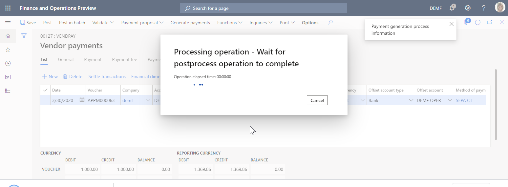

2. Download and save the zip file to your local computer.
3. Extract the **ISO20022 Credit transfer.xml** payment file from the zip file.
4. Open the extracted payment file by using the XML file viewer.

    In the payment file, the International Bank Account Number (IBAN) code of the vendor bank account contains no spaces. Therefore, it differs from the value that was [entered](#enteredIBANcode) on the **Bank accounts** page.

    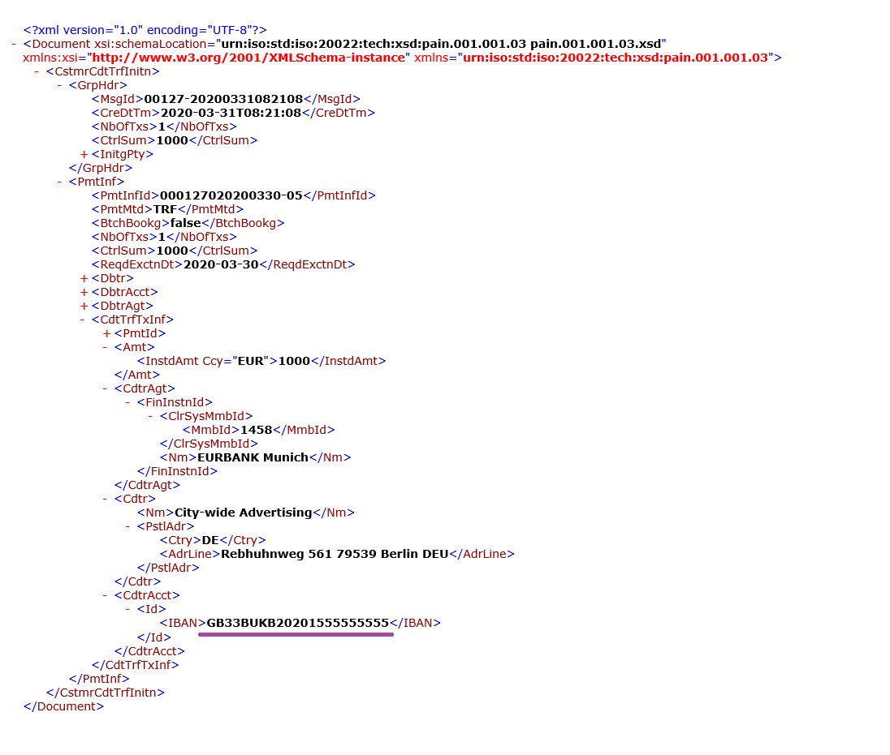

    You can use the ER data source debugger to learn which component of the ER solution is used to truncate spaces in the IBAN code.

## Turn on data source debugging

1. Go to **Organization administration** \> **Electronic reporting** \> **Configurations**.
2. On the **Configurations** page, on the Action Pane, on the **Configurations** tab, in the **Advanced settings** group, select **User parameters**.
3. Set the **Enable data debugging at format run** option to **Yes**.

    > [!NOTE]
    > This parameter is user-specific and company-specific.

    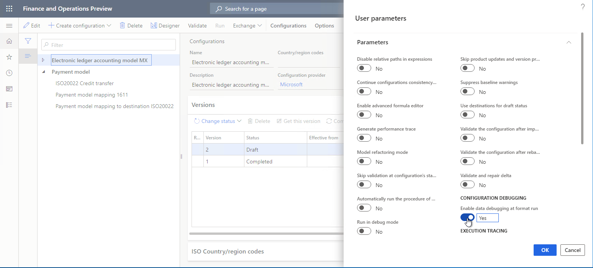

## Process a vendor payment for debugging

1. Follow the steps in [Appendix 3](#appendix3) of this article to process vendor payments.
2. In the message box, select **Yes** to confirm that you want to interrupt vendor payment processing and instead start data source debugging on the **Debug Datasources** page.

    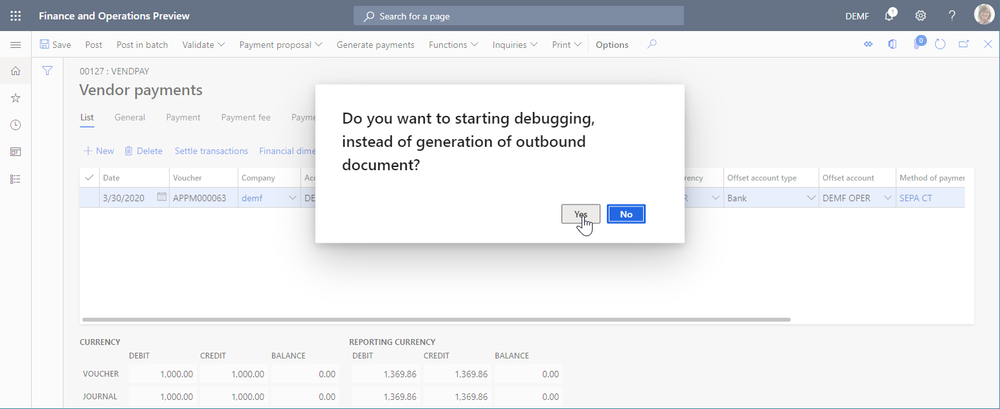

## Debug data sources that are used in payment processing

### Debug the model mapping

1. On the **Debug Datasources** page, on the Action Pane, select **Model mapping** to start to debug from this ER component.
2. In the data source pane on the left, select the **\$notSentTransactions** data source, and then select **Read all records**.

    You can select **Read 1 record**, **Read 10 records**, **Read 100 records**, or **Read all records** to force the appropriate number of records to be read from the selected data source. In this way, you can simulate access to the data source from the running ER format.

3. In the data pane on the right, select **Expand all**.

    You can see that the selected data source of the **Record list** type contains a single record.

4. Expand the **\$notSentTransactions** data source, and select the nested **vendBankAccountInTransactionCompany()** method.
5. Expand the **vendBankAccountInTransactionCompany()** method, and select the nested **IBAN** field.
6. Select **Get value**.

    You can select **Get value** to force the value of a selected field of the selected data source to be read. In this way, you can simulate access to this field from the running ER format.

7. Select **Expand all**.

    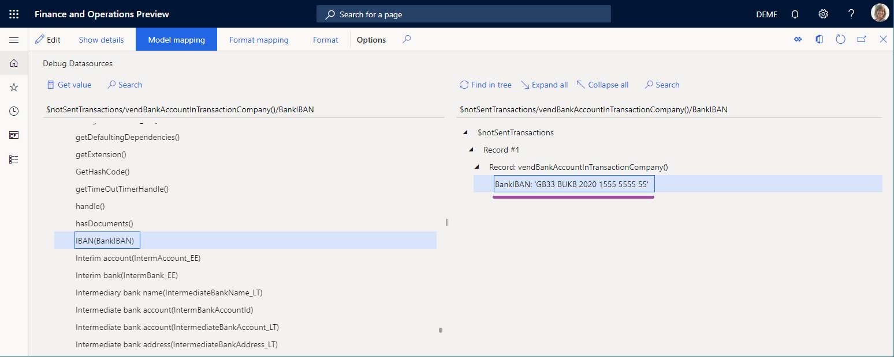

    As you can see, the model mapping isn't responsible for the truncated spaces, because the IBAN code that it returns for the vendor bank account includes spaces. Therefore, you must continue data source debugging.

### Debug the format mapping

1. On the **Debug Datasources** page, on the Action Pane, select **Format mapping** to continue to debug from this ER component.
2. Select the **\$PaymentByDebtor** data source, and then select **Read all records**.
3. Expand **\$PaymentByDebtor**.
4. Expand **\$PaymentByDebtor.Lines**, and then select **Read all records**.
5. Expand **\$PaymentByDebtor.Lines.CreditorAccount**.
6. Expand **\$PaymentByDebtor.Lines.CreditorAccount.Identification**, and then select **\$PaymentByDebtor.Lines.CreditorAccount.Identification.IBAN**.
7. Select **Get value**.
8. Select **Expand all**.

    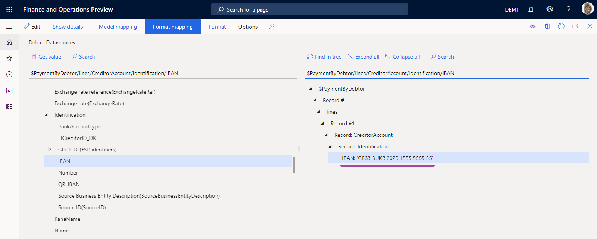

    As you can see, the data sources of the format mapping aren't responsible for the truncated spaces, because the IBAN code that they return for the vendor bank account includes spaces. Therefore, you must continue data source debugging.

### Debug the format

1. On the **Debug Datasources** page, on the Action Pane, select **Format** to continue to debug from this ER component.
2. Expand the format elements to select **ISO20022CTReports** \> **XMLHeader** \> **Document** \> **CstmrCdtTrfInitn** \> **PmtInf**, and then select **Read all records**.
3. Expand the format elements to select **ISO20022CTReports** \> **XMLHeader** \> **Document** \> **CstmrCdtTrfInitn** \> **PmtInf** \> **CdtTrfTxInf**, and then select **Read all records**.
4. Expand the format elements to select **ISO20022CTReports** \> **XMLHeader** \> **Document** \> **CstmrCdtTrfInitn** \> **PmtInf** \> **CdtTrfTxInf** \> **CdtrAcct** \> **Id** \> **IBAN** \> **BankIBAN**, and then select **Get value**.
5. Select **Expand all**.

    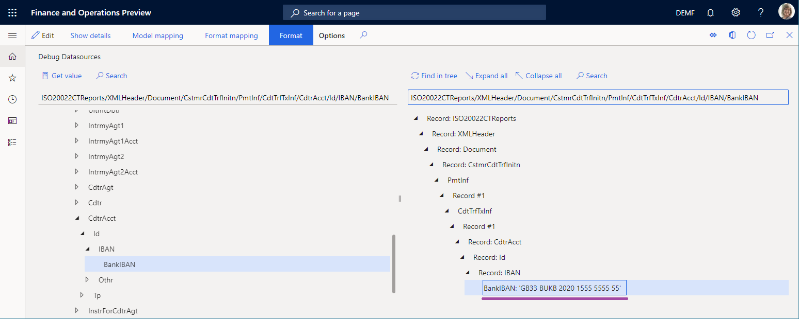

   As you can see, the format binding isn't responsible for the truncated spaces because the IBAN code that it returns for the vendor bank account includes spaces. Therefore, the **BankIBAN** element is configured to use a format transformation that truncates spaces.

6. Close the data source debugger.

### Review the format transformations

1. Go to **Organization administration** \> **Electronic reporting** \> **Configurations**.
2. On the **Configurations** page, select **Payment model** \> **ISO20022 Credit transfer**.
3. Select **Designer**, and then expand the elements to select **Document** \> **CstmrCdtTrfInitn** \> **PmtInf** \> **CdtTrfTxInf** \> **CdtrAcct** \> **Id** \> **IBAN** \> **BankIBAN**.

    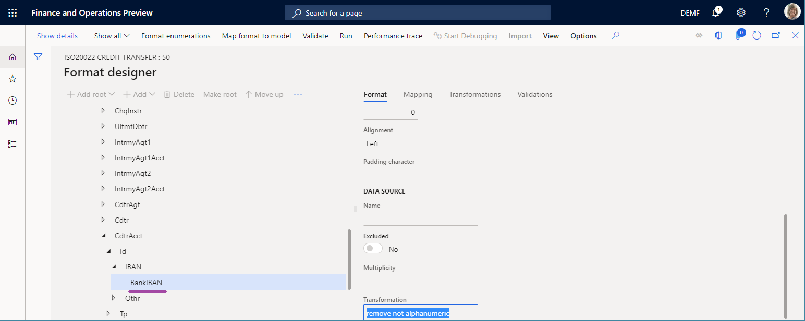

    As you can see, the **BankIBAN** element is configured to use the **remove not alphanumeric** transformation.

4. Select the **Transformations** tab.

    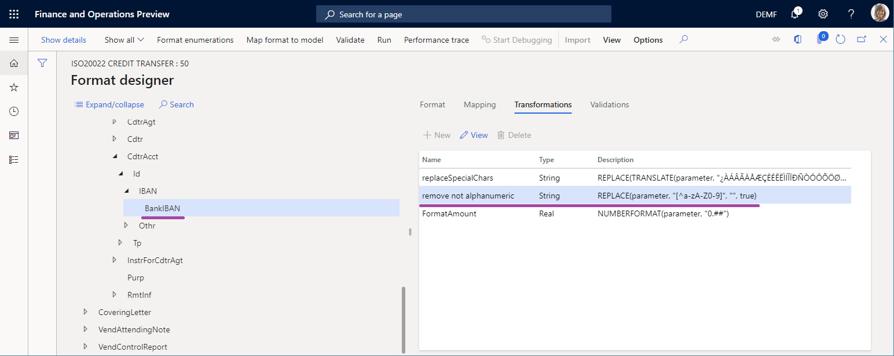

    As you can see, the **remove not alphanumeric** transformation is configured to use an expression that truncates spaces from the text string that is provided.

## Start to debug in the Operation designer

When you configure a draft version of the ER format that can be run directly from the Operation designer, you can access the data source debugger by selecting **Start Debugging** on the Action Pane.

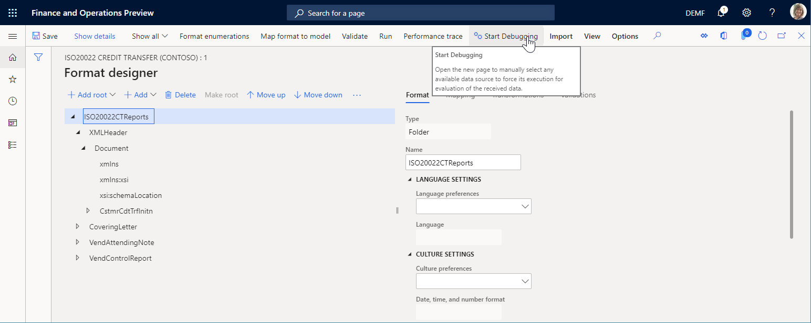

The format mapping and format components of the ER format that is being edited are available for debugging.

## Start to debug in the Model mapping designer

When you configure an ER model mapping that can be run from the **Model mapping** page, you can access the data source debugger by selecting **Start Debugging** on the Action Pane.

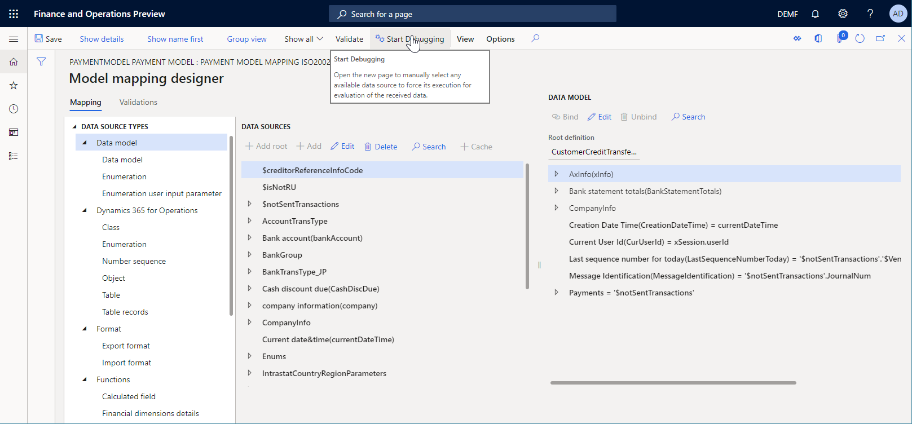

The model mapping component of the ER mapping that is being edited is available for debugging.

## Appendix 1: Get an ER solution

### Download an ER solution

If you want to use an ER solution to generate an electronic payment file for a vendor payment that is processed, you can [download](download-electronic-reporting-configuration-lcs.md) the **ISO20022 Credit transfer** ER payment format that is available from the Shared asset library in Microsoft Dynamics Lifecycle Services (LCS) or from the Global repository.

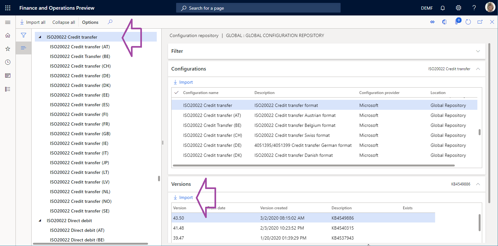

In addition to the selected ER format, the following [configurations](general-electronic-reporting.md#Configuration) must be automatically imported into your Microsoft Dynamics 365 Finance instance as part of the **ISO20022 Credit transfer** ER solution:

- **Payment model** ER data model configuration
- **ISO20022 Credit transfer** ER format configuration
- **Payment model mapping 1611** ER model mapping configuration
- **Payment model mapping to destination ISO20022** ER model mapping configuration

You can find these configurations on the **Configurations** page of the ER framework (**Organization administration** \> **Electronic reporting** \> **Configurations**).

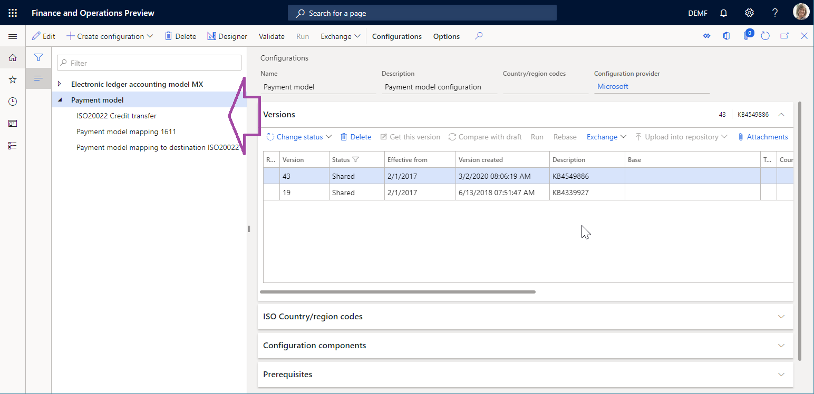

If any of the previously listed configurations are missing in the configuration tree, you must manually download them from the LCS Shared asset library in the same way that you downloaded the **ISO20022 Credit transfer** ER payment format.

### Analyze the downloaded ER solution

#### Review the model mapping

1. Go to **Organization administration** \> **Electronic reporting** \> **Configurations**.
2. Select **Payment model** \> **Payment model mapping 1611**.
3. Select **Designer**.
4. Select the **Payment model mapping ISO20022 CT** mapping record.
5. Select **Designer**, and then review the model mapping that is opened.

    Notice that the **Payments** field of the data model is bound to the **\$notSentTransactions** data source that returns the list of vendor payment lines that are being processed.

    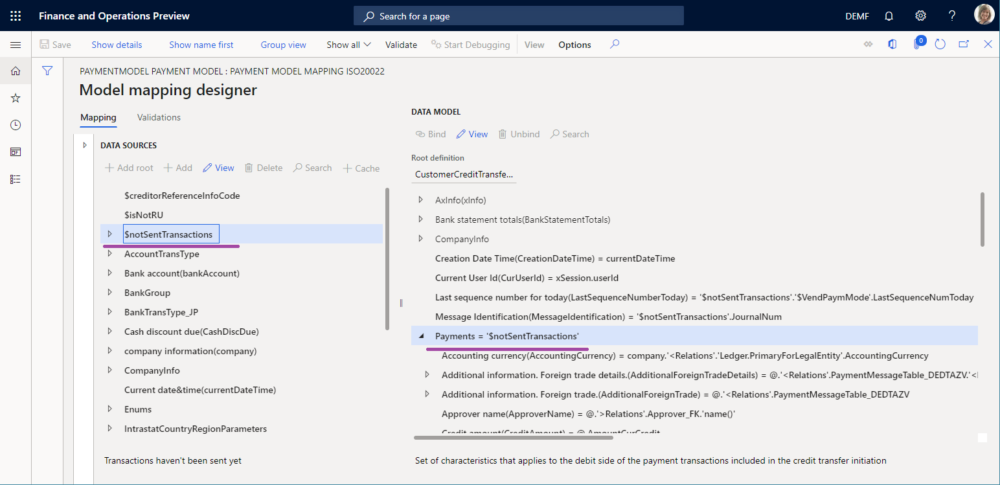

#### Review the format mapping

1. Go to **Organization administration** \> **Electronic reporting** \> **Configurations**.
2. Select **Payment model** \> **ISO20022 Credit transfer**.
3. Select **Designer**.
4. On the **Mapping** tab, review the format mapping that is opened.

    Notice that the **Document** \> **CstmrCdtTrfInitn** \> **PmtInf** element of the **ISO20022CTReports** \> **XMLHeader** file is bound to the **\$PaymentByDebtor** data source that is configured to group records of the data model's **Payments** field.

    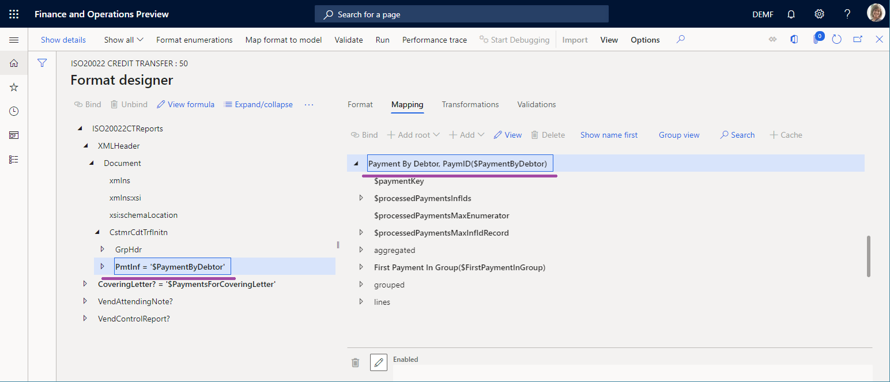

#### Review the format

1. Go to **Organization administration** \> **Electronic reporting** \> **Configurations**.
2. Select **Payment model** \> **ISO20022 Credit transfer**.
3. Select **Designer**, and then review the format that is opened.

    Notice that the format element under **Document** \> **CstmrCdtTrfInitn** \> **PmtInf** \> **CdtTrfTxInf** \> **CdtrAcct** \> **Id** \> **IBAN** \> **BankIBAN** is configured to enter the IBAN code of the vendor account in the payment file.

    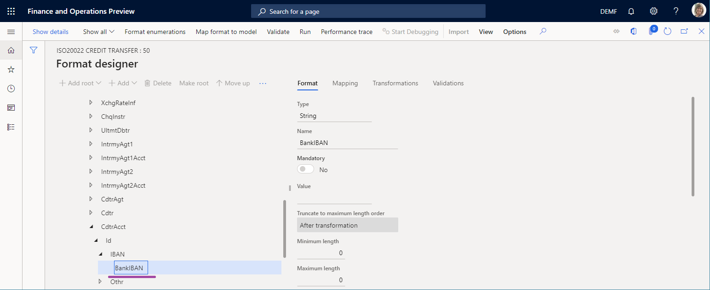

## Appendix 2: Configure Accounts payable

### Modify a vendor property

1. Go to **Accounts payable** \> **Vendors** \> **All vendors**.
2. Select vendor **DE-01002**, and then, on the Action Pane, on the **Vendor** tab, in the **Set up** group, select **Bank accounts**.
3. On the **Identification** FastTab, in the **IBAN** field, enter **GB33 BUKB 2020 1555 5555 55**.
4. Select **Save**.

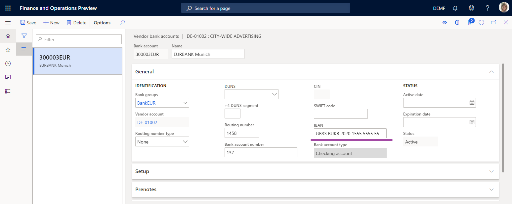

### Set up a method of payment

1. Go to **Accounts payable** \> **Payment setup** \> **Methods of payment**.
2. Select the **SEPA CT** payment method.
3. On the **File formats** FastTab, in the **File formats** section, set the **Generic electronic Export format** option to **Yes**.
4. In the **Export format configuration** field, select the **ISO20022 Credit transfer** ER format.
5. Select **Save**.

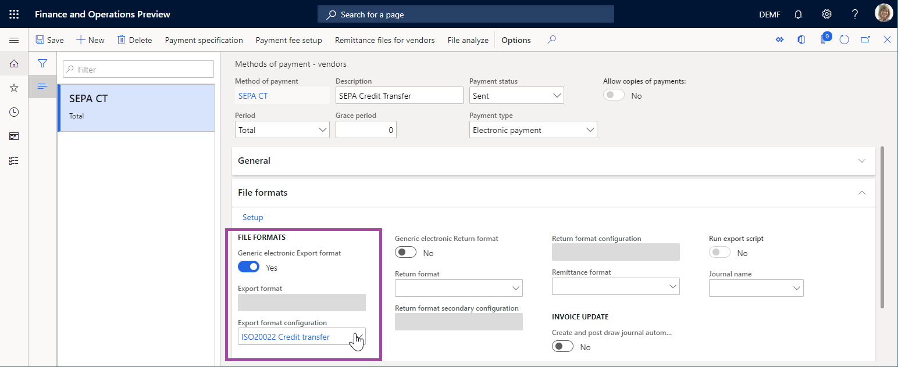

### Add a vendor payment

1. Go to **Accounts payable** \> **Payments** \> **Vendor payment journal**.
2. Add a new payment journal.
3. Select **Lines**, and add a new payment line.
4. In the **Account** field, select vendor **DE-01002**.
5. In the **Debit** field, enter a value.
6. In the **Method of payment** field, select **SEPA CT**.
7. Select **Save**.

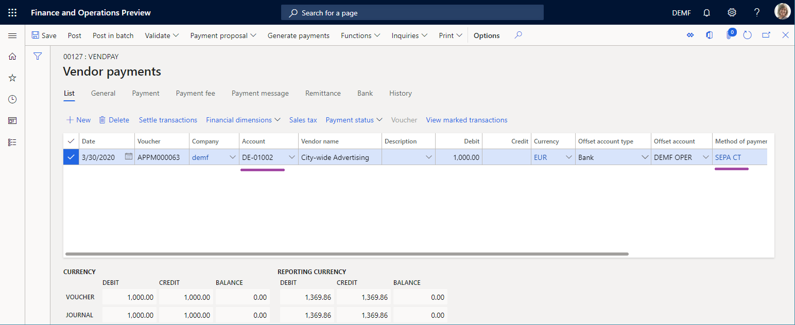

## Appendix 3: Process a vendor payment

1. Go to **Accounts payable** \> **Payments** \> **Vendor payment journal**.
2. On the **Vendor payment journal** page, select the payment journal that you previously created, and then select **Lines**.
3. Select the payment line, and then select **Payment status** \> **None**.
4. Select **Generate payments**.
5. In the **Method of payment** field, select **SEPA CT**.
6. In the **Bank account** field, select **DEMF OPER**.
7. In the **Generate payments** dialog box, select **OK**.
8. In the **Electronic report parameters** dialog box, select **OK**.

[!INCLUDE[footer-include](../../../includes/footer-banner.md)]
