# Defer the execution of sequence elements in ER formats

[!include [banner](../includes/banner.md)]

## Overview

You can use the Operations designer of the [Electronic reporting (ER)](general-electronic-reporting.md) framework to [configure](tasks/er-format-configuration-2016-11.md) the format component of an ER solution that is used to generate outbound documents in a text format. The hierarchical structure of the configured format component consists of format elements of various types. These format elements are used to fill generated documents with the required information at runtime. By default, when you run an ER format, the format elements are run in the same order as they are presented in the format hierarchy: one by one, from top to bottom. However, at design time, you can change the execution order for any sequence elements of the configured format component.

By turning on the **Deferred execution** option for a sequence format element in the configured format, you can defer (postpone) the execution of that element. In this case, the element isn't run until all other elements of its parent have been run.

To learn more about this feature, complete the example in this article.

## Limitations

The **Deferred execution** option is supported only for sequence elements that are configured for an ER format that is used to generate **outbound** documents in text format.

The **Deferred execution** option isn't applicable to sequences that have been configured as trimmed sequences where the maximum length is limited.

## Example: Defer the execution of a sequence element in an ER format

The following steps explain how a user in the System administrator or Electronic reporting functional consultant [role](../sysadmin/tasks/assign-users-security-roles.md) can configure an ER format that contains a sequence element where order of execution differs from the order in the format hierarchy.

These steps can be performed in the **USMF** company in Microsoft Dynamics 365 Finance.

### Prerequisites

To complete this example, you must have access to the **USMF** company in Finance for one of the following roles:

- Electronic reporting functional consultant
- System administrator

If you haven't yet completed the example in the [Defer the execution of XML elements in ER formats](er-defer-xml-element.md#Example) article, download the following [configurations](general-electronic-reporting.md#Configuration) of the sample ER solution.

| Content description            | File name |
|--------------------------------|-----------|
| ER data model configuration    | [Model to learn deferred elements.version.1.xml](https://download.microsoft.com/download/7/6/0/760933ca-4ac3-4f50-bc0c-c35e596ee066/Modeltolearndeferredelements.version.1.xml) |
| ER model mapping configuration | [Mapping to learn deferred elements.version.1.1.xml](https://download.microsoft.com/download/c/9/c/c9c4b9dd-b700-4385-a087-a84ce9fc1d0f/Mappingtolearndeferredelements.version.1.1.xml) |

Before you begin, you must also download and save the following configuration of the sample ER solution.

| Content description     |File name |
|-------------------------|----------|
| ER format configuration | [Format to learn deferred sequences.version.1.1.xml](https://download.microsoft.com/download/0/f/5/0f55c341-8285-4d92-a46d-475d9a010927/Formattolearndeferredsequences.version.1.1.xml) |

### Import the sample ER configurations

1. Go to **Organization administration** \> **Workspaces** \> **Electronic reporting**.
2. Select **Reporting configurations**.
3. On the **Configurations** page, if the **Model to learn deferred elements** configuration isn't available in the configuration tree, import the ER data model configuration:

    1. Select **Exchange**, and then select **Load from XML file**.
    2. Select **Browse**, find and select the **Model to learn deferred elements.1.xml** file, and then select **OK**.

4. If the **Mapping to learn deferred elements** configuration isn't available in the configuration tree, import the ER model mapping configuration:

    1. Select **Exchange**, and then select **Load from XML file**.
    2. Select **Browse**, find and select the **Mapping to learn deferred elements.1.1.xml** file, and then select **OK**.

5. Import the ER format configuration:

    1. Select **Exchange**, and then select **Load from XML file**.
    2. Select **Browse**, find and select the **Format to learn deferred sequences.1.1.xml** file, and then select **OK**.

6. In the configuration tree, expand **Model to learn deferred elements**.
7. Review the list of imported ER configurations in the configuration tree.

    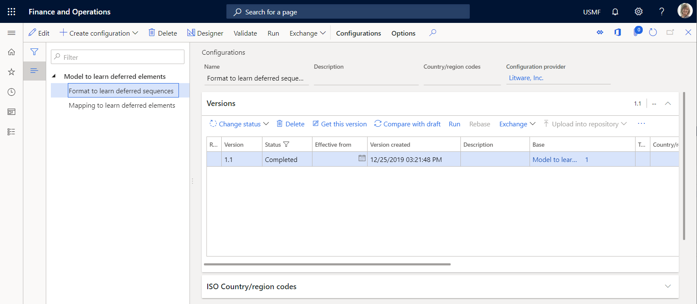

### Activate a configurations provider

1. Go to **Organization administration** \> **Workspaces** \> **Electronic reporting**.
2. On the **Localization configurations** page, in the **Configuration providers** section, make sure that the [configuration provider](general-electronic-reporting.md#Provider) for the Litware, Inc. (`http://www.litware.com`) sample company is listed, and that it's marked as active. If this configuration provider isn't listed, or if it isn't marked as active, follow the steps in the [Create a configuration provider and mark it as active](./tasks/er-configuration-provider-mark-it-active-2016-11.md) article.

    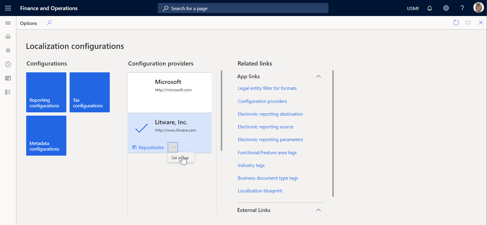

### Review the imported model mapping

Review the settings of the ER model mapping component that is configured to access tax transactions and expose accessed data on request.

1. Go to **Organization administration** \> **Workspaces** \> **Electronic reporting**.
2. Select **Reporting configurations**.
3. On the **Configurations** page, in the configuration tree, expand **Model to learn deferred elements**.
4. Select the **Mapping to learn deferred elements** configuration.
5. Select **Designer** to open the list of mappings.
6. Select **Designer** to review the mapping details.
7. Select **Show details**.
8. Review the data sources that are configured to access tax transactions:

    - The **Transactions** data source of the *Table record* type is configured to access records of the **TaxTrans** application table.
    - The **Vouchers** data source of the *Calculated field* type is configured to return the required voucher codes (**INV-10000349** and **INV-10000350**) as a list of records.
    - The **Filtered** data source of the *Calculated field* type is configured to select, from the **Transactions** data source, only tax transactions of the required vouchers.
    - The **\$TaxAmount** field of the *Calculated field* type is added for the **Filtered** data source to expose the tax value that has the opposite sign.
    - The **Grouped** data source of the *Group By* type is configured to group filtered tax transactions of the **Filtered** data source.
    - The **TotalSum** aggregation field of the **Grouped** data source is configured to summarize values of the **\$TaxAmount** field of the **Filtered** data source for all filtered tax transactions of that data source.

        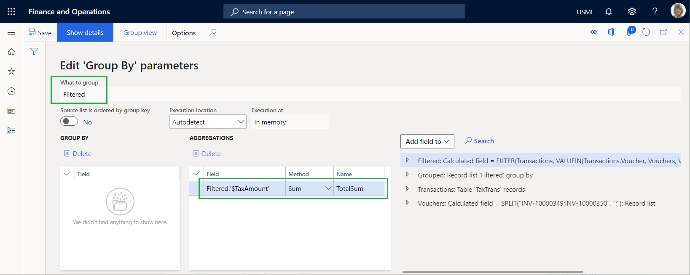

9. Review how the configured data sources are bound to the data model, and how they expose accessed data to make it available in an ER format:

    - The **Filtered** data source is bound to the **Data.List** field of the data model.
    - The **\$TaxAmount** field of the **Filtered** data source is bound to the **Data.List.Value** field of the data model.
    - The **TotalSum** field of the **Grouped** data source is bound to the **Data.Summary.Total** field of the data model.

    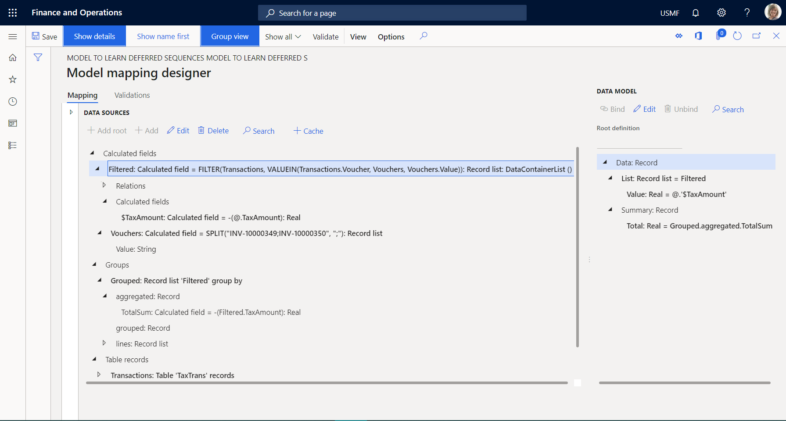

10. Close the **Model mapping designer** and **Model mappings** pages.

### Review the imported format

1. On the **Configurations** page, in the configuration tree, select the **Format to learn deferred sequences** configuration.
2. Select **Designer** to review the format details.
3. Select **Show details**.
4. Review the settings of the ER format components that are configured to generate an outbound document in text format that includes details of the tax transactions:

    - The **Report\\Lines** sequence format element is configured to fill the outbound document with a single line that is generated from the nested sequence elements (**Header**, **Record**, and **Summary**).

        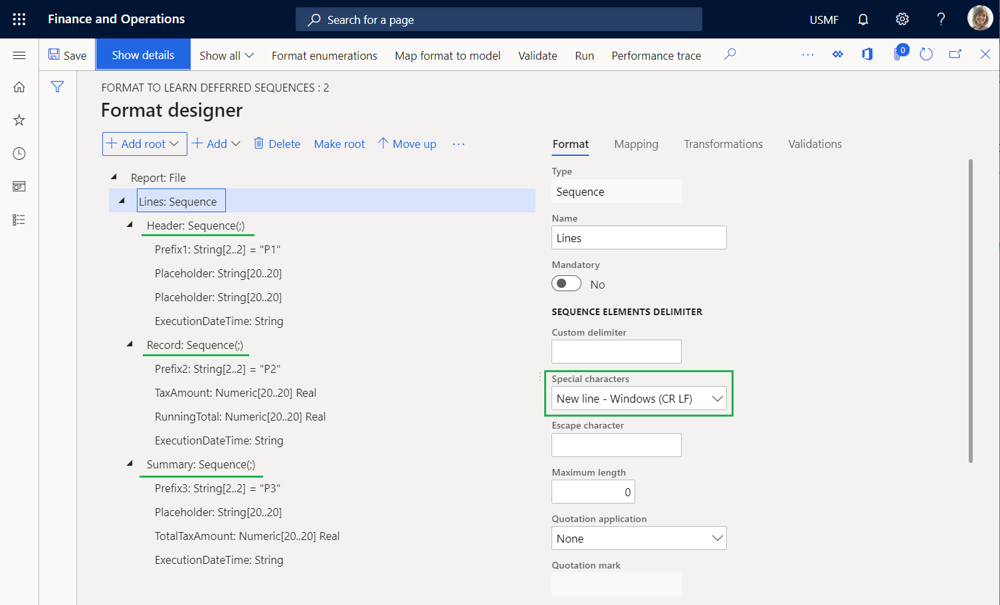

    - The **Report\\Lines\\Header** sequence format element is configured to fill the outbound document with a single header line that shows the date and time  when the processing starts.
    - The **Report \\Lines\\Record** sequence format element is configured to fill the outbound document with a single line that shows the details of individual tax transactions. These tax transactions are separated by a semicolon.

        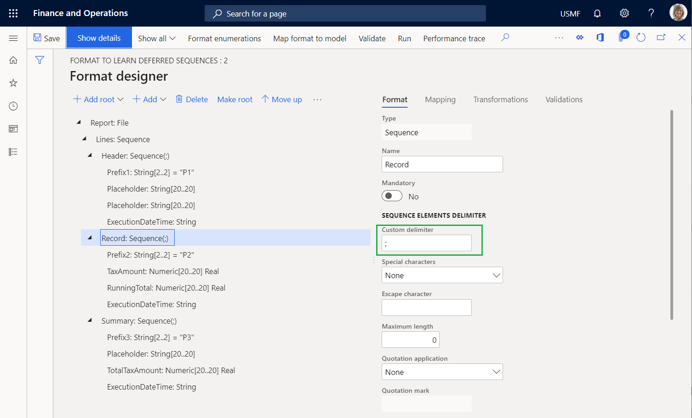

    - The **Report\\Lines\\Summary** sequence format element is configured to fill the outbound document with a single summary line that includes the sum of the tax values from the processed tax transactions.

4. On the **Mapping** tab, review the following details:

    - The **Report\\Lines\\Header** element doesn't have to be bound to a data source to generate a single line in an outbound document.
    - The **Prefix1** element generates **P1** symbols to indicate that the line that is added is the report header line.
    - The **ExecutionDateTime** element generates the date and time (including milliseconds) when the header line is added.
    - The **Report\\Lines\\Record** element is bound to the **model.Data.List** list to generate a single line for every record from the bound list.
    - The **Prefix2** element generates **P2** symbols to indicate that the line that is added is for the tax transaction details.
    - The **TaxAmount** element is bound to **model.Data.List.Value** (which is shown as **\@.Value** in the relative path view) to generate the tax value of the current tax transaction.
    - The **RunningTotal** element is a placeholder for the running total of the tax values. Currently, this element has no output, because neither a binding nor a default value is configured for it.
    - The **ExecutionDateTime** element generates the date and time (including milliseconds) when the current transaction is processed in this report.
    - The **Report\\Lines\\Summary** element doesn't have to be bound to a data source to generate a single line in an outbound document.
    - The **Prefix3** element generates **P3** symbols to indicate that the line that is added contains the total tax value.
    - The **TotalTaxAmount** element is bound to **model.Data.Summary.Total** to generate the sum of the tax values of the processed tax transactions.
    - The **ExecutionDateTime** element generates the date and time (including milliseconds) when the summary line is added.

    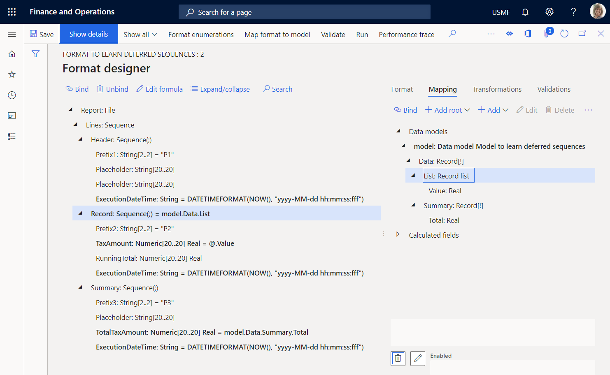

### Run the imported format

1. On the **Format designer** page, select **Run**.
2. Download the file that the web browser offers, and open it for review.

    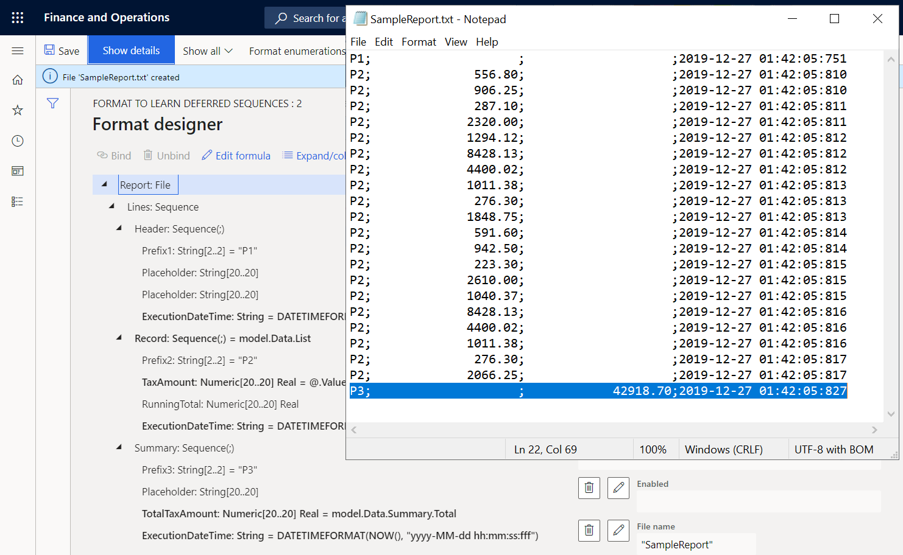

Notice that summary line 22 presents the sum of the tax values for the processed transactions. Because the format is configured to use the **model.Data.Summary.Total** binding to return this sum, the sum is calculated by calling the **TotalSum** aggregation of the **Grouped** data source of the *GroupBy* type that uses the model mapping. To calculate this aggregation, model mapping iterates over all transactions that have been selected in the **Filtered** data source. By comparing the execution times of lines 21 and 22, you can determine that calculation of the sum took 10 milliseconds (ms). By comparing the execution times of lines 2 and 21, you can determine that generation of all transactional lines took 7 ms. Therefore, a total of 17 ms was required.

### Modify the format so that the summing is based on generated output

If the volume of transactions is much larger than the volume in the current example, the summing time might increase and cause performance issues. By changing the setting of the format, you can help prevent these performance issues. Because you access tax values to include them in the generated report, you can reuse this information to sum tax values. For more information, see [Configure format to do counting and summing](./tasks/er-format-counting-summing-1.md).

1. On the **Format designer** page, on the **Format** tab, select the **Report** file element in the format tree.
2. Set the **Collect output details** option to **Yes**. You can now configure this format by using the content of an existing report as a data source that can be accessed by using the built-in ER functions in the [Data collection](er-functions-category-data-collection.md) category.
3. On the **Mapping** tab, select the **Report\\Lines** sequence element.
4. Configure the **Collected data key name** expression as `WsColumn`.
5. Configure the **Collected data key value** expression as `WsRow`.

    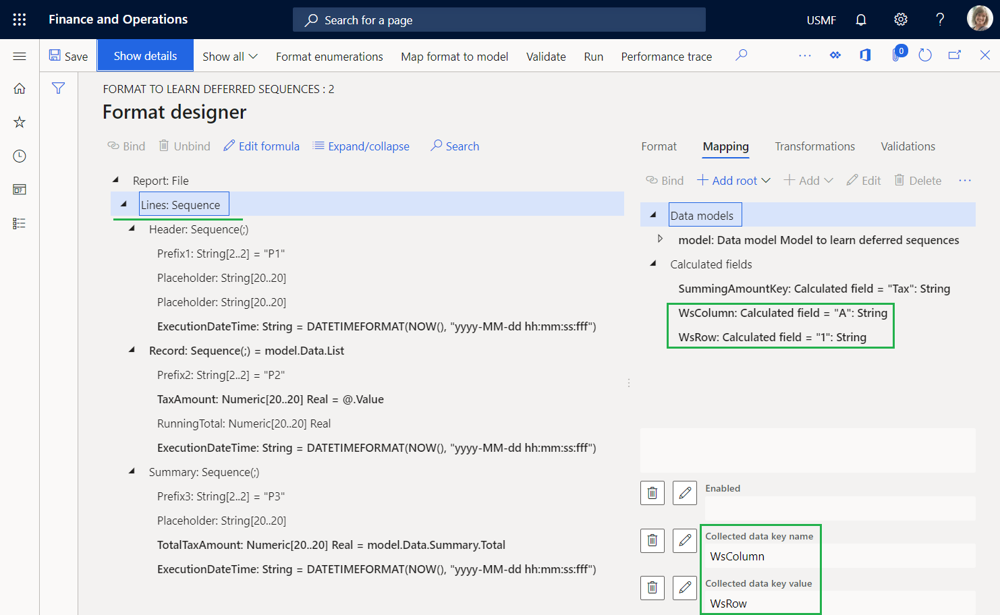

6. Select the **Report\\Lines\\Record\\TaxAmount** numeric element.
7. Configure the **Collected data key name** expression as `SummingAmountKey`.

    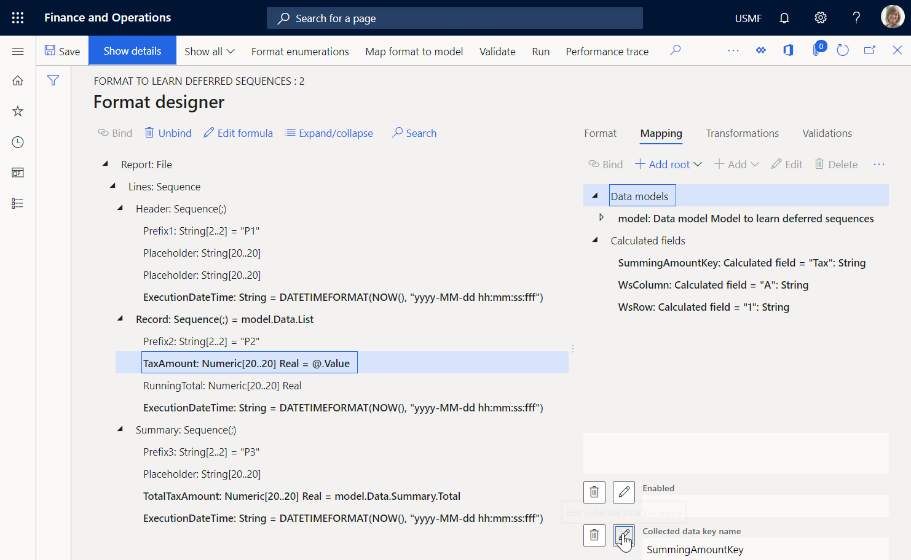

    You can consider this setting the fulfillment of a virtual worksheet, where the value of cell A1 is appended with the value of the tax amount from every processed tax transaction.

8. Select the **Report\\Lines\\Record\\RunningTotal** numeric element, and then select **Edit formula**.
9. Configure the `SUMIF(SummingAmountKey, WsColumn, WsRow)` expression by using the built-in [SUMIF](er-functions-datacollection-sumif.md) ER function.
10. Select **Save**.

    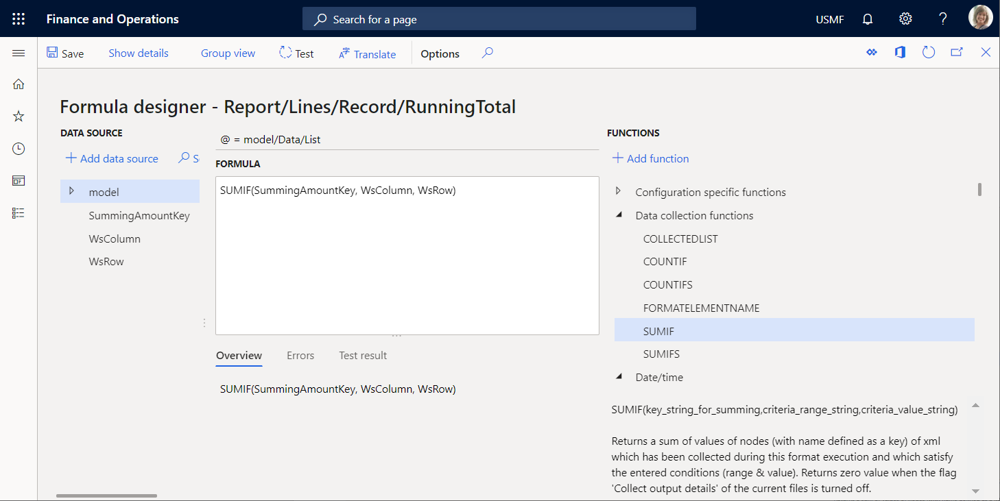

11. Close the **Formula designer** page.
12. Select **Save**, and then select **Run**.
13. Download and review the file that the web browser offers.

    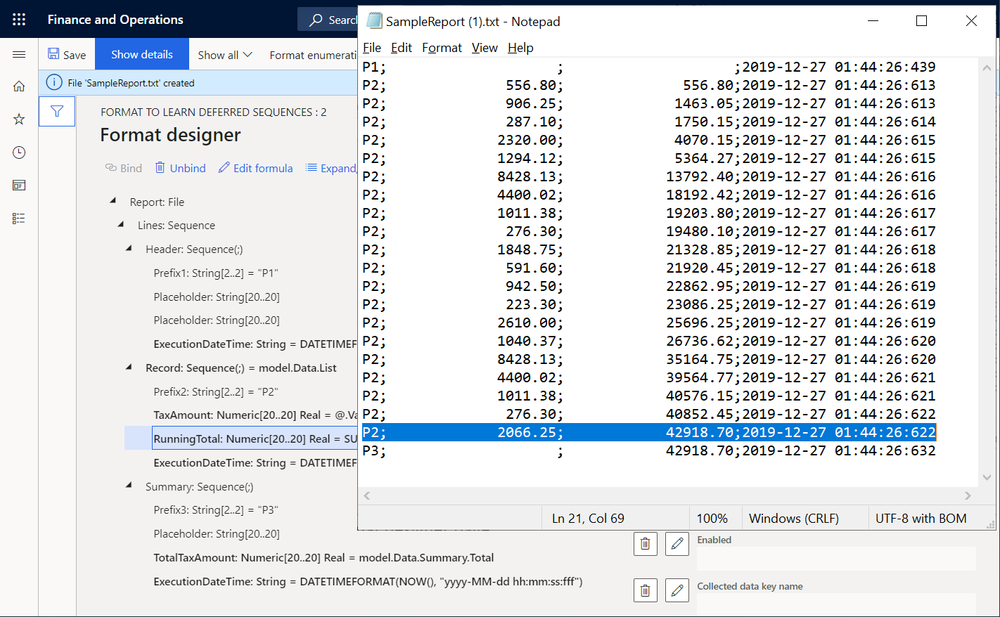

    Line 21 contains the running total of tax values that is calculated for all processed transactions by using the generated output as a data source. This data source starts from the beginning of the report and continues through the last tax transaction. Line 22 contains the sum of the tax values for all processed transactions that are calculated in the model mapping by using the data source of the *GroupBy* type. Notice that these values are equal. Therefore, the output-based summing can be used instead of **GroupBy**. By comparing the execution times of lines 2 and 21, you can determine that generation of all the transactional lines and summing took 9 ms. Therefore, as far as the generation of detailed lines and the summing of tax values are concerned, the modified format is approximately two times faster than the original format.

14. Select the **Report\\Lines\\Summary\\TotalTaxAmount** numeric element, and then select **Edit formula**.
15. Enter the `SUMIF(SummingAmountKey, WsColumn, WsRow)` expression instead of the existing expression.
16. Select **Save**, and then select **Run**.
17. Download and review the file that the web browser offers.

    

    Notice that the running total of tax values on the last transaction details line now equals the sum on the summary line.

### Put values of output-based summing in the report header

If, for example, you must present the sum of tax values in the header of your report, you can modify your format.

1. On the **Format designer** page, on the **Format** tab, select the **Report\\Lines\\Summary** sequence element.
2. Select **Move up**.
3. Select **Save**, and then select **Run**.
4. Download and review the file that the web browser offers.

    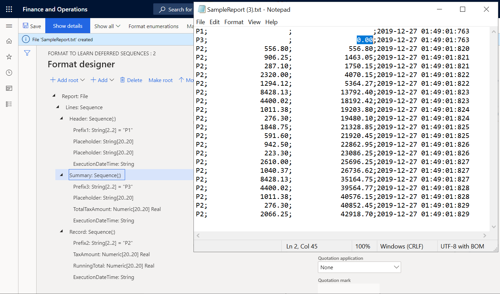

    Notice that the sum of tax values on summary line 2 now equals 0 (zero), because this sum is now calculated based on the generated output. When line 2 is generated, the generated output doesn't yet contain lines that have transaction details. You can configure this format to defer the execution of the **Report\\Lines\\Summary** sequence element until the **Report\\Lines\\Record** sequence element has been run for all tax transactions.

### Defer the execution of the summary sequence so that the calculated total is used

1. On the **Format designer** page, on the **Format** tab, select the **Report\\Lines\\Summary** sequence element.
2. Set the **Deferred execution** option to **Yes**.

    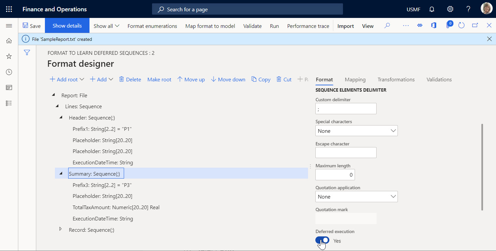

3. Select **Save**, and then select **Run**.
4. Download and review the file that the web browser offers.

    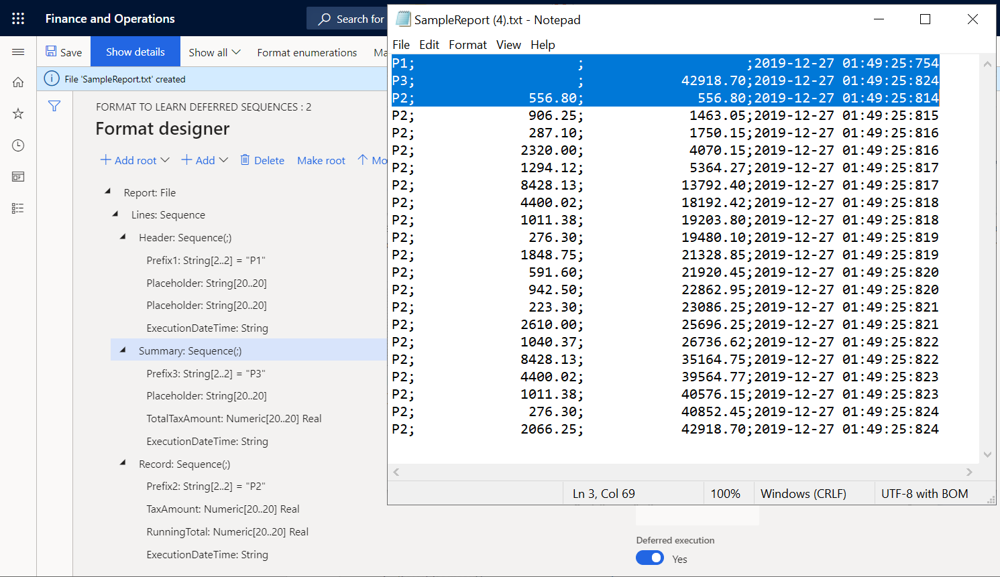

    The **Report\\Lines\\Summary** sequence element is now run only after all other items that are nested under its parent element, **Report\\Lines**, have been run. Therefore, it's run after the **Report\\Lines\\Record** sequence element has been run for all tax transactions of the **model.Data.List** data source. The execution times of lines 1, 2, and 3, and of the last line, 22, reveal this fact.

## Additional resources

- [Configure format to do counting and summing](./tasks/er-format-counting-summing-1.md)
- [Trace execution of ER format to troubleshoot performance issues](trace-execution-er-troubleshoot-perf.md)
- [Defer the execution of XML elements in ER formats](er-defer-xml-element.md#Example)

[!INCLUDE[footer-include](../../../includes/footer-banner.md)]
