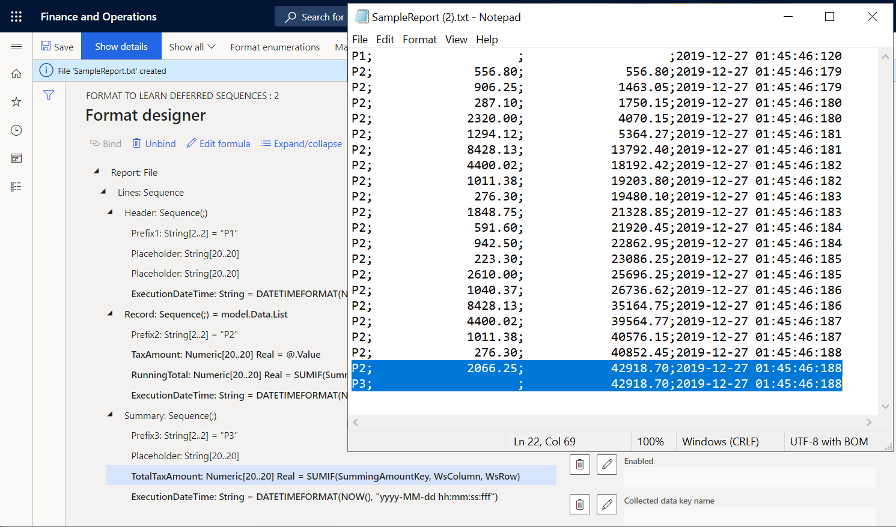

---
# required metadata

title: Defer the execution of sequence elements in ER formats
description: This topic explains how you can defer the execution of a sequence element in an ER format.
author: NickSelin
manager: kfend
ms.date: 1/16/2020
ms.topic: article
ms.prod: 
ms.service: dynamics-ax-platform
ms.technology: 

# optional metadata

ms.search.form: EROperationDesigner
# ROBOTS: 
audience: Application User, IT Pro
# ms.devlang: 
ms.reviewer: kfend
ms.search.scope: Core, Operations
# ms.tgt_pltfrm: 
ms.custom: 58771
ms.assetid: 
ms.search.region: Global
# ms.search.industry: 
ms.author: nselin
ms.search.validFrom: 2019-07-01
ms.dyn365.ops.version: AX 10.0.5

---

# Defer the execution of sequence elements in ER formats

[!include [banner](../includes/banner.md)]

## Overview

You can use the Operations designer of the [Electronic reporting (ER)](general-electronic-reporting.md) framework to [configure](tasks/er-format-configuration-2016-11.md) the [format component](general-electronic-reporting.md#FormatComponentOutbound) of an ER solution that is used to generate outbound documents in a text format. The hierarchical structure of the configured format component consists of format elements of various types that are used populate generated documents with necessary information at run time. By default, when you run an ER format, these format elements are executed in the same sequence that they are presented in the format hierarchy – one by one from top to bottom. At design time, you can change this default execution order for any of sequence elements of the configured format component. 

You can turn on the **Deferred execution** option for a sequence format element to postpone the execution of this element. When this option for a sequence element is on, the element is not executed until all other elements of its parent have been executed.

To learn more about this feature, complete the example in this topic.

## Limitations

The **Deferred execution** option is only supported for the sequence elements that are configured for an ER format that is used to generate **outbound** documents in text format.

The **Deferred execution** option is not applicable for a sequence that has been configured as a trimmed one when its maximum length is limited.

# Example: Defer execution of a sequence format element

The following steps explain how a user in either the System administrator or Electronic reporting functional consultant [role](https://docs.microsoft.com/dynamics365/fin-ops-core/dev-itpro/sysadmin/tasks/assign-users-security-roles) can configure an ER format containing a sequence element the order of execution of which differs from its order in the format’s hierarchy.

These steps can be performed in the **USMF** company of Microsoft Dynamics 365 Finance.

## Prerequisites

To complete the examples in this topic, you must have access to the **USMF** company of Finance for one of the following roles:

- Electronic reporting functional consultant
- System administrator

If you have not yet completed the example in the [Defer execution of an XML element in ER format](er-defer-xml-element.md#Example) topic, download the following [configurations](http://general-electronic-reporting.md/#Configuration) of the sample ER solution.

| **Content description**        | **File name**                      |
|--------------------------------|------------------------------------|
| ER data model configuration    | [Model to learn deferred elements.version.1.xml](https://mbs.microsoft.com/customersource/Global/AX/downloads/hot-fixes/365optelecrepeg)   |
| ER model mapping configuration | [Mapping to learn deferred elements.version.1.1.xml](https://mbs.microsoft.com/customersource/Global/AX/downloads/hot-fixes/365optelecrepeg) |

Before you begin, you must also download and save the following configuration of the sample ER solution.

| **Content description**        | **File name**                      |
|--------------------------------|------------------------------------|
| ER format configuration        | [Format to learn deferred sequences.version.1.1.xml](https://mbs.microsoft.com/customersource/Global/AX/downloads/hot-fixes/365optelecrepeg) |

## Import sample ER configurations

1.  Go to **Organization administration** \> **Workspaces** \> **Electronic reporting**.
2.  Select **Reporting configurations**.
3.  If the **Model to learn deferred elements** configuration is not available in the tree, import the ER data model configuration.

    1. Select **Exchange**.
    2. Select **Load from XML file**.
    3. Select **Browse** to find the **Model to learn deferred elements.1.xml** file.
    4. Select **OK**.
    
4.  If the **Mapping to learn deferred elements** configuration is not available in the tree, import the ER model mapping configuration.
    
    1. Select **Exchange**.
    2. Select **Load from XML file**.
    3. Select **Browse** to find the **Mapping to learn deferred elements.1.1.xml** file.
    4. Select **OK**.
    
5.  Import the ER format configuration.
    
    1. Select **Exchange**.
    2. Select **Load from XML file**.
    3. Select **Browse** to find the **Format to learn deferred sequences.1.1.xml** file.
    4. Select **OK**.
    
6.  In the configurations tree, expand the **Model to learn deferred elements**.
7.  View the list of imported ER configurations in the tree.
    
    

## Activate a configurations provider

1.  Go to **Organization administration** \> **Workspaces** \> **Electronic reporting**.
2.  On the **Localization configurations** page, in the **Configuration providers** section, make sure that the configuration [provider](general-electronic-reporting.md#Provider) for the Litware, Inc. (<http://www.litware.com>) sample company is listed, and that it's marked as **Active**. If you don't see this configuration provider or it is not marked as **Active**, follow the steps in [Create a configuration provider and mark it as active](./tasks/er-configuration-provider-mark-it-active-2016-11.md).

    

## Review the imported model mapping

Review settings of the ER model mapping component configured to access tax transactions and expose accessed data upon request.

1.  Go to **Organization administration** \> **Workspaces** \> **Electronic reporting**.
2.  Select **Reporting configurations**.
3.  Expand **Model to learn deferred elements**.
4.  Select **Mapping to learn deferred elements** configuration.
5.  Select **Designer** to open the list of mappings.
6.  Select **Designer** to review the mapping details.
7.  Toggle **Show details** on.

    Review the data sources that are configured to access tax transactions.

    -   The **Transactions** data source of the *Table record* type is configured to access records of the **TaxTrans** application table.
    -   The **Vouchers** data source of the *Calculated field* type is configured to return the required voucher codes **INV-10000349** and **INV-10000350** as the list of records.
    -   The **Filtered** data source of the *Calculated field* type is configured to select from the **Transactions** data source, only tax transactions of the required vouchers.
    -   The **\$TaxAmount** field of the *Calculated field* type is added for the **Filtered** data source to expose a tax value with the opposite sign.
    -   The **Grouped** data source of the *Group By* type is configured to group filtered tax transactions of the **Filtered** data source.
    -   The **TotalSum** aggregation field of the **Grouped** data source is configured to summarize values of the **\$TaxAmount** field of the **Filtered** data source for all of the  filtered tax transactions of the **Filtered** data source.

        

    Review how configured data sources are bound to the data model and exposing accessed data to make it available in an ER format.

    -   The **Filtered** data source is bound to the **Data.List** field of the data model.
    -   The **\$TaxAmount** field of the **Filtered** data source is bound to the **Data.List.Value** field of the data model.
    -   The **TotalSum** field of the **Grouped** data source is bound to the **Data.Summary.Total** field of the data model.

        

8.  Close the model mapping designer page.
9.  Close the model mappings page.

## Review the imported format

1.  Select the configuration, **Format to learn deferred sequences**.
2.  Select **Designer** to review the format details.
3.  Toggle **Show details** on.

    Review the settings of the ER format components that are configured to generate an outbound document in text format and include details of the tax transactions in the document.

    The **Report\\Lines** sequence format element is configured to populate the outbound document with a single line that is generated from the nested sequence elements (**Header**, **Record**, and **Summary**).

    

    The **Report\\Lines\\Header** sequence format element is configured to populate the outbound document with a single header line that shows the date and time of when the processing starts.

    The **Report \\Lines\\Record** sequence format element is configured to populate the outbound document with a single line that details single tax transactions. These are separated by a semicolon.

    

    The **Report\\Lines\\Summary** sequence format element is configured to populate the outbound document with a single summary line that includes the sum of the tax values from the processed tax transactions.

4.  Select the **Mapping** tab.

    -   The **Report\\Lines\\Header** element is not required to be bound to a data source to output a single line to an outbound document.
    -   The **Prefix1** element outputs **P1** symbols indicating that the added line is the report header line.
    -   The **ExecutionDateTime** element outputs the date and time (including milliseconds) when the header line is added.
    -   The **Report\\Lines\\Record** element is bound to **model.Data.List** list and outputs a single line for every record from the bound list.
    -   The **Prefix2** element outputs **P2** symbols indicating that the added line is the tax transaction details line.
    -   The **TaxAmount** element is bound to **model.Data.List.Value** (shown as **\@.Value** by using the relative path view) to output the tax value of the current tax transaction.
    -   The **RunningTotal** element is a placeholder for the running total of the tax values. Currently, this element outputs nothing as neither a binding or a default value is configured for it.
    -   The **ExecutionDateTime** element outputs the date and time (including milliseconds) when the current transaction is processed in this report.
    -   The **Report\\Lines\\Summary** element is not required to be bound to a data source to output a single line to an outbound document.
    -   The **Prefix3** element outputs **P3** symbols indicating that the added line is the line containing the total tax value.
    -   The **TotalTaxAmount** element is bound to **model.Data.Summary.Total** to output the sum of tax values of the processed tax transactions.
    -   The **ExecutionDateTime** element outputs the date and time (including milliseconds) when the summary line is added.

        

## Run the imported format

1.  Select **Run**.
2.  Download and view the file.

Notice that summary line 22 presents the sum of the tax values for the processed transactions. Because this format is configured to return this sum by using the **model.Data.Summary.Total** binding, this sum is calculated by calling the **TotalSum** aggregation of the **Grouped** data source of the *GroupBy* type using the model mapping. To compute this aggregation, model mapping iterates over
all transactions that have been selected in the **Filtered** data source. Comparing the execution time of lines 21 and 22, you can see that it took 10 milliseconds to perform this summing. Comparing the execution time of lines 2 and 21, you can see that it took 7 milliseconds to generate all transactional lines. In total, it took 17 milliseconds.

## Modify the format to perform summing based on generated output

With a much larger volume of transactions than in the current example, the summing time may increase which might cause performance issues. You can change the setting of this format to prevent the appearance of such performance issues. As you access tax values to include them in the generated report, you can re-use this information for the summing of tax values. See [Configure format to do counting and summing](./tasks/er-format-counting-summing-1.md) for more details.

1.  Select the **Format** tab and then in the format tree, select the **Report** file element.
2.  Set the **Collect output details** option to **Yes**.  
      
    By turning this option on, you can configure this format using the content of an existing report as a data source that can be accessed by using the ER built-in functions of the [Data collection](er-functions-category-data-collection.md) category.

3.  Select the **Mapping** tab and then select the **Report\\Line** sequence element.
4.  Configure the **Collected data key name** expression as `WsColumn`.
5.  Configure the **Collected data key value** expression as `WsRow`.

    

6.  Select the **Report\\Line\\Record\\TaxAmount** numeric element.
7.  Configure the **Collected data key name** expression as `SummingAmountKey`.

    

    You may consider this setting as the fulfillment of a virtual worksheet when the value of the A1 cell is appended by the value of tax amount from every processed tax transaction.

8.  Select the **Report\\Line\\Record\\RunningTotal** numeric element, and then select **Edit formula**.
9.  Configure the `SUMIF(SummingAmountKey, WsColumn, WsRow)` expression by using the [SUMIF](er-functions-datacollection-sumif.md) built-in ER function.
10.  Select **Save**.

     

11.  Close the formula designer page.
12.  Select **Save** and then select **Run**.
13.  Download and view the file.

     

     Line 21 contains the tax value running total that is computed for all processed transactions using the generated output as a data source that starts from the beginning of the report up to the last tax transaction, inclusively. Line 22 contains the sum of tax values for all processed transactions that are computed in model mapping by using the data source of the **GroupBy** type.
Notice that these values are equal which means that the output-based summing can be used instead of the **GroupBy**. Comparing the execution time of lines 2 and 21, you can see that it took 9 milliseconds to generate all of the transactional lines and perform the summing. From the detailed lines generation and tax values summing perspective, the modified format is approximately two times faster than the original one.

14.  Select the **Report\\Line\\Summary\\TotalTaxAmount** numeric element and then select **Edit formula**.
15.  Enter the `SUMIF(SummingAmountKey, WsColumn, WsRow)` expression instead of the existing one.
16.  Select **Save** and then select **Run**.
17. Download and view the file.

     

     Now the tax value running total in the last transaction details line is equal to the sum in the summary line.

## Place values of output-based summing to the report header

Assume that you must present the sum of tax values in the header of your report. You can modify your format for doing this.

1.  Select the **Format** tab.
2.  Select the **Report\\Line\\Summary** sequence element.
3.  Select **Move up**.
4.  Select **Save**.
5.  Select **Run**.
6.  Download and view the file.

     

     Notice that the sum of tax values in summary line two equals zero. This is because the sum is now computed based on the generated output. At the time when line two is generated, the generated output does not yet contain lines with transaction details. You can configure this format to defer the execution of the **Report\\Line\\Summary** sequence element until the **Report\\Line\\Record** sequence element has been executed for all tax transactions.

## Defer the execution of the summary sequence to use calculated total

1.  Select the **Report\\Line\\Summary** sequence element.
2.  Set the **Deferred execution** option to **Yes**.

     

3.  Select **Save**.
4.  Select **Run**.
5.  Download and view the file.

     

     The execution of the **Report\\Line\\Summary** sequence element is now performed at the end of the execution of all other nested items in the **Report\\Line** element that is the parent element of the **Report\\Line\\Summary**. Therefore, it happens after the execution of the **Report\\Line\\Record** sequence element for all tax transactions of the **model.Data.List** data source. The execution time of lines 1,2,3 and the last line 22 illustrates this.

## Additional resources

- [Configure format to do counting and summing](./tasks/er-format-counting-summing-1.md)
- [Trace execution of ER format to troubleshoot performance issues](trace-execution-er-troubleshoot-perf.md)
- [Defer execution of an XML element in ER format](er-defer-xml-element.md#Example)
