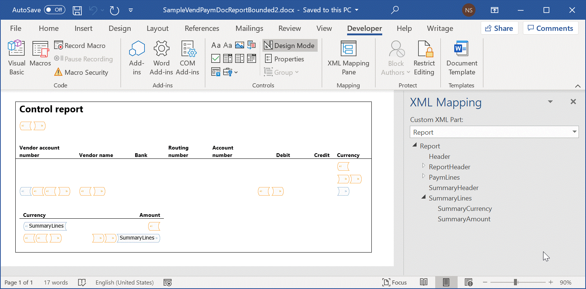
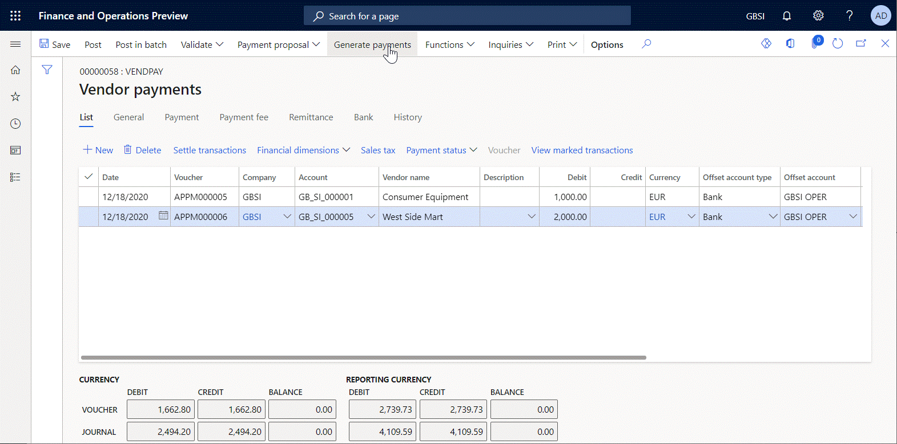
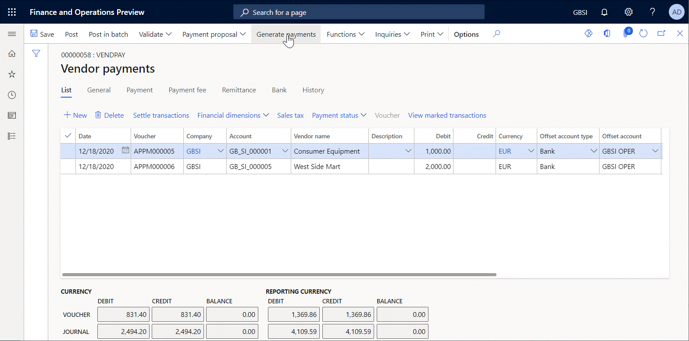

# Suppress Word content controls in generated reports

[!include [banner](../includes/banner.md)]

To generate reports as Microsoft Word documents, you must design a template for the reports as a Word document. This template must contain Word content controls as placeholders for data that will be filled in at runtime. To use the Word document that is created as a template for your reports, you can [configure](er-design-configuration-word.md) a new [Electronic reporting (ER)](general-electronic-reporting.md) [solution](er-quick-start1-new-solution.md). The solution must include an ER [configuration](general-electronic-reporting.md#Configuration) that contains an ER format component. This ER format must be configured to use the designed template for report generation.

In version 10.0.6 and later of Dynamics 365 Finance, you can configure formulas in your ER format to suppress some Word content controls in generated documents.

The following steps explain how a user who is assigned to the System administrator or Electronic reporting functional consultant role can configure an ER format that generates reports as Word files and suppresses some of the content controls in the generated reports that have been configured by using a Word template.

These steps can be completed in the GBSI company.

## Prerequisites

To complete these steps, you must first complete the steps in the following task guides:

- [Design a configuration for generating reports in OPENXML format](./tasks/er-design-reports-openxml-2016-11.md)
- [Re-use ER configurations with Excel templates to generate reports in Word format](./tasks/er-design-configuration-word-2016-11.md)

When you complete the steps of these task guides, the following items are prepared:

- A **Sample worksheet report** ER format that is configured to generate a document in Word format
- A draft version of the **Sample worksheet report** ER format that is marked as **Runnable**
- An **Electronic** method of payments that is configured to use the **Sample worksheet report** ER format for vendor payment processing

You must also download and save the following template for the sample report:

- [Bounded Template 2 of Payment Report (SampleVendPaymDocReportBounded2.docx)](https://download.microsoft.com/download/1/9/b/19b36e39-861a-414e-9150-9880d9d2487c/SampleVendPaymDocReportBounded2.docx)

## Review the downloaded Word template

1. In the Word desktop application, open the **SampleVendPaymDocReportBounded2.docx** template file that you downloaded earlier.
2. Verify that the template file contains a summary section that shows the total payment amounts for every currency code that has been met in the processed payments.

    - The summary section resides in a separate table of the Word document.
    - The first row of this table holds the table columns headings as the section header.
    - The second row of this table holds the repeating content control as the section details.
    - This content control is mapped to the **SummaryLines** field of the **Report** custom XML part.
    - Based on this mapping, the content control is associated with the **SummaryLines** element of the editable ER format.

    > [!NOTE]
    > The repeating content control is tagged by the **SummaryLines** key that matches the field of the custom XML part that it has been mapped to.

    

## Select the existing ER report configuration

For the following steps, you will reuse the existing ER configuration that you configured when you completed the steps in the previously mentioned task guides.

1. Go to **Organization administration** \> **Workspaces** \> **Electronic reporting**.
2. Select **Reporting configurations**.
3. On the **Configurations** page, in the configuration tree, expand **Payment model**, and select **Sample worksheet report**.
4. Select **Designer** to edit the draft version of the selected ER format.

## Replace the current template with the new template

Currently, the SampleVendPaymDocReportBounded.docx file is used as a template to generate the output in Word format. In the following steps, you will replace this Word template with the new Word template, SampleVendPaymDocReportBounded2.docx, that you downloaded earlier.

1. On the **Format designer** page, select **Attachments**.
2. On the **Attachments** page, select **Delete** to remove the existing template.
3. Select **Yes** to confirm the deletion.
4. Select **New** \> **File**.
5. Select **Browse**, and browse to and select the **SampleVendPaymDocReportBounded2.docx** file that you downloaded earlier.
6. Select **OK**.
7. Close the **Attachments** page.
8. On the **Format designer** page, in the **Template** field, enter or select the **SampleVendPaymDocReportBounded2.docx** file.

## Run the format to create Word output

1. Go to **Accounts payable** \> **Payments** \> **Payment journal**.
2. On the **Vendor payments** page, on the **List** tab, select all the payments.
3. Select **Payment status** \> **None**.
4. Select **Generate payments**.
5. In the **Method of payment** field, select **Electronic**.
6. In the **Bank account** field, select **GBSI OPER**.
7. Select **OK**.
8. In the **Electronic report parameters** dialog box, select **OK**, and analyze the generated output.

    

    The output is presented in Word format and contains the summary section.

## Configure the editable format to suppress the summary section

If you want to suppress the summary section in a generated document, based on the request of a user who runs this ER format, you must modify the editable ER format.

1. Go to **Organization administration** \> **Workspaces** \> **Electronic reporting**, and open the draft version of the ER format for editing.
2. Select **Reporting configurations**. 
3. On the **Configurations** page, in the configuration tree, expand **Payment model** \> **Sample worksheet report**.
4. Select **Designer**.
5. On the **Format designer** page, expand **Word**, and select **SummaryLines**.
6. On the **Mapping** tab, add a new data source to ask the user, at runtime, whether the summary section should be suppressed:

    1. Select **Add root**.
    2. In the **Add data source** dialog box, select **General\User input parameter** to open the **'User input parameter' data source properties** dialog box.
    3. In the **Name** field, enter **uipSuppress**.
    4. In the **Label** field, enter **Suppress summary section**.
    5. In the **Operations data type name** field, select or enter **NoYes**.
    6. Select **OK**.

7. Add a new data source of the **NoYes** application enumeration type:

    1. Select **Add root**.
    2. In the **Add data source** dialog box, select **Dynamics 365 for Operations\Enumeration** to open the **'Enumeration' data source properties** dialog box.
    3. In the **Name** field, enter **enumNoYes**.
    4. In the **Label** field, enter **Suppress options**.
    5. In the **Operations data type name** field, select or enter **NoYes**.
    6. Select **OK**.

8. For the selected **SummaryLines** format element, configure the formula to specify when the Word content control that is associated with the selected format element should be suppressed:

    1. On the **Mapping** tab, in the **Removed** section, select **Edit** to open the **[Formula designer](general-electronic-reporting-formula-designer.md)** page.
    2. In the **Formula** field, enter the formula `uipSuppress = enumNoYes.Yes`.
    3. Select **Save**, and close the **Formula designer** page.

        > [!NOTE]
        > This formula will be applied to a generated document **after all other format elements are run**. To apply this formula, a Word content control that is tagged as a format element that the formula is configured for (**SummaryLines** in this case) is found in a generated document. That content control is then completely removed, together with the row in the Word table that holds it. The details row of the summary section is removed from the generated document.
        >
        > At design time, you might configure the **Removed** formula for a format element, even though no content control in the Word template that you're using has a tag that matches the name of a format element that the **Removed** property is configured for. When you validate the format at design time, you receive a [warning](er-components-inspections.md#i14) about this inconsistency.
        >
        > At runtime, an exception is thrown if no content control in the Word template that you're using has a tag that matches the name of a format element that the **Removed** property is configured for.

    4. On the **Mapping** tab, in the **Removed** section, set the **With parent** option to **Yes**.

        > [!NOTE]
        > You must set this option to **Yes** to remove the whole Word table as the parent object of the row that holds the summary section details. If you set this option to **No**, the section header row remains in the generated document.

9. Select **Save** to save your changes to the editable format.

    

## Run the modified format to create Word output

1. Go to **Accounts payable** \> **Payments** \> **Payment journal**.
2. Select the payment journal that you created, and then select **Lines**.
3. On the **Vendor payments** page, select all the rows, and then select **Payment status** \> **None**.
4. Select **Generate payments**.
5. In the **Method of payment** field, select **Electronic**.
6. In the **Bank account** field, select **GBSI OPER**.
7. Select **OK**.
8. In the **Electronic report parameters** dialog box, in the **Suppress summary section** field, select **Yes**.
9. Select **OK**, and analyze the generated output.

    

    Notice that the output doesn't contain the summary section, because it has been suppressed.

## Additional resources

- [Design a configuration for generating reports in OPENXML format](./tasks/er-design-reports-openxml-2016-11.md)
- [Design a new ER configuration to generate reports in Word format](er-design-configuration-word.md)
- [Re-use ER configurations with Excel templates to generate reports in Word format](./tasks/er-design-configuration-word-2016-11.md)
- [Inspect the configured ER component to prevent runtime issues](er-components-inspections.md#i14)

[!INCLUDE[footer-include](../../../includes/footer-banner.md)]
