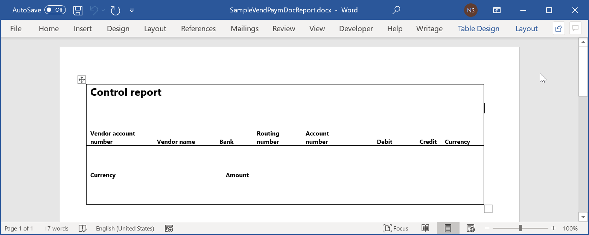
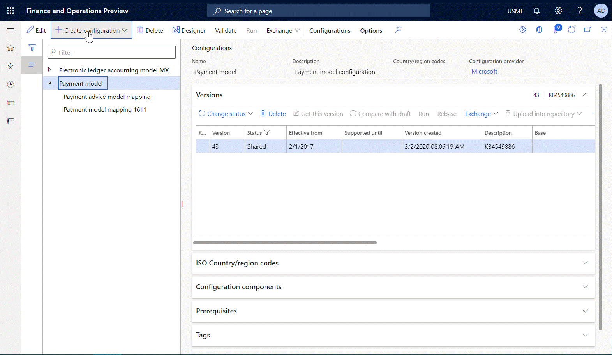
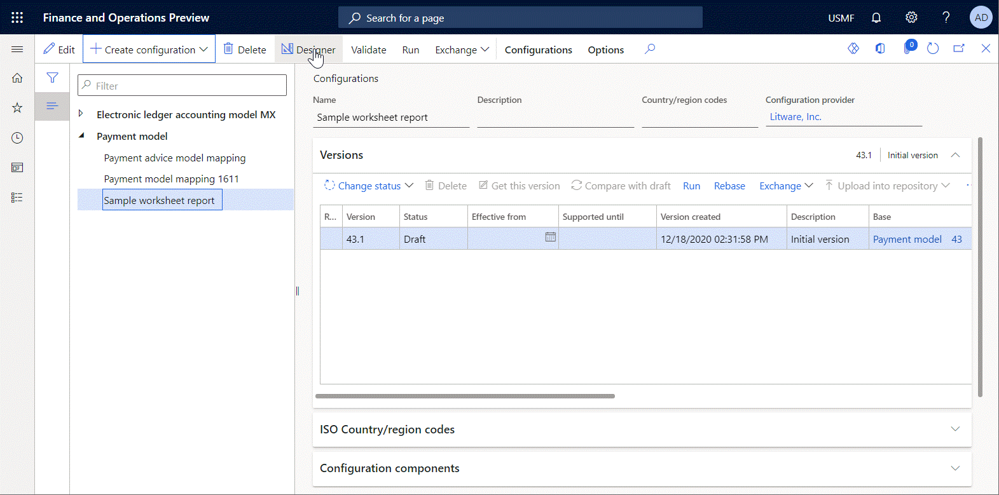
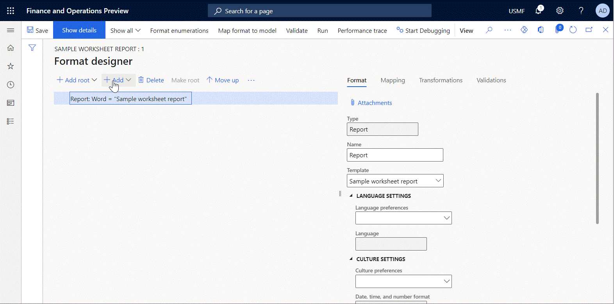
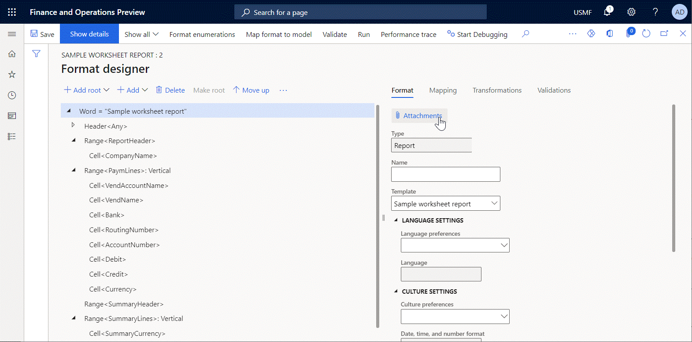
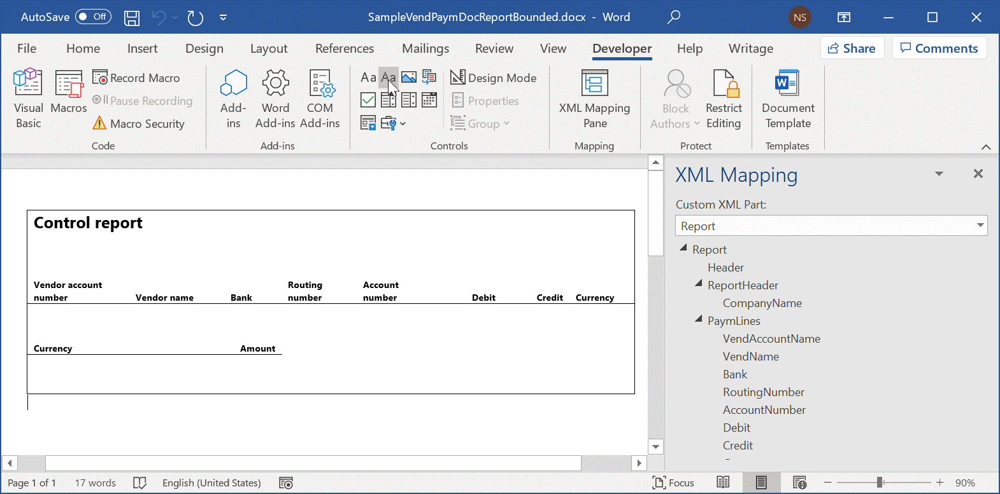
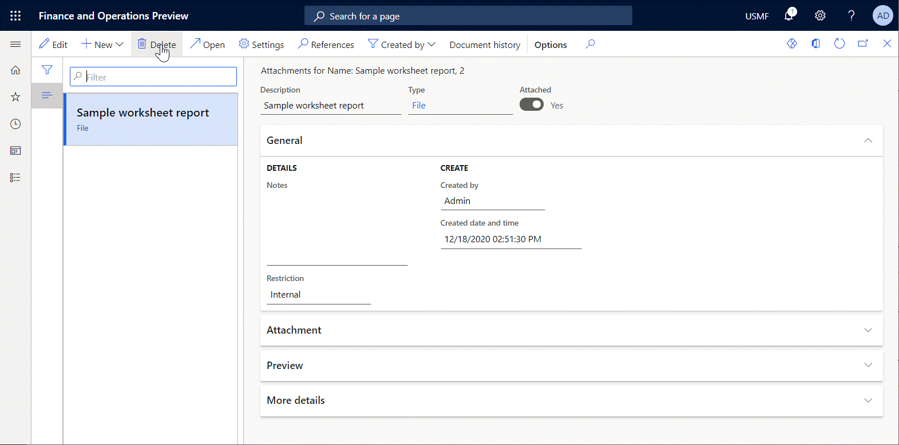

# Design a new ER configuration to generate reports in Word format

[!include [banner](../includes/banner.md)]

To generate reports as Microsoft Word documents, you must design a template for the reports by using, for example, the Word desktop application. The following illustration shows the sample template for the control report that can be generated to show details of processed vendor payments.

To use a Word document as a template for reports in Word format, you can configure a new [Electronic reporting (ER)](general-electronic-reporting.md) [solution](er-quick-start1-new-solution.md). This solution must include an ER [configuration](general-electronic-reporting.md#Configuration) that contains an ER format component.

> [!NOTE]
> When you create a new ER format configuration to generate reports in Word format, you must either select **Word** as the format type in the **Create configuration** drop-down dialog box or leave the **Format type** field blank.

The ER format component of the solution must contain the **Excel\\File** format element, and that format element must be linked to the Word document that will be used as the template for generated reports at runtime. To configure the ER format component, you must open the draft version of the created ER configuration in the ER format designer. Then add the **Excel\\File** element, attach your Word template to the editable ER format, and link that template to the **Excel\\File** element that you added.

> [!NOTE]
> When you attach a template, you must use a [document type](../../fin-ops/organization-administration/configure-document-management.md#configure-document-types) that has previously been [configured](electronic-reporting-er-configure-parameters.md#parameters-to-manage-documents) in the ER parameters to store templates of ER formats.

You can add **Excel\\Range** and **Excel\\Cell** nested elements for the **Excel\\File** element to specify the structure of data that will be entered in generated reports at runtime. You must then bind those elements to data sources of the editable ER format to specify the actual data that will be entered in generated reports at runtime.

When you save your changes to the ER format at design time, the hierarchical format structure is stored in the attached Word template as a [custom XML part](/visualstudio/vsto/custom-xml-parts-overview) that is named **Report**. You must access the modified template, download it from Finance, store it locally, and open it in the Word desktop application. The following illustration shows the locally stored sample template for the control report that contains the **Report** custom XML part.

When bindings of **Excel\\Range** and **Excel\\Cell** format elements are run at runtime, the data that every binding delivers comes into the generated Word document as an individual field of the **Report** custom XML part. To enter the values from the fields of the custom XML part in a generated document, you must add the appropriate Word [content controls](/office/client-developer/word/content-controls-in-word) to your Word template to serve as placeholders for data that will be filled in at runtime. To specify how content controls are filled in, map every content control to the appropriate field of the **Report** custom XML part.

You must then replace the original Word template of the editable ER format with the modified template that now contains Word content controls that were mapped to the fields of the **Report** custom XML part.

When you run the configured ER format, the attached Word template is used to generate a new report. The actual data is stored in the Word report as a custom XML part that is named **Report**. When the generated report is opened, the Word content controls are filled in with data from the **Report** custom XML part.

## Frequently asked questions

**Question:** I configured an ER format to print a Word document that contains a company address. In the Word template for this ER format, I inserted a rich text content control to present a company address. In Finance, I entered the company address as multiline text and selected **Enter** to add a carriage return for every line that I entered. Therefore, I expect the company address to appear as multiline text in generated documents. However, the address appears as a single line of text that contains special symbols instead of carriage returns. What is wrong with my settings?

**Answer:** Instead of using a rich text content control, you must use a plain text content control and select the **Allow carriage returns (multiple paragraphs)** check box in the control's properties.

## Additional resources

- [Reuse ER configurations with Excel templates to generate reports in Word format](./tasks/er-design-configuration-word-2016-11.md)
- [Embed images and shapes in documents that you generate by using ER](electronic-reporting-embed-images-shapes.md#embed-an-image-in-a-word-document)

[!INCLUDE[footer-include](../../../includes/footer-banner.md)]
