---
# required metadata

title: Design multilingual reports in Electronic reporting
description: This topic explains how you can use Electronic reporting (ER) labels to design and generate multilingual reports.
author: NickSelin
ms.date: 11/30/2021
ms.topic: article
ms.prod: 
ms.technology: 

# optional metadata

ms.search.form: ERDataModelDesigner, ERModelMappingDesigner, EROperationDesigner, ERExpressionDesignerFormula
# ROBOTS: 
audience: Application User, Developer, IT Pro
# ms.devlang: 
ms.reviewer: kfend
# ms.tgt_pltfrm: 
ms.custom: 
ms.assetid: 
ms.search.region: Global
# ms.search.industry: 
ms.author: nselin
ms.search.validFrom: 2016-02-28
ms.dyn365.ops.version: AX 7.0.0

---

# Design multilingual reports in Electronic reporting

[!include[banner](../includes/banner.md)]

## Overview

As a business user, you can use the [Electronic reporting (ER)](general-electronic-reporting.md) framework to configure formats for outbound documents that must be generated in accordance with the legal requirements of various countries or regions. When these requirements demand that outbound documents be generated in different languages for different countries or regions, you can configure a single ER format that contains language-dependent resources. In that way, you can reuse the format to generate outbound documents for various countries or regions. You might also want to use a single ER format to generate an outbound document in different languages for corresponding customers, vendors, subsidiaries, or any other parties.

You can configure ER data models and model mappings as the data sources of configured ER formats to define the data flow that specifies what application data is put into generated documents. As an ER configuration [provider](general-electronic-reporting.md#Provider), you can [publish](tasks/er-upload-configuration-into-lifecycle-services.md#upload-a-configuration-into-lcs) configured data models, model mappings, and formats as components of an ER solution to generate specific outbound documents. You can also allow customers to [upload](general-electronic-reporting-manage-configuration-lifecycle.md) the published ER solution so that it can be used and customized. If you expect that customers might speak other languages, you can configure the ER components so that they contain language-dependent resources. In that way, the content of an editable ER component can be presented in a customer's user-preferred language at design time.

You can configure language-dependent resources as ER labels. You can then use those labels to configure ER components for the following purposes:

- At design time:

    - Present the content of configured ER components in the user-preferred language.

- At runtime:

    - Generate language-dependent content for outbound documents.
    - Provide warning and error messages in the user-preferred language.
    - Prompt for required fields in the user-preferred language.

ER labels can be configured in every ER [configuration](general-electronic-reporting.md#Configuration) that contains different components. The labels can be maintained independently of the configured logic of ER data models, ER model mappings, and ER format components.

Every ER label is identified by an ID that is unique in the scope of the ER configuration that holds that label. Every label can contain label text for every language that is supported in the current instance of Microsoft Dynamics 365 Finance. These supported languages include the languages of deployed customizations.

## Entry

When you design an ER data model, an ER model mapping, or an ER format, the **Translate** option is shown whenever you select a field that might contain the translatable context. When you select this option, you can link the selected field to an ER label on the **Text translation** <a name="TextTranslationPane">pane</a>. You can select an existing ER label, or you can add a new ER label if it isn't available yet. When you select or add an ER label, you can add related text for every language that is supported in the current Finance instance.

The following illustration shows how this translation is done in an editable ER data model. In this example, the **Description** attribute of the **PurchaseOrder** field for the editable **Invoice model** is translated into the Austrian German (DE-AT) and Japanese (JA) languages.

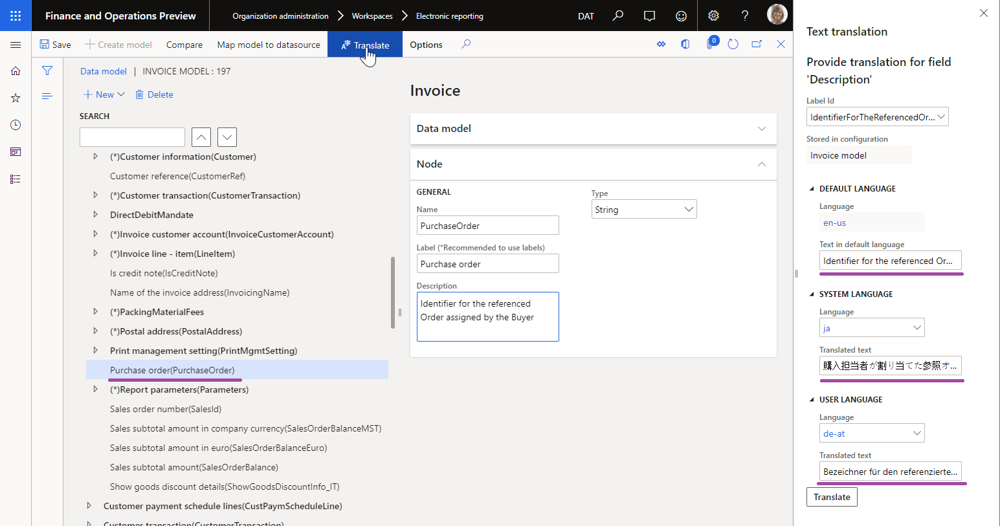

Only label text for labels that reside in an editable ER component can be translated. For example, if you select **Translate** for the label attribute of an ER model mapping data source, and you then select an ER label that resides in the parent ER data model, you will see the content of the label, but you can't change it. In these cases, the **Translated text** field is unavailable, as shown in the following illustration.

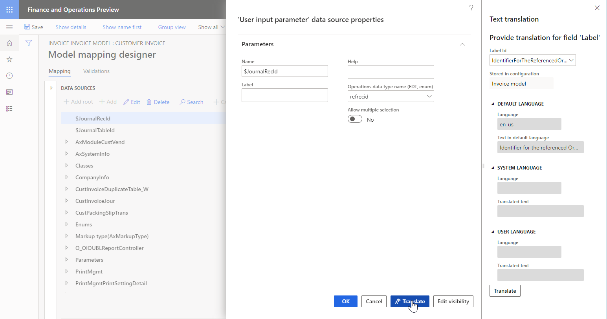

> [!NOTE]
> You can't use the designers to delete label that has been entered in an editable ER component.

## Scope

ER labels can be referred to in several translatable attributes of ER components.

### Data model component

When you configure an ER data model, you can add ER labels for it. **Label** and **Description** attributes of the model item, every model's field, and every model enumeration value can be linked to an ER label that is added to the ER data model.

When an ER data model is configured in this way, its content will be presented to users of the ER data model designer in each user's preferred language. Therefore, model maintenance is simplified. The following illustrations show how this functionality works for users who have DE-AT and JA set as their preferred language.

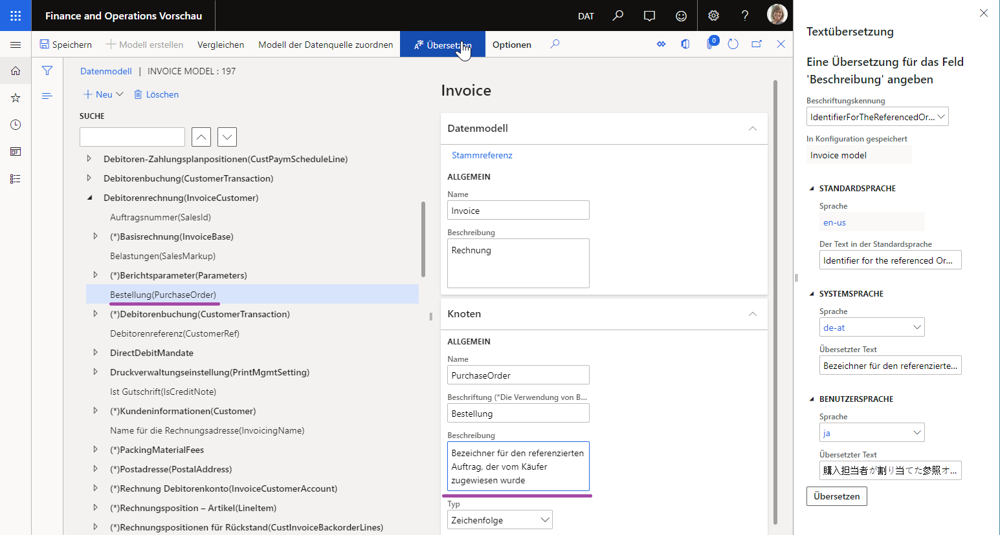

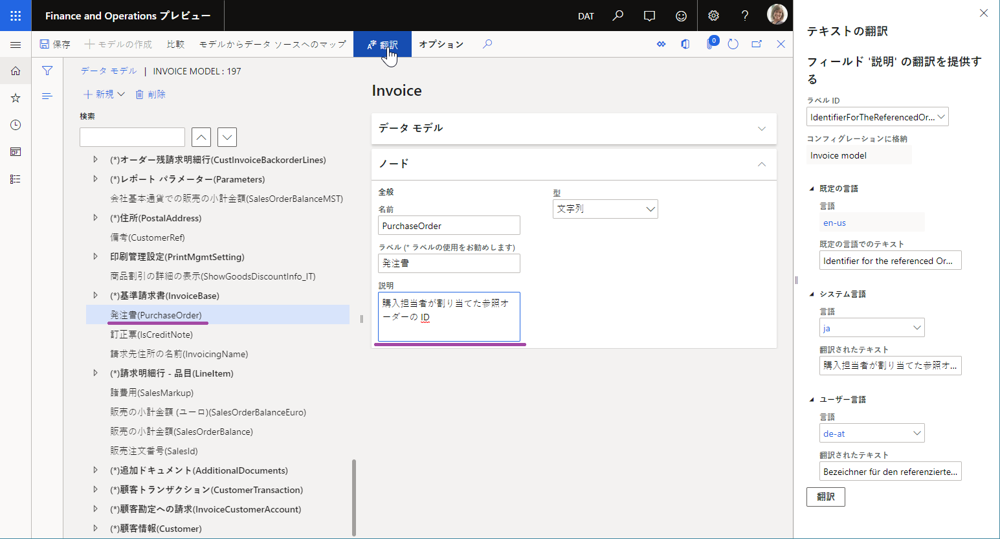

### Model mapping component

Because the ER model mapping is based on an ER data model, the labels of the data model elements that are referred to are appeared in the user's preferred language in the model mapping designer. The following illustration shows how the meaning of the **PurchaseOrder** field is explained in the editable model mapping by using the label of the **Description** attribute that has been added to the configured data model. Notice that this label is presented in the user's preferred language (DE-AT in this example).

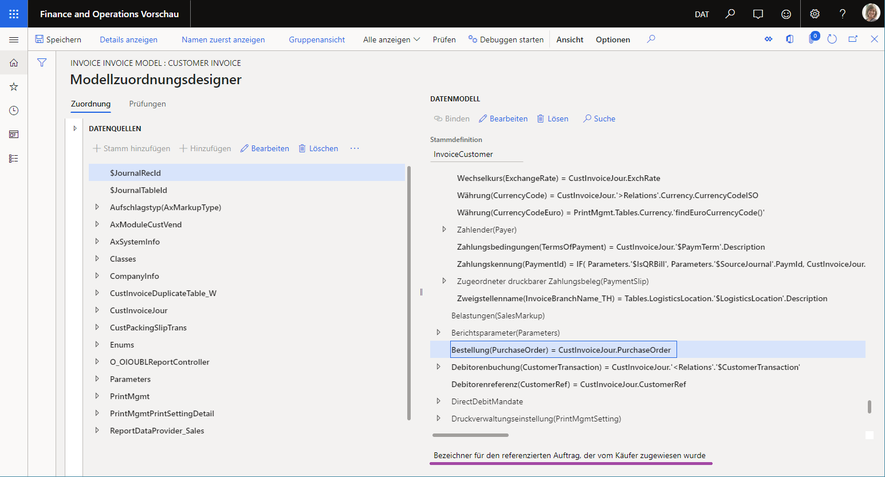

When the **Label** attribute of the **User input parameter** data source is configured as linked to an ER label, the parameter field that corresponds to this data source is presented in the user dialog box at runtime to users in their preferred language.

### Format component

When you configure an ER format, you can add ER labels for it. The **Label** and **Help text** attributes of every configured data source can be linked to an ER label that is added to the ER format. The **Label** and **Description** attributes of every format enumeration value can be also linked to an ER label that is accessible from the editable ER format.

> [!NOTE]
> You can also link these attributes to an ER label of the parent ER data model that reuses the model's labels in every ER format that is configured for this ER data model.

When an ER format is configured in this way, the content of the format will be presented to users of the ER Operation designer in each user's preferred language. Therefore, format maintenance and analysis of the configured logic are simplified.

Because an ER format is based on an ER data model, the labels that are referred to in the data model elements are presented in the ER format designer in the user-preferred language.

When the **Label** attribute of the **User input parameter** data source is linked to an ER label, the field that corresponds to the parameter in the user dialog box at runtime is presented to the user as a prompt. The following illustrations show how you can link the **Label** attribute of the **User input parameter** data source at design time to an ER label, so that users are prompted for the parameter in different user-preferred languages (shown for English United States (EN-US) and DE-AT languages) at runtime.

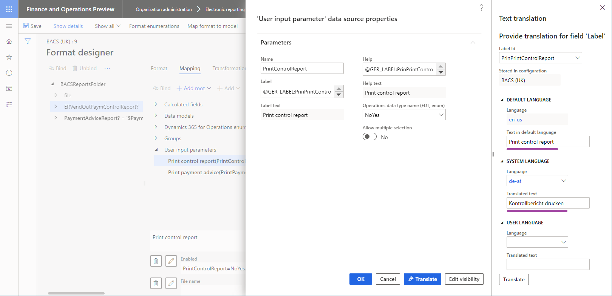

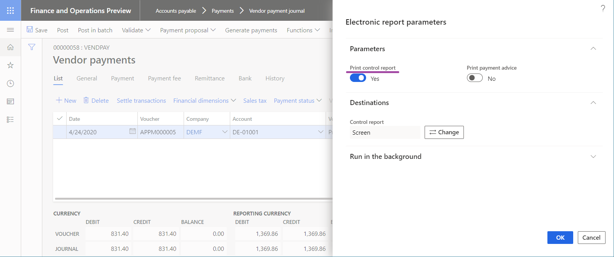

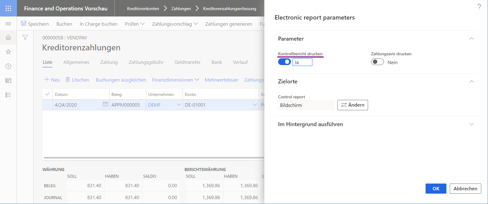

### Expressions

To use a label in an ER [expression](er-formula-language.md), you must use the syntax **@"GER\_LABEL:X"**, where the prefix **@** indicates that the operand refers to a label, **GER\_LABEL** indicates that an ER label is involved, and **X** is the ER label ID.

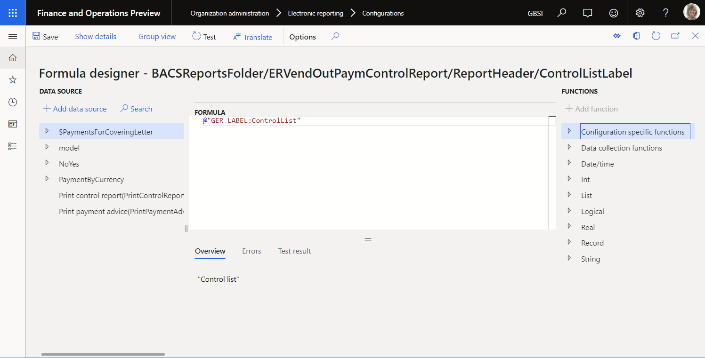

To refer to a system (application) label, use the syntax **@"X"**, where the prefix **@** indicates that the operand refers to a label, and **X** is the system label ID.

#### Model mapping

An expression of an ER model mapping can be configured by using a label. When this mapping is called by an ER format that is run to generate an outbound document, the context of the execution includes a language code. A configured expression label will be filled in with the label text that has been configured for the language of that context.

If a referenced label has no translation for the language of the format execution context that calls the model mapping, the label text in the EN-US language is used instead.

#### Format

An ER expression of an ER format can be configured by using labels. When this format is run to generate an outbound document, the context of the execution includes a language code. A configured expression label will be filled in with the label text that has been configured for the language of that context.

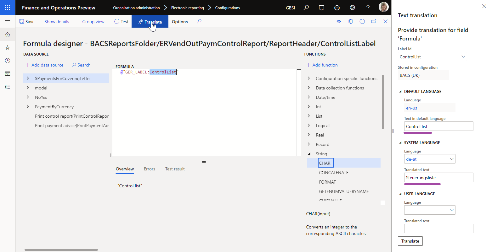

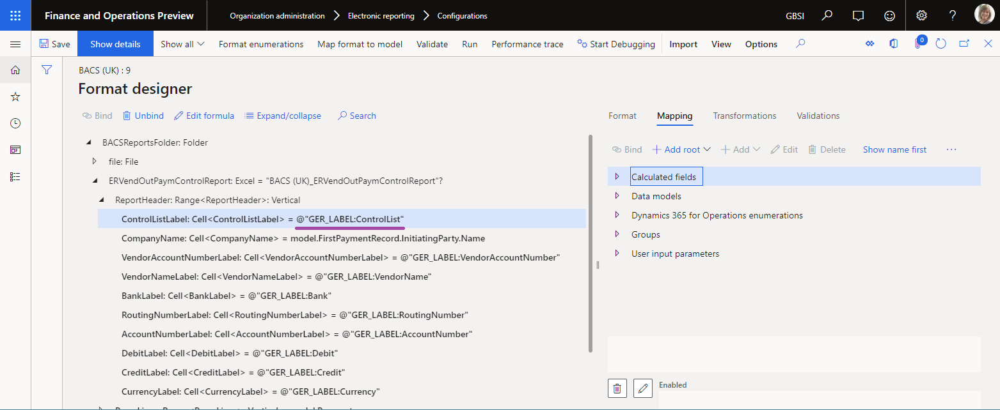

You can configure the **FILE** component of an ER format to generate the report in the user's preferred language.

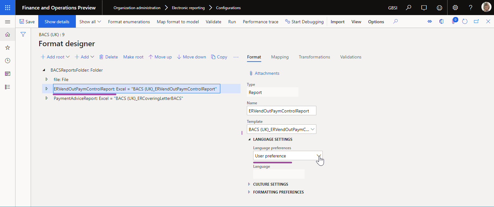

If you configure an ER format in this way, the report is generated by using the corresponding text of the ER labels. The following illustrations show examples of reports for the EN-US and DE-AT user languages.

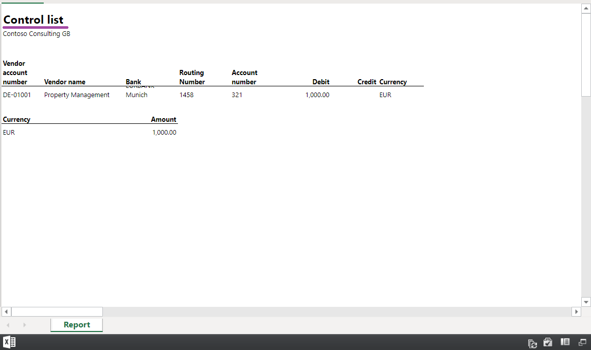

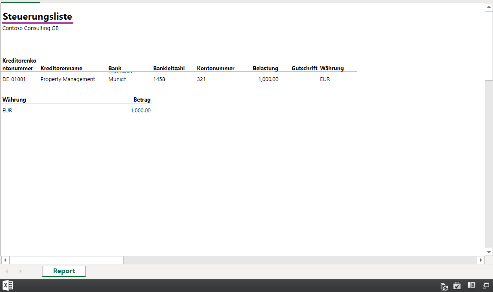

If a referenced label has no translation for the language of the format execution context, the label text in the EN-US language is used instead.

## Language

ER supports different ways to specify a language for a generated report. In the **Language preferences** field on the **Format** tab, you can select the following values:

- **Company preference** – Generate a report in a company-specified language.

    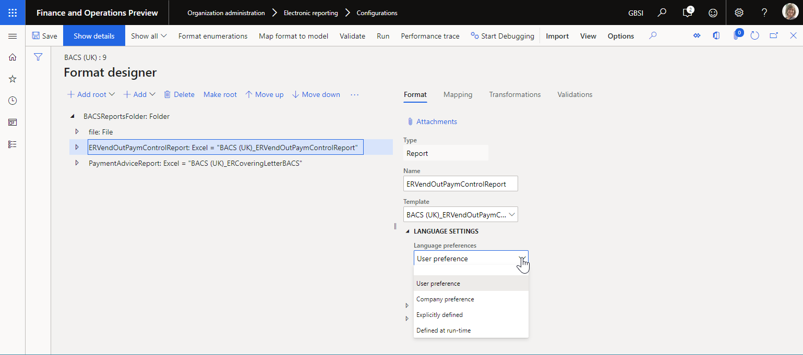

- **User preference** – Generate a report in the user's preferred language.
- **Explicitly defined** – Generate a report in a language that is specified at design time.

    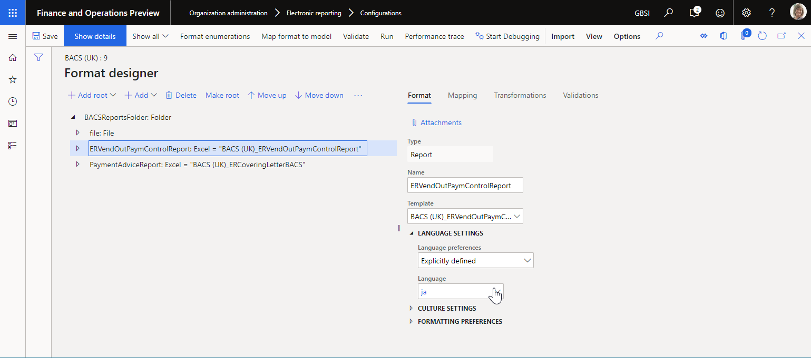

- **Defined at run-time** – Generate a report in a language that is specified at runtime. If you select this value, in the **Language** field, configure an ER expression that returns the language code for the language, such as the language of the corresponding customer.

    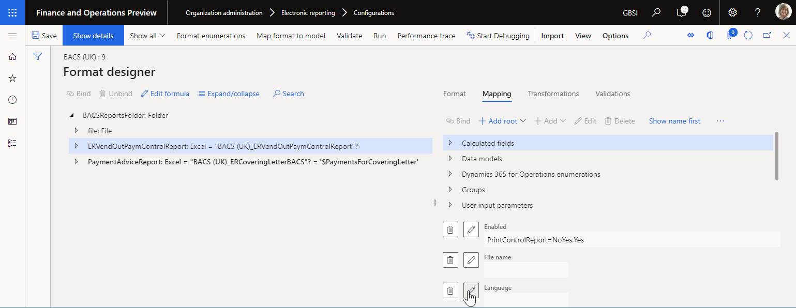

## Culture-specific formatting

ER supports different ways to specify the culture for a generated report. Therefore, the correct culture-specific formatting can be used for date, time, and numeric values. When you design an ER format, on the **Format** tab, in the **Culture preferences** field, you can select one of the following values for every format component of the **Common\\File**, **Excel\\File**, **PDF\\File**, or **PDF\\Merger** type:

- **User preference** – Format the values according to the user's preferred culture. That culture is defined in the **Date, time, and number format** field on the **Preferences** tab of the **User options** page.

    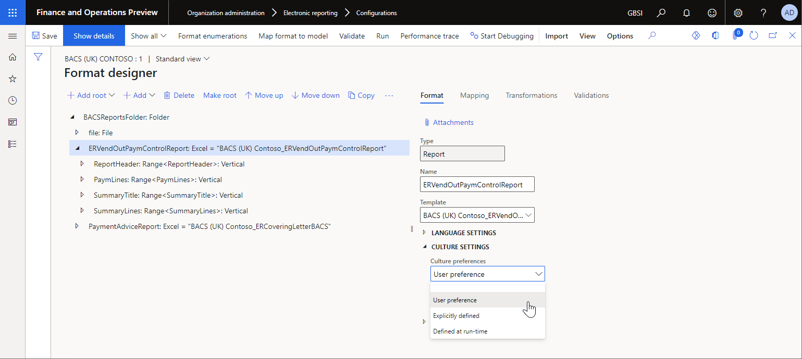

- **Explicitly defined** – Format the values according to the culture that is specified at design time.

    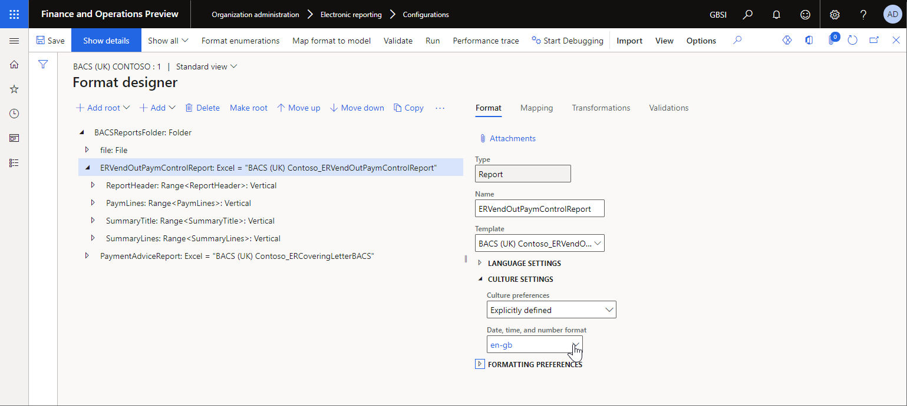

- **Defined at run-time** – Format the values according to the culture that is specified at runtime. If you select this value, on the **Mapping** tab, in the **Date, time, and number format** field, configure an ER expression that returns the culture code for the culture, such as the culture of the corresponding customer.

    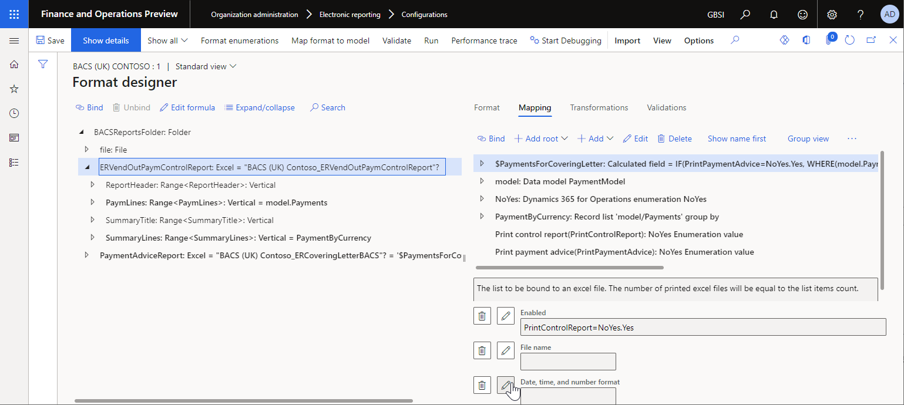

> [!NOTE]
> An ER component that you define a specific culture for might contain child ER components that were configured to fill in a text value. By default, the culture of the parent component is used to format the values of those components. You can use the following built-in ER functions to configure bindings for those components and apply an alternative culture for value formatting:
>
> - [DATEFORMAT](er-functions-datetime-dateformat.md#syntax-2)
> - [DATETIMEFORMAT](er-functions-datetime-datetimeformat.md#syntax-2)
> - [NUMBERFORMAT](er-functions-text-numberformat.md#syntax-2)
>
> In version 10.0.20 and later, the locale of format components of the **Common\\File** and **Excel\\File** types is used to format values during [PDF conversion](electronic-reporting-destinations.md#OutputConversionToPDF) of a generated document.

## Translation

You can add required ER labels to an editable ER component. When an ER label is added, it can be translated in two ways: manually and automatically.

### Manual translation

When you add an ER label on the **Text translation** [pane](#TextTranslationPane), you can manually translate it into all languages that are supported in the current Finance instance. You can select the preferred language in the **Language** field in the **System language** or **User language** section, enter the appropriate text in the corresponding **Translated text** field, and then select **Translate**. This process must be repeated for every required language and every label that you add.

### Automatic translation

Configuration of an ER component is done in the draft version of the ER configuration that the editable ER component resides in.

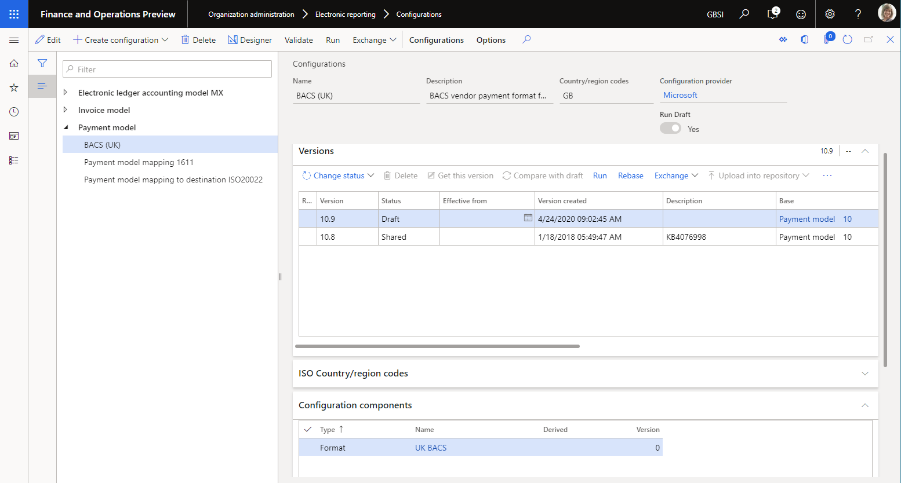

As described earlier in this topic, you can add required ER labels to an editable ER component. In this way, you can specify the text of the ER labels in the EN-US language. You can then export the labels of the ER component by using the built-in ER function. Select the draft version of an ER configuration that contains the editable ER component, and then select **Exchange \> Export labels**.

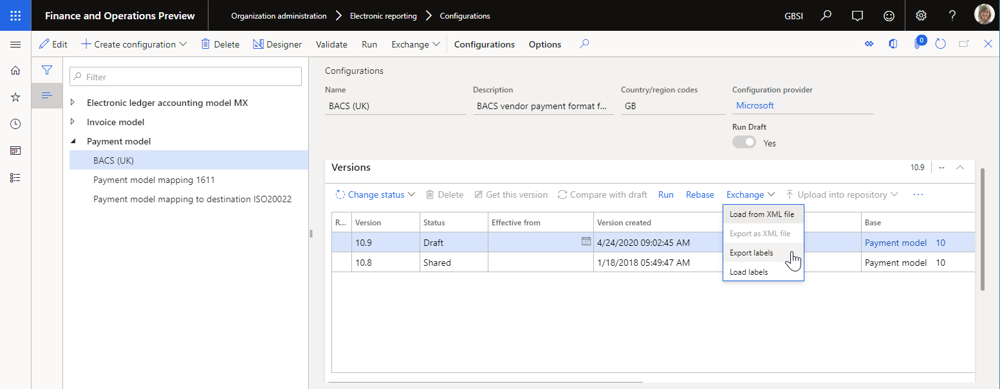

You can export either all labels or the labels for a single language that you specify at the beginning of export. Labels are exported as a zip file that contains XML files. Every XML file contains labels for a single language.

This format is used for automatic translation of labels by  external translation services such as [Dynamics 365 Translation Service](../lifecycle-services/translation-service-overview.md). When you receive the translated labels, you can import them back into the draft version of an ER configuration that contains the ER components that own those labels. Select the draft version of an ER configuration that contains the editable ER component, and select **Exchange \> Load labels**.

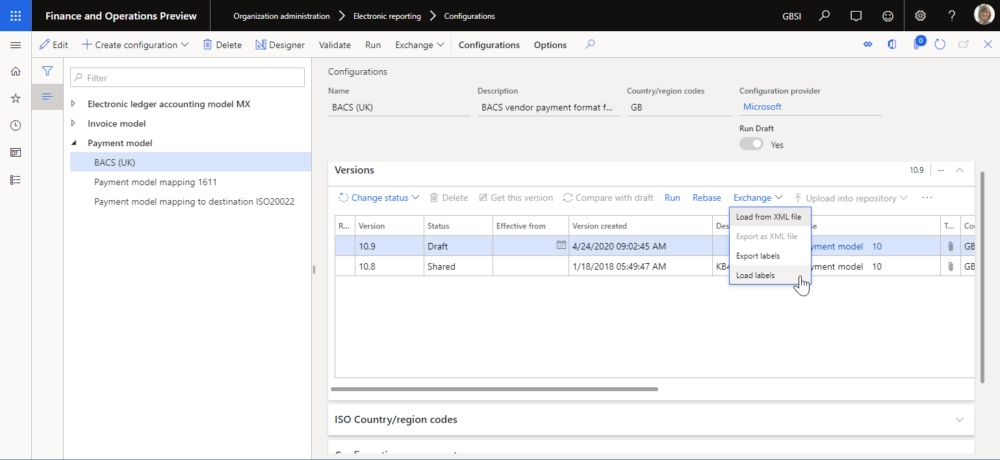

Translated labels will be imported into the selected ER configuration. Translated labels that exist in this ER configuration are replaced. If any translated label is missing in the ER configuration, it's appended.

## Lifecycle

Labels of an ER component that can be edited are kept, together with other content for the component, in the appropriate version of an ER configuration.

Labels of a base ER component can be referred to in a derived version of the ER component that you create to introduce your modifications.

ER versioning controls label assignment to any attribute in an ER component. Changes to the label assignment are recorded in the list of changes (delta) of an editable ER component that has been created as a derived version of the provided ER component. These changes will be validated when a derived version is rebased to a new base version.

## Functions

The built-in [LISTOFFIELDS](er-functions-list-listoffields.md) ER function can access ER labels that have been configured for some items of ER components.

As described earlier in this topic, the **Label** and **Description** attributes of every [model](#LinkModelEnum) or [format](#LinkFormatEnum) ER enumeration's value can be linked to an ER label that is accessible in the appropriate ER component. You can configure an ER expression where you call the **LISTOFFIELDS** function by using the ER enumeration as an argument. This expression returns a list that contains a record for every value of an ER enumeration that has been defined as an argument of this function. Every record contains the value of an ER label that is linked to an ER enumeration value:

- The value of an ER label that is linked to the **Label** attributes is stored in the **Label** field of the returned record.
- The value of an ER label that is linked to the **Description** attributes is stored in the **Description** field of the returned record.

## Performance

When you configure an ER format component to generate a report in your preferred [language](#language), or to import an inbound document where the content is parsed by your preferred language, we recommend that you enable the **Cache the preferred language of the current user for ER runs** feature in the [Feature management](../../fin-ops/get-started/feature-management/feature-management-overview.md) workspace. This feature helps improve performance, especially for ER format components that contain multiple references to labels in ER formulas and bindings and many [validation](general-electronic-reporting-formula-designer.md#TestFormula) rules to generate user messages in your preferred language.

When you change the status of an ER configuration version from **Draft** to **Completed**, if the configuration version contains ER labels, those labels are stored in the application database. The storage schema depends on the state of the **Accelerate the ER labels storage** feature:

- If the feature isn't enabled, all labels are stored in the **LABELXML** field of the **ERSOLUTIONVERSIONTABLE** table as a single XML snippet.
- If the feature is enabled, a separate record is created for each language in the **ERSOLUTIONVERSIONLABELSTABLE** table. The **CONTENTS** field of this table stores labels per language as a compressed XML snippet.

We recommend that you enable the **Accelerate the ER labels storage** feature in the **Feature management** workspace. This feature helps improve network bandwidth utilization and overall system performance because, in most cases, ER labels of a single language are used when you work with a single ER configuration.

To apply the selected storage schema for keeping labels of all ER configurations in the currenet Finance instance, complete the following steps.

1. Go to **Organization administration** > **Periodic** > **Apply the selected labels storing schema for all ER configurations**.
2. Select **OK**.

## Additional resources

- [Electronic Reporting overview](general-electronic-reporting.md)
- [Electronic Reporting functions](er-formula-language.md#Functions)

[!INCLUDE[footer-include](../../../includes/footer-banner.md)]
