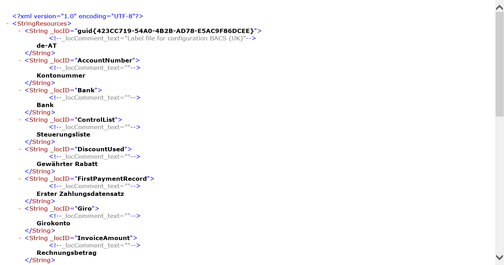

---
# required metadata

title: Design multilingual reports in Electronic reporting
description: This topic explains how you can use Electronic reporting labels to design and generate multilingual reports.
author: NickSelin
manager: AnnBe
ms.date: 04/24/2020
ms.topic: article
ms.prod: 
ms.service: dynamics-ax-platform
ms.technology: 

# optional metadata

ms.search.form: ERDataModelDesigner, ERModelMappingDesigner, EROperationDesigner, ERExpressionDesignerFormula
# ROBOTS: 
audience: Application User, Developer, IT Pro
# ms.devlang: 
ms.reviewer: kfend
ms.search.scope: Core, Operations
# ms.tgt_pltfrm: 
ms.custom: 
ms.assetid: 
ms.search.region: Global
# ms.search.industry: 
ms.author: nselin
ms.search.validFrom: 2016-02-28
ms.dyn365.ops.version: AX 7.0.0

---

# Design multilingual reports

[!include[banner](../includes/banner.md)]

## Overview

As a business user, you can use the [Electronic reporting (ER)](general-electronic-reporting.md) framework to configure formats of outbound documents that must be generated in accordance with the legal requirements of various countries/regions. When these requirements demand outbound documents be generated in different languages for various countries/regions, you may configure a single ER [format](general-electronic-reporting.md#FormatComponentOutbound) that contains language-dependent resources to re-use this format to generate outbound documents for various countries/regions. You may also want to use a single ER format to generate an outbound document in different languages for corresponding customers, vendors, subsidiaries, or any other parties.

You can configure ER data models and model mappings as the data sources of configured ER formats that can define the dataflow that specifies what application data is placed in generated documents. As an ER solution provider, you can [publish](tasks/er-upload-configuration-into-lifecycle-services.md#upload-configuration-into-lcs) configured [data model](general-electronic-reporting.md#data-model-and-model-mapping-components), [model mapping](general-electronic-reporting.md#data-model-and-model-mapping-components) and [formats](general-electronic-reporting.md#FormatComponentOutbound) as components of an ER solution to generate specific outbound documents. You may allow customers to [upload](general-electronic-reporting-manage-configuration-lifecycle.md) the published ER solution for use and customization. When you expect that customers may speak other languages, configure the ER components to contain language dependent resources to allow the presentation of the content of an editable ER component in customer's user preferred language at design time.

You can configure language dependent resources as ER labels. You can then use those labels to configure ER components to achieve the
following:

- At design time:

    - Present the content of configured ER components in the user-preferred language

-   At runtime:

    - Generate language-dependent content of outbound documents
    - Provide the user with Infolog messages about warnings/errors in the user-preferred language
    - Prompt fields that must be filled in by user in the user-preferred language

ER labels can be configured in every ER [configuration](general-electronic-reporting.md#Configuration) that contains different components. The labels can be maintained independently from the configured logic of ER data models, ER model mappings, and ER format components.

Every ER label is identified by the ID that is unique in scope of the ER configuration holding this label. Every label may contain a label text for every language that is supported in the current Finance instance including the languages of deployed customizations.

## Entry

When you design an ER data model, an ER model mapping, or an ER format, the **Translate** option is offered to you whenever you select a field that may contain the translatable context. When you select this option, you can link a selected field with an ER label. You can either select an existing one or add a new ER label if it is not available yet. When you add or select an ER label, you can add related text for every language that is supported in the current Finance instance.

The following screenshot shows how this translation is performed for the DE-AT and JA languages in an editable ER data model for the **Description** attribute of the select **PurchaseOrder** data model’s field.

Only label text for labels that reside in the editable ER component can be translated. For example, if you select **Translate** for the label attribute of an ER model mapping data source, and then select a parent ER data model residing label, you will see the content of this label but you won't be able to modify it. In such cases, the **Translated text** field is not enabled.
>
>

>
> [!NOTE]
> You can't delete an entered label from the editable ER component by using the designers.

## Scope

ER labels can be referred to in several translatable attributes of ER components.

### Data model component

When you configure an ER data model, you can add ER labels for it. **Label** and **Description** attributes of the model item, every model’s field and every <a name="LinkModelEnum">model enumeration</a> value can be linked to an ER label that you added to this ER data model.

When an ER data model is configured this way, the content of the data model will be presented for end-users in the ER data model designer in the user's preferred language which simplifiesmodel maintenance. The following screenshots show how this works for users with the preferred languages of DE-AT and JA.

### Model mapping component

Because the ER model mapping is based on an ER data model, the labels of the data model elements that are referred to are used in the model mapping designer in the user's preferred language. The presented following illustration shows how the meaning of the **PurchaseOrder** field is explained in the editable model mapping by using the label of the **Description** attribute that has been added to the configured data model. Note that this label is presented in the user preferred languate, DE-AT.

When the **Label** attribute of the **User input parameter** data source is configured as linked to an ER label, the data source that corresponds with this parameter field on the user dialog page at runtime is offered to the user in their preferred language.

### Format component

When you configure an ER format, you can add ER labels to it. The **Label** and **Help text** attributes of every configured data source can be linked to an ER label that is added to this ER format. The **Label** and **Description** attributes of every <a name="LinkFormatEnum">format enumeration</a> value can be also linked to an ER label that is accessible from the editable ER format.

> [!NOTE]
> You can also link these attributes to an ER label of the parent ER data model that reuses the model’s labels in every ER format that might be configured for this ER data model.

When an ER format is configured this way, the content of this format will be presented to users in the ER Operation designer in the preferred language simplifying its maintenance and analysis of the configured logic.

Because an ER format is based on an ER data model, the labels referred to in the data model elements are presented in the ER format designer in the users preferred language.

When the **Label** attribute of the **User input parameter** data source is linked to an ER label, the field that corresponds with this parameter on the user dialog page at runtime is offered as a prompt to the user. The following illustration shows how you can link the **Label** attribute of the **User input parameter** data source at design time to prompt this parameter for end users in different user preferred languages at runtime. 

### Expressions

When you want to use a label in an ER [expression](er-formula-language.md), you need to follow this syntax: `@"GER_LABEL:X"` where `@` is the prefix meaning that this operand refers to a label. `GER_LABEL` informs you that this is an ER label and `X` is an ER label ID.

If you want to refer to a system (application) label, use the following syntax: `@"X"` where `@` is the prefix meaning that this operand refers to a label and `X` is a system label ID.

#### Model mapping

An expression of an ER model mapping can be configured using a label. When this mapping is called by an ER format that is executed to generate an outbound document, the context of this execution includes a language code. A configured expression label will be filled in with the label text that has been configured for a language of the context of this execution.
 
When a referred label contains no translation to the language of the executed format context that calls this model mapping, the EN-US language text is used instead.

#### Format

The ER expression of an ER format can be configured using labels. When this format is executed to generate an outbound document, the context of this execution includes a language code. A configured expression label will be filled in by the label text that has been configured for a language of the context of this execution.

You can configure the **FILE** component of an ER format to generate the report in the user's preferred language.

If you configured an ER format this way, the report is generated using the corresponding text of ER labels as shown in the following graphics for the EN-US and DE-AT user languages.

When a referred label contains no translation to a language of the context of format execution, the EN-US language text is used instead.

## Language

ER supports different ways to specify a language for a generated report.

- Select **Company preference** to generate a report in a company-specified language.

    
    
- Select **User preference** to generate a report in the user's preferred language.

    

- Select **Explicitly defined** to generate a report in language that is specified at design time.

    

- Select **Defined at run-time** to generate a report in a language that is specified at runtime. In the **Language** field, configure an ER expression that returns the language code for this. For example, the language of the corresponding customer.

    

## Translation

You can add required ER labels to the editable ER component. When an ER label is added, it can be translated in two ways, manual and automatic.

### Manual

When you add an ER label, you can translate it manually in all languages that are supported in the current Finance instance. You can select the preferred language in the **Language** field of the **System language** or **User language** field groups, and enter the appropriate text in the corresponding **Translated text** field and select **Translate**. This must be repeated for all required languages and every label you add.

### Automatic

When you configure your ER component, you do it in the draft version of the ER configuration that the editable ER component resides in.

As described earlier in this topic, you can add required ER labels to the editable ER component. By doing this, you can specify the text of added ER labels in the EN-US language. Then, you can export labels of this ER component by using the built-in ER function. You need to select the draft version of an ER configuration that contains the editable ER component, and then select **Export labels**.

You can export either all labels or the labels for a single language that you pecify at the beginning of export. Labels are exported as a zipped file that contains XML files. Every XML file contains a label for a single language.

This format is used for automatic translation of labels by using external translation services like [Dynamics 365 Translation Service](../lifecycle-services/translation-service-overview.md). When you receive the translated labels, you can import them back to the draft version of an ER configuration that contains the ER components that own those labels. You need to select the draft version of an ER configuration that contains the editable ER component and select **Load labels**.

Translated labels will be imported to the selected ER configuration. Any missing translated label in this ER configuration will be appended. Translated labels that exist in this ER configuration will be replaced.

## Lifecycle

Labels of an  ER component that can be edited are kept with other content for this component in the appropriate version of an ER configuration.

Labels of a base ER component can be referred in a derived version of this ER component when you created a derived copy of it to introduce your modifications.

Label assignment to any attribute in an ER component is controlled in ER versioning. Changes of such assignment is the subject to record in the list of changes (delta) of an editable ER component that has been created as a derived version of the provided ER component. Such changes will be validated while a derived version is rebased to a new base version. 

## Functions

The [LISTOFFIELDS](er-functions-list-listoffields.md) built-in ER function can access ER labels that have been configured for some items of ER components.

As described earlier in this topic, the **Label** and **Description** attributes of every [model](#LinkModelEnum) or [format](#LinkFormatEnum) ER enumeration’s value can be linked to an ER label that is accessible in the appropriate ER component. You can configure an ER expression in which you call the `LISTOFFIELDS` function using the ER enumeration as an argument. This expression returns a list that contains a record for every value of an ER enumeration that has been defined as an argument of this function. Every record contains the value an ER label that is linked with an ER enumeration value:

-   Value of an ER label that is linked with the **Label** attributes is stored in the **Label** field of the returned record.
-   Value of an ER label that is linked with the **Description** attributes is stored in the **Description** field of the returned record.

## Additional resources

-   [Electronic Reporting overview](general-electronic-reporting.md)
-   [Electronic Reporting functions](er-formula-language.md#functions)
