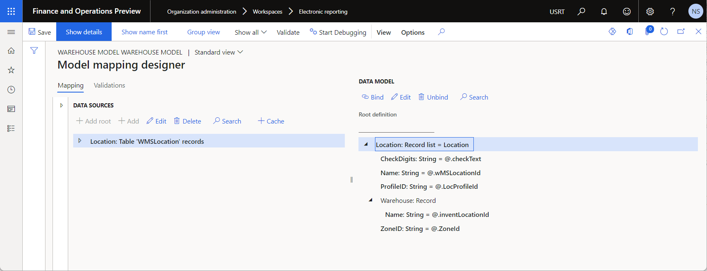

# Design a new ER solution to print ZPL labels

[!include [banner](../includes/banner.md)]

This article explains how a user in the System Administrator, Electronic Reporting Developer, or Electronic Reporting Functional Consultant role can configure parameters of the [Electronic reporting (ER)](general-electronic-reporting.md) framework, design the required ER [configurations](general-electronic-reporting.md#Configuration) of a new ER solution to access the data of the Warehouse management system, and generate custom warehouse location labels in Zebra Programming Language (ZPL) II format. You can complete these steps in the **USRT** company.

## Business scenario

You represent a company that implemented warehouse management in Microsoft Dynamics 365 Finance. Every warehouse location must be labeled with a self-adhesive label that includes a bar code. Warehouse workers use handheld bar code readers to scan the bar codes.

All warehouse locations are labeled in the scope of pre-go-live activities. However, you must also be able to print warehouse location labels on demand if existing labels become damaged or warehouse shelving is reconfigured. By using recently released ER functionality, you can configure a new ER solution that lets a warehouse supervisor print labels directly to a thermal label printer.

## Configure the ER framework

Follow the steps in [Configure the ER framework](er-quick-start2-customize-report.md#ConfigureFramework) to set up the minimal set of ER parameters. You must complete this setup before you start to use the ER framework to design a new ER solution.

## Design a domain-specific data model

Create a new ER configuration that contains a [data model](er-overview-components.md#data-model-component) component for the Warehouse management domain. You use this data model as a data source later, when you design an ER format to generate warehouse location labels.

### Import a data model configuration

Follow these steps to import the required data model from an XML file that Microsoft provides. Alternatively, you can create your own data model as described in the next section.

1. Download the [Warehouse model.version.1.xml](https://download.microsoft.com/download/9/f/1/9f136e9b-bf5f-403a-b089-a2b2ed1da2ba/Warehouse-model.version.1.xml) file, and save it to your local computer.
1. Go to **Organization administration** > **Workspaces** > **Electronic reporting**.
1. In the **Electronic reporting** workspace, select **Reporting configurations**.
1. On the **Configurations** page, on the Action Pane, select **Exchange** > **Load from XML file**.
1. Select **Browse**, and then find and select the **Warehouse model.version.1.xml** file.
1. Select **OK** to import the configuration.

:::image type="content" source="./media/er-design-zpl-labels-imported-model.png" alt-text="Screenshot of imported ER data model configuration on the Configurations page.":::

### Create a data model configuration

Instead of importing the Microsoft-provided data model file, you can create a data model from scratch. For an example that shows how to complete this task, see [Create a new data model configuration](er-quick-start1-new-solution.md#DesignDataModel).

### Review the data model

You can view an editable version of the configured data model on the **Data model designer** page.

:::image type="content" source="./media/er-design-zpl-labels-model.png" alt-text="Screenshot of the structure of the ER data model on the Data model designer page.":::

## Design a model mapping for the configured data model

As a user in the Electronic Reporting Developer role, you must create a new ER configuration that contains a [model mapping](er-overview-components.md#model-mapping-component) component for the Warehouse data model. This component implements the configured data model for Dynamics 365 Finance and is specific to that app. You must configure it to specify the application objects that fill the configured data model with application data at runtime. To complete this task, you must understand how the data structure of the Warehouse management business domain is implemented in Finance.

### Import a model mapping configuration

Follow these steps to import the required model mapping from an XML file that Microsoft provides. Alternatively, you can create your own model mapping as described in the next section.

1. Download the [Warehouse model mapping.version.1.1.xml](https://download.microsoft.com/download/1/c/c/1cc94d28-3d90-4ffd-a118-77d6c322904f/Warehouse-model-mapping.version.1.1.xml) file, and save it to your local computer.
1. Go to **Organization administration** > **Workspaces** > **Electronic reporting**.
1. In the **Electronic reporting** workspace, select **Reporting configurations**.
1. On the **Configurations** page, on the Action Pane, select **Exchange** > **Load from XML file**.
1. Select **Browse**, and then find and select the **Warehouse model mapping.version.1.1.xml** file.
1. Select **OK** to import the configuration.

:::image type="content" source="./media/er-design-zpl-labels-imported-mapping.png" alt-text="Screenshot of imported ER model mapping configuration on the Configurations page.":::

### Create a model mapping configuration

Instead of importing the Microsoft-provided model mapping file, you can create a model mapping from scratch. For an example that shows how to complete this task, see [Create a new model mapping configuration](er-quick-start1-new-solution.md#CreateModelMapping).

### Review the model mapping

You can view an editable version of the configured model mapping on the **Model mapping designer** page.



## Design a format

As a user in the Electronic Reporting Functional Consultant role, you must create a new ER configuration that contains a [format](er-overview-components.md#format-component) component. To configure this component, use ZPL II code to specify the layout of your warehouse location label.

### Import a format configuration

Follow these steps to import the required format from an XML file that Microsoft provides. Alternatively, you can create your own format as described in the next section.

1. Download the [Warehouse location labels.version.1.1.xml](https://download.microsoft.com/download/5/7/5/5758b551-69a5-45bd-a2b2-21c3db73a6fc/Warehouse-location-labels.version.1.1.xml) file, and save it to your local computer.
1. Go to **Organization administration** > **Workspaces** > **Electronic reporting**.
1. In the **Electronic reporting** workspace, select **Reporting configurations**.
1. On the **Configurations** page, on the Action Pane, select **Exchange** > **Load from XML file**.
1. Select **Browse**, and then find and select the **Warehouse location labels.version.1.1.xml** file.
1. Select **OK** to import the configuration.

:::image type="content" source="./media/er-design-zpl-labels-imported-format.png" alt-text="Screenshot of imported ER format configuration on the Configurations page.":::

### Create a format configuration

Instead of importing the Microsoft-provided format file, you can create a format from scratch. For an example that shows how to complete this task, see [Create a new format configuration](er-quick-start1-new-solution.md#FormatCreate).

### Review the format

You can view an editable version of the configured format on the **Format designer** page.

:::image type="content" source="./media/er-design-zpl-labels-format.png" alt-text="Screenshot of the structure of the ER format on the Format designer page.":::

The `model.Location.Label` data source of this format is configured to generate labels that contain the following information:

- The warehouse title as text
- The warehouse title as a bar code
- The location title
- Check digits

On the **Formula designer** page for the data source, the ER formula that generates labels includes a `CONCATENATE` function that combines the information in the desired layout.

:::image type="content" source="./media/er-design-zpl-labels-review-formula.png" alt-text="Screenshot of the formula for the data source on the Formula designer page.":::

> [!TIP]
> The label layout is designed so that the location title and the check digits are aligned in the center of the label. However, ZPL II doesn't support center alignment for bar codes. Therefore, the formula of the `model.Location.Warehouse.Alignment` data source aligns the bar code in the center of the label. This formula calculates the left offset of the bar code, based on the number of characters in the warehouse title.

## Prepare your environment for previewing generated labels

The following example uses a printer emulator application for ZPL labels to show a preview of generated labels on the screen. Follow these steps to enable this option.

1. Add the [Printer](er-destination-type-print.md) ER destination for the **Warehouse location label** ER format, and configure it to send generated labels from Finance to the [Document routing agent (DRA)](install-document-routing-agent.md).
1. Install and configure the DRA to route generated labels from Finance to a local printer that you can access from the current workstation.
1. Add a local printer for the current workstation, and configure it to pass generated labels from the DRA to a printer emulator application.
1. Install a printer emulator application as an extension of the Chrome web browser, and configure it to pass generated labels from a local printer to a web service that renders generated labels and returns them to the printer emulator for preview.

| Data flow | Finance | | Document routing agent | | Local printer | | Printer emulator | | Rendering web service |
|---|---|---|---|---|---|---|---|---|---|
| ER report | :::image type="icon" source="./media/er-design-zpl-labels-flow1.png" border="false"::: | | :::image type="icon" source="./media/er-design-zpl-labels-flow1.png" border="false"::: | | :::image type="icon" source="./media/er-design-zpl-labels-flow1.png" border="false"::: | | :::image type="icon" source="./media/er-design-zpl-labels-flow2.png" border="false"::: | |
| Printer destination | | | | | | | | | |

### Install and configure a printer emulator application

Add a printer emulator application for the ZPL rendering engine to your Chrome web browser. This example uses the [Zpl Printer](https://chrome.google.com/webstore/detail/zpl-printer/phoidlklenidapnijkabnfdgmadlcmjo) emulator that is based on the [Labelary ZPL web service](http://labelary.com/service.html). The printer emulator application passes generated labels in ZPL format from a local printer to the web service and then returns labels as PDF or PNG files for preview.

1. In the Chrome web store, find and select the printer emulator application that you want to use. Then select **Add to Chrome** to add it to your Chrome web browser.

    :::image type="content" source="./media/er-design-zpl-labels-add-app.png" alt-text="Screenshot of adding the printer emulator application to the Chrome web browser from the Chrome web store.":::

1. Select **Launch app** to run the printer emulator application from the Chrome web browser.

    :::image type="content" source="./media/er-design-zpl-labels-run-app.png" alt-text="Screenshot of running the printer emulator application from the Chrome web browser.":::

1. Configure the running application:

    1. Turn the application off.
    1. In the printer settings, set the host to **127.0.0.1**.
    1. Set the port to **9100**.

        :::image type="content" source="./media/er-design-zpl-labels-configure-app.png" alt-text="Screenshot of configuring the printer emulator application.":::

    1. Turn the application back on. You receive a message that states that the printer was started on the specified host and port.

        :::image type="content" source="./media/er-design-zpl-labels-turn-on-app.png" alt-text="Screenshot of the printer emulator application turned back on.":::

> [!NOTE]
> Because the printer emulator application that this example uses relies on a web service to render labels, make sure that your security settings allow you to communicate with the service. Otherwise, the application doesn't receive the rendered labels, and no preview of those labels is available.

### Add and configure a local printer

[Add a new local printer](https://support.microsoft.com/windows/install-a-printer-in-windows-10-cc0724cf-793e-3542-d1ff-727e4978638b) that the current device can use to pass generated labels from the DRA to the printer emulator application.

1. In Windows, select **Start** > **Settings** > **Devices** > **Printers & scanners**.
1. Select **Printers & scanners settings**.
1. For **Add a printer or scanner**, select **Add device**.
1. For **The printer that I want isn't listed**, select **Add manually**.
1. In the **Find a printer by other options** field, select **Add a local printer or network printer with manual settings**.
1. In the **Choose a printer port** field, select **Create a new port**, and then follow these steps:

    1. In the **Type of port** field, select **Standard TCP/IP Port**.
    1. In the **Hostname or IP address** field, enter **127.0.0.1**.
    1. In the **Port name** field, enter **ZPL**.
    1. Wait until the **Detecting TCP/IP port** operation completes.
    1. In the **Device type** field, select **Custom**, and then select **Settings**.
    1. Make sure that the following port settings are specified:

        - **Port name:** ZPL
        - **Printer name or IP address:** 127.0.0.1
        - **Protocol:** Raw
        - **Port number:** 9100

1. In the **Install the printer driver** field, select **Generic / Text only**.
1. In the **Printer name** field, enter **ZebraPrinter**.

:::image type="content" source="./media/er-design-zpl-labels-configure-printer.png" alt-text="Screenshot of adding a local printer for the current device.":::

### Install and configure the DRA

Prepare the DRA to pass generated labels from Finance to the configured local printer.

1. [Install the DRA](install-document-routing-agent.md#install-the-document-routing-agent).
1. [Configure the DRA](install-document-routing-agent.md#configure-the-document-routing-agent).
1. [Register the local printer](install-document-routing-agent.md#register-network-printers) in the DRA.
1. [Activate the local printer](install-document-routing-agent.md#administer-network-printers) in your Finance environment.

:::image type="content" source="./media/er-design-zpl-labels-configure-dra.png" alt-text="Screenshot of preparing the DRA to print generated labels.":::

### Configure the ER destination

Prepare the ER destination to pass generated labels from Finance to the DRA.

1. Go to **Organization administration** > **Electronic reporting** > **Electronic reporting destination**.
1. On the **Electronic reporting destination** page, on the Action Pane, select **New**.
1. In the **Reference** field, select **Warehouse location labels**.
1. On the **File destination** FastTab, select **New**.
1. In the **Name** field, enter **Labels**.
1. In the **File component name** field, select **Report**.
1. Select **Settings**.
1. In the **Destination settings** dialog box, on the **Printer** tab, set the **Enabled** option to **Yes**.
1. In the **Printer name** field, select **ZebraPrinter**.
1. In the **Document routing type** field, select **ZPL**.
1. Select **OK**.

:::image type="content" source="./media/er-design-zpl-labels-configure-destination.png" alt-text="Screenshot of configuring the ER destination for the Warehouse location labels format on the Electronic reporting destination page.":::

## Review warehouse locations

1. Go to **Warehouse management** > **Setup** > **Warehouse** > **Locations**.
1. On **Locations**, filter to view only locations that have a value in the **Check digits** field.

:::image type="content" source="./media/er-design-zpl-labels-review-locations.png" alt-text="Screenshot of reviewing warehouse locations on the Locations page.":::

## Print warehouse location labels

1. Go to **Organization administration** > **Electronic reporting** > **Configurations**.
1. On **Configurations**, in the configuration tree, expand **Warehouse model**, and select **Warehouse location labels**.
1. On the Action Pane, select **Run**.
1. In the **Electronic report parameters** dialog box, on the **Records to include** tab, select **Filter**.
1. On the **Range** tab, find the row where the **Table** field is set to **Locations** and the **Field** field is set to **Location**. In the **Criteria** field, enter **LPEnabled**.
1. Select **OK**.
1. Select **OK**. A label is generated and shown on the preview page in the printer emulator application.

:::image type="content" source="./media/er-design-zpl-labels-preview-label.png" alt-text="Screenshot of reviewing a generated label on the preview page of the Zpl Printer emulator application.":::

## Modify the layout of a label

You can change the current layout of your warehouse location labels. The following example shows how to change the layout so that generated labels include a location profile ID.

1. Go to **Organization administration** > **Electronic reporting** > **Configurations**.
1. Set the **Use destinations for draft status** [ER user parameter](electronic-reporting-destinations.md#applicability) to **Yes**.
1. On **Configurations**, in the configuration tree, expand **Warehouse model**, and select **Warehouse location labels**.
1. Select **Designer**.
1. On **Format designer**, on the **Mapping** tab, select the `model.Location.Label` data source.
1. In the **Data source properties** dialog box, select **Edit** > **Edit formula**.
1. On **Formula designer**, in the **Formula** field, review the ER formula that generates labels.

    ```vb
    CONCATENATE(
    "^XA",CrLf,
    "^CF0,30,30^FO0,30^FB800,1,0,C,0^FD",Warehouse,"\&^FS",CrLf,
    "^BY2,2,50^FT",@.Warehouse.Alignment,",126^BCN,,N,N,N,A^FD",Warehouse,"\&^FS",CrLf,
    "^FO0,150^FB800,1,0,C,0^FD",@.Name,"\&^FS",CrLf,
    "^CF0,20,20^FO0,200^FB800,1,0,C,0^FD",@.CheckDigits,"\&^FS",CrLf,
    "^XZ")
    ```

1. Update the formula to add a location profile ID to generated labels.

    ```vb
    CONCATENATE(
    "^XA",CrLf,
    "^CF0,30,30^FO0,30^FB800,1,0,C,0^FD",Warehouse,"\&^FS",CrLf,
    "^BY2,2,50^FT",@.Warehouse.Alignment,",126^BCN,,N,N,N,A^FD",Warehouse,"\&^FS",CrLf,
    "^FO0,150^FB800,1,0,C,0^FD",@.Name,"\&^FS",CrLf,
    "^CF0,20,20^FO0,200^FB800,1,0,C,0^FD",@.CheckDigits,"\&^FS",CrLf,
    "^CF0,40,40^FO0,240^FB800,1,0,C,0^FD",@.ProfileID,"\&^FS",CrLf,
    "^XZ")
    ```

1. Select **Save**.
1. Select **OK**.
1. On the Action Pane, select **Run**.
1. In the **Electronic report parameters** dialog box, on the **Records to include** tab, select **Filter**.
1. On the **Range** tab, find the row where the **Table** field is set to **Locations** and the **Field** field is set to **Location**. In the **Criteria** field, enter **Bay**.
1. Select **OK**.
1. Select **OK**. A label is generated and shown on the preview page in the printer emulator application.

:::image type="content" source="./media/er-design-zpl-labels-preview-label2.png" alt-text="Screenshot of reviewing a generated label that includes a location profile ID on the preview page of the Zpl Printer emulator application.":::

## Encoding

> [!NOTE]
> You must synchronize the encoding setting of the **Common\\File** component of the editable ER format and the appropriate setting of the designed label. The value of the **[Encoding](er-suppress-bom-characters.md)** field of the **Common\\File** component shouldn't contradict a ZPL command that controls the label's encoding (for example, the `^CI` command). ER doesn't validate that these settings are synchronized.

## Additional resources

[Printer destination](er-destination-type-print.md)

[!INCLUDE[footer-include](../../../includes/footer-banner.md)]
