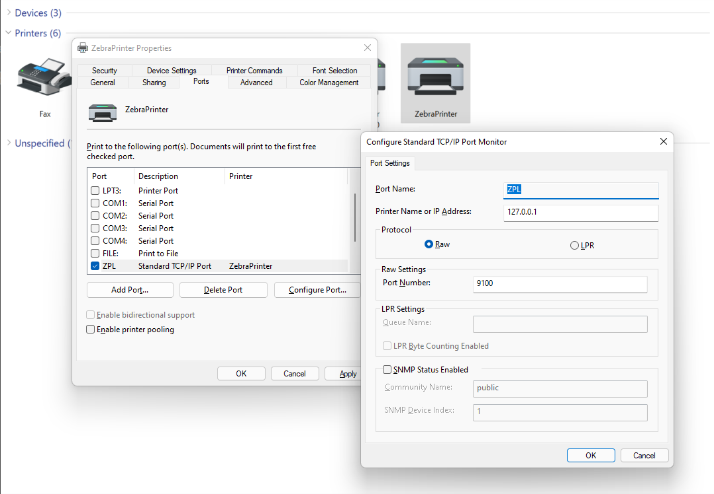

---
# required metadata

title: Design a new ER solution to print ZPL labels
description: This topic explains how to design a new ER solution to print ZPL labels.
author: NickSelin
ms.date: 02/10/2022
ms.topic: article
ms.prod: 
ms.technology: 

# optional metadata

ms.search.form: ERSolutionTable, ERFormatDestinationTable
# ROBOTS: 
audience: Application User
# ms.devlang: 
ms.reviewer: kfend
# ms.tgt_pltfrm: 
ms.custom: 97423
ms.assetid: f3055a27-717a-4c94-a912-f269a1288be6
ms.search.region: Global
# ms.search.industry: 
ms.author: nselin
ms.search.validFrom: 2022-02-01
ms.dyn365.ops.version: 10.0.26

---

# Design a new ER solution to print ZPL labels

[!include [banner](../includes/banner.md)]

The following steps explain how a user in the System Administrator, Electronic Reporting Developer, or Electronic Reporting Functional Consultant role can configure parameters of the [Electronic reporting (ER)](general-electronic-reporting.md) framework, design the required ER [configurations](general-electronic-reporting.md#Configuration) of a new ER solution to access the data of the Warehouse management system, and generate a custom warehouse location labels in ZPL II format. These steps can be completed in the **USRT** company.

## Business scenario

Let's assume that you represent a company that implemented the Dynamics 365 Finance warehouse management. It is required that each warehouse locations must be labeled with a self-adhesive label that contains a barcode to be scanned by using handheld barcode readers. All warehouse locations have been labeled in the scope of pre-golive activities. However, an ad-hoc label printing is required to print out a warehouse location label to replace a damaged label or a new label in case of re-configuring shelving. With recently released ER functionality you can configure a new ER solution that will allow a warehouse supervisor to print labels directly to a thermal label printer.

## Configure the ER framework

Follow the steps in [Configure the ER framework](er-quick-start2-customize-report.md#ConfigureFramework) to set up the minimal set of ER parameters. You must complete this setup before you start to use the ER framework to design a new ER solution.

## Design a domain-specific data model

You must create a new ER configuration that contains a [data model](er-overview-components.md#data-model-component) component for the Warehouse management domain. This data model will later be used as a data source when you design an ER format to generate warehouse location labels.

### Import a new data model configuration

By completing the steps in this section, you can import the required data model from the provided XML file.

1.  Download the [Warehouse model.version.1.xml](https://download.microsoft.com/download/b/.../Warehouse_model.version.1.xml) file, and save it to your local computer.
2.  Go to **Organization administration \> Workspaces \> Electronic reporting**.
3.  In the **Electronic reporting** workspace, select **Reporting configurations**.
4.  On the Action Pane, select **Exchange \> Load from XML file**.
5.  Select **Browse**, and then find and select the **Warehouse model.version.1.xml** file.
6.  Select **OK** to import the configuration.


### Create a new data model configuration

Alternatively, you can design this data model from scratch using the [Create a new data model configuration](er-quick-start1-new-solution.md#DesignDataModel) section as an example.

### Review a new data model

The following illustration shows the editable version of the configured data model on the **Data model designer** page.


## Design a model mapping for the configured data model

As a user in the Electronic Reporting Developer role, you must create a new ER configuration that contains a [model mapping](er-overview-components.md#model-mapping-component) component for the Warehouse data model. Because this component implements the configured data model for Finance application, it's Finance-specific. You must configure the model mapping component to specify the application objects that must be used to fill in the configured data model with application data at runtime. To complete this task, you must be aware of the implementation details of the data structure of the Warehouse management business domain in Finance.

### Import a new model mapping configuration

By completing the steps in this section, you can import the required model mapping from the provided XML file.

1.  Download the [Warehouse model mapping.version.1.1.xml](https://download.microsoft.com/download/b/.../Warehouse_model_mapping.version.1.xml) file, and save it to your local computer.
2.  Go to **Organization administration \> Workspaces \> Electronic reporting**.
3.  In the **Electronic reporting** workspace, select **Reporting configurations**.
4.  On the Action Pane, select **Exchange \> Load from XML file**.
5.  Select **Browse**, and then find and select the **Warehouse model mapping.version.1.1.xml** file.
6.  Select **OK** to import the configuration.


### Create a new model mapping configuration

Alternatively, you can design this model mapping from scratch using the [Create a new model mapping configuration](er-quick-start1-new-solution.md#CreateModelMapping) section as an example.

### Review a new model mapping

The following illustration shows the editable version of the configured model mapping on the **Model mapping designer** page.


## Design a new format

As a user in the Electronic Reporting Functional Consultant role, you must create a new ER configuration that contains a [format](er-overview-components.md#format-component) component. You must configure the format component by using the ZPL II language to specify the layout of your warehouse location label.

### Import a new format configuration

By completing the steps in this section, you can import the required format from the provided XML file.

1.  Download the [Warehouse location labels.version.1.1.xml](https://download.microsoft.com/download/b/.../Warehouse_location_labels.version.1.1.xml) file, and save it to your local computer.
2.  Go to **Organization administration \> Workspaces \> Electronic reporting**.
3.  In the **Electronic reporting** workspace, select **Reporting configurations**.
4.  On the Action Pane, select **Exchange \> Load from XML file**.
5.  Select **Browse**, and then find and select the **Warehouse location labels.version.1.1.xml** file.
6.  Select **OK** to import the configuration.


### Create a new format configuration

Alternatively, you can design this format from scratch using the [Create a new format configuration](er-quick-start1-new-solution.md#FormatCreate) section as an example.

### Review a new format

The following illustration shows the editable version of the configured format on the **Format designer** page.


Notice that the `model.Location.Label` data source of this format is configured to generate a label containing the following information:

1.  Warehouse title as a text
2.  Warehouse title as a barcode
3.  Location title
4.  Check digits


> [!TIP]
> Notice that the label layout is designed to align the location title and the check digits in the center of the label. As the ZPL II language does not support the center alignment for a barcode, the formula of the `model.Location.Warehouse.Alignment` data source is used to calculate the barcode left offset to align this barcode in the center of the label taking into account the number of characters that the warehouse title contains.

## Prepare your environment for previewing generated labels

In this example you will use a printer emulator for rendering ZPL labels to preview them on the screen. The enable this option, you must do the following:

1.  Add and configure the [Printer](er-destination-type-print.md) ER destination for the **Warehouse location label** ER format to send generated labels out of Finance to the [Document routing agent (DRA)](install-document-routing-agent.md).
2.  Install and configure the DRA to route generated labels from Finance to a local printer that is accessible from the current workstation.
3.  Add and configure a local printer for the current workstation to pass generated labels from DRA to a printer emulator application.
4.  Install and configure a printer emulator application as an extension of the Chrome web browser to pass generated labels from a local printer to a web service that will render generated labels and return them back to a printer emulator for preview.

<table>
    <tr align="center">
        <td>
            <p>Finance</p>
            <p>ER report</p>
            <p>Printer destination</p>
        </td>
        <td></td>
        <td>Document<br>routing<br>agent</td>
        <td></td>
        <td>Local<br>printer</td>
        <td></td>
        <td>Physical<br>printer<br>emulator</td>
        <td></td>
        <td>Rendering<br>web<br>service</td>
        </td>
    </tr>
</table>

### Install and configure a printer emulator application

Add to your Chrome web browser a printer emulator application for ZPL rendering engine, for example the [Zpl Printer](https://chrome.google.com/webstore/detail/zpl-printer/phoidlklenidapnijkabnfdgmadlcmjo) emulator. This emulator will pass generated labels in ZPL language from a local printer to a web service and return back labels as PDF or PNG files for preview.

1.  Add the printer emulator application from the Chrome web store.

    

2.  Run the printer emulator application from the Chrome web browser.

    

3.  Configure the running application:
    
    1.  Turn it off.
    2.  Set the host as **127.0.0.1**.
    3.  Set the port **9100**.

    

    4.  Turn it on.
    
    

The emulator is based on the http://labelary.com/service.html web service.

> [!NOTE]
> As the using in this example printer emulator uses a web service for labels rendering, make sure that your security settings allow you to communicate with this service. Otherwise, your printer emulator will not receive back rendered labels and those labels will not be previewed.

### Add and configure a local printer

[Add](https://support.microsoft.com/windows/install-a-printer-in-windows-10-cc0724cf-793e-3542-d1ff-727e4978638b) a new local printer for the current device to pass generated labels from DRA to a printer emulator application.

1.  Select the Windows **Start** button.
    1.  Select **Settings \> Devices \> Printers \& scanners**.
    2.  Select **Printers \& scanners settings**.
    3.  For the **Add a printer or scanner** option, select **Add device**.
    4.  For the **The printer that I want isn't listed** option, select **Add manually**.
2.  In the **Find a printer by other options** field, select **Add a local printer or network printer with manual settings** option.
3.  In the **Choose a printer port** field, select the **Create a new port** option.
    1.  in the **Type of port** field, select the **Standard TCP/IP Port** option.
    2.  In the **Hostname or IP address** field, enter the **127.0.0.1** value.
    3.  In the **Port name** field, enter the **ZPL** value.
    4.  Wait until the **Detecting TCP/IP port** operation has been completed.
    5.  In the **Device type** field, select the **Custom** option and select **Settings**.
    6.  Make sure that the following port settings are specified:
        1.  Port name **ZPL**
        2.  Printer name or IP address **127.0.0.1**
        3.  Protocol **Raw**
        4.  Port number **9100**
4.  In the **Install the printer driver** field, select **Generic / Text only**.
5.  In the **Printer name** field, enter the printer name as **ZebraPrinter**.

    

### Install and configure the Document routing agent

Prepare the DRA to pass generated labels from Finance to the configured local printer.

1.  [Install](install-document-routing-agent.md#install-the-document-routing-agent) the DRA.
2.  [Configure](install-document-routing-agent.md#configure-the-document-routing-agent) the DRA.
3.  [Register](install-document-routing-agent.md#register-network-printers) in DRA the added local **ZebraPrinter**.
4.  [Activate](install-document-routing-agent.md#administer-network-printers) in your Finance instance the local **ZebraPrinter**.

    

### Configure the ER destination

Prepare the ER destination to pass generated labels from Finance to DRA.

1.  Go to **Organization administration \> Electronic reporting \> Electronic reporting destination**.
2.  On the **Electronic reporting destination** page, on the Action Pane, select **New**.
3.  In the **Reference** field, select **Warehouse location labels**.
4.  In the **File destination** FastTab, select **New**.

    1.  In the **Name** field, enter **Labels**.
    2.  In the **File component name**, select the **Report** component.

5.  Select **Settings**.
6.  On the **Destination settings** dialog, select the **Printer** tab.
7.  Set the **Enabled** option to **Yes**.

    1.  In the **Printer name** field, select **ZebraPrinter**.
    2.  In the **Document routing type** field, select **ZPL**.

8.  Select **OK**.

    

## Review warehouse locations

1.  Go to **Warehouse management \> Setup \> Warehouse \> Locations**.
2.  On the **Locations** page, filter only locations with non-blank **Check digits** field.

    

## Print warehouse location labels

1.  Go to **Organization administration \> Electronic reporting \> Configurations**.
2.  On the **Configurations** page, in the configuration tree, expand the **Warehouse model** item.
3.  Select **Warehouse location labels**.
4.  On the Action Pane, select **Run**.
    1.  On the **Electronic report parameters** dialog, in the **Records to include** tab, select **Filter**.
        1.  On the **Range** tab, for the **Location** field of the **Locations** table, in the **Criteria** field, enter **LPEnabled**.
        2.  Select **OK**.
    2.  Select **OK**.

    

## Modify labels layout

Complete the steps of this section to learn how you can change the current layout of warehouse location labels. For example, you can change the current layout to additionally present in generated labels a location profile id.

1.  Go to **Organization administration \> Electronic reporting \> Configurations**.
2.  Set the [ER user parameter](electronic-reporting-destinations.md#applicability) **Use destinations for draft status** to **Yes**.
3.  On the **Configurations** page, in the configuration tree, expand the **Warehouse model** item.
4.  Select **Warehouse location labels**.
5.  Select **Designer**.

    1.  On the **Format designer** page, select the **Mapping** tab.
    2.  Select the `model.Location.Label` data source.
    3.  On the **Data source properties** dialog, select **Edit \> Edit formula**.

        1.  On the **Formula designer** page, in the **Formula** field, review the ER formula using to generate labels.
            ```vb
            CONCATENATE(
            "^XA",CrLf,
            "^CF0,30,30^FO0,30^FB800,1,0,C,0^FD",Warehouse,"\&^FS",CrLf,
            "^BY2,2,50^FT",@.Warehouse.Alignment,",126^BCN,,N,N,N,A^FD",Warehouse,"\&^FS",CrLf,
            "^FO0,150^FB800,1,0,C,0^FD",@.Name,"\&^FS",CrLf,
            "^CF0,20,20^FO0,200^FB800,1,0,C,0^FD",@.CheckDigits,"\&^FS",CrLf,
            "^XZ")
            ```

        2.  In the **Formula** field, update the formula to additionally present in generated labels a location profile id.

            ```vb
            CONCATENATE(
            "^XA",CrLf,
            "^CF0,30,30^FO0,30^FB800,1,0,C,0^FD",Warehouse,"\&^FS",CrLf,
            "^BY2,2,50^FT",@.Warehouse.Alignment,",126^BCN,,N,N,N,A^FD",Warehouse,"\&^FS",CrLf,
            "^FO0,150^FB800,1,0,C,0^FD",@.Name,"\&^FS",CrLf,
            "^CF0,20,20^FO0,200^FB800,1,0,C,0^FD",@.CheckDigits,"\&^FS",CrLf,
            "^CF0,40,40^FO0,240^FB800,1,0,C,0^FD",@.ProfileID,"\&^FS",CrLf,
            "^XZ")
            ```
    
        3.  Select **Save**.

    4.  Select **OK**.

6.  On the Action Pane, select **Run**.
    1.  On the **Electronic report parameters** dialog, in the **Records to include** tab, select **Filter**.
        1.  On the **Range** tab, for the **Location** field of the **Locations** table, in the **Criteria** field, enter **Bay**.
        2.  Select **OK**.
    2.  Select **OK**.

    

## Encoding

> [!NOTE]
> Notice that you must synchronize the encoding setting of the **Common\File** component of the editable ER format and the appropriate setting of the designed label. So, the value of the **[Encoding](er-suppress-bom-characters.md)** field of the **Common\File** component should not contradict a ZPL command that is used to control label's encoding, for example, the `^CI` command. ER does not check that these settings are in sync.

## Additional resources

[Printer destination](er-destination-type-print.md)

[!INCLUDE[footer-include](../../../includes/footer-banner.md)]
