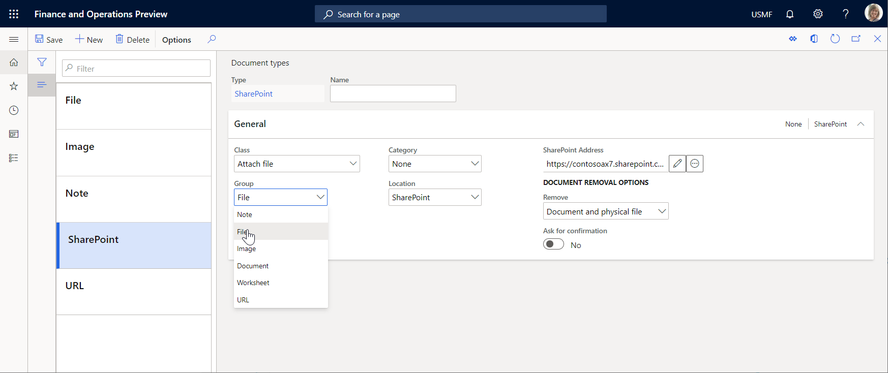
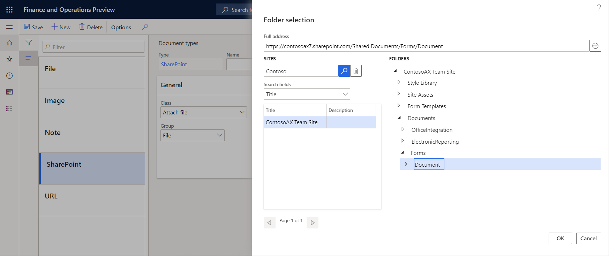

# Archive ER destination type

[!include [banner](../includes/banner.md)]

You can configure an archive destination for each **Folder** or **File** component of an Electronic reporting (ER) format that is configured to generate outbound documents. Based on the destination setting, a generated document is stored as an attachment of a record of the ER jobs list. To view the results, go to **Organization administration** \> **Electronic reporting** \> **Electronic reporting jobs**.

You can use this option to send the generated document to a Microsoft SharePoint folder or Microsoft Azure Storage. Set **Enabled** to **Yes** to send output to a destination that is defined by the selected document type. Only document types where the group is set to **File** are available for selection. You define document [types](../../fin-ops/organization-administration/configure-document-management.md#configure-document-types) at **Organization administration** \> **Document management** \> **Document types**. The configuration for ER destinations is the same as the configuration for the document management system.

The location determines where the file is saved. After the **Archive** destination is enabled, the results can be saved in the Job archive. You can view the results at **Organization administration** \> **Electronic reporting** \> **Electronic reporting archived jobs**.

> [!NOTE]
> Select a document type for the Job archive by navigating to **Organization administration** \> **Workspaces** \> **Electronic reporting** \> **Electronic reporting parameters**. For more information, see [Configure the Electronic reporting (ER) framework](electronic-reporting-er-configure-parameters.md#prerequisites-for-er-setup).

## SharePoint

You can save a file in a designated SharePoint folder. To define the default SharePoint server, go to **Organization administration** \> **Document management** \> **Document management parameters**. On the **SharePoint** tab, configure the SharePoint folder. Then, you can select it as the folder where the ER output will be saved. The **SharePoint** location must be selected in this document type.

## Azure Storage

When the document type location is set to **Azure storage**, you can save a file to Azure Storage.

> [!NOTE] 
> The ER framework permanently stores files in Azure Blob storage unlike the Data management framework that applies the seven-day retention policy for documents that must be processed. For more information, see [API for getting message status](../data-entities/recurring-integrations.md#api-for-getting-message-status) and [Status check API](../data-entities/data-management-api.md#status-check-api). The ER-related files will be stored in Azure Blob storage as attachments of application table records as long as necessary. A single file will be deleted from Azure Blob storage along with the application table record that this file was attached to.

## Additional resources

- [Electronic reporting (ER) overview](general-electronic-reporting.md)
- [Electronic reporting (ER) destinations](electronic-reporting-destinations.md)
- [Configure document management](../../fin-ops/organization-administration/configure-document-management.md)

[!INCLUDE[footer-include](../../../includes/footer-banner.md)]
