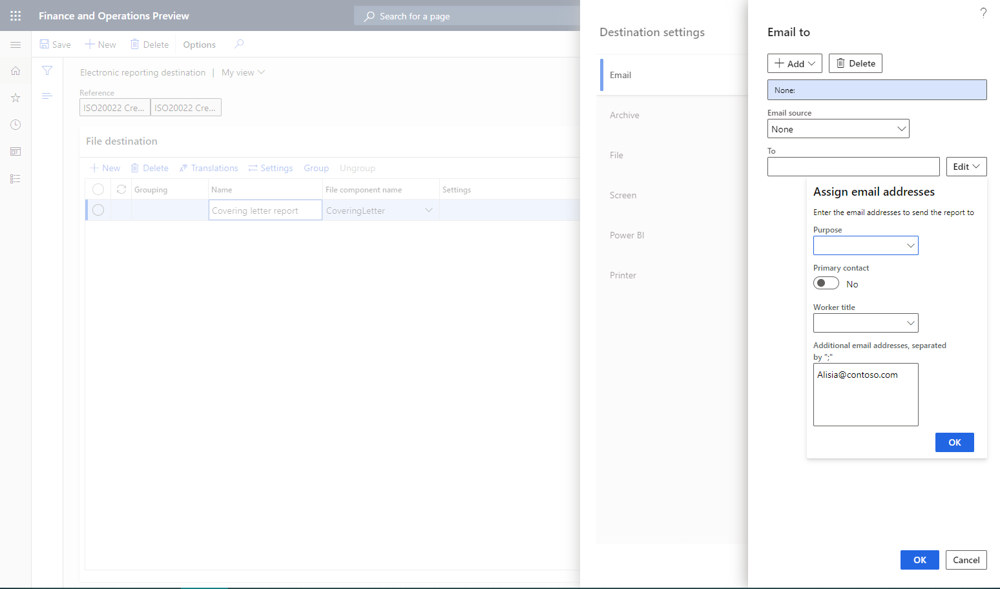
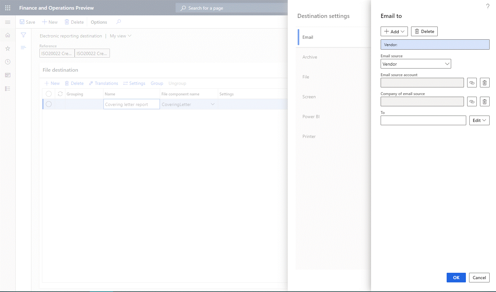
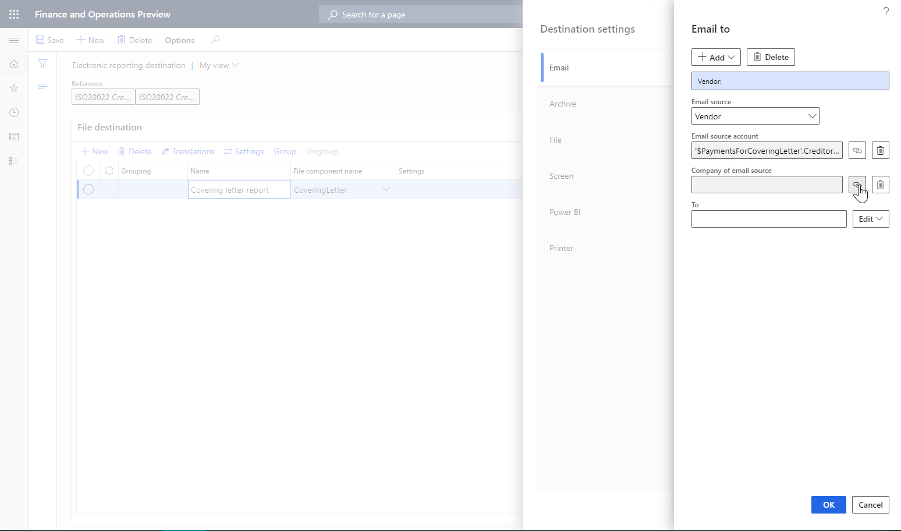
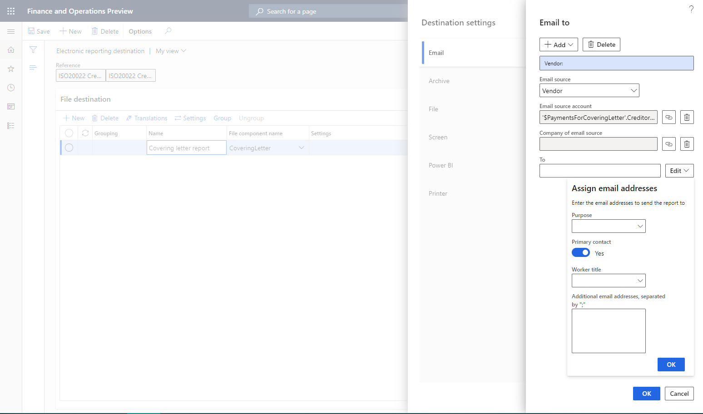
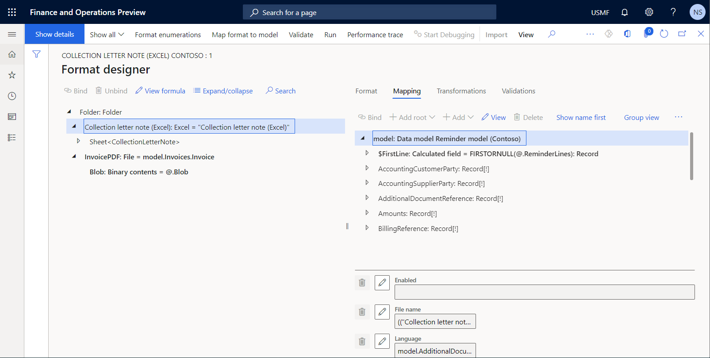
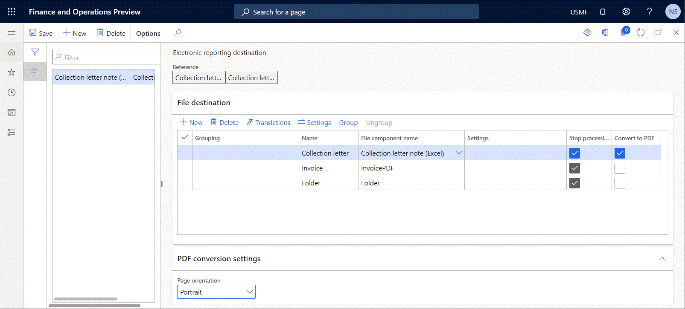

---
# required metadata

title: Email ER destination type
description: This topic explains how to configure an email destination for each FOLDER or FILE component of an Electronic reporting (ER) format that is configured to generate outbound documents.
author: NickSelin
manager: AnnBe
ms.date: 12/03/2020
ms.topic: article
ms.prod: 
ms.service: dynamics-ax-platform
ms.technology: 

# optional metadata

ms.search.form: DocuType, ERSolutionTable, ERFormatDestinationTable
# ROBOTS: 
audience: Application User
# ms.devlang: 
ms.reviewer: kfend
# ms.tgt_pltfrm: 
ms.custom: 97423
ms.assetid: 
ms.search.region: Global
# ms.search.industry: 
ms.author: nselin
ms.search.validFrom: 2016-05-31
ms.dyn365.ops.version: AX 7.0.1

---

# Email ER destination type

[!include [banner](../includes/banner.md)]

When an Electronic reporting (ER) format is run, one or more outbound documents can be generated. **Folder** or **File** format components are used in ER formats to specify the structure of outbound documents. You can configure an email destination for these types of components to send outbound documents as email attachments.

You can configure an email destination for each **Folder** or **File** component of an ER format. In this case, **each outbound document is emailed individually**. Based on this destination setting, a generated document is delivered as an attachment of an email. 

> [!NOTE]
> If no document is generated, because the **Enabled** expression for the relevant **File** component has been configured to return a **False** Boolean value, no email is sent, even if an email destination is configured and enabled for the component.

You can also [group](#grouping) several **Folder** or **File** components together, and then configure an email destination for all the components in the group. In this case, all outbound documents that are generated by components that belong to the group **are sent as multiple attachments of a single email**. Based on this destination setting, each generated document is delivered as an attachment of a single email.

> [!NOTE]
> If at least one document is generated by a **File** component in a group of components, an email is sent. If no document is generated by grouped components, because the **Enabled** expression for each **File** component has been configured to return a **False** Boolean value, no email is sent, even if an email destination is configured and enabled for that group of components.
>
> **Email** is the only destination that can be configured for a group of components. To deliver a document that is emailed based on the email destination setting for a group, add one more destination record, select the component that you want, and then configure another destination for this record.

Multiple groups of components can be configured for a single ER format configuration. In this way, you can configure an email destination for every group of components and an email destination for every component.

## Configure an email destination

To send an output file or several output files by email, on the **Electronic reporting destination** page, on the **File destination** FastTab, select a component or group of components in the grid, and then select **Settings**. In the **Destination settings** dialog box that appears, on the **Email** tab, set the **Enabled** option to **Yes**. You can then specify email recipients, and edit the subject and body of the email message. You can either set up constant text for the email subject and body, or use ER [formulas](er-formula-language.md) to dynamically create email texts.

You can configure email addresses for ER in two ways. The configuration can be completed in the same way that the Print Management feature completes it, or you can resolve an email address by using a direct reference to the ER configuration through a formula.

## Email address types

If you select **Edit** next to the **To** or **Cc** field in the **Destination settings** dialog box, the **Email to** dialog box appears. Select **Add**, and then select the type of email address to use. Two types are currently supported: **Print Management email** and **Configuration email**.

### Print Management email

If you select **Print Management email** as the email address type, you can enter fixed email addresses in the **Email to** dialog box by setting the following fields:

- In the **Email source** field, select **None**.
- In the **Additional email addresses, separated by ";"** field, enter the fixed email addresses.

Alternatively, you can obtain email addresses from the contact details of the party that you generate an outbound document for. To use email addresses that aren't fixed, in the **Email source** field, select the [role](../../fin-ops/organization-administration/overview-global-address-book.md#party-roles) of the party for a file destination. The following roles are supported:

- Customer
- Vendor
- Prospect
- Contact
- Competitor
- Worker
- Applicant
- Prospective vendor
- Disallowed vendor

For example, to configure an email destination for an ER format that is used to process vendor payments, select the **Vendor** role.

After you select the desired role, select the **Bind** button (chain symbol) next to the **Email source account** field to open the [Formula designer](general-electronic-reporting-formula-designer.md) page. You can then use this page to configure a formula that returns, at runtime, the account number of the party that is assigned to the configured role from the processed document to the email destination.

> [!NOTE]
> Formulas are specific to the ER configuration.

On the **Formula designer** page, in the **Formula** field, enter a document-specific reference to a supported role. Instead of typing the reference, in the **Data source** pane, find and select the data source node that represents an account of the configured role, and then select **Add data source** to update the formula. For example, if you configure the email destination for the **ISO 20022 Credit Transfer** configuration that is used to process vendor payments, the node that represents a vendor account is `'$PaymentsForCoveringLetter'.Creditor.Identification.SourceID`.

If the account numbers of the configured role are unique for the whole instance of Microsoft Dynamics 365 Finance, the **Company of email source** field in the **Email to** dialog box can remain blank.

Alternatively, you might have a situation where different parties in the [Global address book](../../fin-ops/organization-administration/overview-global-address-book.md) have been registered in different companies ([legal entities](../../fin-ops/organization-administration/organizations-organizational-hierarchies.md#legal-entities)) in such a way that they all use the same account number to fill the configured role. In this case, account numbers for the configured role aren't unique for the whole Finance instance. Therefore, to explicitly select a party, you can't specify only an account number. You must also specify the company that the party has been registered in the scope of to fill the configured role. Select the **Bind** button (chain symbol) next to the **Company of email source** field in the **Email to** dialog box to open the [Formula designer](general-electronic-reporting-formula-designer.md) page. You can then use this page to configure a formula that returns, at runtime, the code of the company that the desired source must be found in the scope of.

> [!TIP]
> If you must use the company code to run an ER format, but the ER format doesn't provide any data source that the company code can be obtained from, configure the `GetCurrentCompany()` formula by using the built-in [GETCURRENTCOMPANY](er-functions-other-getcurrentcompany.md) ER function.

> [!NOTE]
> Formulas are specific to the ER configuration.

To specify the type of email addresses that must be used at runtime, in the **Email to** dialog box, select **Edit** next to the **To** field to open the **Assign email address** drop-down dialog box. Then set the following fields:

- In the **Purpose** field, select the desire purposes. Only email addresses of the selected purposes from contacts of the discovered party will be used.
- Set the **Primary contact** option to **Yes** to use an email address that is configured for the discovered party as the primary email address.

> [!NOTE]
> If purposes are selected in the **Purpose** field and the **Primary contact** option is set to **Yes** at the same time, every email that satisfies at least one configured criterion will be used at runtime.

### Configuration email

Select **Configuration email** as the email address type if the configuration that you use has a node in the data sources that returns either a single email address or multiple email addresses that are separated by semicolons (;). You can use [data sources](general-electronic-reporting.md#FormatComponentOutbound) and [functions](er-formula-language.md#functions) in the formula designer to get a correctly formatted email address or correctly formatted email addresses that are separated by semicolons. For example, if you use the **ISO 20022 Credit Transfer** configuration, the node that represents the primary email address of a vendor from the vendor contact details that the covering letter should be sent to is `'$PaymentsForCoveringLetter'.Creditor.ContactDetails.Email`.

## Group format components

To group format components, on the **Electronic reporting destination** page, on the **File destination** FastTab, select the components in the grid, and then select **Group**.

**Email** is the only previously configured destination that is still available for the selected components. No other previously configured destinations are available, because they are considered unsupported for a group of components. You will be notified about these changes as appropriate.

The record that you previously added is considered the header of the group that is created. This header record holds the email destination settings for the group. Other records are group members that will use the email destination settings of the group's header record.

To ungroup format components, on the **File destination** FastTab, select a record that belongs to the group, and then select **Ungroup**.

- If you select a header record, the whole group will be ungrouped.
- If you select a member record, and it's the last member record in a group, the whole group will be ungrouped.
- If you select a member record that isn't the last member record in a group, that record will be excluded from the current group.

The following illustration shows the structure of an ER format that was configured to produce a zipped outbound file that contains a collection letter note and appropriate customer invoices in PDF format.

The following illustration shows the process, as described in this topic, of grouping individual components and enabling the **Email** destination for the new group, so that a collection letter note is sent together with appropriate customer invoices as email attachments.

## Additional resources

- [Electronic reporting (ER) overview](general-electronic-reporting.md)
- [Electronic reporting (ER) destinations](electronic-reporting-destinations.md)
- [Formula designer in Electronic reporting (ER)](general-electronic-reporting-formula-designer.md)
