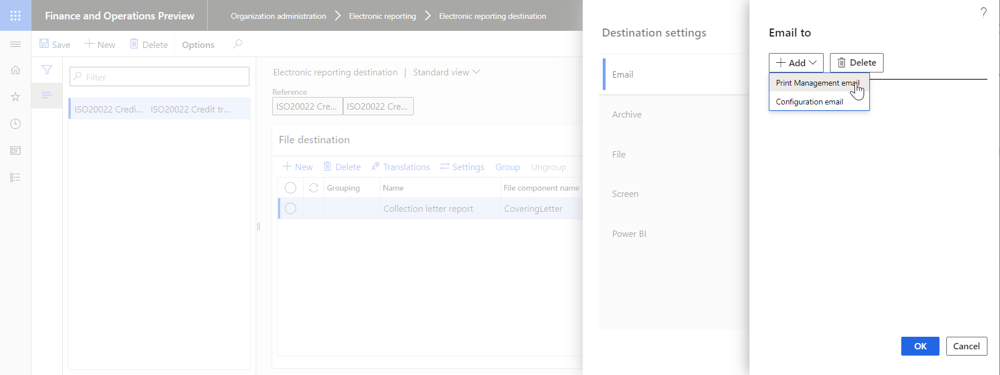

---
# required metadata

title: Email ER destination type
description: This topic provides information about how to configure an email destination for each FOLDER or FILE component of an Electronic reporting (ER) format that is configured to generate outbound documents.
author: NickSelin
manager: AnnBe
ms.date: 01/27/2020
ms.topic: article
ms.prod: 
ms.service: dynamics-ax-platform
ms.technology: 

# optional metadata

ms.search.form: DocuType, ERSolutionTable, ERFormatDestinationTable
# ROBOTS: 
audience: Application User
# ms.devlang: 
ms.reviewer: kfend
ms.search.scope: Core, Operations
# ms.tgt_pltfrm: 
ms.custom: 97423
ms.assetid: 
ms.search.region: Global
# ms.search.industry: 
ms.author: nselin
ms.search.validFrom: 2016-05-31
ms.dyn365.ops.version: AX 7.0.1

---

# <a name="EmailDestinationType">Email destination</a>

[!include [banner](../includes/banner.md)]

You can configure an email destination for each FOLDER or FILE component of an Electronic reporting (ER) format that is configured to generate outbound documents. Based on the destination setting, a generated document is delivered as an attachment of an electronic mail.

Set **Enabled** to **Yes** to send an output file by email. After this option is enabled, you can specify the email recipients and edit the subject and body of the email message. You can set up constant texts for the email subject and body, or you can use ER [formulas](er-formula-language.md) to dynamically create email texts. 

You can configure email addresses for ER in two ways. The configuration can be completed in the same way that the Print management feature completes it, or you can resolve an email address by using a direct reference to the ER configuration through a formula.

## Email address types

When you select **Edit** in the **To** or **Cc** fields, the **Email to** dialog box appears. You can then select the type of email address to use. The **Configuration email** and **Print Management** email types are currently supported.

### Print management

If you select the **Print Management** email type, you can enter fixed email addresses in the **To** field. 

To use email addresses that aren't fixed, you must select the email source type for a file destination. The following values
are supported: **Customer**, **Vendor**, **Prospect**, **Contact**, **Competitor**, **Worker**, **Applicant**, **Prospective vendor**, and **Disallowed vendor**. After you select an email source type, use the button next to the **Email source account** field to open the **Formula designer** form. You can use this form to attach a formula that returns at runtime, the **party account** of the selected source type from the processed document to the email destination.

Formulas are specific to the ER configuration. In the **Formula** field, enter a document-specific reference to a customer or vendor party type. Instead of typing, you can find the data source node that represents the customer or vendor account, and then select **Add data source** to update the formula. For example, if you use the **ISO 20022 Credit Transfer** configuration, the node that represents a vendor account is `'\$PaymentsForCoveringLetter'.Creditor.Identification.SourceID`.

If you enter a string value, such as `"DE-001"`, and save a formula, an email will be sent to the contact person of the vendor, **DE-001**.

### Configuration email

Use this email type if the configuration that you use has a node in the data sources that returns an **email address**. You can use data sources and functions in the formula designer to get a correctly formatted email address. For example, if you use the **ISO 20022 Credit Transfer** configuration, the node that represents an email address of a vendor's contact person is `'$PaymentsForCoveringLetter'.Creditor.ContactDetails.Email`.

## Additional resources

- [Electronic reporting (ER) overview](general-electronic-reporting.md)
- [Electronic reporting (ER) destinations](electronic-reporting-destinations.md)
- [Formula designer in Electronic reporting (ER)](general-electronic-reporting-formula-designer.md)
