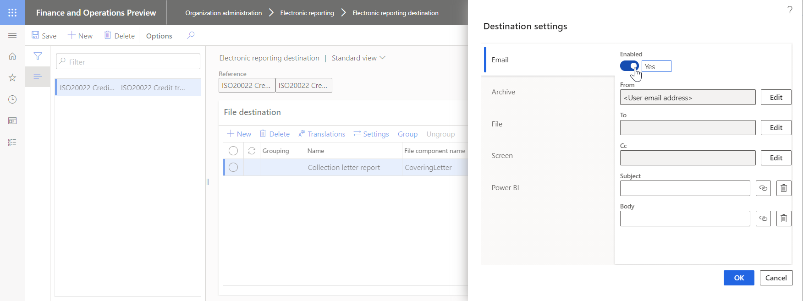

---
# required metadata

title: Email ER destination type
description: This topic provides information about how to configure an email destination for each FOLDER or FILE component of an Electronic reporting (ER) format that is configured to generate outbound documents.
author: NickSelin
manager: AnnBe
ms.date: 11/03/2020
ms.topic: article
ms.prod: 
ms.service: dynamics-ax-platform
ms.technology: 

# optional metadata

ms.search.form: DocuType, ERSolutionTable, ERFormatDestinationTable
# ROBOTS: 
audience: Application User
# ms.devlang: 
ms.reviewer: kfend
ms.search.scope: Core, Operations
# ms.tgt_pltfrm: 
ms.custom: 97423
ms.assetid: 
ms.search.region: Global
# ms.search.industry: 
ms.author: nselin
ms.search.validFrom: 2016-05-31
ms.dyn365.ops.version: AX 7.0.1

---

# Email destination

[!include [banner](../includes/banner.md)]

When an Electronic reporting (ER) format is executed, one or more outbound documents can be generated. **FOLDER** or **FILE** format components are used in ER formats to specify the structure of outbound documents. You can configure an email destination for these types of components to send outbound documents as email attachments.

You can configure an email destination for each **FOLDER** or **FILE** component of an ER format. In this case, **each outbound document is emailed individually**. Based on this destination setting, a generated document is delivered as an attachment of an electronic mail.

> [!NOTE]
> If a document isn't generated as the **Enabled** expression for the relevant **FILE** component has been configured, (to return the **FALSE** value), an email isn't sent out, even if an email destination is configured and enabled for this component.

You can also choose to [group](#grouping) several **FOLDER** or **FILE** components together to configure an email destination for this group of components. In this case, all outbound documents that are generated by components that belong to this group **are sent out as several attachments of a single email**. Based on this destination setting, each generated document is delivered as an attachment of a single electronic mail.

> [!NOTE]
> If at least one document is generated by a **FILE** component of a group of components, an email is sent out. If none of the documents are generated by grouped components as the **Enabled** expression for each **FILE** component has been configured (to return the **FALSE** value), an email isn't sent out even if an email destination is configured and enabled for this group of component.

> [!NOTE]
> Only the email destination can be configured for a group of components. If you want to deliver a document that is emailed based on the email destination setting for a group, add one more destination record, selecting the component you want, and then configure another destination for this record.

Multiple groups of components can be configured for a single ER format configuration. This allows you to configure an email destination for every group of components and an email destination for every single component.

## Configure an email destination

For a selected component or group of components, on the **Destination settings** dialog, in the **Email** section, set **Enabled** to **Yes** to send an output file or several output files by email. After this option is enabled, you can specify email recipients and edit the subject and body of the email message. You can set up constant text for the email subject and body, or you can use ER [formulas](er-formula-language.md) to dynamically create email texts.

You can configure email addresses for ER in two ways. The configuration can be completed in the same way that the Print management feature completes it, or you can resolve an email address by using a direct reference to the ER configuration through a formula.

## Email address types

When you select **Edit** in the **To** or **Cc** fields, the **Email to** dialog box appears. You can then select the type of email address to use. The **Configuration email** and **Print Management** email types are currently supported.

### Print management

If you select the **Print Management** email type, you can enter fixed email addresses in the **To** field. 

To use email addresses that aren't fixed, you must select the email source type for a file destination. The following values
are supported: **Customer**, **Vendor**, **Prospect**, **Contact**, **Competitor**, **Worker**, **Applicant**, **Prospective vendor**, and **Disallowed vendor**. After you select an email source type, use the button next to the **Email source account** field to open the **Formula designer** form. You can use this form to attach a formula that returns at runtime, the **party account** of the selected source type from the processed document to the email destination.

Formulas are specific to the ER configuration. In the **Formula** field, enter a document-specific reference to a customer or vendor party type. Instead of typing, you can find the data source node that represents the customer or vendor account, and then select **Add data source** to update the formula. For example, if you use the **ISO 20022 Credit Transfer** configuration, the node that represents a vendor account is `'\$PaymentsForCoveringLetter'.Creditor.Identification.SourceID`.

If you enter a string value, such as `"DE-001"`, and save a formula, an email will be sent to the contact person of the vendor, **DE-001**.

### Configuration email

Use this email type if the configuration that you use has a node in the data sources that returns an **email address**. You can use data sources and functions in the formula designer to get a correctly formatted email address. For example, if you use the **ISO 20022 Credit Transfer** configuration, the node that represents an email address of a vendor's contact person is `'$PaymentsForCoveringLetter'.Creditor.ContactDetails.Email`.

## <a name="grouping">Group format components</a>

To group format components, in the grid of the **File destination** FastTab, select the components you want to group, and then select **Group**.

Except for **Email**, any previously configured destinations for the selected components are no longer enabled as they are considered not supported for a group of components. When applicable, you will be notified regarding these changes in user infolog.

The record previously added is considered the header of the created group. This record holds the email destination settings for this group. Other records are group members that will use the email destination settings of the header record of this group.

To ungroup format components, select a record that belongs to a group in the grid of the **File destination** FastTab, and the select **Ungroup**.

- When a header record is selected, the whole group will be demounted.
- When a member record is selected and it's the last member record in a group, the whole group will be demounted.
- When a member record is selected and it's not the last member record in a group, the record will be excluded from the current group.

The following illustration shows the structure of an ER format that was configured to produce a zipped outbound file containing a collection letter note along with appropriate customer invoices in PDF format.

The following illustration shows the process of grouping individual components and enabling the **Email** destination for the created group to send out a collection letter note with appropriate customer invoices as email attachments.

## Additional resources

- [Electronic reporting (ER) overview](general-electronic-reporting.md)
- [Electronic reporting (ER) destinations](electronic-reporting-destinations.md)
- [Formula designer in Electronic reporting (ER)](general-electronic-reporting-formula-designer.md)
