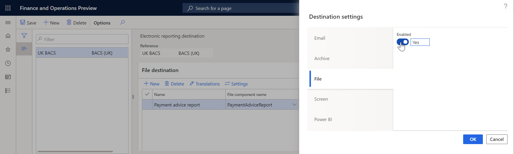

---
# required metadata

title: File ER destination type
description: This topic provides information about configuring a file destination for an ER format.
author: NickSelin
ms.date: 01/27/2020
ms.topic: article
ms.prod: 
ms.technology: 

# optional metadata

ms.search.form: DocuType, ERSolutionTable, ERFormatDestinationTable
# ROBOTS: 
audience: Application User
# ms.devlang: 
ms.reviewer: kfend
# ms.tgt_pltfrm: 
ms.custom: 97423
ms.assetid: 
ms.search.region: Global
# ms.search.industry: 
ms.author: nselin
ms.search.validFrom: 2016-05-31
ms.dyn365.ops.version: AX 7.0.1

---

# File destination

[!include [banner](../includes/banner.md)]

You can configure a file destination for each FOLDER or FILE component of an Electronic reporting (ER) format that is configured to generate outbound documents. Based on the setting of the destination, a generated document is available for download from the web browser.

On the **Destination settings** page, if you set **Enabled** to **Yes**, an open or save dialog box opens when the configuration has finished running.

## Additional resources

- [Electronic reporting (ER) overview](general-electronic-reporting.md)
- [Electronic reporting (ER) destinations](electronic-reporting-destinations.md)

[!INCLUDE[footer-include](../../../includes/footer-banner.md)]