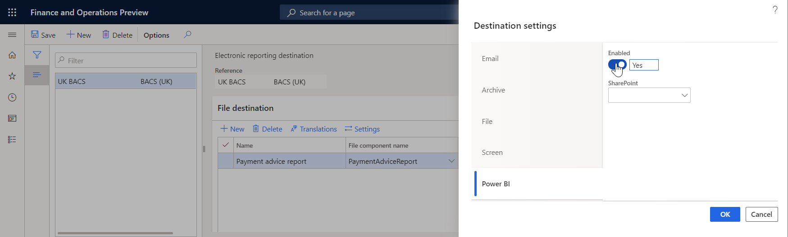

# Power BI destination

[!include [banner](../includes/banner.md)]

You can configure a Microsoft Power BI destination for each folder or file component of an Electronic reporting (ER) format that is configured to generate outbound documents. Based on the setting of the destination, a generated document is stored in a previously configured SharePoint folder.

Set **Enabled** to **Yes** to use your ER configuration to arrange the transfer of data from your Dynamics 365 Finance instance to Microsoft Power BI services. The transferred files are stored on a Microsoft SharePoint Server instance that must be configured for that purpose. For more information, see [Configure Electronic reporting (ER) to pull data into Power BI](general-electronic-reporting-report-configuration-get-data-powerbi.md).

## Additional resources

- [Electronic reporting (ER) overview](general-electronic-reporting.md)
- [Electronic reporting (ER) destinations](electronic-reporting-destinations.md)

[!INCLUDE[footer-include](../../../includes/footer-banner.md)]
