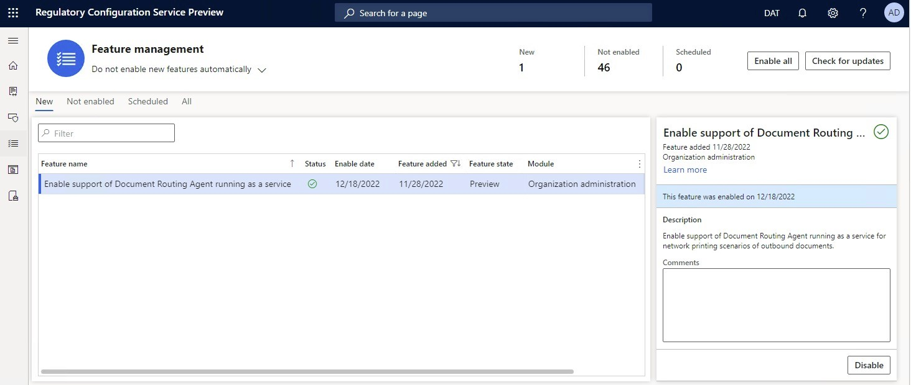

# Printer destination

[!include [banner](../includes/banner.md)]

You can send a generated document directly to a network printer for direct printing.

## Prerequisites

Before you begin, you must install and configure the Document Routing Agent, and then register the network printers. For more information, see [Install the Document Routing Agent to enable network printing](./install-document-routing-agent.md).

## Make the Printer destination available

To make the **Printer** destination available in the current instance of Microsoft Dynamics 365 Finance, go to the **Feature management** workspace, and turn on the following features, in this order:

1. Convert Electronic Reporting outbound documents from Microsoft Office formats to PDF
2. Document Routing Agent as Electronic Reporting destination for outbound documents

> [!NOTE]
> As of Finance version 10.0.32, the **Convert Electronic Reporting outbound documents from Microsoft Office formats to PDF** and **Document Routing Agent as Electronic Reporting destination for outbound documents** features have been eliminated. The functionality that these features controlled is now enabled by default.

### Run the Document Routing Agent as a service

The Document Routing Agent lets you select the mode of execution. The process can run either as a desktop application or as a Windows service. For more information, see [Run the Document Routing Agent as a Windows service](run-document-routing-agent-as-windows-service.md).

As of Finance version 10.0.32, the capability to support running the Document Routing Agent as a Windows service has been implemented. To activate this capability in the system, turn on the **Enable support of Document Routing agent running as a service** feature in the **Feature management** workspace.

### Applicability

#### PDF printing

> [!NOTE]
> PDF documents can be printed directly to a network printer only if the Document Routing Agent is running as a desktop application. If the Document Routing Agent is running as a service, PDF documents won't be sent directly to a printer. Instead, they will be stored in a target folder. This folder must be configured in advance in the Document Routing Agent's parameters. For more information, see [Update the execution mode for the Document Routing Agent](run-document-routing-agent-as-windows-service.md#update-the-execution-mode-for-the-document-routing-agent).
>
> To continue to send printable documents directly to a printer when the Document Routing Agent is running as a service, use [EMF printing](#EMFprinting).

In versions of Finance before version 10.0.18, the **Printer** destination can be configured only for file components that are used to generate output in printable PDF format (**PDF Merger** or **PDF file** format elements) or Microsoft Office Excel and Word format (**Excel file** format element). When the output is generated in PDF format, it's sent to a printer. When the output is generated in Office format by using the **Excel file** format element, it's automatically converted to PDF format and then sent to a printer.

However, as of version 10.0.18, you can configure the **Printer** destination for the **Common file** format element. This format element is mostly used to generate output in either TXT or XML format. You can configure an ER format that contains the **Common file** format element as the root format element and the **Binary contents** format element as the only nested element under it. In this case, the **Common file** format element will produce output in the format that is specified by the binding that you configure for the **Binary contents** format element. For example, you can configure this binding to [fill in](tasks/er-document-management-files-5.md#modify-the-format-to-populate-attachments-into-generating-messages-in-binary-format) this element with the content of a [Document management](../../fin-ops/organization-administration/configure-document-management.md) attachment in PDF or Office (Excel or Word) format. You can print out the output by using the configured **Printer** destination. 

> [!NOTE]
> When you select the **Common\\File** format element to configure the **Printer** destination, there is no way to guarantee, at design time, that the selected element will produce output in PDF format or output that can be converted to PDF format. Therefore, you receive the following warning message: "Please, make sure that the output that is generated by selected format component can be converted to PDF. Otherwise, uncheck the 'Convert to PDF' option." You must take steps to help prevent runtime issues when non-PDF or non-PDF-convertible output is provided for printing at runtime. If you expect to receive output in Office (Excel or Word) format, the **Convert to PDF** option must be selected.
>
> In version 10.0.26 and later, to use the **Convert to PDF** option, you must select **PDF** for the **Document routing type** parameter of the configured **Printer** destination.

#### EMF printing

As of Finance version 10.0.32, the capability to generate outbound documents in Enhanced Metafile (EMF) format has been implemented. To activate this capability, follow these configurations steps.

1. Make sure that the [Enable support of Document Routing agent running as a service](#DRAservice) feature is turned on in Feature management.
2. Configure the **Printer** destination for the required format component by selecting **EMF** for the **Document routing type** parameter.

#### ZPL printing

In version 10.0.26 and later, you can configure the **Printer** destination for the **Common\\File** format element by selecting **ZPL** for the **Document routing type** parameter. In this case, the **Convert to PDF** option is ignored at runtime, and the TXT or XML output is sent directly to a selected printer by using the Zebra Programming Language (ZPL) contract of the [Document routing agent (DRA)](install-document-routing-agent.md). Use this feature for an ER format that represents a ZPL II label layout to print various labels.

For more information about this feature, see [Design a new ER solution to print ZPL labels](er-design-zpl-labels.md).

### Limitations

The **Printer** destination is implemented only for cloud deployments.

### Use the Printer destination

1. Set the **Enabled** option to **Yes** to send a generated document to a printer.
2. In the **Printer name** field, select the required network printer.
3. Set the **Save in print archive?** option to **Yes** to store the generated output in the print archive, so that it's available for further printing. To access archived output later, go to **Organization administration** \> **Inquiries and reports** \> **Report archive**.

> [!NOTE]
> The **Convert to PDF** option doesn't have to be turned on when you configure the **Printer** destination. The PDF conversion for printing purposes will occur even if the option is turned off.

To use a specific [page orientation](electronic-reporting-destinations.md#SelectPdfPageOrientation) when you print an outbound document in Excel format, you must turn on the **Convert to PDF** option. When you set the **Convert to PDF** option to **Yes**, the **Page orientation** field becomes available. In the **Page orientation** field, you can select a page orientation.

## Additional resources

- [Electronic reporting (ER) overview](general-electronic-reporting.md)
- [Electronic reporting (ER) destinations](electronic-reporting-destinations.md)

[!INCLUDE[footer-include](../../../includes/footer-banner.md)]
