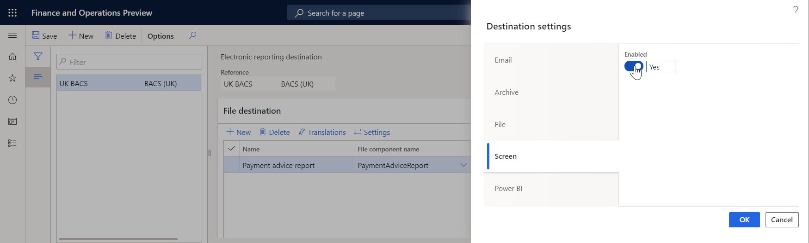

# Screen destination

[!include [banner](../includes/banner.md)]

You can configure a screen destination for each folder or file component of an Electronic reporting (ER) format that is configured to generate outbound documents. Based on the setting of the destination, a generated document is opened for preview in a separate browser tab.

If you set **Enabled** to **Yes**, a preview of the output is created. You can view some file types, such as XML, TXT, or PDF, directly in a browser window. For other file types, such Microsoft Excel or Word, the Microsoft Office Online service is used.

## Additional resources

- [Electronic reporting (ER) overview](general-electronic-reporting.md)
- [Electronic reporting (ER) destinations](electronic-reporting-destinations.md)

[!INCLUDE[footer-include](../../../includes/footer-banner.md)]
