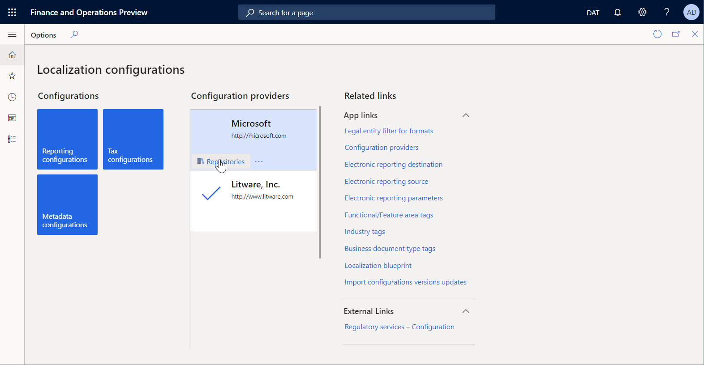
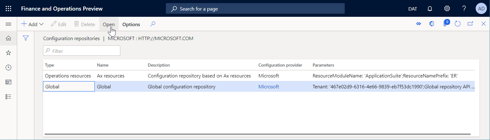
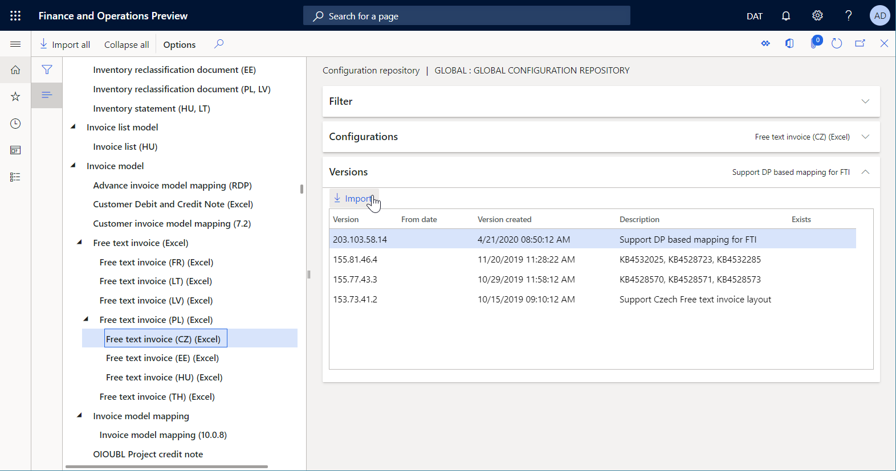
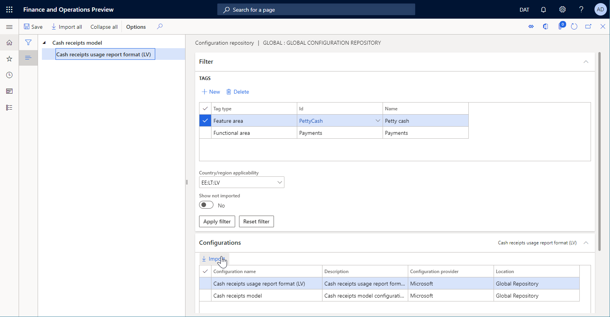

---
# required metadata

title: Download ER configurations from the Global repository of Configuration service 
description: This topic explains how to download Electronic reporting (ER) configurations from the Global repository of Configuration service.
author: NickSelin
ms.date: 06/02/2020
ms.topic: article
ms.prod: 
ms.technology: 

# optional metadata

ms.search.form: ERSolutionImport, ERWorkspace, ERSolutionRepositoryTable
# ROBOTS: 
audience: Application User, IT Pro
# ms.devlang: 
ms.reviewer: kfend
# ms.tgt_pltfrm: 
ms.custom: 105843
ms.assetid: dc44dea2-22ce-401e-98b9-d289e0e2825b
ms.search.region: Global
# ms.search.industry: 
ms.author: nselin
ms.search.validFrom: 2016-05-31
ms.dyn365.ops.version: AX 10.0.5

---

# Download ER configurations from the Global repository of Configuration service

[!include [banner](../includes/banner.md)]

This topic explains how to download [Electronic reporting (ER) configurations](general-electronic-reporting.md#Configuration) from the Global repository of configuration service. For more information, see [Microsoft Dynamics 365 for Finance and Operations - Regulatory Services, Configuration service](/business-applications-release-notes/october18/dynamics365-finance-operations/regulatory-service-configuration).

## Open configurations repository

1. Sign in to the Dynamics 365 Finance application using one of the following roles:

    - Electronic reporting developer
    - Electronic reporting functional consultant
    - System administrator

2. Go to **Organization administration > Workspaces > Electronic reporting**.
3. In the **Configuration providers** section, select the **Microsoft** tile.
3. On the **Microsoft** tile, select **Repositories**.

    

4. On the **Configuration repositories** page, in the grid, select the existing repository of the **Global** type. If this repository doesn't appear in the grid, follow these steps:

    1. Select **Add** to add a new repository.
    2. Select **Global** as the repository type, and then select **Create repository**.
    3. If prompted, follow the authorization instructions.
    4. Enter a name and description for the repository and then select **OK** to confirm the new repository entry.
    5. In the grid, select the new repository of the **Global** type.

5. Select **Open** to view the list of ER configurations for the selected repository.

    

## Import a single configuration

1. On the **Configuration repositories** page, in the configurations tree, select the ER configuration that you want.
2. On the **Versions** FastTab, select the required version of the selected ER configuration.
3. Select **Import** to download the selected version from Global repository to the current Finance instance.

    > [!NOTE]
    > The **Import** button is unavailable for ER configuration versions that are already present in the current Finance instance.

    

## Import filtered configurations

1. On the **Configuration repositories** page, in the configurations tree, expand the **Filter** FastTab.
2. In the **Tags** grid, add any tags that are needed.
3. In the **Country/region applicability** field, select the appropriate country/region codes, and then select  **Apply filter**.

    > [!NOTE]
    > The **Configurations** FastTab shows all the configurations that satisfy the specified selection conditions.

4. On the **Configurations** FastTab, select **Import** to download the filtered configurations from the Global repository to the current instance.
5. On the **Configurations** FastTab, select **Reset filter** to clean up the specified selection conditions.

    

> [!NOTE]
> Depending on the ER settings, configurations are validated after they are imported. You might be notified about any inconsistency issues that are discovered. Before you can use the imported configuration version, you must resolve the issues. For more information, see the list of related resources for this topic.

> [!NOTE]
> ER configurations can be configured as being dependent on other configurations. Therefore, along with a selected configuration, other configurations might be automatically imported. For more about configuration dependencies, see [Define the dependency of ER configurations on other components](tasks/er-define-dependency-er-configurations-from-other-components-july-2017.md).

## Additional resources

[Electronic reporting (ER) overview](general-electronic-reporting.md)

[!INCLUDE[footer-include](../../../includes/footer-banner.md)]
