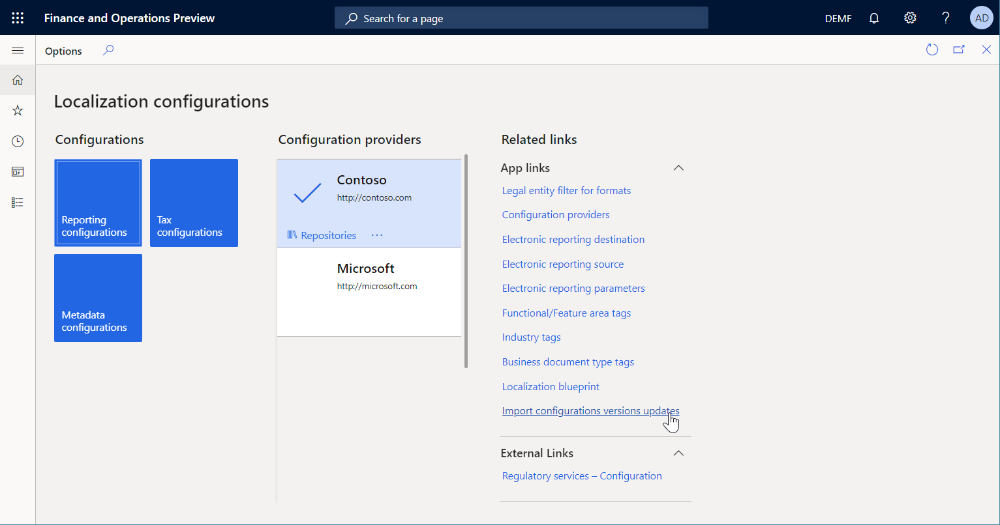
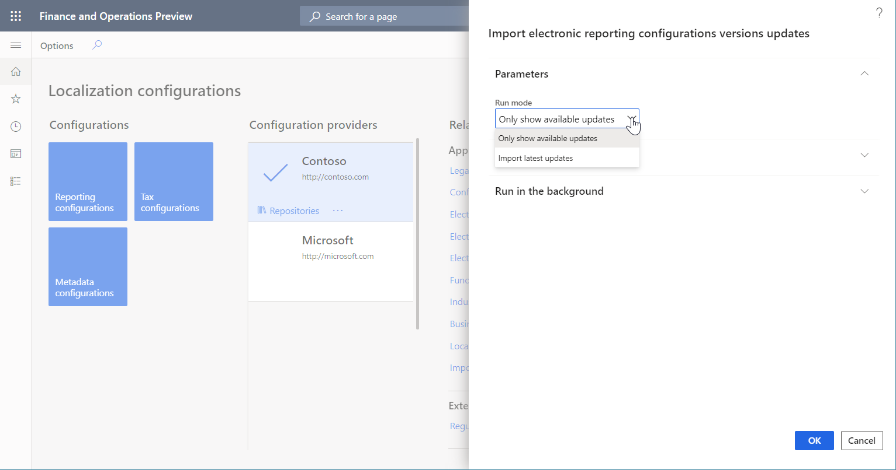
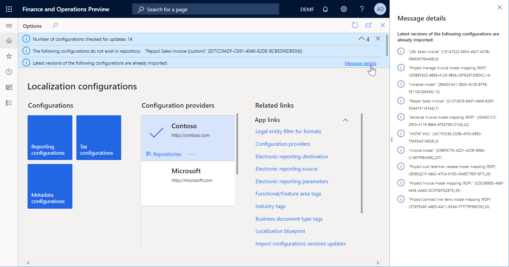
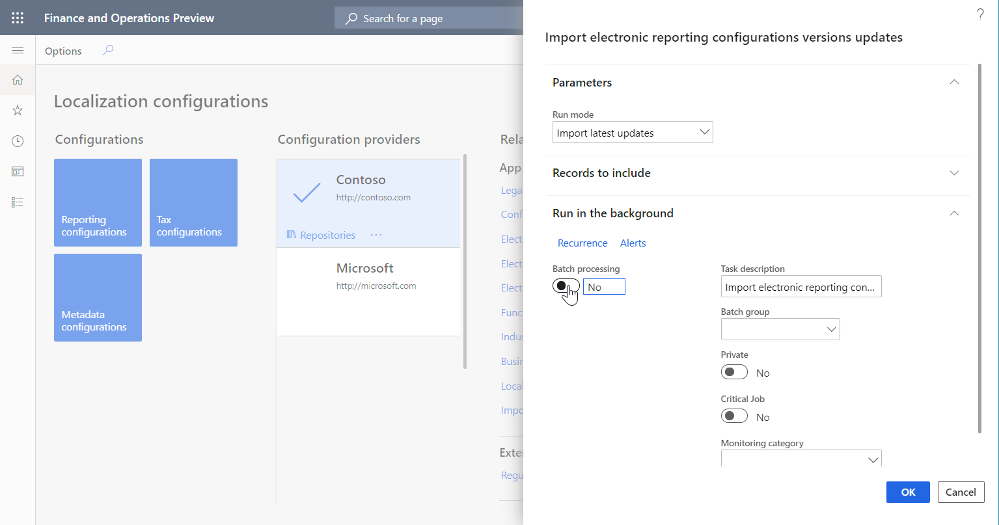
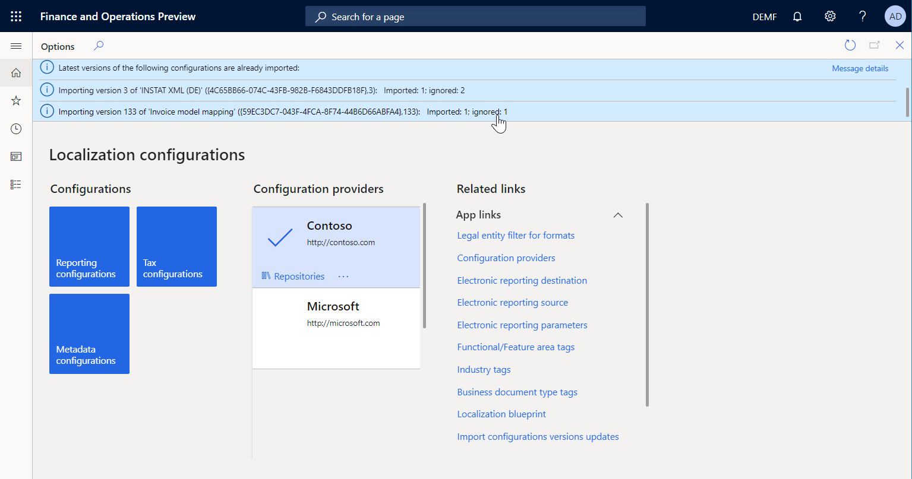
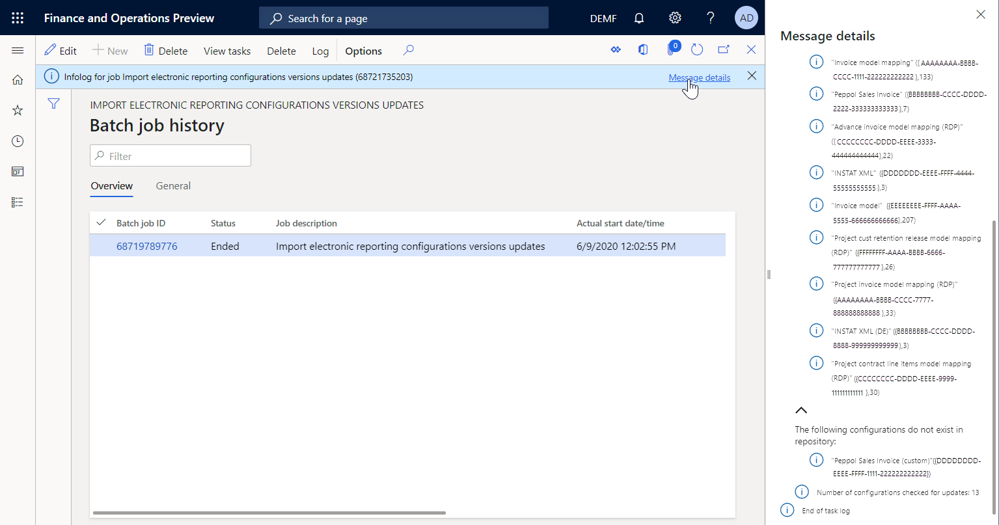

# Import updated versions of ER configurations

[!include [banner](../includes/banner.md)]
[!INCLUDE[banner](../../../finance/includes/rsc-to-gsw-banner.md)]

Electronic reporting (ER) [repositories](general-electronic-reporting.md#Repository) are used to share [ER configurations](general-electronic-reporting.md#Configuration). You can [import](download-electronic-reporting-configuration-lcs.md) ER configurations from different repositories into your instance of Microsoft Dynamics 365 Finance. When you import ER configurations, [configuration providers](general-electronic-reporting.md#Provider) can publish new versions repositories so that they can be shared.

This article explains how to import updated versions of ER configurations from the Global repository of the Configuration service. For more information, see [Microsoft Dynamics 365 Finance - Regulatory Services, Configuration service](/business-applications-release-notes/october18/dynamics365-finance-operations/regulatory-service-configuration).

## Review the available updated versions

1. Sign in to Finance by using one of the following roles:

    - Electronic reporting developer
    - Electronic reporting functional consultant
    - System administrator

2. Go to **Organization administration** \> **Workspaces** \> **Electronic reporting**.
3. On the **Localization configurations** page, in the **Related links** section, select **Import configurations versions updates**.

    

4. In the **Import electronic reporting configurations versions updates** dialog box, in the **Run mode** field, select **Only show available updates**. Then select **OK**. 

    

5. Review the messages that you receive. These messages provide the following information about the ER configurations in the current Finance instance and how they compare to the content of the Global repository:

    - The total number of ER configurations
    - ER configurations that aren't present in the Global repository
    - ER configurations for which the latest version is already available in the current Finance instance (To view the full list of these ER configurations, select the **Message details** link.)

        

    - ER configurations for which the latest version is available in the Global repository and can be imported into the current Finance instance (To view the full list of these ER configurations, select the **Message details** link.)

        

## Import available updated versions

1. Sign in to Finance by using one of the following roles:

    - Electronic reporting developer
    - Electronic reporting functional consultant
    - System administrator

2. Go to **Organization administration** \> **Workspaces** \> **Electronic reporting**.
3. On the **Localization configurations** page, in the **Related links** section, select **Import configurations versions updates**.
4. In the **Import electronic reporting configurations versions updates** dialog box, in the **Run mode** field, select **Import latest updates** to import the latest versions of ER configurations from the Global repository into the current Finance instance.
5. To schedule a batch job for the import, on the **Run in the background** FastTab, set the **Batch processing** option to **Yes**. If you want to repeat the import periodically, configure the required recurrence.

    

6. Select **OK**.
7. To learn what configuration versions have been imported, follow one of these steps:

    - If you run the import interactively instead of using a batch job, review the messages that you receive.

        

    - If you run the import in batch mode, follow these steps:

        1. Go to **Common** \> **Inquiries** \> **Batch jobs** \> **My batch jobs**.
        2. Find and select the **Import electronic reporting configurations versions updates** job, and then, on the Action Pane, on the **Batch job** tab, select **Batch job history** to view the job history.
        3. On the **Batch job history** page, select **Log**. Then, in the message that you receive, select the **Message details** link to view the job log.

        

> [!IMPORTANT]
> We don't recommend that you schedule a recurring batch job to import updated versions of ER configurations directly from the Global repository into a production environment, because the imported versions will immediately be available for use. Instead, use this approach to deploy versions of ER configurations to a sandbox environment. They can then be evaluated in the sandbox environment before they are deployed to a production environment.

## Additional resources

- [Electronic reporting (ER) overview](general-electronic-reporting.md)
- [Download ER configurations from the Global repository of Configuration service](er-download-configurations-global-repo.md)

[!INCLUDE[footer-include](../../../includes/footer-banner.md)]
