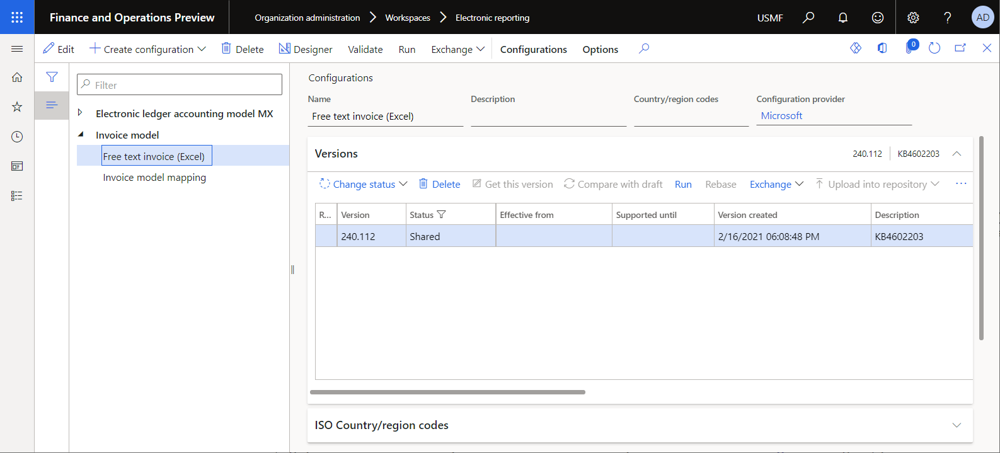

# Design an ER format to generate a report in Excel format with embedded images in page headers or footers

[!include[banner](../includes/banner.md)]

This article explains how a user in the System Administrator or Electronic Reporting Functional Consultant role can perform these tasks:

- Configure parameters for the [Electronic reporting (ER)](general-electronic-reporting.md) framework.
- Import ER [configurations](general-electronic-reporting.md#Configuration) that are [provided](general-electronic-reporting.md#Provider) by Microsoft and used to generate [free text invoices](../../../finance/accounts-receivable/create-free-text-invoice-new.md), based on a [template](er-fillable-excel.md#excel-file-component) in Microsoft Excel format.
- Create a [custom (derived)](general-electronic-reporting.md#building-a-format-selecting-another-format-as-a-base-customization) version of a standard ER format configuration that is provided by Microsoft.
- Modify the custom ER format configuration so that it generates a free text invoice report that has a company logo image in the footer.

The procedures in this article can be completed in the **USMF** company. No coding is required. Before you begin, download and save the following file.

| Description        | File name |
|--------------------|-----------|
| Company logo image | [Company logo.png](https://download.microsoft.com/download/8/2/e/82e6bd81-caac-4e9a-bfce-1392ce7c8616/Companylogo.png) |

## Content

- [Configure the legal entity](#ConfigureLegalEntity)
- [Configure the ER framework](#ConfigureFramework)

    - [Configure ER parameters](#ConfigureParameters)
    - [Activate an ER configuration provider](#ActivateProvider)

        - [Review the list of ER configuration providers](#ReviewProvidersList)
        - [Add a new ER configuration provider](#AddProvider)
        - [Activate the new ER configuration provider](#ActivateAddedProvider)

- [Import the standard ER format configurations](#ImportERSolution1)

    - [Import the standard ER configurations](#ImportERFormat)
    - [Review the imported ER configurations](#ReviewImportedERSolution)

- [Print a free text invoice by using the standard ER format](#PrintInvoice1)

    - [Set up print management](#ConfigurePrintManagement1)
    - [Print a free text invoice](#ProcessInvoice1)

- [Customize the standard ER format](#CustomizeProvidedFormat)

    - [Create a custom format](#DeriveProvidedFormat)
    - [Edit the custom format](#ConfigureDerivedFormat)
    - [Mark the custom format as runnable](#MarkFormatRunnable)

- [Print a free text invoice by using the custom ER format](#PrintInvoice2)

    - [Set up print management](#ConfigurePrintManagement2)
    - [Print a free text invoice](#ProcessInvoice2)

- [Additional resources](#References)

## Configure the legal entity

1. Go to **Organization administration** \> **Organizations** \> **Legal entities**.
2. On the **Legal entities** page, on the **Report company logo image** FastTab, select **Change**.
3. In the **Select image file to upload** dialog box, select **Browse**, and select the **Company logo.png** file that you downloaded earlier.
4. Select **Save**, and then close the **Legal entities** page.

## Configure the ER framework

As a user in the Electronic Reporting Functional Consultant role, you must configure the minimal set of ER parameters before you can start to use the ER framework to design a custom version of a standard ER format.

### Configure ER parameters

1. Go to **Organization administration** \> **Workspaces** \> **Electronic reporting**.
2. On the **Localization configurations** page, in the **Related links** section, select **Electronic reporting parameters**.
3. On the **Electronic reporting parameters** page, on the **General** tab, set the **Enable design mode** option to **Yes**.
4. On the **Attachments** tab, set the following parameters:

    - In the **Configurations** field, select the **File** type for the **USMF** company.
    - In the **Job archive**, **Temporary**, **Baseline**, and **Others** fields, select the **File** type.

For more information about ER parameters, see [Configure the ER framework](electronic-reporting-er-configure-parameters.md).

### Activate an ER configuration provider

Every ER configuration that is added is marked as owned by an ER configuration provider. The ER configuration provider that is activated in the **Electronic reporting** workspace is used for this purpose. Therefore, you must activate an ER configuration provider in the **Electronic reporting** workspace before you start to add or edit ER configurations.

> [!NOTE]
> An ER configuration can be edited only by the configuration owner. Before an ER configuration can be edited, the appropriate ER configuration provider must be activated in the **Electronic reporting** workspace.

#### Review the list of ER configuration providers

1. Go to **Organization administration** \> **Workspaces** \> **Electronic reporting**.
2. On the **Localization configurations** page, in the **Related links** section, select **Configuration providers**.
3. On the **Configuration provider table** page, each provider record has a unique name and URL. Review the contents of this page. If a record for **Litware, Inc.** (`https://www.litware.com`) already exists, skip the next procedure, [Add a new ER configuration provider](#AddProvider).

#### Add a new ER configuration provider

1. Go to **Organization administration** \> **Workspaces** \> **Electronic reporting**.
2. On the **Localization configurations** page, in the **Related links** section, select **Configuration providers**.
3. On the **Configuration providers** page, select **New**.
4. In the **Name** field, enter **Litware, Inc.**
5. In the **Internet address** field, enter `https://www.litware.com`.
6. Select **Save**.

#### Activate the new ER configuration provider

1. Go to **Organization administration** \> **Workspaces** \> **Electronic reporting**.
2. On the **Localization configurations** page, in the **Configuration providers** section, select the **Litware, Inc.** tile, and then select **Set active**.

For more information about ER configuration providers, see [Create configuration providers and mark them as active](tasks/er-configuration-provider-mark-it-active-2016-11.md).

## Import the standard ER format configurations

### Import the standard ER configurations

To add the standard ER configurations to your current instance of Dynamics 365 Finance, you must import them from the ER [repository](general-electronic-reporting.md#Repository) that was configured for that instance.

1. Go to **Organization administration** \> **Workspaces** \> **Electronic reporting**.
2. On the **Localization configurations** page, in the **Configuration providers** section, select the **Microsoft** tile, and then select **Repositories** to view the list of repositories for the **Microsoft** provider.
3. On the **Configuration repositories** page, select the repository of the **Global** type, and then select **Open**. If you're prompted for authorization to connect to [Regulatory Configuration Service](../../../finance/localizations/rcs-overview.md), follow the authorization instructions.
4. On the **Configuration repository** page, in the configuration tree in the left pane, select the **Free text invoice (Excel)** format configuration.
5. On the **Versions** FastTab, select the latest version (for example, **240.112**) of the selected ER format configuration.
6. Select **Import** to download the selected version from the Global repository to the current Finance instance.

> [!TIP]
> If you have trouble accessing the [Global repository](er-download-configurations-global-repo.md), you can [download configurations](download-electronic-reporting-configuration-lcs.md) from Microsoft Dynamics Lifecycle Services (LCS) instead.

### Review the imported ER configurations

1. Go to **Organization administration** \> **Workspaces** \> **Electronic reporting**.
2. On the **Localization configurations** page, in the **Configurations** section, select the **Reporting configurations** tile.
3. On the **Configurations** page, in the configuration tree in the left pane, expand **Invoice model**.
4. In addition to the selected **Free text invoice (Excel)** ER format, other required ER configurations were imported. Make sure that the following ER configurations are available in the configuration tree:

    - **Invoice model** – This configuration contains the data model ER component that represents the data structure of the invoicing business domain.
    - **Invoice model mapping** – This configuration contains the model mapping ER component that describes how the data model is filled in with application data at runtime.
    - **Free text invoice (Excel)** – This configuration contains the format and format mapping ER components. The format component specifies the report layout, based on a template in Excel format. The format mapping component contains the model data source and specifies how this data source is used to fill in the report layout at runtime.

## Print a free text invoice by using the standard ER format

### Set up print management

1. Go to **Accounts receivable** \> **Invoices** \> **All free text invoices**.
2. On the **Free text invoice** page, select the **FTI-00000002** invoice, and then, on the Action Pane, on the **Invoice** tab, in the **Print management** group, select **Print management**.
3. On the **Print management setup** page, in the tree on the left, expand **Module - accounts receivable \> Documents \> Free text invoice**, and then select the **Original \<Default\>** item.
4. In the **Report format** field, select **Free text invoice (Excel)**.
5. Select the **Esc** key to leave the **Print management setup** page and return to the **Free text invoice** page.

### Print a free text invoice

1. On the **Free text invoice** page, make sure that the **FTI-00000002** invoice is still selected, and then, on the Action Pane, on the **Invoice** tab, in the **Document** group, select **Print** \> **Selected**.
2. Download the generated invoice in Excel format, and open it for preview.
3. Notice that, in accordance with the structure of the Excel template for the provided ER format, the page footer of the generated invoice contains information about the current page number and the total number of pages in the report.

## Customize the standard ER format

For the example in this section, you can use the ER configurations that are provided by Microsoft to generate a free text invoice in Excel format. However, you must add a customization to put a company logo image in the page footer of generated invoices.

In this case, as the representative of Litware, Inc., you must create (derive) a new ER format configuration that is based on the Microsoft-provided **Free text invoice (Excel)** configuration.

### Create a custom format

1. Go to **Organization administration** \> **Electronic reporting** \> **Configurations**.
2. On the **Configurations** page, in the configuration tree in the left pane, expand **Invoice model**, and then select **Free text invoice (Excel)**. Litware, Inc. will use the imported version (for example, **240.112**) of this ER format configuration as the base for the custom version.
3. Select **Create configuration** to open the drop-down dialog box. Use this dialog box to create a new configuration for a custom payment format.
4. In the **New** field group, select the **Derive from Name: Free text invoice (Excel), Microsoft** option.
5. In the **Name** field, enter **Free text invoice (Excel) custom**.
6. Select **Create configuration**.

Version 240.112.1 of the **Free text invoice (Excel) custom** ER format configuration is created. This version has a status of **Draft** and can be edited. The current content of your custom ER format matches the content of the format that is provided by Microsoft.

### Edit the custom format

Configure your custom format so that a company logo image is put in the footer on every page of the report.

1. Go to **Organization administration** \> **Electronic reporting** \> **Configurations**.
2. On the **Configurations** page, in the configuration tree in the left pane, expand **Payment model**, and then select **Free text invoice (Excel) custom**.
3. On the **Versions** FastTab, select version **240.112.1** of the selected configuration.
4. Select **Designer**.
5. On the **Format designer** page, select **Show details** to view more information about the format elements.
6. Expand and review the following elements:

    - The **Free text invoice** element of the **Excel** type. This element is used to generate an invoice in Excel workbook format.
    - The **Free text invoice \\ Invoice** element of the **Sheet** type. This element is used to generate a worksheet of the generated Excel workbook.
    - The **Free text invoice \\ Invoice \\ Footer** element of the **Footer** type. This element is used to fill in an invoice footer.

7. Select the **Free text invoice \\ Invoice \\ Footer** element.

    

    > [!NOTE]
    > Every page footer of a generated invoice contains information about the current page number and the total number of pages in the report. As you can see, the **Free text invoice \\ Invoice \\ Footer** element contains no child elements. Therefore, the Excel template that is being used is configured to show paging details in the center of every report's footer.

8. Select **Add**, and then select the **Excel \\ Picture** type of the format element that you're adding:

    1. In the **Alignment** field, select **Right**.
    2. In the **Scale the height** field, select **Relative**.
    3. In the **Scale in percentage** field, enter **70**.
    4. Select **OK**.

        > [!NOTE]
        > The **Excel \\ Picture** element is used to add a company logo image and align it on right side of the page footer.

    

9. In the format structure tree on the left, select the **Picture** element that you just added, and then, on the **Mapping** tab, expand the **model** data source.
10. Expand **model.Payment** \> **model.InvoiceBase \> model.InvoiceBase.CompanyInfo**, and then select the **model.InvoiceBase.CompanyInfo.Logo** data source field. The data source field of the [Container](er-formula-supported-data-types-composite.md#container) type exposes the company logo image as media content.
11. Select **Bind**. The **Picture** format element is now bound with the **model.InvoiceBase.CompanyInfo.Logo** data source field. Therefore, at runtime, a company logo image will be put in the footer of generated invoices.

    

12. Select **Save**, and then close the **Designer** page.

### Mark the custom format as runnable

Because the first version of the custom format has been created and has a status of **Draft**, you can run the format for testing purposes. To run the report, process a vendor payment by using the payment method that refers to your custom ER format. By default, when you call an ER format from the application, only versions that have a status of **Completed** or **Shared** are considered. This behavior helps prevent ER formats that have unfinished designs from being used. However, for your test runs, you can force the application to use the version of your ER format that has a status of **Draft**. In this way, you can adjust the current format version if any modifications are required. For more information, see [Applicability](electronic-reporting-destinations.md#applicability).

To use the draft version of an ER format, you must explicitly mark the ER format.

1. Go to **Organization administration** \> **Electronic reporting** \> **Configurations**.
2. On the **Configurations** page, on the Action Pane, on the **Configurations** tab, in the **Advanced settings** group, select **User parameters**.
3. In the **User parameters** dialog box, set the **Run settings** option to **Yes**, and then select **OK**.
4. Select **Edit** to make the current page editable, and then, in the configuration tree in the left pane, select **Free text invoice (Excel) custom**.
5. Set the **Run Draft** option to **Yes**.

## Print a free text invoice by using the custom ER format

### Set up print management

1. Go to **Accounts receivable** \> **Invoices** \> **All free text invoices**.
2. On the **Free text invoice** page, select the **FTI-00000002** invoice, and then, on the Action Pane, on the **Invoice** tab, in the **Print management** group, select **Print management**.
3. On the **Print management setup** page, in the tree on the left, expand **Module - accounts receivable** \> **Documents** \> **Free text invoice**, and then select the **Original** **\<Default\>** item.
4. In the **Report format** field, select **Free text invoice (Excel) custom**.
5. Select **Esc** to leave the **Print management setup** page and return to the **Free text invoice** page.

### Print a free text invoice

1. On the **Free text invoice** page, make sure that the **FTI-00000002** invoice is still selected, and then, on the Action Pane, on the **Invoice** tab, in the **Document** group, select **Print** \> **Selected**.
2. Download the generated invoice in Excel format, and open it for preview.
3. Notice that, in accordance with the structure of the custom ER format, the page footer of the generated invoice contains a company logo image in addition to information about the report's paging.

## Additional resources

- [Design a configuration for generating documents in Excel format](er-fillable-excel.md)
- [Embed images and shapes in documents that you generate by using ER](electronic-reporting-embed-images-shapes.md)
