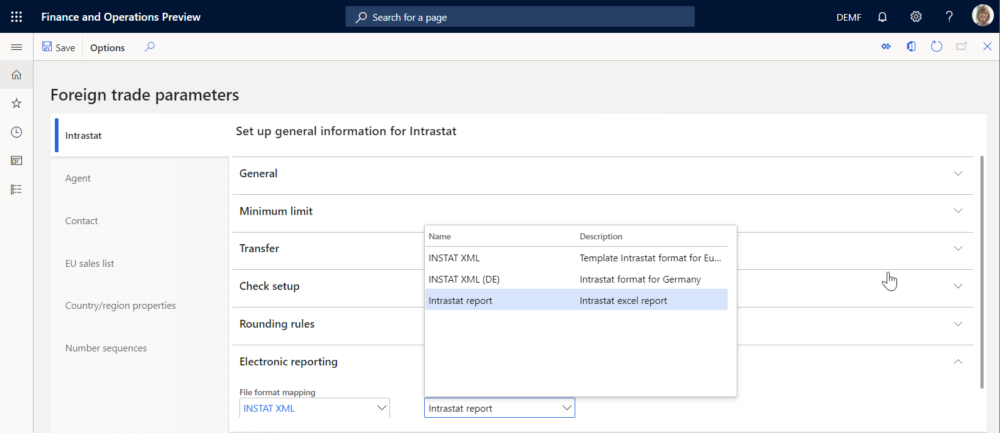
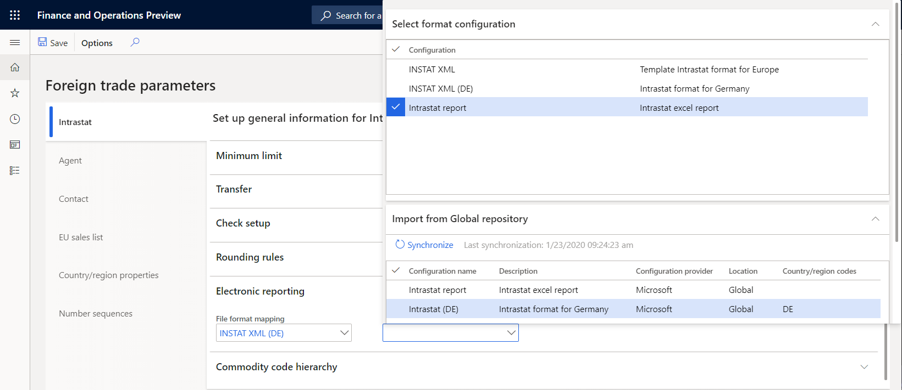
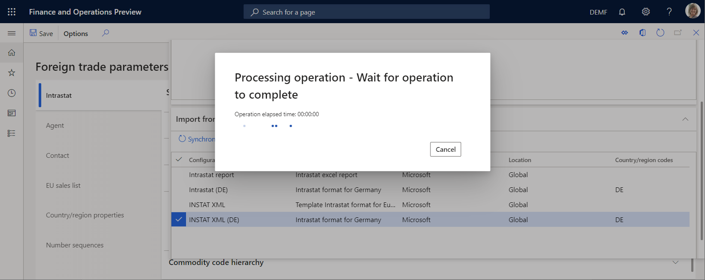
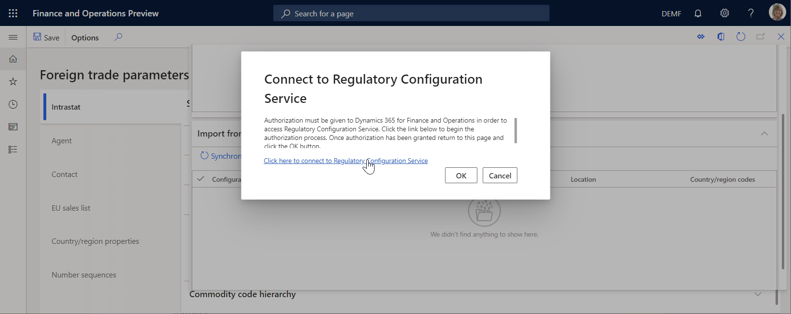
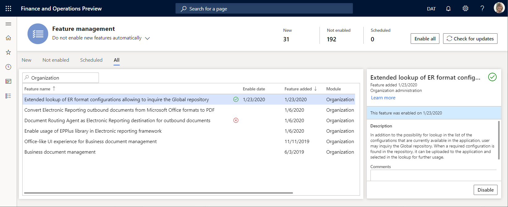
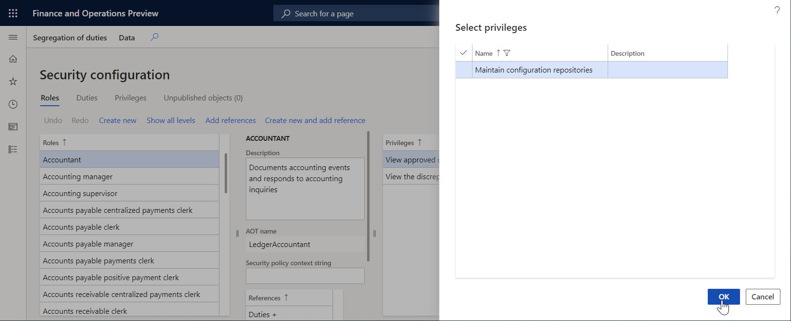

# Allow users to set up an ER format reference inquiring a format from the Global repository

[!include [banner](../includes/banner.md)]

You can use the [Electronic reporting](general-electronic-reporting.md) (ER) framework to configure formats for outbound documents in accordance to the legal requirements of various countries/regions. You can also use the ER framework to configure formats for parsing inbound documents and use the information from those documents to append or update application data. Each of these formats can be used in your Dynamics 365 Finance instance for handling inbound or outbound business documents as part of a certain business process.

Usually, you must specify what ER format must be used in a certain business process. To do that, select a single ER format in a lookup field that is configured as part of business process-specific parameters. These lookup fields are usually implemented by using the appropriate API of the ER framework. For more information, see [ER framework API - code to display a format mapping lookup](er-apis-app73.md#code-to-display-a-format-mapping-lookup).

For example, when you configure [foreign trade parameters](../../../finance/localizations/emea-intrastat.md#set-up-foreign-trade-parameters), you need to set up the references to individual ER formats that will be used to generate the Intrastat declaration and the Intrastat declaration control report. The screenshots below show how the ER formats lookup field looks like in the **Foreign trade parameters** page.

If the current Finance instance contains no Intrastat business process-related ER formats, this lookup field will be empty.

If the current Finance instance contains Intrastat business process related ER formats, this lookup field offers the ER formats.

This lookup offers only the ER formats that have already been imported to the current Finance instance. To
[import](./tasks/er-import-configuration-lifecycle-services.md) ER solutions to the current Finance instance, you need to have permissions to run the appropriate function of the ER framework that supports the [lifecycle](general-electronic-reporting-manage-configuration-lifecycle.md) of ER solutions that contain ER formats.

Starting in the Finance version 10.0.9 (April 2020 release), the user interface of the ER format lookup that is implemented by using the ER framework API, has been extended. You can still select the existing ER formats, which on the **Select format configuration** FastTab. In addition, the extended lookup offers the new option to search the Global repository (GR) to locate specific ER formats. All ER formats of the GR are offered on the **Import from Global repository** FastTab.

Similar to the **Select format configuration** FastTab, the **Import from Global repository** FastTab shows only the ER formats that are applicable to the business process for which an ER format is selected in this lookup field. In this example, the generation of Intrastat declaration. The ER format is applicable for the company to which the user is currently signed in, depending on the company country context.

When you select an ER format on the **Import from Global repository** FastTab, the selected ER format
[configuration](general-electronic-reporting.md#Configuration) is imported from the GR to the current Finance instance.

Then, if the import completes successfully, the reference to the imported ER format is stored in this lookup field. When you access the GR for the first time, you need to follow the link provided to sign up for the [Regulatory Configuration Service](https://aka.ms/rcs) (RCS) that is used to manage access to the GR storage.

By default, the **Import from Global repository** FastTab presents the list of ER formats from the temporary storage that is automatically created based on the GR content for performance improvements. This happens when the **Import from Global repository** FastTab is opened the first time, which may take several seconds.

If you do not see the required ER format in the **Import from Global repository** FastTab, but you are sure that this ER format is stored in the GR, select the **Synchronize** option. This option will update the temporary storage and synchronize it with the current content of the GR.

## Feature activation

The availability of this functionality is controlled by the feature **Extended lookup of ER format configurations allowing to inquire the Global repository** in the **Feature management**. This feature is enabled by default.

## Security considerations

The **Maintain configuration repositories** (**ERMaintainSolutionRepositories**) privilege controls access to the GR for a user opening the ER format lookup with the enabled **Import from Global repository** FastTab. To allow users to access the GR content from the ER format lookups, you need to change the security settings by granting the **ERMaintainSolutionRepositories** privilege to users either directly or by using already assigned roles and duties.

The following screenshot shows how this privilege can be granted to users who are assigned to the **Accountant** role. This role allows users to configure foreign trade parameters and set up references to the ER formats in the **File format mapping** and **Report format mapping** fields on the **Foreign trade parameters** page.

## Limitations

Access to the GR in the ER format lookup is currently only supported for the selection of ER formats that are used to generate outbound documents.

## Frequently asked questions

### Why can't I access the Global repository from the ER format lookup?

If you have enabled the **Extended lookup of ER format configurations allowing to inquire the Global repository** feature on the **Feature management** page, but users can't see ER formats on the **Import from Global repository** FastTab and the **Synchronize** option is visible but disabled, make sure that the **Maintain configuration repositories** (**ERMaintainSolutionRepositories**) privilege has been granted to the user. Contact your system administrator to receive this privilege.

## Additional resources

- [Electronic reporting (ER) overview](general-electronic-reporting.md)
- [Electronic reporting (ER) framework API](er-apis-app73.md)
- [Manage Electronic reporting (ER) configurations lifecycle](general-electronic-reporting-manage-configuration-lifecycle.md)

[!INCLUDE[footer-include](../../../includes/footer-banner.md)]
