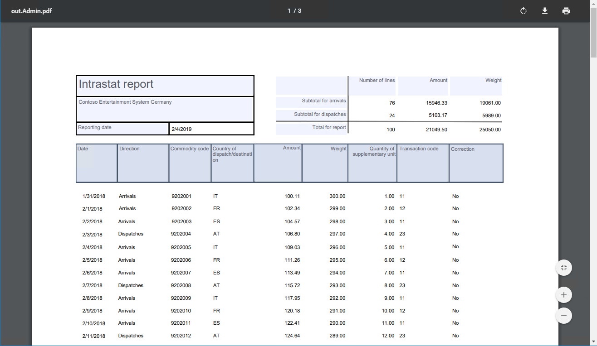

# Design ER configurations to fill in PDF templates

[!include[banner](../includes/banner.md)]

The procedures in this article are examples that show how a user in either the **System administrator** role or the **Electronic reporting developer** role can configure an Electronic reporting (ER) format that generates reports as PDF files by using fillable PDF documents as report templates. These steps can be performed in any company of Dynamics 365 Finance or Regulatory Configuration Services (RCS).

## Prerequisites

Before you begin, you must have one of the following types of access, depending on the service that you use to complete the procedures in this article:

- Access to Finance for one of the following roles:

    - Electronic reporting developer
    - Electronic reporting functional consultant
    - System administrator

- Access to RCS for one of the following roles:

    - Electronic reporting developer
    - Electronic reporting functional consultant
    - System administrator

You must also complete the [Create configuration providers and mark them as active](tasks/er-configuration-provider-mark-it-active-2016-11.md)
procedure.

Finally, download the following files.

| Content description                       | File name                                     |
|-------------------------------------------|-----------------------------------------------|
| Template for the first page of the report | [IntrastatReportTemplate1.pdf](https://download.microsoft.com/download/0/8/3/0832c82b-4448-4562-afbf-01e0efc8d999/IntrastatReportTemplate1.pdf)                  |
| Template for other pages of the report    | [IntrastatReportTemplate2.pdf](https://download.microsoft.com/download/c/7/a/c7a8a806-2192-4034-9052-e8b84b527d5e/IntrastatReportTemplate2.pdf)                  |
| Sample ER format - PDF                          | [Intrastat report (PDF).version.1.1.xml](https://download.microsoft.com/download/a/8/7/a87aea3e-3f60-404c-8899-c471d20e7ea9/IntrastatreportPDFversion1.1.xml)        |
| Sample ER format - Excel                          | [Intrastat (import from Excel).version.1.1.xml](https://download.microsoft.com/download/a/2/c/a2c0c145-d989-4e55-9d47-9647c02e4ee4/IntrastatimportfromExcelversion1.1.xml) |
| Sample dataset                            | [Intrastat sample data.xlsx](https://download.microsoft.com/download/9/f/1/9f1c5b96-3800-475f-8cf6-1ddd42873758/Intrastatsampledata.xlsx)                    |

## Design the format configuration

### Get access to the list of configurations provided by Microsoft

1. Go to **Organization administration \> Workspaces \> Electronic reporting**.
2. Make sure that the **Litware, Inc.** provider is available and marked as active.
3. On the tile for the **Microsoft** provider, select **Repositories**.

    > [!NOTE]
    > If a repository of the **LCS** type already exists, skip the remaining steps of this procedure.

4. Select **Add**.
5. In the drop-down dialog box, in the **Configuration repository type** field group, select the **LCS** option.
6. Select **Create repository**.
7. Select **OK**.

### Get the model configurations provided by Microsoft

1. On the left side of the **Configuration repositories** page, select the **Show filters** button (the funnel symbol).
2. Add a filter for a value of **LCS** in the **Type** field, and use the **begins with** operator.
3. Select **Apply**.
4. Select **Open**.
5. In the tree, select **Intrastat model**.
6. On the **Versions** FastTab, select version **1**.

    > [!NOTE]
    > If the **Import** button on the **Versions** FastTab is unavailable, skip the remaining steps of this procedure.

7. Select **Import**.
8. Select **Yes** to confirm the import of the selected version of the **Intrastat model** model configuration.

### Create a new format configuration

1. In the **Electronic reporting** workspace, select the **Reporting configurations** tile.
2. In the tree, select **Intrastat model**.
3. Select **Create configuration**.

    > [!NOTE]
    > If the **Create configuration** button isn't available, you must turn on design mode on the **Electronic reporting parameters** page that can be opened from the **Electronic reporting** workspace.

4. In the drop-down dialog box, in the **New** field group, select the **Format based on data model Intrastat** option.
5. In the **Name** field, enter **Intrastat report (PDF)**.
6. In the **Description** field, enter **Intrastat report in PDF format**.

    > [!NOTE]
    > The active configuration provider is automatically entered. This provider will be able to maintain this configuration. Although other providers can use this configuration, they won't be able to maintain it.

7. Optional: In the **Format type** field, you can select a specific format of electronic document. If you select **PDF**, at design time, the ER Operations designer will offer just the format elements that are applicable only to documents that are generated in PDF format (**PDF\File**, **PDF\PDF Merger**, etc.). If you leave this field blank, a format of electronic document will be specified at design time in the ER Operations designer when a first format element will be added. For example, if you add the **Excel\File** as the first format element, the ER Operations designer will offer you just the format elements that are applicable only to documents that are generated in Excel format (**Excel\Cell**, **Excel\Range**, etc.). 
format.
8. Select **Create configuration**.

A new ER format configuration is created. You can use the draft version of this configuration to store the ER format component that is designed to generate electronic documents in PDF format.

### Design the format of an electronic document

Next, in the ER format configuration that you created, you will design the ER format that generates the **Intrastat control** report in PDF format. The first page of this report must show a summary of the report and details of the foreign trade transactions that are reported on. The other pages must show only details of the foreign trade transactions that are reported on. Because the report pages that are generated must have different layouts, two different templates in PDF format will be used in the ER format.

In any PDF viewer, open the PDF templates that you downloaded. Notice that each template contains multiple fields that must be filled in. In each template, details of foreign trade transactions are presented as 42 rows, each of which has nine fields. The row number appears at the end of each field's name (for example, **Date 1**…**Date 42** and **Commodity 1**…**Commodity 42**).

The following illustration shows the PDF template for the first page of the report.

The following illustration shows the PDF template for other pages of the report.

1. On the **Configurations** page, select **Designer**.
2. Select **Add root**.
3. In the drop-down dialog box, in the tree, select **PDF \> PDF Merger**.

    When you select the **PDF Merger** element as the root element of the format, all PDF documents that are generated at run time will be merged into a single final PDF document. If you need only one PDF template to generate all the required documents by using the ER format that you design, you can select **PDF file** as the root element.

4. In the **Name** field, enter **Output**.
5. In the **Language preferences** field, select **User preference**. The report will be generated in the preferred language of the user who runs it.
6. In the **Culture preferences** field, select **User preference**. Values and dates that are presented on the pages of the report will be formatted based on the preferred locale of the user who runs the report.
7. Select **OK**.
8. On the Action Pane, on the **Import** tab, select **Import from PDF**.

    When a fillable PDF document is imported as a template for this ER format, all the required ER format elements (**PDF file**, **Field group**, and **Field** elements) are automatically created in the format that is designed, based on the structure of the PDF document that is imported.

9. Select **Browse**. Navigate to and select the **IntrastatReportTemplate1.pdf** file that you downloaded earlier as a prerequisite.
10. Select **OK**.

    The selected file is loaded, and the **Template** field in the **Import from PDF** dialog box is filled in.

11. Set the **Group fields** option to **Yes**. If the selected PDF document contains any field groups, they will be used to group the ER format elements that are created. A **Field group** format element will be created for this purpose.

    If this option is set to **No**, the required ER format elements will be created as a flat list of elements that are nested under the **PDF File** format element that is created.

12. Select **OK**.

    

13. In the tree, expand **Output**.

    Notice that the **PDF File** component has been automatically created to manage the creation of the first page of the report that is generated at run time.

14. In the tree, expand **Output \> PDF File**.

    Notice that the structured list of format elements has been automatically created in this ER format, based on the structure of the fillable PDF document that you imported earlier.

15. In the tree, select **Output \> PDF File**.
16. In the **Name** field, enter **Page 1**.

    This format element will be used to generate the first page of the **Intrastat control** report. That page will show a summary of the report and details of foreign trade transactions.

    If you leave the **Language preferences** field blank, the **Language preferences** setting of the parent **PDF Merger** element will determine the language of the report that is generated by using this format element. You can select another value to override the setting of the parent element.

    If you leave the **Culture preferences** field blank, the **Culture preferences** setting of the parent **PDF Merger** element will determine the locale of the report that is generated by using this format element. The locale determines the format of values and dates on the pages of the report. You can select another value to override the setting of the parent element.

17. On the Action Pane, select the **Import** tab. Notice that the **Update from PDF** button has become available for selected format element, **PDF File**.

    You can use this button to import the updated PDF template to the edited format. When the updated PDF template is imported, the list of format elements will be changed accordingly:

    - For any new fields in the updated PDF template, new format elements are created in the edited ER format.
    - If the updated PDF template no longer includes fields that correspond to any existing format elements in the edited ER format, those format elements are deleted from the ER format.

18. On the **Format** tab, select **Attachments**.

    Notice that the imported PDF document is attached to the edited ER format.

    

19. Continue to design this format by importing the second PDF template, adding necessary bindings to data sources, and so on.
20. Select **Save**.
21. Close the page.
22. Select **Delete**.
23. Select **Yes**.

To learn how new **PDF Merger**, **PDF File**, **Field group** and **Field** format elements can be used to generate documents in PDF format, you can import and analyze the sample ER format.

### Import the format configuration

Next, you will import the sample ER format that you previously downloaded to generate the **Intrastat control** report in PDF format. The first page of the report must show a summary of the report and details of the foreign trade transactions that are reported on. The other pages must show only details of the foreign trade transactions that are reported on.

1. On the **Configurations** page, select **Exchange \> Load from XML file**.
2. Select **Browse**. Navigate to and select the **Intrastat report (PDF).version.1.1.xml** file that you downloaded earlier as a prerequisite.
3. Select **OK**.

## Analyze the format configuration

### Format layout

1. On the **Configurations** page, in the tree, select **Intrastat model \> Intrastat report (PDF)**.
2. Select **Designer**.
3. Select **Show details**.
4. In the tree, expand **Output: PDF Merger**.

    Notice that this ER format contains two **PDF File** elements, each of which uses a different PDF template. One template is used to generate the first page of the report in PDF format, and the other template is used to generate the other pages.

5. In the tree, expand **Output: PDF Merger \> Page 1: PDF File (IntrastatReportTemplate1)**.
6. In the tree, expand **Output: PDF Merger \> Page N: PDF File (IntrastatReportTemplate2)**.

    Notice that, because the content of the two PDF templates differs, the structure of the nested format elements for the two **PDF File** elements also differs.

### Format mapping

1. On the **Format designer** page, select the **Mapping** tab.
2. In the tree, expand **Paging \> Pages**.

    

    Note the following details:

    - The **Output \> Page 1** format element of the **PDF File** type isn't bound to any data source, and the **Enabled** expression of this format element is empty. Therefore, at run time, the **IntrastatReportTemplate1** PDF template will be filled in only one time when an individual PDF document is generated.
    - The **Output \> Page N** format element of the **PDF File** type is bound to the **Paging.PageN** data source of the **Record list** type, and the **Enabled** expression of this format element is empty. Therefore, at run time, the **IntrastatReportTemplate2** PDF template will be filled in for each record from the bound record list when an individual PDF document is generated.
    - Because the **Page 1: PDF File** and **Page N: PDF File** format elements are children of the **Output: PDF Merger** format element, all PDF documents that are filled in will be merged into a single final PDF document.
    - The **Paging.Page1** and **Paging.PageN** data sources are configured as filters of records from the **Paging.Pages** data source. This data source is configured to split the whole set of foreign trade transactions into batches. Each batch contains up to 42 records. The following ER expression is used to split the transactions into batches:

        SPLITLIST(Totals.CommodityRecord,42)

    - The **Paging.Pages** data source contains the **Paging.Pages.Enumerated** element that returns the details of each record that is included in a batch. These details include the record's sequence in the current batch (the **Paging.Pages.Enumerated.Number** field). The **Paging.Pages.Enumerated.Number** field is used in the **Name** expression of **PDF Field** format elements to dynamically generate a field name that is based on the transaction number in a batch. The field name that is generated is then used to fill in the correct PDF field in the PDF template that is used.
    - The **Output \> Page N \> Details 2** format element of the **PDF Group** type is bound to the **Paging.PageN.Enumerated** data source (or **\@.Enumerated** if the **Relative path** view mode is used) of the **Record list** type. Therefore, at run time, the nested elements of this PDF group will be filled in for each record from the bound record list. In this way, individual PDF lines are virtually generated when for each Nth of 42 records of the **Paging.PageN.Enumerated** list the following PDF fields are filled in: Date N, Direction N, Commodity N, etc. Therefore, in this respect, the behavior of this **Field group** format element resembles the behavior of the **XML \> Sequence** and **Text \> Sequence** format elements.

3. In the tree, expand **Output \> Page N \> Details2**.
4. In the tree, select **Output \> Page N \> Details2 \> PageFooter**.

    Notice that the **Name** attribute of this format element is defined as **PageFooter**. Also notice that the **Name** expression of the format element is empty.

5. In the tree, select **Output \> Page N \> Details2 \> Correction 1**.

    Notice that the **Name** attribute of this format element is defined as **Correction 1**. Also notice that the **Name** expression of the format element is defined as **Paging.FldName("Correction",\@.Number)**.

Note that the **Field** format element is used to fill in an individual field of a fillable PDF document that is defined as a template of the parent **PDF File** format element. The binding of the **PDF File** format element or its nested elements, if it has any nested elements, specifies the value that is entered in corresponding PDF fields. Different properties of the **Field** format element can be used to specify which PDF field is filled in by an individual format element:

- On the **Format** tab, the **Name** attribute of the format element
- On the **Mapping** tab, the **Name** expression of the format element

Because both properties are optional for a **Field** format element, the following rules are applied to specify the target PDF field:

- If the **Name** attribute is blank, and the **Name** expression returns an empty string at run time, an exception is thrown at run time to notify the user that a PDF field can't be found in the PDF template that is being used to fill in the PDF document.
- If the **Name** attribute is defined, and the **Name** expression is blank, the PDF field that has the same name as the **Name** attribute of the format element is filled in.
- If the **Name** attribute is defined, and the **Name** expression is configured, the PDF field that the same name as the value that is returned by the **Name** expression of the format element is filled in.

> [!NOTE]
> When a checkbox in the PDF template doesn't belong to a group of checkboxes, it's represented in the editable ER format as a **Field** element that is nested under the **PDF File** element. This type of PDF checkbox can be set as selected in the following ways:
>
> - The corresponding **Field** format element is bound to a data source field of the *[Boolean](er-formula-supported-data-types-primitive.md#boolean)* data type that has a value of **True**.
> - The corresponding **Field** format element contains a nested **String** format element that is bound to a data source field that has a text value of **1**, **True**, or **Yes**.
>
> Your template can contain a group of checkboxes where only one checkbox can be selected at a time. Those checkboxes are represented in a PDF template as multiple form fields of the *CHECKBOX* type. Each field has the same name but a different export value. When you import the template into the editable ER format, each checkbox will be represented in the format hierarchical structure as a **Check box group item** element that is nested under the same **Check box group** element. The name of the **Check box group** element will equal the name of the checkbox fields in the PDF template. The name of each **Check box group item** element will equal the export value of the corresponding checkbox field in the PDF template.
>
> You can bind a **Check box group item** element to a data source field of the *Boolean* data type only.

## Run the format configuration

### Import the format configuration

Next, you will load the **Intrastat (import from Excel)** sample ER format. This format is designed to parse a user-selected Microsoft Excel workbook that simulates foreign trade transactions.

1. On the **Configurations** page, select **Exchange \> Load from XML file**.
2. Select **Browse**. Navigate to and select the **Intrastat (import from Excel).version.1.1.xml** file that you downloaded earlier as a prerequisite.
3. Select **OK**.
4. In the tree, select **Intrastat model \> Intrastat (import from Excel)**.
5. Select **Edit**.
6. Set the **Default for model mapping** option to **Yes**.

    > [!NOTE]
    > If you previously set the **Default for model mapping** option to **Yes** for the **Intrastat model** configuration or another configuration that is nested under the **Intrastat model** configuration, set this option to **No**.

    When the **Default for model mapping** option is set to **Yes**, the imported **Intrastat (import from Excel)** ER format is assigned as the default data source for the **Intrastat report (PDF)** format configuration. Then, when the **Intrastat report (PDF)** format configuration is run, the content of the Excel workbook that is parsed by the **Intrastat (import from Excel)** ER format will simulate foreign trade transactions that must be reported. The following illustration shows an example of an Excel workbook.

    

### Run the format configuration

1. On the **Configurations** page, in the tree, select **Intrastat model \> Intrastat report (PDF)**.
2. Select **Run**.
3. Select **Browse**. Navigate to and select the **Intrastat sample data.xlsx** file that you downloaded earlier as a prerequisite.
4. Select **OK**.
5. In the **Report direction** field, select **Both** to fill in all transactions from the imported Excel workbook in the PDF report that is generated.
6. Select **OK**.
7. Review the PDF document that is generated.

The follow illustration shows an example of the first page of the report that is generated.

The follow illustration shows an example of another page of the report that is generated.

## Limitations

The names of fillable fields should be unique in the PDF form that you plan to use as a report template. For every such field, an individual format element with the corresponding name is created in the editable ER format when a PDF form is imported. If a PDF form contain several fields with the same name, a single format element is created for the fields that doesn't allow them to be individually filled in at runtime.

## Frequently asked questions

### When I run the ER format to generate a report in PDF format, why do I get the following errors:  **Cannot handle iref streams. The current implementation of PDFSharp cannot handle this PDF feature introduced with Acrobat 6.** and **A PDF name must start with a slash (/).**

The ER framework uses version 1.5 of the PDFSharp library to generate these PDF reports. Some features of PDF 1.5 (Adobe Reader 6.0) are not yet implemented in this library. Therefore, PDFSharp can't yet open some files that are marked as **for PDF 1.5 or higher** and can result in the errors received. Use one of the following solutions to resolve the issue:

-   When you use your own PDF template: Downgrade the template to an earlier Adobe version and start using a new template in your ER format.
-   When you use an ER format template that was shared with you by another configuration provider as part of an ER solution: Contact the owner of this ER solution and provide a description of the issue.
-   When you use the ISV solution that contains an earlier version of the PDFSharp library: Contact the owner of the solution and suggest an upgrade to the newer PDFSharp version.

## Additional resources

- [ER Design a configuration for generating reports in OPENXML format (November 2016)](tasks/er-design-reports-openxml-2016-11.md)
- [Design ER configurations to generate reports in Word format](tasks/er-design-configuration-word-2016-11.md)

[!INCLUDE[footer-include](../../../includes/footer-banner.md)]
