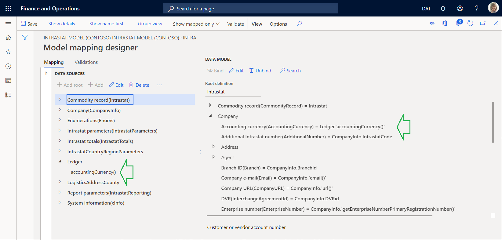
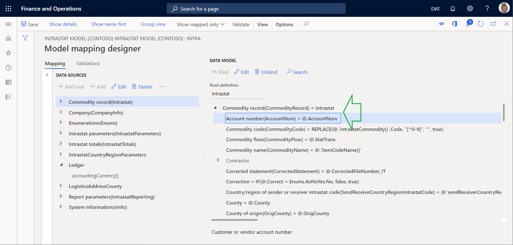
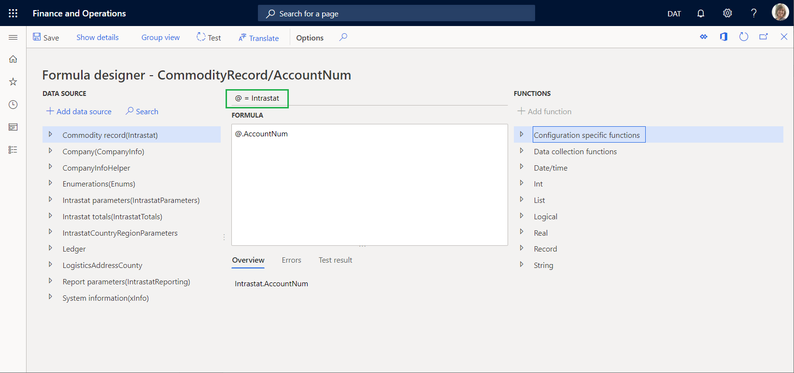

# Electronic reporting formula language

[!include [banner](../includes/banner.md)]

Electronic reporting (ER) provides a powerful data transformation experience. The language that is used to express the required data manipulations in the [ER formula designer](general-electronic-reporting-formula-designer.md) resembles the formula language in Microsoft Excel.

## Basic syntax

ER expressions can contain any or all of the following elements:

- [Constants](#Constants)
- [Operators](#Operators)
- [References](#References)
- [Paths](#Paths)
- [Functions](#Functions)

## <a name="Constants"></a>Constants

When you design expressions, you can use text and numeric constants (that is, values that aren't calculated). For example, the expression `VALUE ("100") + 20` uses the numeric constant **20** and the string constant **"100"**, and it returns the numeric value **120**.

The ER formula designer supports escape sequences. Therefore, you can specify an expression string that should be handled differently. For example, the expression `"Leo Tolstoy ""War and Peace"" Volume 1"` returns the text string **Leo Tolstoy "War and Peace" Volume 1**.

## <a name="Operators"></a>Operators

The following table shows the arithmetic operators that you can use to do basic mathematical operations, such as addition, subtraction, multiplication, and division.

| Operator | Meaning               | Example     |
|----------|-----------------------|-------------|
| +        | Addition              | `1+2`       |
| -        | Subtraction, negation | `5-2`, `-1` |
| \*       | Multiplication        | `7\*8`      |
| /        | Division              | `9/3`       |

The following table shows the comparison operators that are supported. You can use these operators to compare two values.

| Operator | Meaning                  | Example      |
|----------|--------------------------|--------------|
| =        | Equal                    | `X=Y`        |
| &gt;     | Greater than             | `X>Y`        |
| &lt;     | Less than                | `X<Y`        |
| &gt;=    | Greater than or equal to | `X>=Y`       |
| &lt;=    | Less than or equal to    | `X<=Y`       |
| &lt;&gt; | Not equal to             | `X<>Y`       |

Additionally, you can use an ampersand (&) as a text concatenation operator. In this way, you can join, or concatenate, one or more text strings into a single piece of text.

| Operator | Meaning     | Example                                               |
|----------|-------------|-------------------------------------------------------|
| &        | Concatenate | `"Nothing to print:" & " " & "no records found"`      |

### Operator precedence

The order in which the parts of a compound expression are evaluated is important. For example, the result of the expression `1 + 4 / 2` varies, depending on whether the addition or division operation is done first. You can use parentheses to explicitly define how an expression is evaluated. For example, to indicate that the addition operation should be done first, you can change the preceding expression to `(1 + 4) / 2`. If you don't explicitly indicate the order of operations in an expression, the order is based on the default precedence that is assigned to the supported operators. The following table shows the precedence that is assigned to each operator. Operators that have a higher precedence (for example, 7) are evaluated before operators that have a lower precedence (for example, 1).

| Precedence | Operators      | Syntax                                                                  |
|------------|----------------|-------------------------------------------------------------------------|
| 7          | Grouping       | ( … )                                                                   |
| 6          | Member access  | … . …                                                                   |
| 5          | Function call  | … ( … )                                                                 |
| 4          | Multiplicative | … \* …<br>… / …                                                         |
| 3          | Additive       | … + …<br>… - …                                                          |
| 2          | Comparison     | … &lt; …<br>… &lt;= …<br>… =&gt; …<br>… &gt; …<br>… = …<br>… &lt;&gt; … |
| 1          | Separation     | … , …                                                                   |

If an expression includes multiple consecutive operators that have the same precedence, those operations are evaluated from left to right. For example, the expression `1 + 6 / 2 \* 3 > 5` returns **true**. We recommend that you use parentheses to explicitly indicate the desired order of operations in expressions, so that the expressions are easier to read and maintain.

## <a name="References"></a>References

All data sources of the current ER component that are available during the design of an expression can be used as named references. The current ER component can be either a model mapping or a format. For example, the current ER model mapping contains the **ReportingDate** data source, which returns a value of the [*DateTime*](er-formula-supported-data-types-primitive.md#datetime) data type. To correctly format that value in the generating document, you can reference the data source in the expression as `DATETIMEFORMAT (ReportingDate, "dd-MM-yyyy")`.

All characters in the name of a referencing data source that don't represent a letter of the alphabet must be preceded by a single quotation mark ('). If the name of a referencing data source contains at least one symbol that doesn't represent a letter of the alphabet, the name must be enclosed in single quotation marks. For example, these non-alphabetic symbols can be punctuation marks or other written symbols. Here are some examples:

- The **Today's date & time** data source must be referred to in an ER expression as `'Today''s date & time'`.
- The **name()** method of the **Customers** data source must be referred to in an ER expression as `Customers.'name()'`.

If the methods of application data sources have parameters, the following syntax is used to call those methods:

- If the **isLanguageRTL** method of the **System** data source has an **EN-US** parameter of the [*String*](er-formula-supported-data-types-primitive.md#string) data type, this method must be referred to in an ER expression as `System.isLanguageRTL("EN-US")`.
- Quotation marks aren't required when a method name contains only alphanumeric symbols. However, they are required for a method of a table if the name includes brackets.

When the **System** data source is added to an ER mapping that refers to the **Global** application class, the expression `System.isLanguageRTL("EN-US ")` returns the *Boolean* value **FALSE**. The modified expression `System.isLanguageRTL("AR")` returns the *Boolean* value **TRUE**.

You can limit the way that values are passed to the parameters of this type of method:

- Only constants can be passed to methods of this type. The values of the constants are defined at design time.
- Only [primitive](er-formula-supported-data-types-primitive.md) (basic) data types are supported for parameters of this type. The primitive data types include *Integer*, *Real*, *Boolean*, and *String*.

## <a name="Paths"></a>Paths

When an expression references a structured data source, you can use the path definition to select a specific primitive element of that data source. A dot character (.) is used to separate individual elements of a structured data source. For example, the current ER model mapping contains the **InvoiceTransactions** data source, and this data source returns a list of records. The **InvoiceTransactions** record structure contains the **AmountDebit** and **AmountCredit** fields, and both these fields return numeric values. Therefore, you can design the following expression to calculate the invoiced amount: `InvoiceTransactions.AmountDebit - InvoiceTransactions.AmountCredit`. The `InvoiceTransactions.AmountDebit` construction in this expression is the path that is used to access the **AmountDebit** field of the **InvoiceTransactions** data source of the *Record list* type.

### Relative path

If the path of a structured data source starts with an "at" sign (@), it's a relative path. The "at" sign is shown instead of the remaining part of the absolute path of the hierarchical tree structure that is used. The following illustration shows an example. Here, the absolute path `Ledger.'accountingCurrency()'` indicates that the accounting currency value from the **Ledger** data source is entered in the **AccountingCurrency** field of the data model.



The example in the following illustration shows how a relative path is used. The relative path `@.AccountNum` indicates that the **AccountNum** field of the **Intrastat** data source (which appears one level above the **AccountNum** field in the data model's hierarchical tree) is used to enter the customer or vendor account number in the data model's **AccountNum** field.



The remaining part of the absolute path is also shown in the [ER formula editor](general-electronic-reporting-formula-designer.md).



For more information, see [Use a relative path in data bindings of ER models and formats](relative-path-data-bindings-er-models-format.md).

## <a name="Functions"></a>Functions

ER built-in functions can be used in ER expressions. All data sources of the expression context (that is, the current ER model mapping or ER format) can be used as parameters of calling functions, in accordance with the list of arguments for calling functions. Constants can also be used as parameters of calling functions. For example, the current ER model mapping contains the **InvoiceTransactions** data source, and this data source returns a list of records. The **InvoiceTransactions** record structure contains the **AmountDebit** and **AmountCredit** fields, and both these fields return numeric values. Therefore, to calculate the invoiced amount, you can design the following expression that uses the built-in ER rounding function: `ROUND (InvoiceTransactions.AmountDebit - InvoiceTransactions.AmountCredit, 2)`.

When you design ER model mappings and ER reports, you can use ER functions from the following categories:

- [Date and time functions](er-functions-category-datetime.md)
- [List functions](er-functions-category-list.md)
- [Logical functions](er-functions-category-logical.md)
- [Mathematical functions](er-functions-category-mathematical.md)
- [Record functions](er-functions-category-record.md)
- [Text functions](er-functions-category-text.md)
- [Data collection functions](er-functions-category-data-collection.md)
- [Other (business domain–specific) functions](er-functions-category-other.md)
- [Type conversion functions](er-functions-category-type-conversion.md)

## Functions list extension

ER lets you extend the list of functions that are used in ER expressions. Some engineering effort is required. For detailed information, see [Extend the list of Electronic reporting (ER) functions](general-electronic-reporting-formulas-list-extension.md).

## Compound expressions

You can create compound expressions that use functions from different categories, provided that the data types match. When you use functions together, match the data type of the output from one function to the input data type that is required by another function. For example, to avoid a possible "list-is-empty" error in a binding of a field to an ER format element, combine functions from the [List](er-functions-category-list.md) category with a function from the [Logical](er-functions-category-logical.md) category, as the following example shows. Here, the formula uses the [IF](er-functions-logical-if.md) function to test whether the **IntrastatTotals** list is empty before it returns the value of the required aggregation from that list. If the **IntrastatTotals** list is empty, the formula returns **0** (zero).

```vb
IF(ISEMPTY(IntrastatTotals), 0.0, IntrastatTotals.aggregated.'$AmountMSTRounded') 
```

## Multiple solutions

Often, you can get the same data transformation result in multiple ways, by using functions from different categories or different functions from the same category. For example, the previous expression can also be configured by using the [COUNT](er-functions-list-count.md) function from the [List](er-functions-category-list.md) category.

```vb
IF(COUNT (IntrastatTotals)=0, 0.0, IntrastatTotals.aggregated.'$AmountMSTRounded') 
```

## Additional resources

[Electronic Reporting overview](general-electronic-reporting.md)

[Formula designer in Electronic reporting](general-electronic-reporting-formula-designer.md)

[Extend the list of Electronic reporting functions](general-electronic-reporting-formulas-list-extension.md)

[Supported primitive data types](er-formula-supported-data-types-primitive.md)

[Supported composite data types](er-formula-supported-data-types-composite.md)

[!INCLUDE[footer-include](../../../includes/footer-banner.md)]
