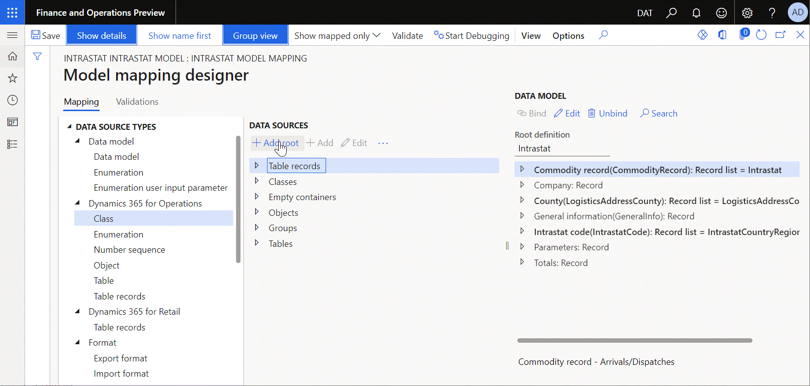
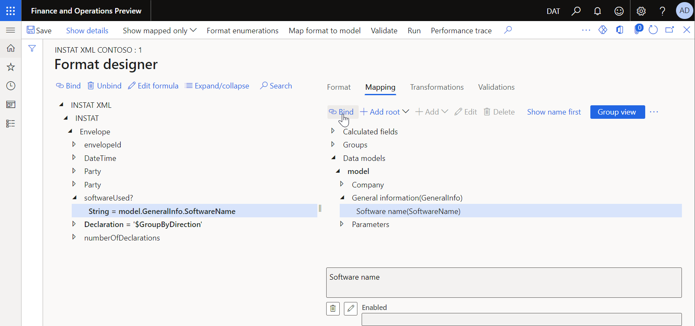
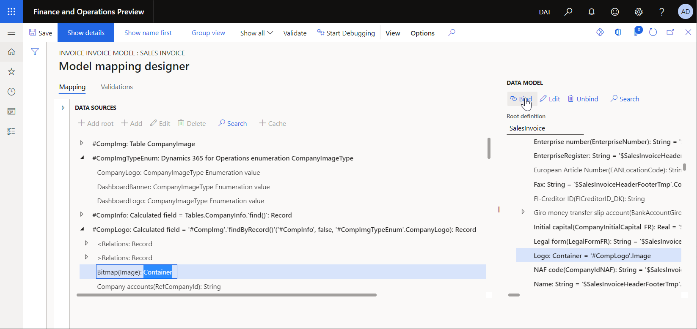
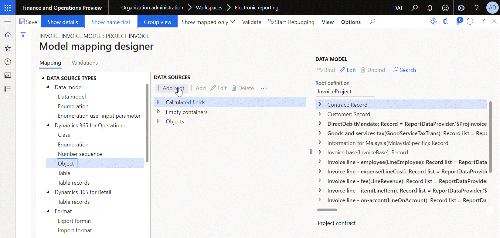

# Supported composite data types for Electronic reporting formulas

[!include [banner](../includes/banner.md)]

This article provides information about the composite data types that are supported in [Electronic reporting (ER)](general-electronic-reporting.md) expressions. The composite data types are [class](#class), [container](#container), [record](#record), [record list](#record-list), and [object](#object).

## Class

The *class* data type refers to a public application class. In ER, it's represented as a [*record*](#record) that contains a separate field for every public method of the referenced class. When the call of the method is parameterized, you must also specify the required arguments of the appropriate types in an ER expression that is configured to call the method.

In ER mapping and format components, you can add the **Class** data source that is presented as a data source and that returns a value of the *class* type. This data source exposes public methods of the class that can be called at runtime.

> [!NOTE]
> Only methods that return a value can be called from ER expressions.
>
> Only methods that have a range of zero to eight arguments can be called from ER expressions.

The default value of a *class* is **null**.

The following illustration shows how the **System information(xInfo)** data source of the **Class** type is added to make the instance of the **xInfo** application class and call its **productName()** method to receive the name of the current application. The name of the current application is fetched at runtime by execution of the `xInfo.productName` binding that was configured for the **Software name(SoftwareName)** field of the ER data model. This binding calls the `productName()` method of the **xInfo** application class that is represented in the current model mapping as the **System information(xInfo)** data source.

The following illustration shows how the ER format is configured to put the provided application name in generated documents. The **Software name(SoftwareName)** field of the used data model was bound to the **String** component that is nested under the **softwareUsed** XML element of the ER format. So, the name of the current application is placed at runtime to the **softwareUsed** XML element of a generated document in XML format.

## Container

The *container* data type holds binary content. A *container* value can be used to pass specific information from storage to a generated document. In the ER framework, this data type is frequently used to put media content such as a company logo in generated documents.

> [!NOTE]
> Although every media item can be represented as a *container* value, not every *container* value represents a media item. Therefore, if you configure an ER format so that it uses a *container* to put an image in generated documents, but the referenced *container* doesn't return media content, an exception that resembles the following example might be thrown: "Error executing code: Binary (object), method constructFromContainer called with invalid parameters."

The default value of a *container* is **null**.

The following illustration shows how the **Bitmap(Image)** field of the *Container* type is bound to the data model **Logo** field of the **Container** type in the **Sales invoice** model mapping. This binding makes the company logo available to any ER format that is designed for the **SalesInvoice** root definition and that uses this model mapping at runtime.

## Record

A *record* is a collection of named fields, each of which is associated with a value of either a [primitive](er-formula-supported-data-types-primitive.md) data type or a composite data type. Usually, a *record* is used to represent a single record of a record list. In this case, every item represents individual fields, methods, and relations.

The default value of a *record* is **empty**.

> [!NOTE]
> When you get the value of a field of an empty *record*, the default value of the appropriate data type is returned.

A *record* can be obtained by using the following functions:

- [FIRST](er-functions-list-first.md)
- [FIRSTORNULL](er-functions-list-firstornull.md)
- [EMPTYRECORD](er-functions-record-emptyrecord.md)
- [NULLCONTAINER](er-functions-record-nullcontainer.md)

For more information about the transformation of *record* values, see [List of ER functions in the list category](er-functions-category-list.md).

## Record list

A *record list* is a list of items of the *record* type. Usually, a *record list* is used to represent the list of records that has been fetched from a database table.

By default, records of a *record list* are accessed sequentially. To access a specific record, you can use the [INDEX](er-functions-list-index.md) function and specify the *integer* index.

The default value of a *record list* is **empty**. You can use the [ISEMPTY](er-functions-list-isempty.md) function to evaluate whether a *record list* is empty.

> [!NOTE]
> If a *record list* is empty, any attempt to get a field value for a *record* in it causes an exception to be thrown at runtime. To learn how you can help prevent runtime exceptions of this type, see [Consideration of empty list cases](er-components-inspections.md#i9).

A *record list* can be initiated by using the following functions:

- [ALLITEMS](er-functions-list-allitems.md)
- [ALLITEMSQUERY](er-functions-list-allitemsquery.md)
- [EMPTYLIST](er-functions-list-emptylist.md)
- [LIST](er-functions-list-list.md)
- [LISTDISTINCT](er-functions-list-listdistinct.md)

For more information about the transformation of *record list* values, see [List of ER functions in the list category](er-functions-category-list.md). To learn how to introduce *record list* items, fill them with application data, and then use the data to generate business documents, see [Design a new ER solution to print a custom report](er-quick-start1-new-solution.md).

## Object

An *object* refers to a stateful instance of a *class*. Usually, an *object* is initiated in source code. It's then passed to an ER model mapping and provides details of the execution context.

The default value of an *object* is **null**.

The following illustration shows how the **ReportDataContract** data source of the *Object* type is added to pass information about a generated invoice from source code to the **Project invoice** model mapping. For example, the invoice instance text is passed as part of the execution context. This text is taken from source code at runtime by execution of the `ReportDataContract.parmInvoiceInstanceText` binding that was configured for the **Note** field of the ER data model. This binding calls the `parmInvoiceInstanceText()` method of the **PSAProjInvoiceContract** application class that is represented in the current model mapping as the **ReportDataContract** data source.

To learn how to pass details of the execution context from source code to the running ER solution, see [Develop application artefacts to call the designed report](er-quick-start1-new-solution.md#DevelopCustomCode).

## Additional resources

- [Electronic Reporting overview](general-electronic-reporting.md)
- [Electronic reporting formula language](er-formula-language.md)
- [Supported primitive data types](er-formula-supported-data-types-primitive.md)
