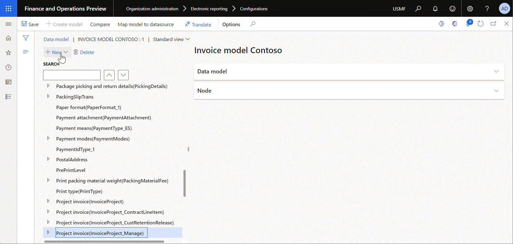
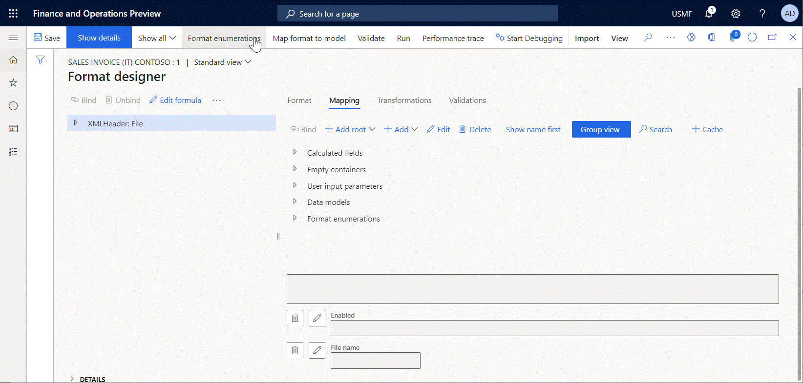
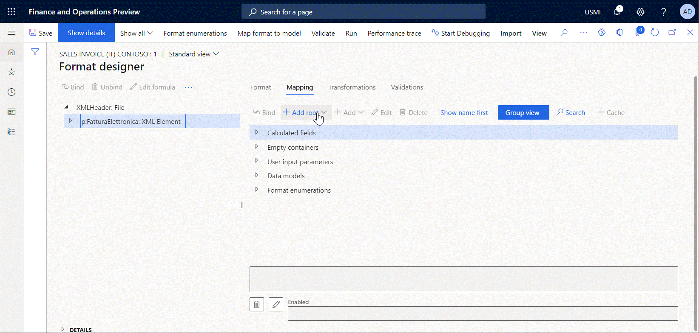
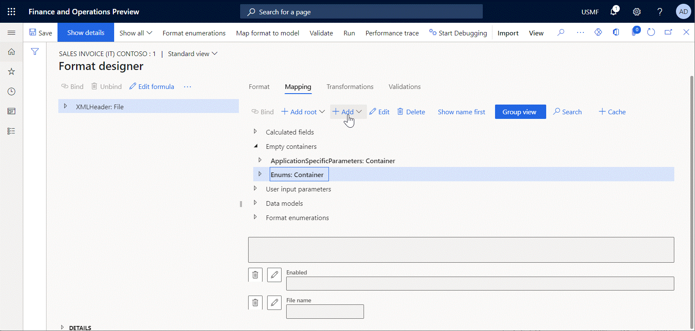
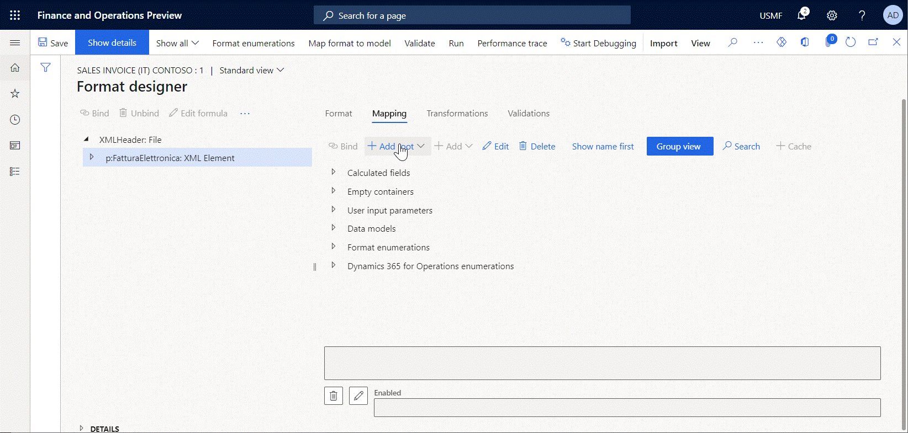

# Supported primitive data types for Electronic reporting formulas

[!include [banner](../includes/banner.md)]

This topic provides information about the primitive data types that are supported in [Electronic reporting (ER)](general-electronic-reporting.md) expressions. Here is a list of the primitive data types:

- [boolean](#boolean)
- [date](#date)
- [datetime](#datetime)
- [enumeration](#enumeration)
- [guid](#guid)
- [integer](#integer)
- [int64](#int64)
- [real](#real)
- [string](#string)

## Boolean

The *boolean* primitive data type contains a value that is evaluated as either *true* or *false*. You can use the reserved literal keywords **True** and **False** wherever a *boolean* expression is expected. The default value is *false*.

The internal representation of a *boolean* is an *integer*. The *integer* value 0 (zero) is evaluated as *false*, and all other *integer* values are evaluated as *true*. When you [validate](general-electronic-reporting-formula-designer.md#TestFormula) a configured expression that returns a *boolean* in the [ER formula designer](er-advanced-formula-editor.md), the test result pane presents *0* (zero) when an expression returns *false*. Otherwise, the test result pane presents *1*.

A *boolean* has no implicit conversions. However, you can use the [TEXT](er-functions-text-text.md) function to explicitly converts a *boolean* to a *string*:

- The *false* value is converted to the text string **False**.
- The *true* value is converted to the text string **True**.

> [!NOTE]
> This conversion doesn't depend on the provided language and culture [context](er-design-multilingual-reports.md).

Comparison [operators](er-formula-language.md#Operators) are the only type of operator that can be used with the *boolean* data type. The following operators can be used to compare two *boolean* values: \<\> and =.

## Date

The *date* primitive data type contains the day, month, and year. Dates can be initiated by using the following functions:

- [DATEVALUE](er-functions-datetime-datevalue.md)
- [NULLDATE](er-functions-datetime-nulldate.md)
- [SESSIONTODAY](er-functions-datetime-sessiontoday.md)
- [TODAY](er-functions-datetime-today.md)

The *date* data type can hold dates between January 1, 1900, and December 31, 2154. The default value is **null**, and the internal representation is the date January 1, 1900.

A *date* has no implicit conversions. However, you can use the following explicit conversion functions:

- [DATEFORMAT](er-functions-datetime-dateformat.md)
- [DATETODATETIME](er-functions-datetime-datetodatetime.md)
- [TEXT](er-functions-text-text.md)

The [ADDDAYS](er-functions-datetime-adddays.md) function lets you add and subtract days from dates. In this way, you can move the date a specific number of days into the future and the past. The [DAYS](er-functions-datetime-days.md) function lets you subtract dates from each other and calculate the difference in days. For more information about the transformation of *date* values, see [List of ER functions in the Date and time category](er-functions-category-datetime.md).

Comparison [operators](er-formula-language.md#Operators) are the only type of operator that can be used with the *date* data type. The following operators can be used to compare two *date* values: \<\>, \<, \<=, =, \>, and \>=.

## Datetime

The *datetime* primitive data type combines the *date* type and a value that represents the time that has passed since midnight. The time is expressed in hours, minutes, seconds, and fractions of a second. A *datetime* value also holds information about the time zone.

The *datetime* data type can hold dates between January 1, 1900 (1900-01-01T00:00:00.0000000+00:00 in the round-trip [format](/dotnet/standard/base-types/standard-date-and-time-format-strings)) and December 31, 2154 (2154/12/31T11:59:59.9999999+00:00 in the round-trip format). The smallest unit of time in a *datetime* is one ten millionth of a second.

> [!NOTE]
> When the **hh** [specifier](/dotnet/standard/base-types/standard-date-and-time-format-strings) is used for hours, time values above 12:59:59:9999999 can't be interpreted as valid times.
>
> When the **HH** specifier is used for hours, time values above 23:59:59:9999999 can't be interpreted as valid times.

The default value is **null**, and the internal representation is the date January 1, 1900 (1900-01-01T00:00:00.0000000+00:00 in the round-trip format).

Datetimes can be initiated by using the following functions:

- [DATETIMEVALUE](er-functions-datetime-datetimevalue.md)
- [NULNULLDATETIMELDATE](er-functions-datetime-nulldatetime.md)
- [SESSIONNOW](er-functions-datetime-sessionnow.md)
- [NOW](er-functions-datetime-now.md)

A *datetime* has no implicit conversions. However, you can use the following explicit conversion functions:

- [DATETIMEFORMAT](er-functions-datetime-datetimeformat.md)
- [TEXT](er-functions-text-text.md)

For more information about the transformation of *datetime* values, see [List of ER functions in the Date and time category](er-functions-category-datetime.md).

Comparison [operators](er-formula-language.md#Operators) are the only type of operator that can be used with the *datetime* data type. The following operators can be used to compare two *datetime* values: \<\>, \<, \<=, =, \>, and \>=.

## Enumeration

The *enumeration* primitive data type is a list of literals. You can use enumerations that are defined in the application [source code](../dev-ref/xpp-data-primitive.md#enum). You can also introduce your own enumerations in the ER data model and ER format components.

An application *enumeration* can be used in expressions of any ER model mapping and ER format.

The following illustration shows how you can add the **CustVendCorrectiveReasonCode** model enumeration to the editable ER data model.

A model *enumeration* can be used in expressions of any ER model mapping and ER format that were created under a data model where the *enumeration* was introduced.

The following illustration shows how you can add the **List of Natura reverse charge subcategories** format enumeration to the editable ER format.

A format *enumeration* can be used only in expressions of the ER format where the *enumeration* was introduced.

You must use the appropriate type of ER data sources to bring a specific enumeration to a configured ER component as a constant or as a value that the user who is running an ER solution defined in the dialog box at runtime.

- Application enumerations can be accessed by using the **Dynamics 365 for Operations \ Enumeration** and **General \ User input parameters** data sources. The following illustration shows how you can add to the editable ER format the **appenumNoYes** and **uipNoYes** data sources that refer to the **NoYes** application enumeration.

    

- Data model enumerations can be accessed by using the **Data model \ Enumeration** and **Data model \ Enumeration user input parameters** data sources. The following illustration shows how you can add to the editable ER format the **CustVendCorrectiveReasonCode** data source that refers to the **CustVendCorrectiveReasonCode** data model enumeration.

    

- Format enumerations can be accessed by using the **Format \ Enumeration** and **Format \ Enumeration user input parameters** data sources. The following illustration shows how you can add to the editable ER format the **NaturaReverseCharge** data source that refers to the **Natura reverse charge subcategories** format enumeration.

    

An *enumeration* has no implicit conversions. However, you can use the [TEXT](er-functions-text-text.md) conversion function to convert an *enumeration* to a text string. This conversion isn't language dependent. To learn how you can associate an *enumeration* value with the appropriate language-specific labels, see the usage examples for the [LISTOFFIELDS](er-functions-list-listoffields.md) and [GETENUMVALUEBYNAME](er-functions-text-getenumvaluebyname.md) functions.

Comparison [operators](er-formula-language.md#Operators) are the only type of operator that can be used with the *enumeration* data type. The following operators can be used to compare two *enumeration* values: \<\> and =.

## Guid

The *guid* primitive data type holds a globally unique identifier (GUID) value. A GUID is a value that can be used across all computers and networks, wherever a unique identifier is required. It's unlikely that the number will be duplicated. A valid GUID meets all the following specifications:

- There must be 32 hexadecimal digits.
- In addition, there must be four dash characters that are embedded at the following locations: 8-4-4-4-12.
- In addition, optional braces \{\} can be added at the beginning and end of the string. For example, both **\{2CDB0FE7-D7B3-4938-A0F0-FE28FB8FE212\}** and **2CDB0FE7-D7B3-4938-A0F0-FE28FB8FE212** are valid GUID strings.
- Therefore, there must be a total of 36 or 38 characters, depending on whether braces are added.
- The letters that are used as hexadecimal digits can be uppercase (A–F), lowercase (a–f), or mixed.

The following explicit conversion functions can be used:

- [GUIDVALUE](er-functions-text-guidvalue.md)
- [TEXT](er-functions-text-text.md)

Comparison [operators](er-formula-language.md#Operators) are the only type of operator that can be used with the *guid* data type. The following operators can be used to compare two *guid* values: \<\> and =.

## Integer

The *integer* primitive data type represents a number that has no decimal places. Integers are used as control variables in repetitive statements or as indexes in record lists.

An *integer* literal is the integer as it's entered directly in an ER [expression](general-electronic-reporting-formula-designer.md#formula-designer-overview) (formula), such as **12345**. An *integer* is 32-bits wide. The default value is **0**, and the internal representation is a long number. An *integer* is automatically converted to a *real*.

Additionally, the following explicit conversion functions can be used:

- [INTVALUE](er-functions-conversion-intvalue.md)
- [NUMBERFORMAT](er-functions-text-numberformat.md)
- [TEXT](er-functions-text-text.md)

The range of an *integer* is \[-2,147,483,647 : 2,147,483,647\]. All integers of this range can be used as literals.

All comparison and mathematical [operators](er-formula-language.md#Operators) can be used with the *integer* data type.

## Int64

The *int64* primitive data type represents a number that has no decimal places. *Int64* values are used as control variables in repetitive statements or as record identifiers.

An *int64* is 64-bits wide. The default value is **0**, and the internal representation is a long number. An *int64* is automatically converted to a *real*.

Additionally, the following explicit conversion functions can be used:

- [INT64VALUE](er-functions-conversion-int64value.md)
- [NUMBERFORMAT](er-functions-text-numberformat.md)
- [TEXT](er-functions-text-text.md)

The range of an *int64* is \[-9,223,372,036,854,775,807 : 9,223,372,036,854,775,807\].

All comparison and mathematical [operators](er-formula-language.md#Operators) can be used with the *int64* data type.

## Real

The *real* primitive data type can hold decimal values in addition to integers. You can use decimal literals anywhere that a *real* is expected. A decimal literal is the decimal as it's entered directly in code, such as **2.19**.

> [!NOTE]
> In ER expressions, a period (.) is always used as the decimal separator.

Reals can be used in all expressions, and they can be used with both comparison and arithmetic operators. A *real* has a precision of 16 significant digits. The default value for a *real* is **0.0**, and the internal representation is a binary-coded digital (BCD) number. The BCD encoding enables exact representations of values that are multiples of 0.1. The range of a *real* variable is -(10)127 through (10)127. All reals in this range can be used as literals in ER expressions.

A *real* has no implicit conversions. However, you can use the following functions to explicitly convert a *real* to other data types and other data types to a *real*:

- [INTVALUE](er-functions-conversion-intvalue.md)
- [INT64VALUE](er-functions-conversion-int64value.md)
- [NUMBERFORMAT](er-functions-text-numberformat.md)
- [TEXT](er-functions-text-text.md)
- [VALUE](er-functions-conversion-value.md)

All comparison and mathematical [operators](er-formula-language.md#Operators) can be used with the *real* data type.

## String

The *string* primitive data type represents a sequence of characters that are used as texts, account numbers, addresses, and telephone numbers.

*String* literals are characters that are enclosed in quotation marks (""). *String* literals can be used wherever *string* values are expected in ER expressions. You can use strings in logical expressions, such as comparisons. You can also concatenate *string* values by using the **\&** operator or the [CONCATENATE](er-functions-text-concatenate.md) function.

> [!NOTE]
> If you concatenate two *string* values, and you want the resulting *string* to span more than one line, use the line break separator between the values. For the TEXT output, this separator can be a character that is generated by using the [CHAR](er-functions-text-char.md)(10) or CHAR(13) expression. For HTML, it can be the **\<br\>** tag.

The default value for a *string* is a blank text string that has no characters, and the internal representation is a list of characters.

There are no automatic conversions for strings. However, the following explicit conversion functions can be used:

- [CHAR](er-functions-text-char.md)
- [FORMAT](er-functions-text-format.md)
- [LEFT](er-functions-text-left.md)
- [LEN](er-functions-text-len.md)
- [MID](er-functions-text-mid.md)
- [PADLEFT](er-functions-text-padleft.md)
- [REPLACE](er-functions-text-replace.md)
- [RIGHT](er-functions-text-right.md)
- [TEXT](er-functions-text-text.md)
- [TRANSLATE](er-functions-text-translate.md)
- [TRIM](er-functions-text-trim.md)
- [UPPER](er-functions-text-upper.md)

For more about the transformation of *string* values, see [List of ER functions of the text category](er-functions-category-text.md).

A *string* can hold an indefinite number of characters.

All comparison [operators](er-formula-language.md#Operators) can be used with the *string* data type.

## Additional resources

- [Electronic Reporting overview](general-electronic-reporting.md)
- [Electronic reporting formula language](er-formula-language.md)
- [Supported composite data types](er-formula-supported-data-types-composite.md)
