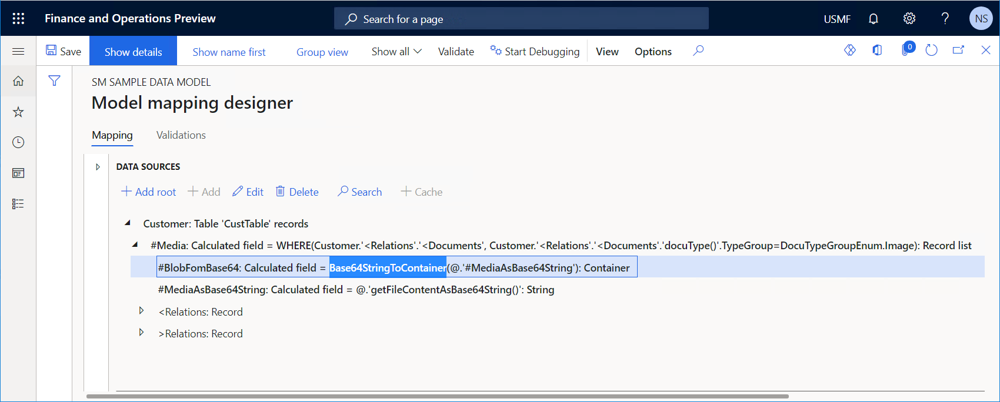

# Base64StringToContainer ER function

[!include [banner](../includes/banner.md)]

The `BASE64STRINGTOCONTAINER` [function](er-formula-language.md#Functions) converts the specified input of the *String* type to a data item of the *[Container](er-functions-category-container.md)* type.

## Syntax

```vb
BASE64STRINGTOCONTAINER (input)
```

## Arguments

`input`: *String*

The valid path of a data source of the *String* type.

## Return values

*Container*

The resulting binary value in binary large object (BLOB) format.

## Usage notes

The "Parameter is not valid" exception is thrown if the input string doesn't provide a correct Base64 group of binary-to-text encoding schemes.

## Example

You define the following data sources in your model mapping:

- The root **DocuTypeGroupEnum** data source of the *Dynamics 365 for Operations / Enumeration* type that refers to the **DocuTypeGroup** application enumeration
- The root **Customer** data source of the *Dynamics 365 for Operations / Table records* type that refers to the **CustTable** application table
- The **\#Media** data source of the *Calculated field* type that is configured in the following way:

    - It's added as a child data source of the **Customer** data source.
    - It contains the expression `WHERE(@.'<Relations'.'<Documents', @.'<Relations'.'<Documents'.'docuType()'.TypeGroup = DocuTypeGroupEnum.Image)`.

- The **\#MediaAsBase64String** data source of the *Calculated field* type that is configured in the following way:

    - It's added as a child data source of the **Customer.'\#Media'** data source.
    - It contains the expression `Customer.'#Media'.'getFileContentAsBase64String()'`.

- The **\#BlobFomBase64** data source of the *Calculated field* type that is configured in the following way:

    - It's added as a child data source of the **Customer.'\#Media'** data source.
    - It contains the expression `Base64StringToContainer(Customer.'#Media'.'#MediaAsBase64String')'`.

In this example, the **\#MediaAsBase64String** data source encodes the binary content of the current media attachment as text that represents a Base64 group of binary-to-text encoding schemes. The **\#BlobFomBase64** data source decodes the Base64 string and returns a binary value in BLOB format.



## Additional resources

[Container functions](er-functions-category-container.md)


[!INCLUDE[footer-include](../../../includes/footer-banner.md)]
