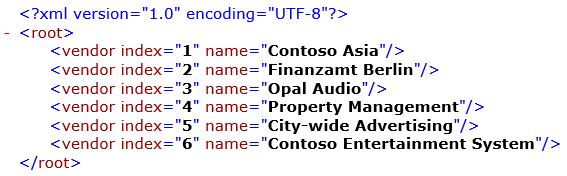

---
# required metadata

title: ENUMERATE ER function
description: This topic provides information about how the ENUMERATE Electronic reporting (ER) function is used.
author: NickSelin
ms.date: 12/12/2019
ms.prod: 
ms.technology: 

# optional metadata

ms.search.form: ERDataModelDesigner, ERExpressionDesignerFormula, ERMappedFormatDesigner, ERModelMappingDesigner
# ROBOTS: 
audience: Application User, IT Pro
# ms.devlang: 
ms.reviewer: kfend
# ms.tgt_pltfrm: 
ms.custom: 58771
ms.assetid: 24223e13-727a-4be6-a22d-4d427f504ac9
ms.search.region: Global
# ms.search.industry: 
ms.author: nselin
ms.search.validFrom: 2016-02-28
ms.dyn365.ops.version: AX 7.0.0

---

# ENUMERATE ER function

[!include [banner](../includes/banner.md)]

The `ENUMERATE` function returns a new *Record list* value that consists of enumerated records of the specified list.

## Syntax

```vb
ENUMERATE (list)
```

## Arguments

`list`: *Record list*

The valid path of a data source of the *Record list* data type.

## Return values

*Record list*

The resulting list of records.

## Usage notes

The list of enumerated records that is returned exposes the following additional elements:

- The record of fields (**Value** component)
- The current record index (**Number** component)

## Example

In the following illustration, an **Enumerated** data source is created as an enumerated list of vendor records from the **Vendors** data source that refers to the VendTable table.

<a href="./media/picture-enumerate-datasource.jpg"></a>

The following illustration shows the Electronic reporting (ER) format. In this format, data bindings are created to generate output in XML format. This output presents individual vendors as enumerated nodes.

<a href="./media/picture-enumerate-format.jpg"></a>

The following illustration shows the result when the designed format is run.

<a href="./media/picture-enumerate-result.jpg"></a>

## Additional resources

[List functions](er-functions-category-list.md)


[!INCLUDE[footer-include](../../../includes/footer-banner.md)]