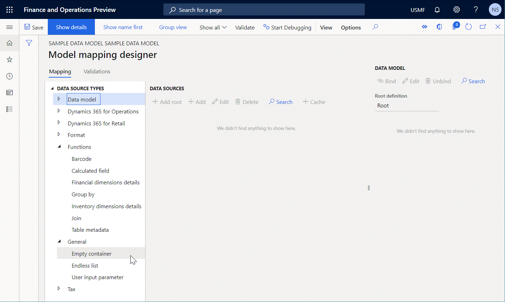
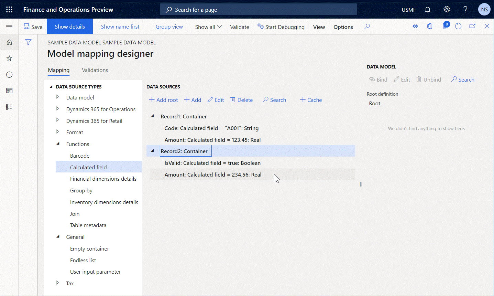
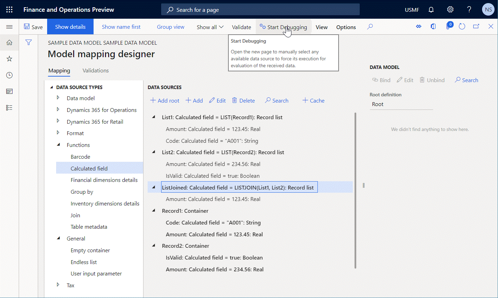

# LISTJOIN ER function

[!include [banner](../includes/banner.md)]

The `LISTJOIN` function returns a *Record list* value that represents a new joined list of records that is created from the specified arguments.

## Syntax

```vb
LISTJOIN (list 1 [, list 2, …, list N])
```

## Arguments

`list 1`: *Record list*

A reference to a data source of the *Record list* data type. This argument is mandatory.

`list N`: *Record list*

A reference to a data source of the *Record list* data type. These additional arguments are optional.

## Return values

*Record list*

The resulting list of records.

## Usage notes

The structure of the list that is created contains only the fields that are present in the structure of every record list that is referenced in the arguments.

## Example

You enter data source **Record 1** of the `Container` type. This data source contains the following nested fields of the `Calculated field` type:

- **Code**: This field contains an expression that returns a value of the `String` type.
- **Amount**: This field contains an expression that returns a value of the `Real` type.

You then enter data source **Record 2** of the `Container` type. This data source contains the following nested fields of the `Calculated field` type:

- **Amount**: This field contains an expression that returns a value of the `Real` type.
- **IsValid**: This field contains an expression that returns a value of the `Boolean` type.



In this case, the expression `LISTJOIN(LIST('Record 1'), LIST('Record 2'))` returns a new list that contains two records.



The structure of this list consists of a single **Amount** field of the `Real` type, because this field is the only field that is presented in every argument of the called function.



## Additional resources

[List functions](er-functions-category-list.md)

[Debug data sources of an executed ER format to analyze data flow and transformation](er-debug-data-sources.md)


[!INCLUDE[footer-include](../../../includes/footer-banner.md)]
