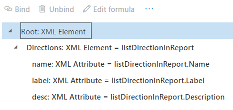

# LISTOFFIELDS ER function

[!include [banner](../includes/banner.md)]

The `LISTOFFIELDS` function returns a *Record list* value that is created based on the structure of the specified argument of the *Enumeration* or *Container (record)* type.

## Syntax 1

```vb
LISTOFFIELDS (path)
```

## Syntax 2

```vb
LISTOFFIELDS (path, language)
```

## Arguments

`path`: Data source reference

The valid reference path of a data source of one of the following data types:

- Model enumeration
- Format enumeration
- Application enumeration
- Container (record)

`language`: *String*

Text that represents a language code.

## Return values

*Record list*

The resulting list of records.

## Usage notes

The list that is created consists of records that have the following fields:

- **Name** (*String* data type)
- **Label** (*String* data type)
- **Description** (*String* data type)
- **IsTranslated** (*Boolean* data type)

If the `path` argument refers to a data source of the *Container (Record)* type, for every field of the referenced container record, a new record is added to the list that is created. For every record that is created, the **Name** field returns the name of the field of the referenced container record that the current record was created for.

If the `path` argument refers to a data source of one of the *Enumeration* types, for every enumeration value of the referenced enumeration, a new record is added to the list that is created. For every record that is created, the **Name** field returns the value of the referenced enumeration that the current record was created for, the **Description** field returns the description of that enumeration, and the **Label** field returns the label of that enumeration.

At runtime, when syntax 1 is used, the **Label** and **Description** fields must return values that are based on the language settings of the Electronic reporting (ER) format that is running:

- If the labels and descriptions for the requested language are available, the **Label** and **Description** fields return values that are based on that language, and the **IsTranslated** field returns **True**.
- If the labels and descriptions for the requested language aren't available, the **Label** and **Description** fields return values that are based on the default **EN-US** language, and the **IsTranslated** field returns **False**.

At runtime, when syntax 2 is used, the **Label** and **Description** fields must return values that are based on the language that is defined as the second argument of the called function:

- If the labels and descriptions for the requested language are available, the **Label** and **Description** fields return values that are based on that language, and the **IsTranslated** field returns **True**.
- If the labels and descriptions for the requested language aren't available, the **Label** and **Description** fields return values that are based on the **EN-US** language, and the **IsTranslated** field returns **False**.

## Example 1

In the following illustration, an enumeration is introduced in an ER data model.

<a href="./media/ger-listoffields-function-model-enumeration.png"></a>

The following illustration shows these details:

- The model enumeration is inserted into a report as a data source.
- An ER expression uses the model enumeration as a parameter of the `LISTOFFIELDS` function.
- A data source of the *Record list* type is inserted into a report by using the ER expression that is created.

<a href="./media/ger-listoffields-function-in-format-expression.png"></a>

The following example shows the ER format elements that are bound to the data source of the *Record list* type that was created by using the `LISTOFFIELDS` function.

<a href="./media/ger-listoffields-function-format-design.png"></a>

The following illustration shows the result when the designed format is run.

<a href="./media/ger-listoffields-function-format-output.png"></a>

> [!NOTE] 
> Based on the language settings of the parent **FILE** and **FOLDER** format elements, translated text for labels and descriptions is entered in the output of the ER format.

## Example 2

You use the *Calculated field* data source type to configure **enumType\_de** and **enumType\_deCH** data sources for the **enumType** data model enumeration:

- **enumType\_de** = `LISTOFFIELDS (enumType, "de")`
- **enumType\_deCH** = `LISTOFFIELDS (enumType, "de-CH")`

In this case, you can use the following expression to get the label of the enumeration value in Swiss German, if that translation is available. If the Swiss German translation isn't available, the label is in German.

```vb
IF (NOT (enumType_deCH.IsTranslated), enumType_de.Label, enumType_deCH.Label)
```

## Additional resources

[List functions](er-functions-category-list.md)


[!INCLUDE[footer-include](../../../includes/footer-banner.md)]
