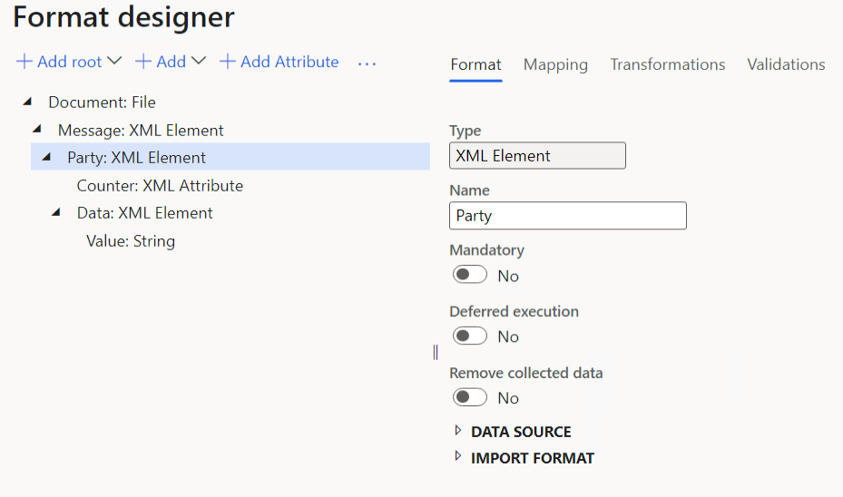
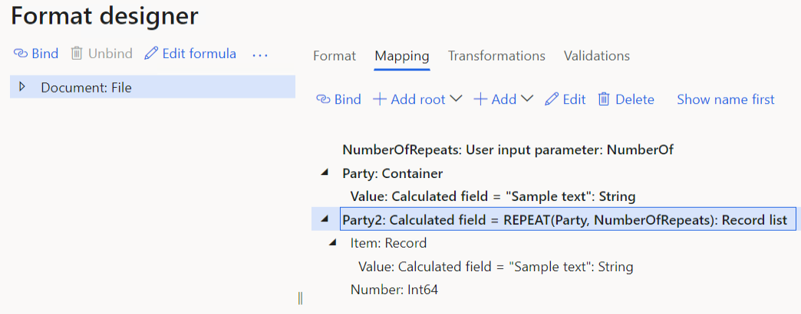
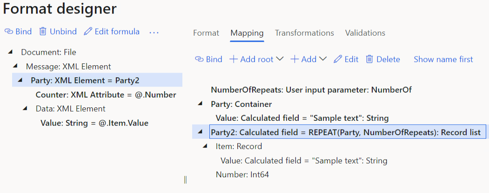
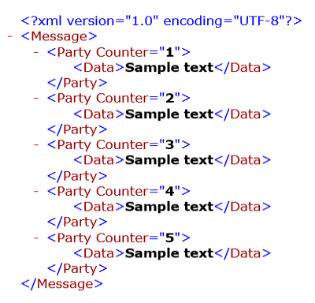

---
# required metadata

title: REPEAT ER function
description: This topic provides information about how the REPEAT Electronic reporting (ER) function is used.
author: NickSelin
ms.date: 06/01/2022
ms.prod: 
ms.technology: 

# optional metadata

ms.search.form: ERDataModelDesigner, ERExpressionDesignerFormula, ERMappedFormatDesigner, ERModelMappingDesigner
audience: Application User, IT Pro
ms.reviewer: kfend
ms.custom:
ms.assetid: 
ms.search.region: Global
ms.author: nselin
ms.search.validFrom: 2022-06-01
ms.dyn365.ops.version: AX 10.0.29

---

# REPEAT ER function

[!include [banner](../includes/banner.md)]

The `REPEAT` function builds a record containing the field the value of which matches the specified input and returns a new *Record list* of such record that is repeated the specified number of times.

## Syntax

```vb
REPEAT (item, number)
```

## Arguments

`item`: any supported [primitive](er-formula-supported-data-types-primitive.md) or [composite](er-formula-supported-data-types-composite.md) data type

The value to repeat.

`number`: *Integer*

The number of repeats.

## Return values

*Record list*

The resulting list of records.

## Usage notes

The list of repeated records that is returned exposes the following fields:

- The specified value (`Item` field)
- The current record index (`Number` field)

> [!NOTE]
> Because one-based numbering is used for this function, the `Number` field contains the value 1 for the first record of the resulting list.

You can use this function to multiply existing data for performance and volume testing of ER solutions by using the [RSAT](../perf-test/rsat/rsat-overview.md) tool.

## Example

Let's assume that you want to generate a document in XML format that must contain as many `Party` XML elements as you specified in a data entry field in the dialog box at runtime, before execution of an ER format begins.

The following illustration shows the [Electronic reporting](general-electronic-reporting.md) (ER) [format](er-overview-components.md#format-component). In this format, the single `Party` XML element is added to expose properties of a single party.

<a href="./media/er-repeat-function-1.png"></a>

The following illustration shows the following configured data sources:

- The `Party` data source that represents a single party. The `Party.Value` field is used to expose a single text value.
- The `NumberOfRepeats` [data source](er-user-input-parameter-data-sources.md) that is used to offer you a data entry field in the dialog box at runtime to let you specify the number of parties to be placed to a generated document.
- The `Party2` data source that repeats the `Party` record as many times as you specified in the `NumberOfRepeats` data source.

<a href="./media/er-repeat-function-2.png"></a>

The following illustration shows data bindings of the editable ER format that are created to generate output in XML format. This output presents individual parties as enumerated nodes.

<a href="./media/er-repeat-function-3.png"></a>

The following illustration shows the result when the designed format is run and the value of the `NumberOfRepeats` data source is specified as 5.

<a href="./media/er-repeat-function-4.png"></a>

## Additional resources

[List functions](er-functions-category-list.md)


[!INCLUDE[footer-include](../../../includes/footer-banner.md)]
