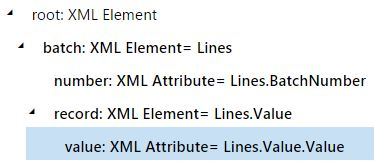

# SPLITLIST ER function

[!include [banner](../includes/banner.md)]

The `SPLITLIST` function splits the specified list into sublists (or batches), each of which contains the specified number of records. It then returns the result as a new *Record list* value that consists of the batches.

## Syntax 1

```vb
SPLITLIST (list, number)
```

## Syntax 2

```vb
SPLITLIST (list, number, on-demand reading flag)
```

## Arguments

`list`: *Record list*

The valid path of a data source of the *Record list* data type.

`number`: *Integer*

The maximum number of records per batch.

`on-demand reading flag`: *Boolean*

A *Boolean* value that specifies whether elements of sublists should be generated on demand.

## Return values

*Record list*

The resulting list of records.

## Usage notes

The list of batches that is returned contains the following elements:

 - **Value:** *List*

    The list of records that belong to the current batch.

- **BatchNumber:** *Integer*

    The number of the current batch in the returned list.

When the on-demand reading flag is set to **True**, sublists are generated upon request which allows for a reduction in memory consumption but may cause performance degradation if elements aren't used sequentially.

## Example

In the following illustration, a **Lines** data source is created as a record list that has three records. This list is divided into batches, each of which contains up to two records.

<a href="./media/picture-splitlist-datasource.jpg"></a>

The following illustration shows the designed format layout. In this format layout, bindings to the **Lines** data source are created to generate output in XML format. This output presents individual nodes for each batch and the records in it.

<a href="./media/picture-splitlist-format.jpg"></a>

The following illustration shows the result when the designed format is run.

<a href="./media/picture-splitlist-result.jpg"></a>

## Additional resources

[List functions](er-functions-category-list.md)


[!INCLUDE[footer-include](../../../includes/footer-banner.md)]
