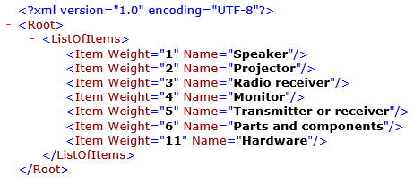

# SPLITLISTBYLIMIT ER function

[!include [banner](../includes/banner.md)]

The `SPLITLISTBYLIMIT` function splits the specified list into a new list of sublists (batches). The number of records in each batch is dynamically calculated. The function then returns the result as a new *Record list* value that consists of the batches.

## Syntax

```vb
SPLITLISTBYLIMIT (list, limit value, limit source)
```

## Arguments

`list`: *Record list*

The valid path of a data source of the *Record list* data type.

`limit value`: *Integer* or *Real*

The maximum value of the limit that is used to split the original list into batches.

`limit source`: *Field*

The valid path of a field of the *Integer* or *Real* type in the specified list. The value of this field defines the step that the total sum is increased on.

## Return values

*Record list*

The resulting list of records.

## Usage notes

The list of batches that is returned contains the following elements:

- **Value**: *List*

    The list of records that belong to the current batch.

- **BatchNumber**: *Integer*

    The number of the current batch in the returned list.

The limit isn't applied to a single item of the original list if the limit source exceeds the defined limit.

## Example

The following illustration shows an Electronic reporting (ER) format.

<a href="./media/ger-splitlistbylimit-format.png"></a>

The following illustration shows the data sources that are used for the format.

<a href="./media/ger-splitlistbylimit-datasources.png"></a>

The following illustration shows the result when the format is run. In this case, the output is a flat list of commodity items.

<a href="./media/ger-splitlistbylimit-output.png"></a>

In the following illustrations, the same format has been adjusted so that it presents the list of commodity items in batches if a single batch must include commodities and the total weight should not exceed a limit of 9.

<a href="./media/ger-splitlistbylimit-format-1.png"></a>

<a href="./media/ger-splitlistbylimit-datasources-1.png"></a>

The following illustration shows the result when the adjusted format is run.

<a href="./media/ger-splitlistbylimit-output-1.png"></a>

> [!NOTE] 
> The limit isn't applied to the last item of the original list, because the value (**11**) of the limit source (**weight**) exceeds the defined limit (**9**). To ignore sublists during report generation, use either the `WHERE` function or the **Enabled** expression of the corresponding format element, as you require.

## Additional resources

[List functions](er-functions-category-list.md)


[!INCLUDE[footer-include](../../../includes/footer-banner.md)]
