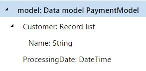

# FORMAT ER function

[!include [banner](../includes/banner.md)]

The `FORMAT` function returns the specified string as a *String* value after it has been formatted by substituting any occurrences of **%N** with the *N*th argument.

## Syntax

```vb
FORMAT (string, argument 1[, argument 2, …, argument N])
```

## Arguments

`string`: *String*

A reference to a data source of the *String* type that must be formatted. This argument is required.

`argument 1`: *String*

The first argument, which is used to replace occurrences of **%1**. This argument is required.

`argument N`: *String*

The *N*th argument, which is used to replace occurrences of **%2**, **%3**, and so on. These additional arguments are optional.

## Return values

*String*

The resulting text value.

## Usage notes

If an argument isn't provided for a parameter, the parameter is returned as **"%N"** in the string. For values of the *Real* type, the default string conversion is limited to two decimal places.

## Example

In the following illustration, the **PaymentModel** data source returns a list of customer records by using the **Customer** component. It returns the processing date value by using the **ProcessingDate** field.

<a href="./media/picture-format-datasource.jpg"></a>

In the Electronic reporting (ER) format that is designed to generate an electronic file for selected customers, **PaymentModel** is selected as a data source, and it controls the process flow. If a selected customer is stopped for the date when the report is processed, an exception is thrown to notify the user. The formula that is designed for this type of processing control can use the following resources:

- Label SYS70894, which has the following text:

    - **For the EN-US language:** "Nothing to print"
    - **For the DE language:** "Nichts zu drucken"

- Label SYS18389, which has the following text:

    - **For the EN-US language:** "Customer %1 is stopped for %2."
    - **For the DE language:** "Debitor '%1' wird für %2 gesperrt."

Here is the expression that can be designed.

```vb
FORMAT (CONCATENATE (@"SYS70894", ". ", @"SYS18389"), model.Customer.Name, DATETIMEFORMAT (model.ProcessingDate, "d"))
```

If a report is processed for the **Litware Retail** customer on December 17, 2015, in the **EN-US** culture and the **EN-US** language, this formula returns the following text, which can be presented to the user as an exception message:

*Nothing to print. Customer Litware Retail is stopped for 12/17/2015.*

If the same report is processed for the **Litware Retail** customer on December 17, 2015, in the **DE** culture and the **DE** language, the formula returns the following text, which uses a different date format:

*Nichts zu drucken. Debitor 'Litware Retail' wird für 17.12.2015 gesperrt.*

>[!NOTE]
> The following syntax is applied in ER formulas for labels:
>
> - **For labels from resources in the Microsoft Dynamics 365 Finance app:** **\@X**, where **X** is the label ID in the Application Object Tree (AOT)
> - **For labels that reside in ER configurations:** **@"GER_LABEL:X"**, where **X** is the label ID in the ER configuration

## Additional resources

[Text functions](er-functions-category-text.md)


[!INCLUDE[footer-include](../../../includes/footer-banner.md)]
