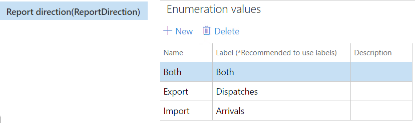
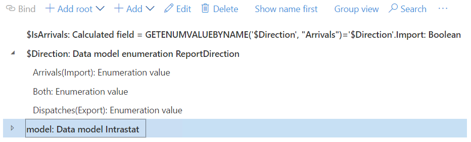
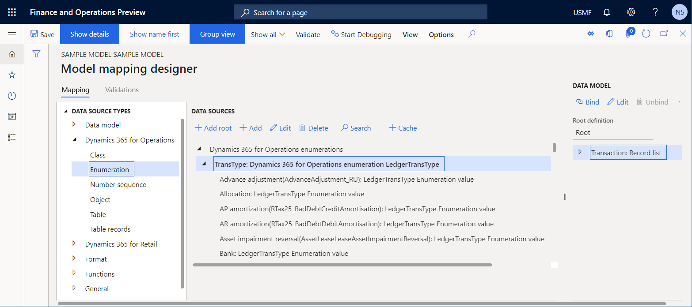
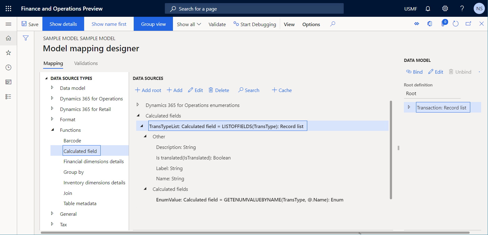
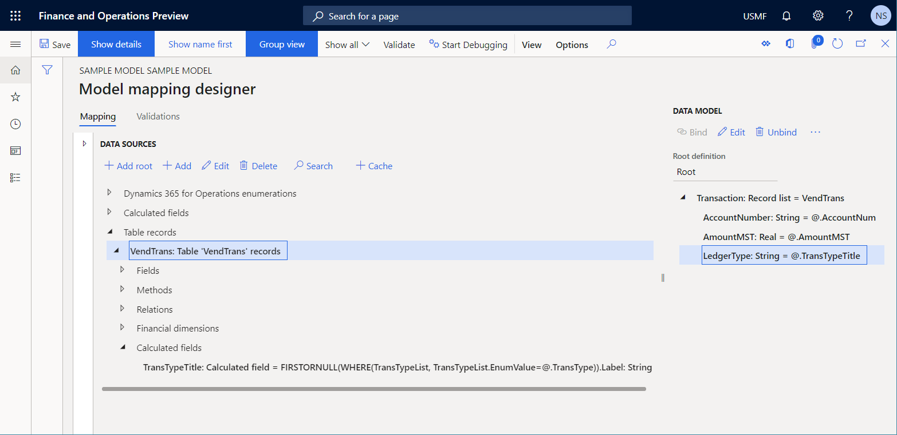
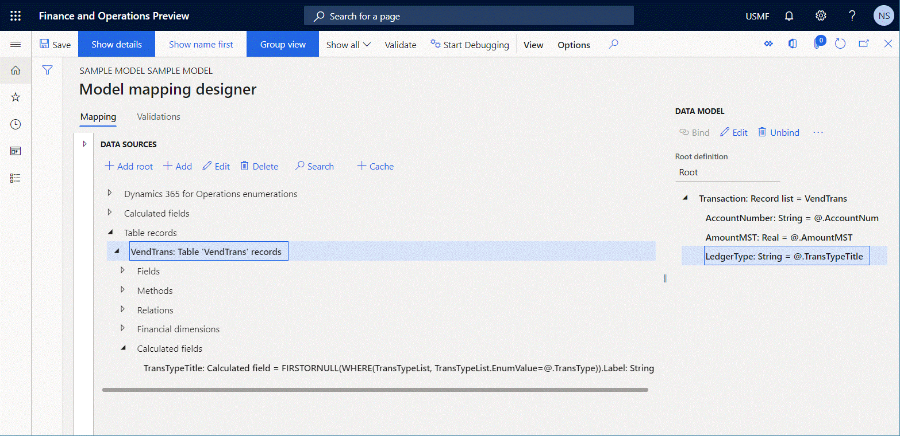

# GETENUMVALUEBYNAME ER function

[!include [banner](../includes/banner.md)]

The `GETENUMVALUEBYNAME` function searches for a specific *Enum* value in the specified enumeration data source by using the enumeration name that is specified as a *String* value. If the *Enum* value is found, the function returns it. Otherwise, the function returns the **null** enumeration value.

## Syntax

```vb
GETENUMVALUEBYNAME (enumeration data source path, enumeration value text)
```

## Arguments

`enumeration data source path`: *Enumeration*

The valid path of a data source of one of the following enumeration types:

- Electronic reporting (ER) model enumeration
- ER format enumeration
- Microsoft Dynamics 365 Finance enumeration

`enumeration value text`: *String*

A string value that represents the name of a single enumeration value.

## Return values

Nullable *Enum*

The resulting enumeration value.

## Usage notes

No exception is thrown if an *Enum* value isn't found by using the name of the enumeration value that is specified as a *String* value.

## Example 1

In the following illustration, the **ReportDirection** enumeration is introduced in a data model. Notice that labels are defined for the enumeration values.



The following illustration shows these details:

- The **$Direction** data source is configured in an ER report. This data source is configured based on the **ReportDirection** model enumeration.
- The `$IsArrivals` expression is designed to use the model enumeration–based **$Direction** data source as a parameter of this function.
- The value of this comparison expression is **TRUE**.



## Example 2

The `GETENUMVALUEBYNAME` and [`LISTOFFIELDS`](er-functions-list-listoffields.md) functions let you fetch values and labels of supported enumerations as text values. (The supported enumerations are application enumerations, data model enumerations, and format enumerations.)

In the following illustration, the **TransType** data source is introduced in a model mapping. This data source refers to the **LedgerTransType** application enumeration.



The following illustration shows the **TransTypeList** data source that is configured in a model mapping. This data source is configured based on the **TransType** application enumeration. The `LISTOFFIELDS` function is used to return all enumeration values as a list of records that contain fields. In this way, the details of every enumeration value are exposed.

> [!NOTE]
> The **EnumValue** field is configured for the **TransTypeList** data source by using the `GETENUMVALUEBYNAME(TransType, TransTypeList.Name)` expression. This field returns an enumeration value for every record in this list.



The following illustration shows the **VendTrans** data source that is configured in a model mapping. This data source returns vendor transaction records from the **VendTrans** application table. The ledger type of every transaction is defined by the value of the **TransType** field.

> [!NOTE]
> The **TransTypeTitle** field is configured for the **VendTrans** data source by using the `FIRSTORNULL(WHERE(TransTypeList, TransTypeList.EnumValue = @.TransType)).Label` expression. This field returns the label of an enumeration value of the current transaction as text, if this enumeration value is available. Otherwise, it returns a blank string value.
>
> The **TransTypeTitle** field is bound to the **LedgerType** field of a data model that enables this information to be used in every ER format that uses the data model as a source of data.



The following illustration shows how you can use the [data source debugger](er-debug-data-sources.md) to test the configured model mapping.



The **LedgerType** field of a data model exposes labels of transaction types as expected.

If you plan to use this approach for a large amount of transactional data, you must consider execution performance. For more information, see [Trace the execution of ER formats to troubleshoot performance issues](trace-execution-er-troubleshoot-perf.md).

## Additional resources

[Text functions](er-functions-category-text.md)

[Trace the execution of ER formats to troubleshoot performance issues](trace-execution-er-troubleshoot-perf.md)

[LISTOFFIELDS ER function](er-functions-list-listoffields.md)

[FIRSTORNULL ER function](er-functions-list-firstornull.md)

[WHERE ER function](er-functions-list-where.md)


[!INCLUDE[footer-include](../../../includes/footer-banner.md)]
