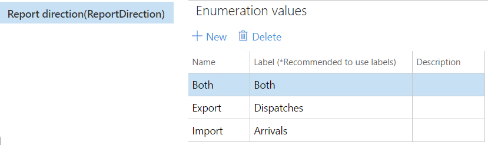
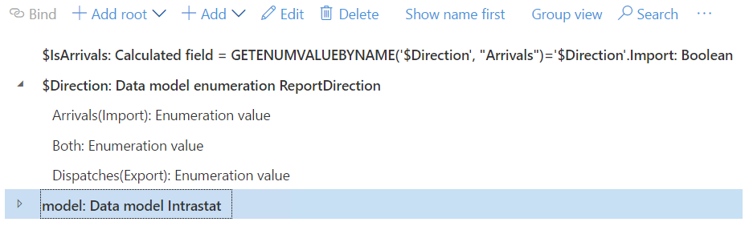
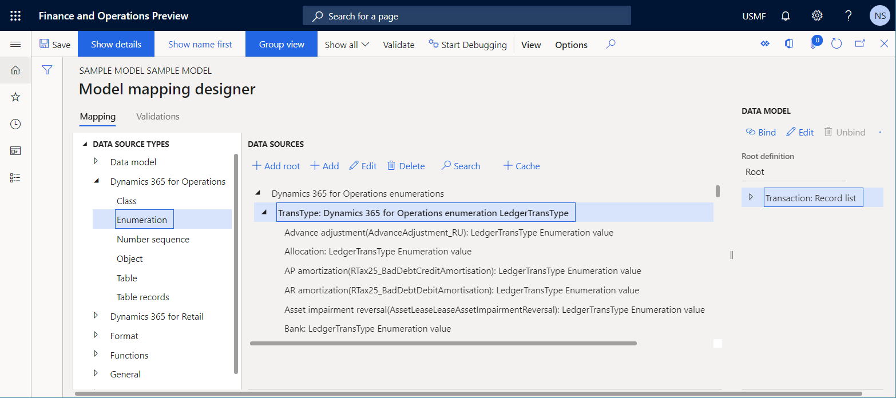
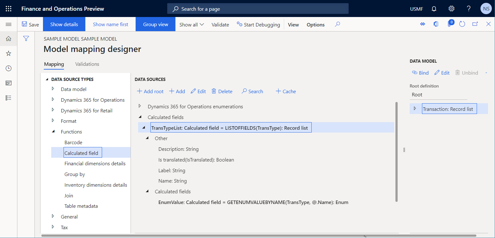
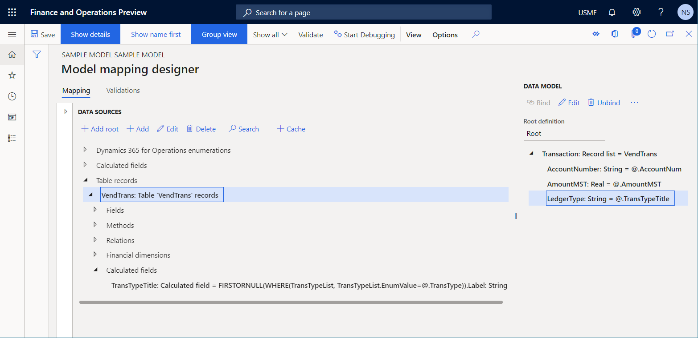
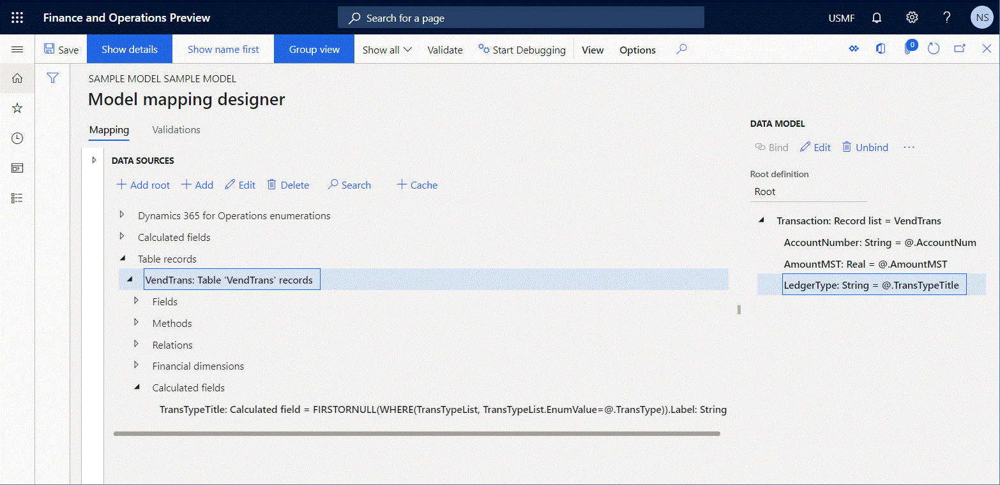

# GETENUMVALUEBYNAME ER function

[!include [banner](../includes/banner.md)]

The `GETENUMVALUEBYNAME` function searches for a specific *Enum* value in the specified enumeration data source by using the enumeration name that you specify as a *String* value. If the function finds the *Enum* value, it returns it. Otherwise, the function returns the **null** enumeration value.

## Syntax

```vb
GETENUMVALUEBYNAME (enumeration data source path, enumeration value text)
```

## Arguments

`enumeration data source path`: *Enumeration*

The valid path of a data source for one of the following enumeration types:

- Electronic reporting (ER) model enumeration
- ER format enumeration
- Microsoft Dynamics 365 Finance enumeration

`enumeration value text`: *String*

A string value that represents the name of a single enumeration value.

## Return values

Nullable *Enum*

The resulting enumeration value.

## Usage notes

No exception is thrown if an *Enum* value isn't found by using the name of the enumeration value that you specify as a *String* value.

## Example 1

In the following illustration, the **ReportDirection** enumeration is introduced in a data model. The labels for the enumeration values are defined.



The following illustration shows these details:

- The **$Direction** data source is configured in an ER report. This data source is configured based on the **ReportDirection** model enumeration.
- The `$IsArrivals` expression uses the model enumeration–based **$Direction** data source as a parameter of this function.
- The value of this comparison expression is **TRUE**.



## Example 2

Use the `GETENUMVALUEBYNAME` and [`LISTOFFIELDS`](er-functions-list-listoffields.md) functions to get the values and labels of supported enumerations as text values. Supported enumerations include application enumerations, data model enumerations, and format enumerations.

In the following illustration, you add the **TransType** data source in a model mapping. This data source refers to the **LedgerTransType** application enumeration.



The following illustration shows the **TransTypeList** data source that you configure in a model mapping. You base this data source on the **TransType** application enumeration. Use the `LISTOFFIELDS` function to return all enumeration values as a list of records that contain fields. This approach exposes the details of every enumeration value.

> [!NOTE]
> Use the `GETENUMVALUEBYNAME(TransType, TransTypeList.Name)` expression to configure the **EnumValue** field for the **TransTypeList** data source. This field returns an enumeration value for every record in this list.



The following illustration shows the **VendTrans** data source that you configure in a model mapping. This data source returns vendor transaction records from the **VendTrans** application table. The ledger type of every transaction is defined by the value of the **TransType** field.

> [!NOTE]
> Use the `FIRSTORNULL(WHERE(TransTypeList, TransTypeList.EnumValue = @.TransType)).Label` expression to configure the **TransTypeTitle** field for the **VendTrans** data source. This field returns the label of an enumeration value of the current transaction as text, if this enumeration value is available. Otherwise, it returns a blank string value.
>
> Bind the **TransTypeTitle** field to the **LedgerType** field of a data model. This binding enables you to use the information in every ER format that uses the data model as a source of data.



The following illustration shows how you can use the [data source debugger](er-debug-data-sources.md) to test the configured model mapping.



The **LedgerType** field of a data model exposes labels of transaction types as expected.

If you plan to use this approach for a large amount of transactional data, consider execution performance. For more information, see [Trace the execution of ER formats to troubleshoot performance issues](trace-execution-er-troubleshoot-perf.md).

## Additional resources

[Text functions](er-functions-category-text.md)

[Trace the execution of ER formats to troubleshoot performance issues](trace-execution-er-troubleshoot-perf.md)

[LISTOFFIELDS ER function](er-functions-list-listoffields.md)

[FIRSTORNULL ER function](er-functions-list-firstornull.md)

[WHERE ER function](er-functions-list-where.md)


[!INCLUDE[footer-include](../../../includes/footer-banner.md)]
